# RynnWorld-4D 代码深入分析报告

> **分析对象**：RynnWorld-4D — 面向机器人操作的 4D 具身世界模型  
> **代码仓库**：本地 `RynnWorld-4D/` 目录（以实际代码为准）  
> **论文来源**：arXiv 2607.06559，TeX 源码位于 `b/d/p/TeX_Source/`  
> **分析日期**：2026-07-24

---

## 目录

1. [概述与论文核心思想](#1-概述与论文核心思想)
2. [代码库静态架构](#2-代码库静态架构)
3. [数据处理流水线](#3-数据处理流水线)
4. [三分支 World Model 架构深入分析](#4-三分支-world-model-架构深入分析)
5. [训练系统动态架构](#5-训练系统动态架构)
6. [推理流水线](#6-推理流水线)
7. [Policy Head 深入分析](#7-policy-head-深入分析)
8. [论文-代码对照分析](#8-论文-代码对照分析)
9. [关键设计决策与工程洞察](#9-关键设计决策与工程洞察)

---

## 1. 概述与论文核心思想

### 1.1 核心问题与动机

机器人在开放世界中的操作任务需要 world model（世界模型）来预测环境在交互下如何演变。现有方法存在两大类局限：

1. **2D 视频生成模型**（如 CogVideoX、Wan 2.2）：在像素空间预测未来帧，丢失了深度、6-DoF 位姿等 3D 空间信息，且存在时序不一致（物体尺度漂移、非物理形变）。
2. **3D/4D 重建方法**（NeRF/3DGS、Dynamic SfM）：要么是优化式的（慢、场景特定），要么是前馈式的（仅针对单物体），无法与预训练视频扩散模型的强大先验结合。

### 1.2 RGB-DF：投影 4D 表示

RynnWorld-4D 的核心创新在于提出了 **RGB-DF 表示**——同步生成 RGB 视频、深度视频和光流视频。这一表示的几何意义在于：

- **深度 (D)** 将每个像素提升到 3D 空间：$\mathbf{P}_t = D_t(u,v) \cdot \mathbf{K}^{-1} \cdot \mathbf{p}_t$
- **光流 (F)** 提供像素级运动：$\mathbf{f}_{opt} = [\Delta u, \Delta v]$
- 深度 + 光流可通过反投影得到 **3D 场景流**：$\mathbf{f}_{3D} = \mathbf{P}_{t+1} - \mathbf{P}_t$

这样既保留了与 2D 视频扩散模型兼容的格式（2D 对齐的张量），又使得 3D 几何和运动信息可被显式提取。

### 1.3 四大贡献

| # | 贡献 | 描述 |
|---|------|------|
| 1 | RGB-DF 投影 4D 表示 | 同时生成 RGB、深度、光流，支持 3D 场景流解释 |
| 2 | RynnWorld-4D 三分支世界模型 | 三分支 DiT + Joint Cross-Modal Attention |
| 3 | Rynn4DDataset 1.0 | 254.4M 帧的 4D 具身视频数据集 |
| 4 | RynnWorld-4D-Policy | 逆动力学策略头，利用内部 4D 表征进行高频闭环控制 |

### 1.4 横向分析：与同期 4D World Model 的定位区分

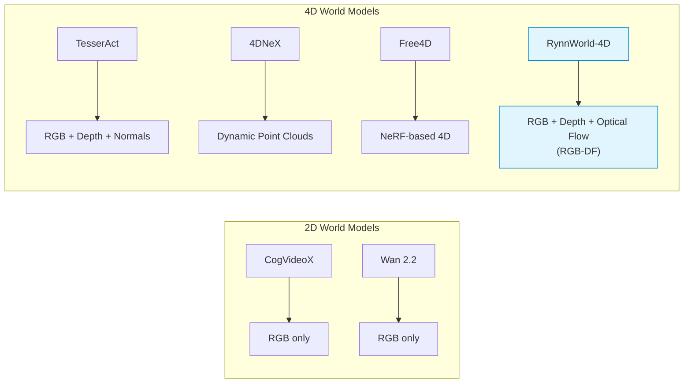

| 方法 | 表示 | 是否有光流 | 是否支持场景流 | 与视频扩散先验兼容 |
|------|------|-----------|--------------|-------------------|
| TesserAct | RGB-DN (含法线) | 否 | 否 | 是 |
| 4DNeX | 动态点云 | 否 | 间接（点运动） | 否 |
| Free4D | NeRF 4D 场 | 否 | 否 | 否 |
| **RynnWorld-4D** | **RGB-DF** | **是** | **是（反投影）** | **是** |

关键区分：RynnWorld-4D 是唯一包含光流分支的 4D 世界模型，使其能通过深度+光流反投影得到 3D 场景流，提供了显式的逐点 3D 运动线索。

### 1.5 纵向分析：从 2D 到 4D World Model 的演进

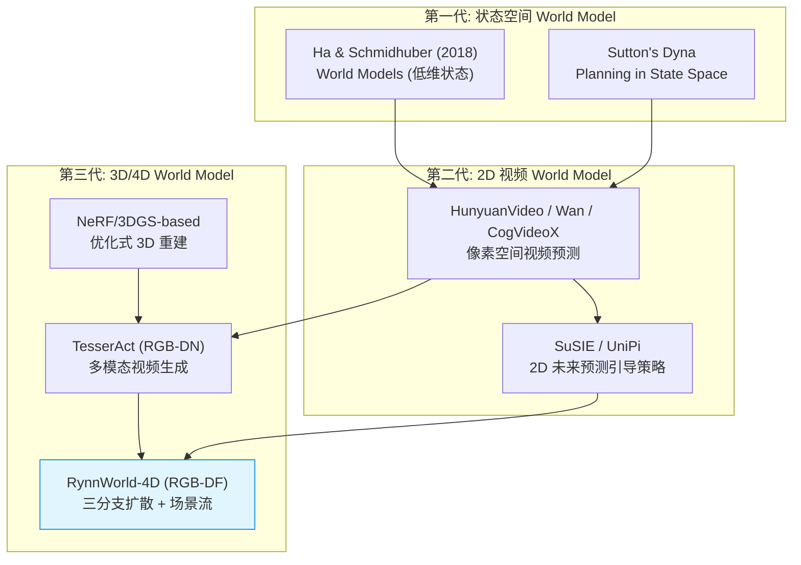

RynnWorld-4D 的**关键进步**在于：（1）将 TesserAct 的法线替换为光流，获得了显式运动信息；（2）相比 SuSIE/UniPi 等 2D 方法，策略头直接消费内部 4D 特征（单次前向传播），无需逐步视频解码/去噪。

---

## 2. 代码库静态架构

### 2.1 顶层目录结构

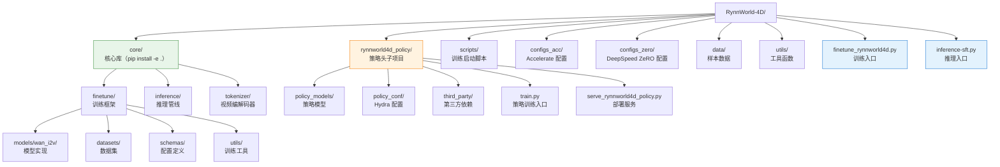

### 2.2 核心类继承层次

#### 2.2.1 Trainer 继承链

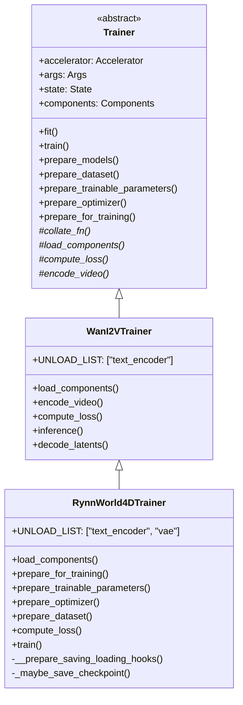

**关键设计**：`RynnWorld4DTrainer` 重写了大部分方法，实际上是一个几乎完整的重新实现。它从 `WanI2VTrainer` 继承了 `encode_video()` 和 `decode_latents()` 等 VAE 相关功能，但训练循环、损失计算、参数准备等核心逻辑均为独立实现。

#### 2.2.2 模型继承链

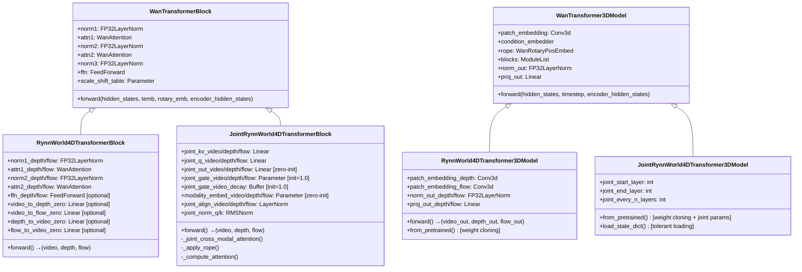

**重要观察**：`RynnWorld4DTransformer3DModel`（Stage 1）和 `JointRynnWorld4DTransformer3DModel`（Stage 2/3）是**平行的两个子类**，而非继承关系。Stage 2 的模型并非从 Stage 1 的类继承，而是独立实现了三分支结构 + Joint Attention。这意味着从 Stage 1 切换到 Stage 2 时，会构建一个全新的模型类并通过 `load_state_dict` 加载 Stage 1 的权重。

#### 2.2.3 Policy 模型组件

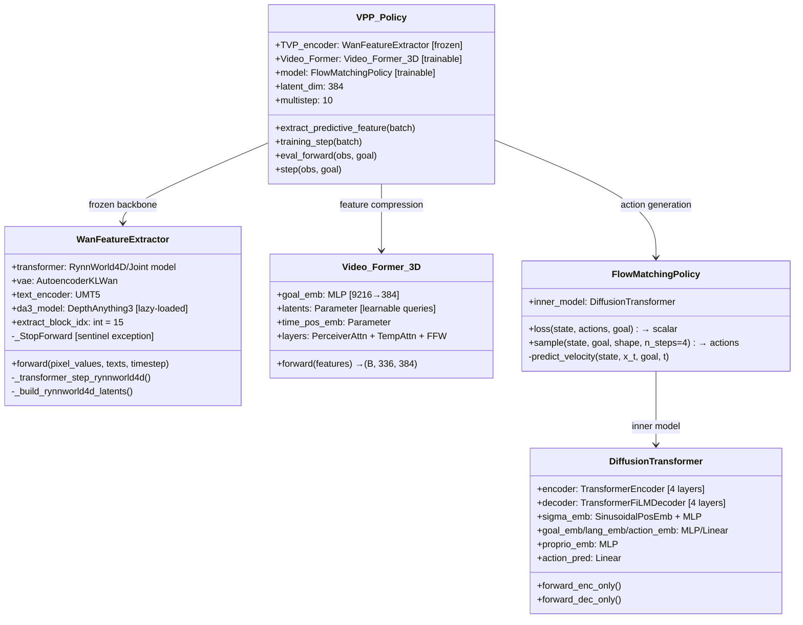

### 2.3 模块间依赖关系

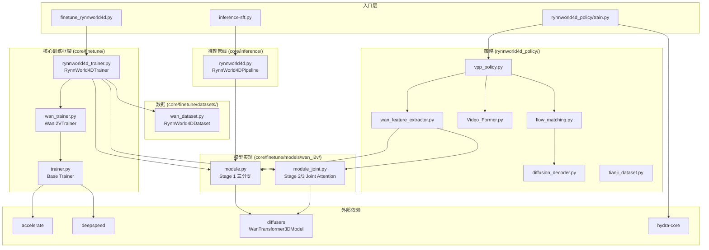

---

## 3. 数据处理流水线

### 3.1 Rynn4DDataset 1.0 构建流程

论文描述的数据集包含超过 **254.4M 帧**，来源涵盖人类中心数据集（Epic-Kitchens、EgoVid）和机器人操作数据集（RoboMIND、RDT-1B、Galaxea、RoboCoin、AgiBot）。

每帧生成三种伪标签：

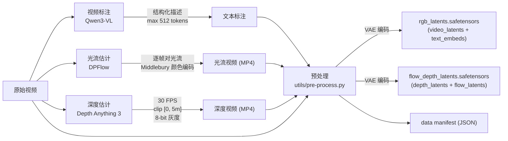

### 3.2 预处理代码分析：`utils/pre-process.py`

`PreProcess` 类封装了 VAE 编码和文本编码的全流程：

**VAE 编码** (`encode_video`)：
```python
# 伪代码概要（基于 utils/pre-process.py 实际实现）
frames = decord.VideoReader(video_path)           # 读取视频
frames = center_crop_and_resize(frames, 640, 480) # 裁剪到目标分辨率
frames = (frames / 255.0 - 0.5) * 2.0             # 归一化到 [-1, 1]
latent = vae.encode(frames).latent_dist.sample()   # VAE 编码
latent = (latent - latents_mean) / latents_std     # 潜变量标准化
```

**文本编码** (`_get_t5_prompt_embeds`)：
- 使用 `UMT5EncoderModel` + `T5TokenizerFast`
- 文本预处理：`ftfy.fix_text` + `html.unescape` + 去除多余空白
- 最大序列长度 512，零填充
- 输出维度：`(1, 512, 4096)`

**输出数据格式**：

| 文件 | 键名 | 形状 | 说明 |
|------|------|------|------|
| `*_rgb.safetensors` | `video_latents` | `(C_z, F_lat, H_lat, W_lat)` | RGB VAE 潜变量 |
| | `text_embeds` | `(1, seq_len, 4096)` | UMT5 文本嵌入 |
| `*_flow_depth.safetensors` | `depth_latents` | `(C_z, F_lat, H_lat, W_lat)` | 深度 VAE 潜变量 |
| | `flow_latents` | `(C_z, F_lat, H_lat, W_lat)` | 光流 VAE 潜变量 |

其中 $C_z = 16$（Wan VAE 潜变量通道数），$F_{lat} = (F_{raw} - 1) / 4 + 1$（Causal VAE 4x 时间压缩），$H_{lat} = H / 8$，$W_{lat} = W / 8$（8x 空间压缩）。

### 3.3 训练数据集：`RynnWorld4DDataset`

> 源码位置：`core/finetune/datasets/wan_dataset.py`

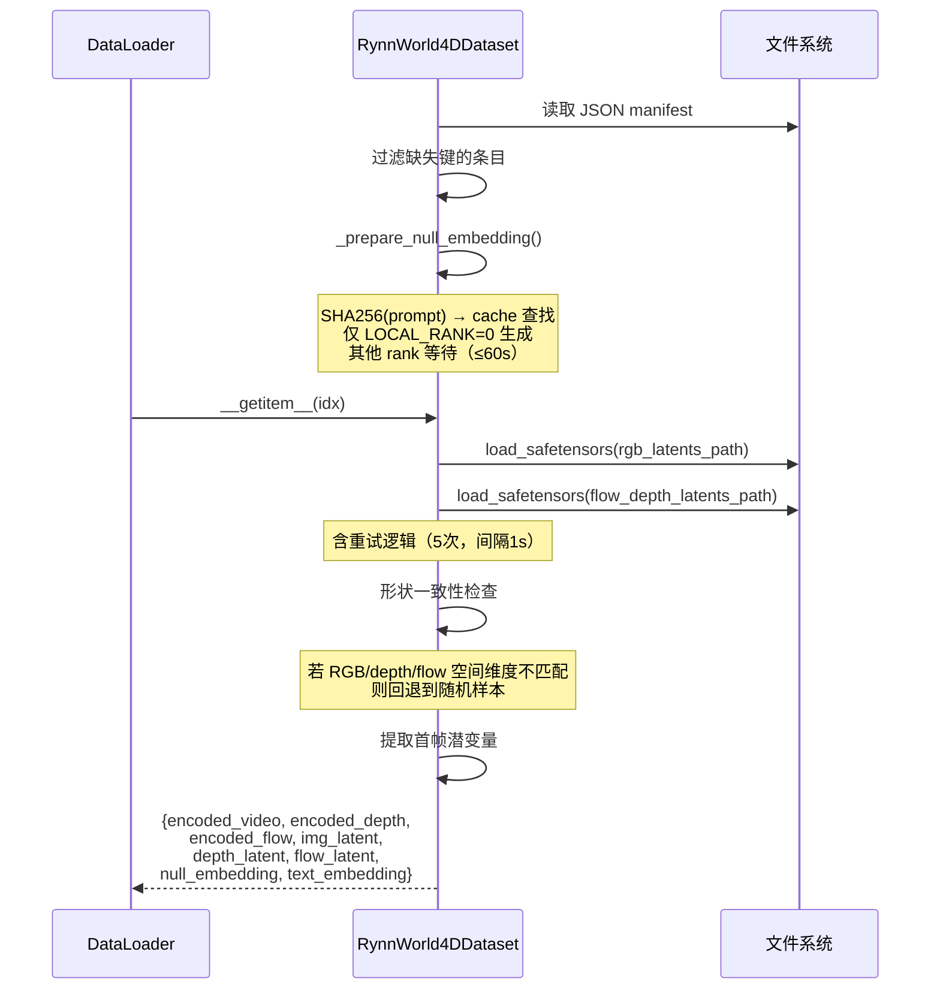

**关键实现细节**：
- 首帧潜变量提取：`img_latent = encoded_video[:, :1, :, :]`，保留时间维度为 1
- 空嵌入缓存：使用 `prompt` 字符串的 SHA256 哈希作为缓存键，避免重复编码
- 多 GPU 安全：只有 `LOCAL_RANK=0` 的进程生成空嵌入并保存到文件系统，其他进程轮询等待

### 3.4 Tianji 机器人数据集：`TianjiVideoDataset`

> 源码位置：`rynnworld4d_policy/policy_models/datasets/tianji_dataset.py`

用于 Policy 训练的数据集，读取 TIANJI M6 机器人的遥操作采集数据：

**Episode 目录结构**：
```
episode_00001/
├── observation.images.head.mp4        # 头部摄像头 (1280×720, 30fps)
├── timeseries.parquet                 # 每帧动作/状态数据
├── metadata.json                      # 任务描述、fps、总帧数
└── [可选] observation.images.left_wrist.mp4
```

**数据处理**：
- RGB 增强：CenterCrop → ColorJitter(亮度/对比度/饱和度=0.2) → ToTensor → Normalize 到 [-1, 1]
- 深度：CenterCrop → ToTensor → Normalize 到 [-1, 1]（无增强）
- 动作标准化：计算全 episode 的逐维均值/标准差，保存为 `action_stats.json`

**输出字典**：

| 键 | 形状 | 说明 |
|----|------|------|
| `rgb_obs.rgb_static` | `(obs_seq_len, 3, H, W)` | RGB 观测 |
| `state` | `(54,)` | 本体感知（关节位置） |
| `actions` | `(10, 54)` | 标准化动作序列 |
| `depth_static` | `(1, 3, H, W)` | 深度图（如可用） |

---

## 4. 三分支 World Model 架构深入分析

### 4.1 基座模型：Wan 2.2-TI2V-5B

RynnWorld-4D 构建在 Wan 2.2 Text/Image-to-Video 5B 扩散 Transformer 之上。该模型的核心参数：

| 参数 | 论文描述 | 代码构造器默认值 | 说明 |
|------|---------|-----------------|------|
| 隐藏维度 $d$ | 3072 | `inner_dim = num_attention_heads × attention_head_dim` | 代码默认 40×128=5120，但实际由预训练模型 config 决定 |
| 层数 | 30 | `num_layers = 40`（默认） | 同上，实际值来自预训练 config |
| FFN 维度 | 14,336 | `ffn_dim = 13824`（默认） | 同上 |
| 注意力头数 | — | `num_attention_heads = 40`（默认） | 5B 模型实际约 24 头 |
| 头维度 | — | `attention_head_dim = 128` | — |
| Patch 大小 | — | `(1, 2, 2)` | 时间步幅 1，空间步幅 2 |
| 输入通道 | — | `in_channels = 16` | VAE 潜变量通道数 |
| 文本维度 | — | `text_dim = 4096` | UMT5 编码器输出维度 |

> **注**：代码中的构造器默认值（如 `num_attention_heads=40, num_layers=40`）为 Python 参数默认值，实际运行时由 `from_pretrained()` 加载的预训练模型 `config.json` 覆盖。论文描述的 Wan 2.2-TI2V-5B 参数为 $d=3072$、30 层。`module_joint.py` 文件头注释中使用 `dim=5120` 计算参数开销，可能是基于更大变体的估算。

#### Flow Matching 目标函数

Wan 2.2 使用 **Rectified Flow**（整流流）作为生成框架。给定数据 $z_0$ 和噪声 $\epsilon \sim \mathcal{N}(0, I)$，线性插值路径为：

$$z_t = (1 - \sigma_t) z_0 + \sigma_t \epsilon$$

其中 $\sigma_t$ 经过 **flow shift** 调度：

$$\sigma_t = \frac{s \cdot \text{shift}}{1 + (\text{shift} - 1) \cdot s}, \quad s = \frac{t}{T}$$

`shift` 为调度器超参数（Wan 默认 `flow_shift=5.0`），控制噪声调度的非线性程度。

速度预测目标为：

$$v_\theta(z_t, t) = \epsilon - z_0$$

训练损失即速度场的均方误差。

#### First-Frame Conditioning

Wan 2.2 的 Image-to-Video 模式使用**首帧条件注入**：

1. 将首帧图像编码为潜变量 $z_0^{f=0}$
2. 在每个去噪步骤中，将噪声潜变量的第 0 帧替换为干净的首帧潜变量
3. 使用 **per-token timestep**：第 0 帧的时间步设为 0（表示干净信号），其他帧使用采样的时间步 $t$

代码中 per-token timestep 的构建（`compute_loss` 方法）：

```python
# first_frame_mask: shape [B, C_z, F_lat, H_lat, W_lat], 第0帧=0，其余=1
# shifted_timesteps: 标量时间步
per_token_timestep = first_frame_mask[0][0][:, ::2, ::2] * shifted_timesteps
# 下采样 ::2 匹配 patch 后的空间维度
```

### 4.2 Stage 1：三分支独立训练

> 源码位置：`core/finetune/models/wan_i2v/module.py`  
> 对应训练脚本：`scripts/rynnworld4d-stage1.sh`  
> 训练参数：`fusion_mode=none`, `share_ffn=False`, `lr=1.5e-5`, `loss_weight_flow=0.5`

#### 4.2.1 权重克隆策略

Stage 1 的核心设计决策是从预训练的 Wan 2.2 RGB 模型权重**完全克隆**出深度和光流分支。`from_pretrained` 类方法（`module.py`）实现了精细的权重映射：

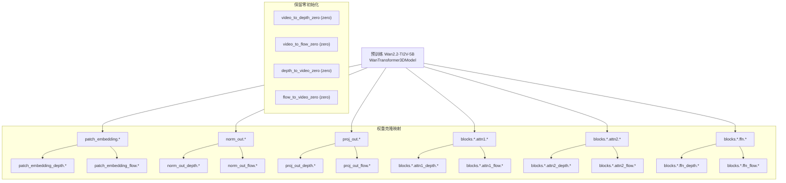

这意味着在训练开始时，三个分支具有**完全相同的权重**，各自从同一起点开始适应不同模态。融合层（`*_zero` 线性层）保持零初始化，确保初始前向传播行为与单分支模型一致。

#### 4.2.2 `RynnWorld4DTransformerBlock` 架构

每个 Transformer block 的内部结构：

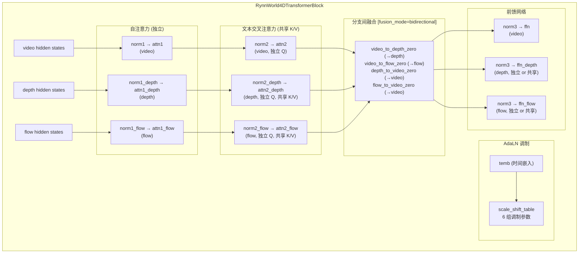

**关键实现细节**：

1. **AdaLN 共享**：三个分支共用同一组 `scale_shift_table` 调制参数（来自时间嵌入），不做分支特定的调制。这是因为三个分支共享相同的去噪时间步。

2. **文本交叉注意力的 K/V 共享**（`module.py` 中）：
   ```python
   # 深度和光流的 K/V 投影直接指向 video 的 attn2
   self.attn2_depth.to_k = self.attn2.to_k
   self.attn2_depth.norm_k = self.attn2.norm_k
   self.attn2_depth.to_v = self.attn2.to_v
   self.attn2_flow.to_k = self.attn2.to_k
   self.attn2_flow.norm_k = self.attn2.norm_k
   self.attn2_flow.to_v = self.attn2.to_v
   ```
   这意味着文本条件信号以相同的 K/V 投影进入三个分支，但每个分支用独立的 Q 投影来选择性提取不同的信息。

3. **FFN 独立性**：当 `share_ffn=False`（Stage 1 实际使用的配置）时，深度和光流分支拥有独立的 FFN。消融实验表明共享 FFN 会导致性能崩溃，因为 RGB 纹理、深度流形和运动场的潜空间本质上是异构的。

4. **融合模式**（Stage 1 实际使用 `fusion_mode=none`，不启用任何融合层）：
   - `"bidirectional"`：4 个零初始化 Linear，双向信息交换
   - `"unidirectional"`：2 个零初始化 Linear，仅 depth/flow → video
   - `"none"`：无融合层（Stage 1 实际配置）

#### 4.2.3 Stage 1 训练配置

| 参数 | 值 | 说明 |
|------|-----|------|
| `fusion_mode` | `none` | 无跨模态注意力 |
| `share_ffn` | `False` | 独立 FFN |
| `learning_rate` | `1.5e-5` | |
| `lr_warmup_steps` | `300` | |
| `gradient_accumulation` | `4` | |
| `train_resolution` | `25×480×832` | (帧数, 高, 宽) |
| `use_ema` | `True` | EMA 衰减 0.9999 |
| `loss_weight_flow` | `0.5` | 光流损失权重降低 |
| 启动方式 | `accelerate launch` | 多节点 DeepSpeed |

> **光流损失权重 0.5 的原因**：在 Stage 1 中，光流的首帧条件（白色图 = 零光流）信息量远低于 RGB 的首帧条件（实际图像），因此降低光流损失权重以避免其主导训练。

### 4.3 Stage 2：Joint Cross-Modal Attention

> 源码位置：`core/finetune/models/wan_i2v/module_joint.py`  
> 对应训练脚本：`scripts/rynnworld4d-stage2.sh`  
> 训练参数：`fusion_mode=joint`, `freeze_non_joint=True`, `joint_every_n_layers=3`

Stage 2 是架构设计的核心创新——引入 **Joint Cross-Modal Attention (JA)** 实现三分支之间的深层特征交互。

#### 4.3.1 JA 模块架构

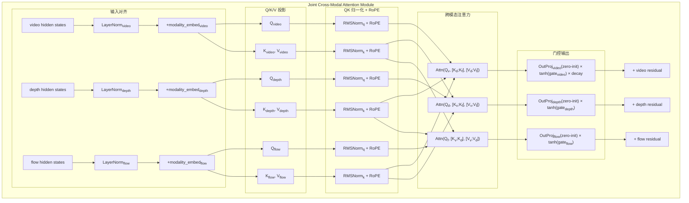

#### 4.3.2 参数效率分析

论文声称使用 "shared K/V" 设计将参数从朴素设计的 $18d^2$ 降低到 $12d^2$。代码实现验证了这一点：

**朴素设计**（每个分支对其他两个分支各自独立 Q/K/V）：
- 3 个分支 × 2 个交叉注意力 × 3 个投影 (Q, K, V) = 18 个 $d \times d$ 线性层

**实际设计**（shared K/V）：
- 3 个分支 × 1 个 K 投影 = 3 个线性层（K 被其他两个分支的 Q 共享）
- 3 个分支 × 1 个 V 投影 = 3 个线性层
- 3 个分支 × 1 个 Q 投影 = 3 个线性层
- 3 个分支 × 1 个 Out 投影 = 3 个线性层
- **总计 12 个 $d \times d$ 线性层**

JA 放置策略（`joint_every_n_layers=3`）：在 30 层中每隔 3 层放置一个 JA 模块，共 10 个 JA 模块（在 blocks 0, 3, 6, 9, 12, 15, 18, 21, 24, 27）。

#### 4.3.3 Gate 设计深入分析

这是 RynnWorld-4D 最精妙的工程设计之一。代码中每个 JA 模块的输出组合为：

$$\text{output}_m = \underbrace{\text{OutProj}_m(\text{Attn}_m)}_{\text{zero-init}} \cdot \underbrace{\tanh(g_m)}_{\tanh(1.0)} \cdot \underbrace{d_m}_{\text{decay (仅 video)}}$$

**初始化状态**：
- $\text{OutProj}_m$：权重和偏置均初始化为 **零**
- $g_m$：初始化为 **1.0**（`nn.Parameter(torch.ones(1))`）
- $d_m$（decay buffer）：初始化为 **1.0**

**为什么不用 double zero-init？**

`module_joint.py` 的注释（约第 134-143 行）给出了明确解释。如果 `OutProj` 和 `gate` 都初始化为零，会产生**鞍点死锁（saddle-point deadlock）**：

$$\frac{\partial \mathcal{L}}{\partial W_{out}} = \tanh(g) \cdot \frac{\partial \mathcal{L}}{\partial \text{output}}$$

如果 $g = 0$，则 $\tanh(0) = 0$，导致 $\frac{\partial \mathcal{L}}{\partial W_{out}} = 0$。同时：

$$\frac{\partial \mathcal{L}}{\partial g} = W_{out} \cdot x \cdot (1 - \tanh^2(g)) \cdot \frac{\partial \mathcal{L}}{\partial \text{output}}$$

如果 $W_{out} = 0$，则 $\frac{\partial \mathcal{L}}{\partial g} = 0$。两个参数互相锁死，无法逃离零点。

**对比 ControlNet 的 zero-init**：ControlNet 使用单一的零初始化卷积（没有 gate），梯度可以正常流动。但 RynnWorld-4D 的双层设计需要避免这种死锁。

**当前设计的梯度分析**：

$$\begin{aligned}
\text{output} &= W_{out} \cdot x \cdot \tanh(g) \\
\frac{\partial \mathcal{L}}{\partial W_{out}} &= \tanh(1.0) \cdot x \cdot \frac{\partial \mathcal{L}}{\partial \text{output}} \approx 0.762 \cdot x \cdot \frac{\partial \mathcal{L}}{\partial \text{output}} \neq 0
\end{aligned}$$

$W_{out}$ 可以立即获得非零梯度，从而开始学习。同时，由于 $W_{out} = 0$，初始输出仍然为零，保证了从 Stage 1 到 Stage 2 的平滑过渡。

#### 4.3.4 3D RoPE 在 Joint Attention 中的应用

当 `joint_use_rope=True` 时，Q 和 K 在跨模态注意力中也应用 3D 旋转位置编码。实现位于 `_apply_rope` 方法：

```python
def _apply_rope(self, x, cos, sin):
    # x: [B, N, dim] → unflatten → [B, N, H, D]
    x = x.unflatten(-1, (self.num_heads, self.head_dim))
    x1, x2 = x.chunk(2, dim=-1)
    # 旋转：[x1·cos - x2·sin, x1·sin + x2·cos]
    x = torch.cat([x1 * cos - x2 * sin, x1 * sin + x2 * cos], dim=-1)
    return x.flatten(-2, -1)  # → [B, N, dim]
```

**设计意图**：3D RoPE 编码了每个 token 的 $(t, h, w)$ 空间位置。在跨模态注意力中应用 RoPE，使得同一空间位置的 RGB/深度/光流 token 之间的注意力权重天然更高，实现了**空间对齐的特征融合**。消融实验证实去除 RoPE 会导致深度精度 $\delta_1$ 从 0.610 下降到 0.450。

#### 4.3.5 Frame-wise Attention

当 `joint_frame_wise=True` 时，跨模态注意力被限制在**同一时间帧**内的 token 之间：

```python
if self.joint_frame_wise and num_frames > 1:
    # [B, T*S, dim] → [B*T, S, dim]
    # 每个分支独立 reshape，然后在 S 维度上做 cross-attention
```

这将注意力的序列长度从 $T \times S$ 降低到 $S$（其中 $S = H' \times W'$ 为单帧空间 token 数），显著降低了计算开销。物理直觉是：同一时刻的 RGB/深度/光流之间的对应关系是最直接的。

#### 4.3.6 Branch Dropout

Stage 2 使用 `branch_dropout_prob=0.2`：

```python
# compute_loss 中的实现
if branch_dropout_prob > 0:
    # 随机选择一个分支（从 ["depth", "flow"] 中）
    # 将该分支的非首帧噪声潜变量替换为纯高斯噪声
    # video 分支永远不会被 dropout
```

**设计意图**：强制 JA 学习从可见模态重建被遮蔽模态的能力，增强模型的鲁棒性。Video（RGB）分支作为外观锚点（appearance anchor）永远不被 dropout。

#### 4.3.7 Stage 2 训练配置

| 参数 | 值 | 说明 |
|------|-----|------|
| `fusion_mode` | `joint` | 启用 Joint Attention |
| `freeze_non_joint` | `True` | 冻结 backbone，仅训练 JA 参数 |
| `joint_start_layer` | `0` | 从第 0 层开始 |
| `joint_end_layer` | `30` | 到第 30 层结束 |
| `joint_every_n_layers` | `3` | 每 3 层一个 JA 模块 |
| `joint_frame_wise` | `True` | 帧内跨模态注意力 |
| `joint_use_rope` | `True` | 使用 3D RoPE |
| `joint_unidirectional` | `True` | video 仅作为 K/V 源 |
| `branch_dropout_prob` | `0.2` | 分支 dropout |
| `learning_rate` | `5e-5` | |
| `joint_out_lr` | `2.5e-4` | JA 输出投影专用 LR |
| `lr_warmup_steps` | `200` | |
| 启动方式 | `torchrun` + ZeRO-2 | CPU offload |

**单向模式 (`joint_unidirectional=True`)**：在 Stage 2 中，video 分支不接收来自 depth/flow 的信息（仅作为 K/V 源）。只有 depth/flow 分支从 video 中获取信息。这意味着此阶段仅训练 depth/flow 的跨模态理解能力。

### 4.4 Stage 3：全参数联合微调

> 对应训练脚本：`scripts/rynnworld4d-stage3.sh`  
> 训练参数：`freeze_non_joint=False`, `joint_video_decay=True`

#### 4.4.1 Cosine Decay 机制

Stage 3 的关键创新是 `joint_gate_video_decay`——一个注册为 buffer 的衰减因子，对**仅 video 分支**的 JA 输出进行渐进衰减：

$$d(t) = \frac{1}{2}\left(1 + \cos\left(\pi \cdot \min\left(1, \frac{t}{T_{decay}}\right)\right)\right)$$

其中 $T_{decay}$ 默认为 700 步。

```python
# rynnworld4d_trainer.py train() 方法中
decay = 0.5 * (1.0 + math.cos(math.pi * min(1.0, global_step / decay_steps)))
for block in model.blocks:
    if hasattr(block, 'joint_gate_video_decay'):
        block.joint_gate_video_decay.fill_(decay)
```

衰减过程：$d(0) = 1.0 \to d(T_{decay}/2) = 0.5 \to d(T_{decay}) = 0.0$

**应用于 forward pass**：
```python
# module_joint.py forward 中
hidden_states += self.joint_out_video(attn_out_v) * self.joint_gate_video.tanh() * self.joint_gate_video_decay
```

**设计意图**：在 Stage 3 初期，video 分支仍然接收来自 depth/flow 的跨模态信息（与 Stage 2 结束时一致）。随着训练进行，逐渐移除 depth/flow 对 video 的反向注入，使得 **video 分支回归独立生成能力**，而 depth/flow 分支继续从 video 中获取信息。这实现了一种非对称的信息流：

$$\text{video} \xrightarrow{\text{始终}} \text{depth/flow}, \quad \text{depth/flow} \xrightarrow{\text{渐进消失}} \text{video}$$

#### 4.4.2 差异化学习率

Stage 3 使用三组不同的学习率：

| 参数组 | 学习率 | 说明 |
|--------|--------|------|
| `joint_out_*` | `1e-5` (`joint_out_lr`) | JA 零初始化输出投影 |
| 其他 `joint_*` + `modality_embed` | `5e-6 × 1.0` | JA 其他参数（`joint_other_lr_multiplier=1.0`） |
| Backbone 参数 | `5e-6` | 基础学习率 |

对比 Stage 2 中 `joint_out_lr=2.5e-4` 和 `joint_other_lr_multiplier=10.0`，Stage 3 显著降低了所有学习率，体现了全参数微调阶段的保守策略。

#### 4.4.3 Stage 3 训练配置

| 参数 | 值 | 与 Stage 2 的差异 |
|------|-----|------------------|
| `freeze_non_joint` | `False` | 解冻所有参数 |
| `learning_rate` | `5e-6` | ↓10× |
| `joint_out_lr` | `1e-5` | ↓25× |
| `joint_other_lr_multiplier` | `1.0` | ↓10× |
| `branch_dropout_prob` | `0.05` | ↓4× |
| `lr_warmup_steps` | `500` | ↑ |
| `ema_decay` | `0.999` | vs 0.9999 |
| `joint_video_decay` | `True` | 新增 |
| 权重加载 | `--load_stage2_model_weights` | 仅加载模型权重，不加载优化器状态 |

### 4.5 三阶段训练总结

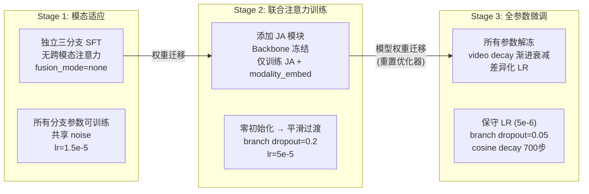

**每个阶段都重置优化器/调度器**：从前一阶段仅加载模型权重（model-only checkpoint），不继承优化器状态。这允许每个阶段使用不同的学习率和调度策略。

---

## 5. 训练系统动态架构

### 5.1 训练 Forward Pass 完整流程

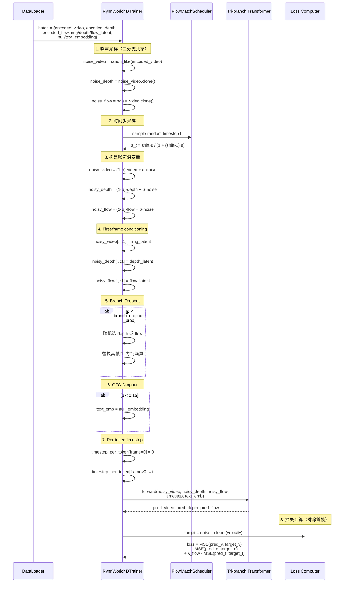

### 5.2 共享 Noise 的设计分析

代码中三个分支使用**完全相同的噪声样本**：

```python
noise_video = torch.randn_like(encoded_videos)
noise_depth = noise_video.clone()
noise_flow = noise_video.clone()
```

`rynnworld4d_trainer.py` 中的注释解释了这一设计：相同的噪声**对齐了三个分支的去噪轨迹**。在 Flow Matching 框架下，从相同的噪声出发、沿相同的时间步去噪，使得三个分支在每个时间步都处于相似的噪声水平，有利于 Joint Cross-Modal Attention 的跨模态特征对齐。

### 5.3 分布式训练架构

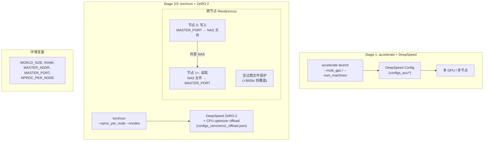

**Stage 1 vs Stage 2/3 启动方式的差异**：
- **Stage 1** 使用 `accelerate launch`，依赖 HuggingFace Accelerate 的分布式抽象
- **Stage 2/3** 切换到 `torchrun`，使用 DeepSpeed ZeRO-2 with CPU optimizer offload

这可能是因为 Stage 2/3 需要更精细的显存管理（JA 模块增加了大量参数），ZeRO-2 with CPU offload 可以将优化器状态卸载到 CPU 来节省 GPU 显存。

### 5.4 EMA 机制

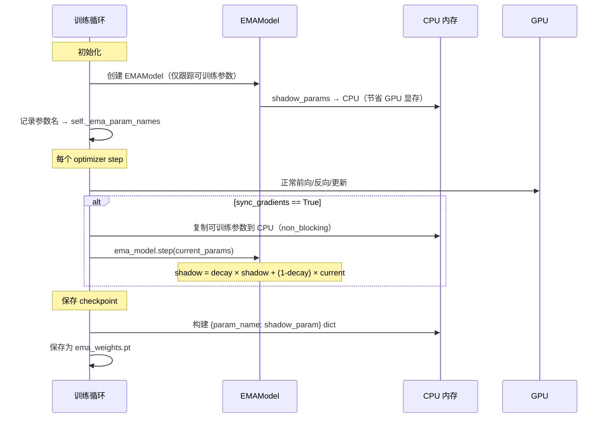

**关键设计**：EMA 仅跟踪**可训练参数**，不跟踪冻结的 backbone（在 Stage 2 中可节省大量 CPU 内存）。Shadow 参数存储在 CPU 以节省 GPU 显存。

### 5.5 Checkpoint Save/Load Hooks

`RynnWorld4DTrainer` 注册了自定义的保存/加载钩子，将模型权重分离为两部分：

1. **LoRA 权重** → `high_noise_lora/` 目录
2. **三分支/JA 权重** → `rynnworld4d_layers.bin` 文件

分支权重的筛选关键词：
```python
branch_keywords = ("depth", "flow", "video_to_depth", "video_to_flow",
                   "depth_to_video", "flow_to_video", "joint_")
```

### 5.6 Monkey Patching 详解

代码在 **import 时** 对 diffusers 库的两个方法进行了 monkey patch：

#### Patch 1：FP32 时间嵌入稳定性

```python
# 原始 diffusers: 使用混合精度下的 bf16 计算时间嵌入
# Patched: 强制 FP32 计算 time embedding
with torch.autocast(device_type=timestep.device.type, dtype=torch.float32, enabled=True):
    temb = self.time_embedder(timestep)
    timestep_proj = self.time_proj(self.act_fn(temb))
```

**原因**：时间嵌入中的正弦/余弦位置编码在 bf16 下可能产生数值不稳定，尤其是在高频分量处。FP32 计算确保了时间信号的精确性。

#### Patch 2：添加 control_video_latent 参数

```python
# 原始 diffusers: WanTransformer3DModel.forward 仅接受 hidden_states
# Patched: 新增 control_video_latent 参数，支持首帧条件注入
def wan_forward(self, hidden_states, ..., control_video_latent=None, is_concat=False):
    if control_video_latent is not None:
        if is_concat:
            hidden_states = torch.cat([hidden_states, control_video_latent], dim=1)
            hidden_states = self.control_patch_embedding(hidden_states)
        else:
            control_emb = self.control_patch_embedding(control_video_latent)
            hidden_states = hidden_states + control_emb
```

### 5.7 训练诊断日志

每 50 步，trainer 输出以下诊断信息：

1. **Gate 值**：`mean(tanh(joint_gate_*))` 跨所有 blocks 的平均值，确认跨模态通道是否激活
2. **Joint Ratio**：`mean(_joint_ratio_*)` 跨所有 blocks 的平均值，衡量 JA 输出占总隐藏状态的比例
3. **Decay 值**：当前的 `joint_gate_video_decay` 值

这些诊断指标无需 GPU→CPU 同步（使用 `torch.tensor` 在 device 上计算），不会影响训练吞吐量。

---

## 6. 推理流水线

### 6.1 推理流程总览

> 源码位置：`core/inference/rynnworld4d.py` (`RynnWorld4DPipeline`) 和 `inference-sft.py`

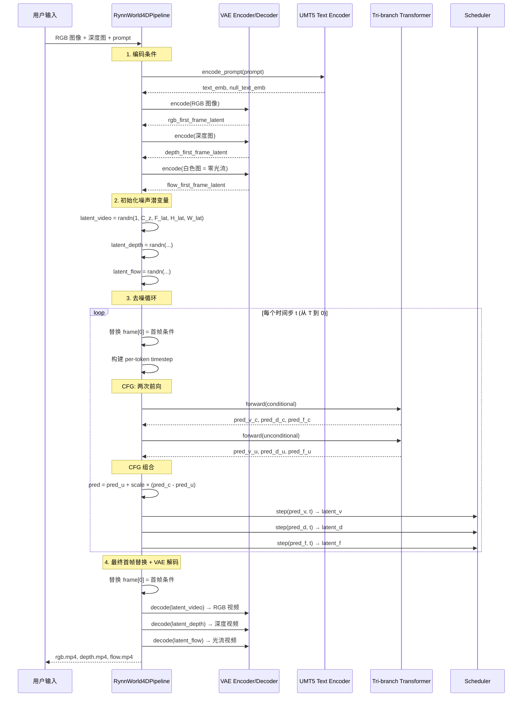

### 6.2 关键实现细节

#### 6.2.1 三分支独立 Scheduler Step

推理时每个分支使用**独立的 scheduler step**：

```python
latents_video = self.scheduler.step(noise_pred_video, t, latents_video).prev_sample
latents_depth = self.scheduler.step(noise_pred_depth, t, latents_depth).prev_sample
latents_flow = self.scheduler.step(noise_pred_flow, t, latents_flow).prev_sample
```

每个分支在各自的潜变量空间中独立去噪，跨模态一致性通过 Joint Attention 在 Transformer 内部实现。

#### 6.2.2 省显存的逐分支 VAE 解码

```python
# 逐分支解码以节省显存
video_output = self.vae.decode(latents_video)
depth_output = self.vae.decode(latents_depth)
flow_output = self.vae.decode(latents_flow)
```

三个分支共享同一个 VAE 解码器，但逐一解码以避免同时占用三倍显存。

#### 6.2.3 Checkpoint 加载策略

`inference-sft.py` 支持多种 checkpoint 格式：

1. **DeepSpeed ZeRO 格式**：从 `mp_rank_00_model_states.pt` 加载，去除 `module.` 前缀
2. **Safetensors 分片**：使用 `mmap=True` 内存映射加载，减少内存峰值
3. **EMA 权重**：从 `ema_weights.pt` 加载 shadow 参数
4. **Joint Attention 消融**：支持 `disable_joint=True` 关闭 JA 模块用于消融实验

---

## 7. Policy Head 深入分析

### 7.1 整体架构

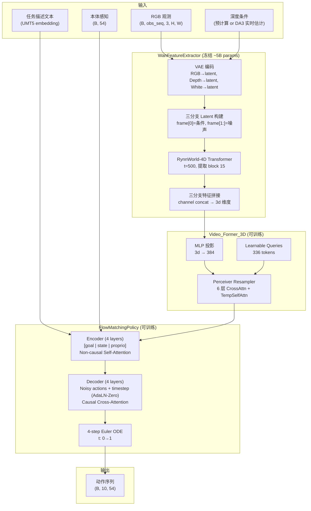

### 7.2 特征提取：`WanFeatureExtractor`

> 源码位置：`rynnworld4d_policy/policy_models/module/wan_feature_extractor.py`

#### 7.2.1 单次前向传播特征提取

Policy 不进行完整的扩散去噪循环。它在**固定时间步 $t=500$** 做单次前向传播，提取中间层特征：

```python
# vpp_policy.py extract_predictive_feature 中
features = self.TVP_encoder(pixel_values, texts, timestep=500, ...)
```

**物理意义**：$t=500$ 位于去噪过程的中间位置（总步数 1000），此时模型既有足够的噪声信号以提取全局结构信息，又保留了足够的数据信号以获取细节。

#### 7.2.2 Forward Hook + Early Exit 机制

```python
class _StopForward(Exception):
    """Sentinel exception to abort transformer forward early."""
    pass

def _register_hook(self, block_idx):
    def hook(module, input, output):
        # 捕获输出
        self._features[block_idx] = output
        if block_idx == max(self._extract_block_idx):
            raise _StopForward()  # 提前终止前向传播
    return block.register_forward_hook(hook)
```

当所有需要的 block 输出都被捕获后，通过抛出异常中止 Transformer 的剩余前向传播。

**物理删除优化**：当 `num_inference_layers` 被设置时（默认配置中为 20），直接从 `nn.ModuleList` 中删除不需要的 blocks：

```python
if num_inference_layers is not None:
    self.transformer.blocks = self.transformer.blocks[:num_inference_layers]
```

由于特征从 block 15 提取，blocks 16-29 在推理时是不必要的。物理删除节省了 GPU 显存和加载时间。

#### 7.2.3 三分支 Latent 构建

```python
def _build_rynnworld4d_latents(self, pixel_values, depth_cond):
    # Video: frame[0] = VAE(RGB condition), frame[1:] = noise
    latents_video = torch.randn(...)
    latents_video[:, :, :1] = self._vae_encode_single_frame(pixel_values[:, -1])
    
    # Depth: frame[0] = VAE(DA3 depth estimation), frame[1:] = noise
    latents_depth = torch.randn(...)
    depth_latent = self._estimate_depth_latent(pixel_values[:, -1])
    latents_depth[:, :, :1] = depth_latent
    
    # Flow: frame[0] = VAE(white image = zero flow), frame[1:] = noise
    latents_flow = torch.randn(...)
    white_latent = self._vae_encode_single_frame(white_image)
    latents_flow[:, :, :1] = white_latent
    
    return latents_video, latents_depth, latents_flow
```

#### 7.2.4 DA3 深度估计集成

```python
def _get_da3_model(self):
    # 延迟加载 Depth-Anything-3
    # 支持 int8 量化（通过 bitsandbytes）
    if self.da3_quantize:
        quant_config = BitsAndBytesConfig(load_in_8bit=True)
        model = DepthAnything3.from_pretrained(..., quantization_config=quant_config)
    else:
        model = DepthAnything3.from_pretrained(...)
    return model
```

DA3 模型按需加载，支持 int8 量化以节省显存。

#### 7.2.5 特征输出维度

从 block 15 提取的三分支特征经过拼接后的维度变化：

| 步骤 | 形状 | 说明 |
|------|------|------|
| Block 15 输出（每分支） | `(B, F×H'×W', d)` | 展平的序列 |
| Reshape | `(B, F, d, H', W')` | 恢复空间结构 |
| 三分支拼接 | `(B, F, 3d, H', W')` | Channel concat |
| Rearrange | `(B, F, H'×W', 3d)` | 为 Video_Former 准备 |

其中 $d$ 为 Transformer 隐藏维度（Wan 2.2-5B 中 $d=3072$），最终 `condition_dim = 3d = 9216`。

### 7.3 Video_Former_3D (Perceiver Resampler)

> 源码位置：`rynnworld4d_policy/policy_models/module/Video_Former.py`

#### 7.3.1 架构设计

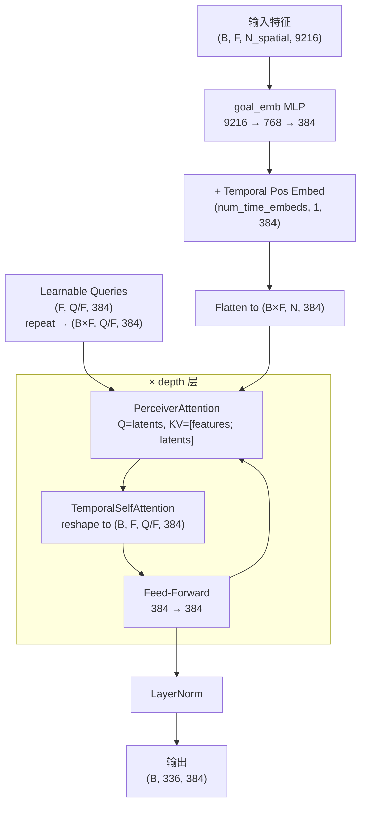

**关键参数**（来自 `train_config.yaml`）：

| 参数 | 值 | 说明 |
|------|-----|------|
| `dim` | 384 | 内部维度 |
| `depth` | 6 | Perceiver 层数 |
| `condition_dim` | 9216 | 输入特征维度 |
| `num_latents` | 336 | 总 latent query 数 |
| `num_frame` | 21 | 帧数（81帧视频经 VAE 压缩后） |
| `num_time_embeds` | 21 | 时间位置嵌入数 |
| `heads` | 8 | 注意力头数 |
| `dim_head` | 64 | 每头维度 |
| `use_temporal` | True | 启用时间自注意力 |

**Perceiver Attention 的工作原理**：

1. Queries 来自 learnable latent tokens（$Q/F$ 个 per frame，共 $Q=336$）
2. Keys/Values 来自 visual features + latent tokens 的拼接（self + cross）
3. Cross-attention 将高维空间特征压缩到低维 latent 空间

**时间自注意力**：在 Perceiver Attention 之后，latent tokens 在时间维度上做 self-attention，使不同帧的信息能够交互。

### 7.4 FlowMatchingPolicy（动作生成）

> 源码位置：`rynnworld4d_policy/policy_models/edm_diffusion/flow_matching.py`

#### 7.4.1 DiffusionTransformer 架构

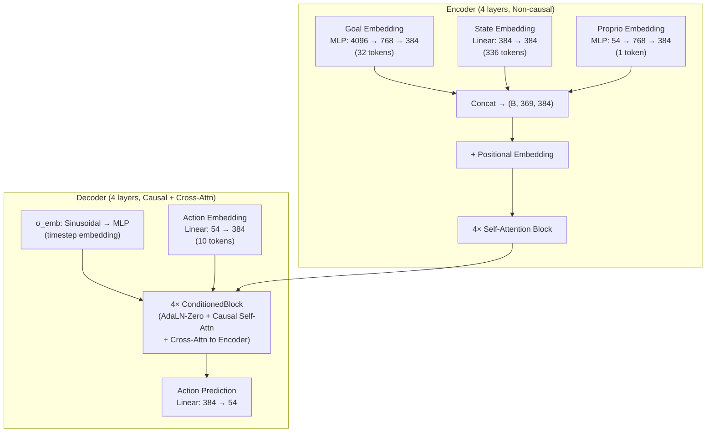

**Block size 计算**：
$$\text{block\_size} = \underbrace{32}_{\text{goal}} + \underbrace{10}_{\text{action}} + \underbrace{1 \times 336}_{\text{obs}} + \underbrace{2}_{\text{padding}} = 380$$

#### 7.4.2 Flow Matching 训练与采样

**训练**（`loss` 方法）：

$$\begin{aligned}
t &\sim \text{Uniform}[10^{-4}, 1] \\
\epsilon &\sim \mathcal{N}(0, I) \\
x_t &= (1 - t) \epsilon + t \cdot x_1 \quad \text{（线性插值）} \\
v_{target} &= x_1 - \epsilon \\
\mathcal{L} &= \|v_\theta(x_t, t) - v_{target}\|^2
\end{aligned}$$

注意这里的方向与 World Model 的 Flow Matching 不同：
- **World Model**：$z_t = (1 - \sigma_t) z_0 + \sigma_t \epsilon$，目标 $v = \epsilon - z_0$（noise - clean）
- **Policy**：$x_t = (1 - t) \epsilon + t \cdot x_1$，目标 $v = x_1 - \epsilon$（data - noise）

两者在数学上是等价的（方向相反、符号不同），但 Policy 使用了更标准的 Flow Matching 形式。

**推理**（`sample` 方法）：4 步 Euler ODE 积分，从 $t=0$（噪声）到 $t=1$（数据）：

$$\begin{aligned}
\Delta t &= 1/4 \\
\text{for } i &= 0, 1, 2, 3: \\
\quad t_i &= i \cdot \Delta t \\
\quad v_i &= v_\theta(x_{t_i}, t_i) \\
\quad x_{t_{i+1}} &= x_{t_i} + v_i \cdot \Delta t
\end{aligned}$$

#### 7.4.3 Classifier-Free Guidance (目标 Dropout)

```python
def mask_cond(cond, goal_drop=0.1):
    # 以概率 goal_drop 将整个 goal embedding 置零
    mask = torch.bernoulli(torch.ones(B) * (1 - goal_drop))
    return cond * mask.unsqueeze(-1).unsqueeze(-1)
```

训练时以 10% 概率丢弃目标条件，推理时可使用 CFG 增强目标导向性。

### 7.5 实时控制架构

#### 7.5.1 延迟分解

论文报告的在 NVIDIA RTX 5090 上的推理延迟（使用 FP8 量化 + FlashAttention 3）：

| 组件 | 延迟 (ms) | 占比 |
|------|-----------|------|
| DA3 深度估计 | 85 | 7.7% |
| VAE 编码 + Latent 准备 | 18 | 1.6% |
| RynnWorld-4D Transformer | 990 | 89.5% |
| 特征 Reshape + Concat | 1 | 0.1% |
| Video_Former (Flow Former) | 4 | 0.4% |
| Action Flow Matching Head | 8 | 0.7% |
| **总计** | **~1,106** | **100%** |

#### 7.5.2 Action Chunking

```python
# vpp_policy.py step() 方法
def step(self, obs, goal):
    if self.rollout_step_counter % self.multistep == 0:
        # 每 multistep 步重新规划
        self.plan = self.eval_forward(obs, goal)  # (B, 10, 54)
    
    action = self.plan[:, self.rollout_step_counter % self.multistep]
    self.rollout_step_counter += 1
    return action
```

每次规划生成 $K=10$ 步动作序列，机器人以 50 Hz 执行缓存的动作块，同时在后台计算下一个动作块。有效控制频率：

$$f_{eff} = K \times f_{plan} = 10 \times \frac{1}{1.106\text{s}} \approx 9 \text{ Hz}$$

#### 7.5.3 CPU Offload 推理

> 源码位置：`rynnworld4d_policy/inference_cpu_offload.py`

提供了 int8 量化 + 手动 CPU offload 的推理方案：

```python
class Int8Linear(nn.Module):
    """Per-channel int8 量化线性层"""
    def __init__(self, weight_int8, scale, bias):
        self.weight_int8 = weight_int8  # int8 权重
        self.scale = scale              # 每通道缩放因子
    
    def forward(self, x):
        # 即时反量化 + 矩阵乘法
        return F.linear(x, self.weight_int8.float() * self.scale, self.bias)
```

手动 sequential offload：
1. 将小模块（Video_Former, policy head）常驻 GPU
2. 大模块（RynnWorld-4D transformer）临时从 CPU 移至 GPU
3. 前向传播完成后立即移回 CPU

---

## 8. 论文-代码对照分析

### 8.1 论文描述与代码实现的差异

| # | 论文描述 | 代码实现 | 分析 |
|---|---------|---------|------|
| 1 | "30-layer DiT, $d=3072$" | 构造器默认 `num_layers=40, num_attention_heads=40 → inner_dim=5120` | 构造器默认值为 Python 参数默认值，实际由 `from_pretrained()` 加载的预训练模型 config 覆盖。module_joint.py 注释中使用 `dim=5120` 估算参数，可能基于更大变体 |
| 2 | "JA 每隔 3 个 block" | `joint_every_n_layers=3`，从第 0 层开始 | 完全一致 |
| 3 | "Stage 2 LR $5 \times 10^{-5}$" | `lr=5e-5`，`joint_out_lr=2.5e-4` | 代码额外指定了 JA 输出投影的独立 LR，论文未提及 |
| 4 | "λ_flow = 0.5 (Stage 1), 1.0 (Stage 2/3)" | `loss_weight_flow=0.5` (stage1), `1.0` (stage2/3) | 完全一致 |
| 5 | "Branch Dropout $p=0.2$ (Stage 2)" | `branch_dropout_prob=0.2` | 完全一致 |
| 6 | "EMA decay 0.9999" | Stage 1/2: `0.9999`；Stage 3: `0.999` | Stage 3 使用更快的 EMA 衰减，论文未区分 |
| 7 | "train resolution 81×480×640" | Stage 1 脚本: `25×480×832` | Stage 1 使用更短的视频（25帧）和更宽的分辨率（832），可能为节省显存 |
| 8 | Stage 2 "Joint unidirectional" | `joint_unidirectional=True` | 代码中 Stage 2 是单向的（仅 depth/flow 从 video 获取信息），论文将其描述为双向 JA |
| 9 | Policy "block 15 features" | `wan_extract_block_idx=15` | 完全一致 |
| 10 | Policy "timestep t=500" | `timestep=500` | 完全一致 |

### 8.2 代码中存在但论文未提及的实现细节

1. **Monkey Patching**：FP32 时间嵌入和 `control_video_latent` 注入，属于工程稳定性措施
2. **差异化学习率**：`joint_out_lr` 和 `joint_other_lr_multiplier` 的精细调控
3. **`_StopForward` 异常**：Policy 的 early exit 机制
4. **物理删除 blocks**：`num_inference_layers=20` 直接截断 block list
5. **Int8 量化推理**：`inference_cpu_offload.py` 中的自定义 int8 线性层
6. **跨节点 rendezvous**：通过 NAS 文件同步 `MASTER_PORT` 的分布式协调机制
7. **`joint_gate_video_decay` vs `joint_gate_video`**：decay buffer（不可训练）vs gate parameter（可训练）的分离设计
8. **半余弦 LR 调度**：`rynnworld4d_trainer.py` 中自定义的 lambda scheduler 使用 `cos(π × 0.5 × 2.0 × progress)`

### 8.3 消融实验对应的代码开关

| 消融实验 | 代码配置 | 效果（论文报告） |
|---------|---------|-----------------|
| Independent Branches (无 JA) | `fusion_mode=none`（仅 Stage 1） | AbsRel 0.737↑, AEPE 0.247↑ |
| w/o Modality Adaptation (跳过 Stage 1) | 直接从预训练加载到 Stage 2 | δ₁ 0.479↓ |
| w/o 4D Pre-training | 仅用机器人任务数据 | AEPE 0.729 (崩溃) |
| w/o RoPE in JA | `joint_use_rope=False` | δ₁ 0.450↓, AEPE 0.210↑ |
| Shared FFN | `share_ffn=True` | AbsRel 0.580↑, δ₁ 0.380↓ (崩溃) |
| w/o RynnWorld-4D backbone | Policy 中使用 ResNet-18 替代 | 所有任务大幅下降 |
| RGB only | 仅使用 video 分支特征 | 次优 |
| RGB + Depth | 使用 video + depth 特征 | 空间精度任务提升 |
| RGB + Optical Flow | 使用 video + flow 特征 | 运动敏感任务提升 |

### 8.4 超参数对照

| 超参数 | 论文值 | Stage 1 脚本 | Stage 2 脚本 | Stage 3 脚本 | Policy 配置 |
|--------|--------|-------------|-------------|-------------|-------------|
| Learning Rate | 2e-5 (S1), 5e-5 (S2), 1e-5 (S3) | 1.5e-5 | 5e-5 | 5e-6 | 1e-4 |
| Warmup Steps | 500 (S1), 200 (S2), 500 (S3) | 300 | 200 | 500 | 2% of total |
| Weight Decay | 1e-4 | 1e-4 | 1e-4 | 1e-4 | 0.05 |
| β₁, β₂ | 0.9, 0.95 | 0.9, 0.95 | 0.9, 0.95 | 0.9, 0.95 | 0.9, 0.9 |
| Batch Size / GPU | — | — | — | — | 1 |
| Gradient Accum | — | 4 | 2 | — | — |
| Resolution | 81×480×640 | 25×480×832 | — | — | 81×480×640 |
| EMA Decay | 0.9999 | 0.9999 | 0.9999 | 0.999 | 0.9999 |

---

## 9. 关键设计决策与工程洞察

### 9.1 共享 Noise 的跨模态对齐

三个分支使用相同的噪声样本是一个看似简单但影响深远的决策。在 Flow Matching 框架下，噪声样本定义了从数据分布到噪声分布的传输映射。共享噪声意味着三个分支在每个时间步都处于**相同的噪声水平**，使得 Joint Cross-Modal Attention 可以在对齐的信号-噪声比下进行特征交互。

如果使用独立噪声，三个分支在同一时间步可能处于不同的信噪比状态，JA 可能需要额外学习处理这种不对齐，增加了学习难度。

### 9.2 Gate 初始化的梯度工程

`gate=1.0 + OutProj=zero` 的组合是精心设计的工程解决方案。与 ControlNet 的单层 zero-init 不同，RynnWorld-4D 使用了两层控制（gate × projection），需要避免鞍点死锁。这一设计确保了：

1. **初始输出为零**：$\text{OutProj}(x) \cdot \tanh(1) = 0 \cdot 0.762 = 0$，平滑过渡
2. **梯度非零**：$\nabla_{W_{out}} \mathcal{L} = \tanh(1) \cdot ... \neq 0$，立即可学习
3. **Gate 可调节**：gate 从 1.0 开始，通过训练自适应地调节跨模态信息流强度

### 9.3 三阶段训练的渐进式设计哲学

三阶段设计体现了深度学习中的**课程学习**（curriculum learning）思想：

1. **Stage 1**：让每个分支先学会各自模态的生成能力（简单任务）
2. **Stage 2**：冻结已学会的分支，专注训练跨模态交互（中等任务）
3. **Stage 3**：全部解冻，联合优化，同时通过 decay 渐进移除对称性（困难任务）

每阶段重置优化器状态，避免了前一阶段的动量/方差累积对新阶段的干扰。

### 9.4 EMA CPU Offload 的显存优化

将 EMA shadow 参数存储在 CPU 而非 GPU 上，对于一个约 5B 参数的模型（bf16 下约 10GB），可以节省**约 10GB GPU 显存**。代价是每个 optimizer step 需要一次 GPU→CPU 的参数复制（使用 `non_blocking=True` 异步传输，开销极小）。

### 9.5 DeepSpeed ZeRO-2 vs ZeRO-3

- **Stage 1** 使用 ZeRO-3（或 Accelerate 默认），适合多 GPU 训练大模型
- **Stage 2/3** 使用 ZeRO-2 + CPU optimizer offload

ZeRO-2 仅分片优化器状态和梯度，不分片模型参数。配合 CPU offload，优化器状态（~30GB for AdamW with 5B params）被卸载到 CPU，而模型参数保留在 GPU 上。这比 ZeRO-3（分片所有内容但通信开销更大）在 Stage 2/3 中更高效，因为 Stage 2 只训练少量 JA 参数，优化器状态相对较小。

### 9.6 Policy 的 Single Forward Pass 设计

传统方法（如 SuSIE、UniPi）需要完整的扩散去噪循环来生成未来帧，然后从像素中提取信息。RynnWorld-4D-Policy 的设计直接跳过了这一过程：

1. 在固定时间步 $t=500$ 做单次前向传播
2. 提取中间层（block 15）特征
3. 这些特征已经包含了模型对未来场景演变的**内部表征**

这将推理时间从数十次去噪步骤压缩到单次前向传播，是实现实时控制的关键。

---

## 10. 训练数据与 Loss 计算深入分析

本章基于实际代码逐行分析 RynnWorld-4D（世界模型）和 RynnWorld-4D-Policy（策略头）在训练时使用的数据、数据格式、数据处理代码和 loss 计算逻辑。

### 10.1 World Model 训练数据

#### 10.1.1 数据总览

World Model 使用**预计算的 VAE 潜变量**（而非原始视频像素）进行训练。整个数据流程分为两个阶段：

```mermaid
flowchart LR
    subgraph "离线预处理 (utils/pre-process.py)"
        RAW_RGB["原始 RGB 视频"] --> VAE_E["Wan VAE Encoder"]
        RAW_DEPTH["深度视频 (DA3)"] --> VAE_E
        RAW_FLOW["光流视频 (DPFlow)"] --> VAE_E
        RAW_TEXT["文本描述 (Qwen3-VL)"] --> T5_E["UMT5 Encoder"]
        
        VAE_E --> SF_RGB["rgb_latents.safetensors"]
        VAE_E --> SF_FD["flow_depth_latents.safetensors"]
        T5_E --> SF_RGB
    end
    
    subgraph "在线训练 (RynnWorld4DDataset)"
        JSON["JSON Manifest"] --> DS["Dataset.__getitem__"]
        SF_RGB --> DS
        SF_FD --> DS
        DS --> BATCH["Training Batch"]
    end
```

#### 10.1.2 原始数据预处理：`utils/pre-process.py`

> 源码位置：`utils/pre-process.py`，`PreProcess` 类

**视频读取与变换**：

1. 使用 `decord.VideoReader` 读取视频（支持 H.264 转码回退）
2. 缩放到目标分辨率（短边匹配），然后 `CenterCrop((height, width))`
3. 像素归一化：$\text{pixel} \in [0, 255] \to [-1.0, 1.0]$（通过 `x / 255.0 * 2.0 - 1.0`）
4. 长视频分块：按 `max_num_frames` 切分，短于 40 帧的余段丢弃

**光流视频特殊处理**：
- 光流视频有 $N-1$ 帧（相邻帧对），代码在前面补一帧全白帧（像素值 255，即归一化后 +1.0），表示零光流（Middlebury 颜色编码约定）

**VAE 编码**（`encode_video` 方法）：

```python
# 伪代码（基于 pre-process.py 约 440-450 行）
video_input = frames.permute(1,0,2,3).unsqueeze(0)        # [1, C, T, H, W]
video_latents = vae.encode(video_input).latent_dist.mode() # 使用 mode() 而非 sample()

# 潜变量标准化（per-channel z-score）
latents_mean = torch.tensor(vae.config.latents_mean).view(1, -1, 1, 1, 1)
latents_std  = torch.tensor(vae.config.latents_std).view(1, -1, 1, 1, 1)
video_latents = (video_latents - latents_mean) / latents_std
```

三个模态（RGB/深度/光流）**共用同一个 VAE 编码器和相同的 `latents_mean`/`latents_std` 标准化参数**。

**文本编码**（`_get_t5_prompt_embeds` 方法）：
- 文本清理：`ftfy.fix_text` + `html.unescape` + 去除多余空白
- 使用 `T5TokenizerFast` + `UMT5EncoderModel`，最大序列长度 226（默认），零填充
- 输出形状：`(1, max_seq_len, 4096)`

#### 10.1.3 数据清单格式：JSON Manifest

> 样例文件：`data/sample.json`

```json
[
  {
    "rgb_latents": "data/sample_latents/agibot_0_rgb.safetensors",
    "flow_depth_latents": "data/sample_latents/agibot_0_flow_depth.safetensors",
    "prompt": "The robot uses its left arm to pick up a red apple ..."
  },
  ...
]
```

每个条目代表一个视频片段。训练时只需 `rgb_latents` 和 `flow_depth_latents` 两个路径（`prompt` 字段仅供参考，实际文本嵌入已编码在 safetensors 中）。

#### 10.1.4 Safetensors 文件内容

| 文件类型 | 键名 | 形状 | 说明 |
|---------|------|------|------|
| RGB safetensors | `video_latents` | `[C_z, T_{lat}, H_{lat}, W_{lat}]` | VAE 编码后的 RGB 潜变量，$C_z=16$ |
| | `text_embeds` | `[1, seq_{len}, 4096]` | UMT5 文本嵌入 |
| Flow/Depth safetensors | `depth_latents` | `[C_z, T_{lat}, H_{lat}, W_{lat}]` | VAE 编码后的深度潜变量 |
| | `flow_latents` | `[C_z, T_{lat}, H_{lat}, W_{lat}]` | VAE 编码后的光流潜变量 |

其中维度关系：
- $C_z = 16$（Wan VAE 潜变量通道数）
- $T_{lat} = (T_{raw} - 1) / 4 + 1$（Causal VAE 4x 时间压缩，如 81 帧 → 21 帧）
- $H_{lat} = H / 8$，$W_{lat} = W / 8$（8x 空间压缩）

**三个模态的潜变量形状完全相同**，因为它们来自相同分辨率和帧数的视频，经过同一个 VAE 编码器。

#### 10.1.5 `RynnWorld4DDataset.__getitem__` 详解

> 源码位置：`core/finetune/datasets/wan_dataset.py:107-158`

每个样本的加载流程：

```mermaid
flowchart TB
    IDX["idx"] --> LOAD_RGB["加载 rgb_latents.safetensors<br/>(含 5 次重试, 间隔 1s)"]
    IDX --> LOAD_FD["加载 flow_depth_latents.safetensors<br/>(含 5 次重试, 间隔 1s)"]
    
    LOAD_RGB --> EXTRACT_RGB["video_latents: [C, T, H, W]<br/>text_embeds: squeeze → [seq, dim]"]
    LOAD_FD --> EXTRACT_FD["depth_latents: [C, T, H, W]<br/>flow_latents: [C, T, H, W]"]
    
    EXTRACT_RGB --> CHECK["形状一致性检查<br/>depth.shape == video.shape?<br/>flow.shape == video.shape?"]
    EXTRACT_FD --> CHECK
    
    CHECK -->|"不匹配"| FALLBACK["回退到随机样本"]
    CHECK -->|"匹配"| FIRST_FRAME["提取首帧潜变量<br/>img_latent = video[:, :1, :, :]<br/>depth_latent = depth[:, :1, :, :]<br/>flow_latent = flow[:, :1, :, :]"]
    
    FIRST_FRAME --> RETURN["返回 8 个张量的字典"]
```

**返回字典的完整内容**：

| 键名 | 形状 | 来源 | 训练中的用途 |
|------|------|------|------------|
| `encoded_video` | `[C, T, H, W]` | RGB safetensors | 三分支 video 的干净潜变量（$z_0^{video}$） |
| `encoded_depth` | `[C, T, H, W]` | Flow/Depth safetensors | 三分支 depth 的干净潜变量（$z_0^{depth}$） |
| `encoded_flow` | `[C, T, H, W]` | Flow/Depth safetensors | 三分支 flow 的干净潜变量（$z_0^{flow}$） |
| `img_latent` | `[C, 1, H, W]` | `encoded_video[:, :1]` | RGB 首帧条件（Image-to-Video） |
| `depth_latent` | `[C, 1, H, W]` | `encoded_depth[:, :1]` | 深度首帧条件 |
| `flow_latent` | `[C, 1, H, W]` | `encoded_flow[:, :1]` | 光流首帧条件（零光流的白色图编码） |
| `null_embedding` | `[seq, dim]` | 预计算的空文本嵌入 | CFG dropout 时替换真实文本 |
| `text_embedding` | `[seq, dim]` | RGB safetensors 中的 `text_embeds` | 文本条件信号 |

**Collate 函数**（`rynnworld4d_trainer.py:714-746`）：对每个键执行 `torch.stack`，将上述字典中的每个张量在 batch 维度堆叠，如 `encoded_videos: [B, C, T, H, W]`。

### 10.2 World Model Loss 计算

> 源码位置：`core/finetune/models/wan_i2v/rynnworld4d_trainer.py:796-915`，`compute_loss` 方法

这是 RynnWorld-4D 训练的核心函数。下面逐步解析其完整实现，精确标注每一步使用了训练数据中的哪些信息。

#### 10.2.1 完整流程图

```mermaid
flowchart TB
    subgraph "Step 1: 从 batch 提取数据"
        B_VID["encoded_videos<br/>[B,C,T,H,W]"]
        B_DEPTH["encoded_depth<br/>[B,C,T,H,W]"]
        B_FLOW["encoded_flow<br/>[B,C,T,H,W]"]
        B_IMG["img_latent<br/>[B,C,1,H,W]"]
        B_DLAT["depth_latent<br/>[B,C,1,H,W]"]
        B_FLAT["flow_latent<br/>[B,C,1,H,W]"]
        B_NULL["null_embedding<br/>[B,seq,dim]"]
        B_TEXT["text_embedding<br/>[B,seq,dim]"]
    end
    
    subgraph "Step 2: 共享噪声采样"
        NOISE["noise_video = randn_like(video)"]
        NOISE --> CLONE_D["noise_depth = noise_video.clone()"]
        NOISE --> CLONE_F["noise_flow = noise_video.clone()"]
    end
    
    subgraph "Step 3: 时间步采样 + Flow-shift"
        T_SAMP["t ~ U{0, ..., T-1}"]
        T_SAMP --> SIGMA["σ_t = shift·s / (1+(shift-1)·s)"]
    end
    
    subgraph "Step 4: 构建噪声潜变量"
        B_VID --> NOISY_V["noisy_v = (1-σ)·video + σ·noise"]
        B_DEPTH --> NOISY_D["noisy_d = (1-σ)·depth + σ·noise"]
        B_FLOW --> NOISY_F["noisy_f = (1-σ)·flow + σ·noise"]
    end
    
    subgraph "Step 5: 计算目标"
        TARGET_V["target_v = noise - video"]
        TARGET_D["target_d = noise - depth"]
        TARGET_F["target_f = noise - flow"]
    end
    
    subgraph "Step 6: 首帧替换"
        B_IMG --> REPLACE_V["noisy_v[:,:,0:1] = img_latent"]
        B_DLAT --> REPLACE_D["noisy_d[:,:,0:1] = depth_latent"]
        B_FLAT --> REPLACE_F["noisy_f[:,:,0:1] = flow_latent"]
    end
    
    subgraph "Step 7: Branch Dropout"
        BD["p < branch_dropout_prob?"]
        BD -->|"是"| BD_CHOOSE["随机选 depth 或 flow"]
        BD_CHOOSE --> BD_APPLY["选中分支 frame[1:] = randn(...)"]
    end
    
    subgraph "Step 8: CFG Dropout"
        CFG["p < 0.15?"]
        CFG -->|"是"| CFG_APPLY["text_emb = null_embedding"]
        B_TEXT --> CFG
        B_NULL --> CFG_APPLY
    end
    
    subgraph "Step 9: 构建 per-token timestep"
        PER_TOK["frame[0] → timestep=0<br/>frame[1:] → timestep=σ_t·T"]
    end
    
    subgraph "Step 10: Transformer 前向"
        FORWARD["model(noisy_v, noisy_d, noisy_f,<br/>timestep, text_emb)"]
        FORWARD --> PRED_V["pred_video"]
        FORWARD --> PRED_D["pred_depth"]
        FORWARD --> PRED_F["pred_flow"]
    end
    
    subgraph "Step 11: 计算 Loss"
        LOSS_V["loss_v = MSE(pred_v[:,1:], target_v[:,1:])"]
        LOSS_D["loss_d = MSE(pred_d[:,1:], target_d[:,1:])"]
        LOSS_F["loss_f = MSE(pred_f[:,1:], target_f[:,1:])"]
        TOTAL["loss = loss_v + loss_d + λ_flow · loss_f"]
    end
    
    NOISY_V --> BD
    NOISY_D --> BD
    NOISY_F --> BD
    
    BD --> FORWARD
    CFG --> FORWARD
    PER_TOK --> FORWARD
    
    TARGET_V --> LOSS_V
    TARGET_D --> LOSS_D
    TARGET_F --> LOSS_F
    PRED_V --> LOSS_V
    PRED_D --> LOSS_D
    PRED_F --> LOSS_F
    LOSS_V --> TOTAL
    LOSS_D --> TOTAL
    LOSS_F --> TOTAL
```

#### 10.2.2 逐步代码解析

**Step 1：提取 batch 数据**（约第 797-813 行）

```python
video_latent       = batch["encoded_videos"].to(model_dtype)   # 干净 RGB 潜变量
depth_video_latent = batch["encoded_depth"].to(model_dtype)    # 干净深度潜变量
flow_video_latent  = batch["encoded_flow"].to(model_dtype)     # 干净光流潜变量
img_latent         = batch["img_latent"].to(model_dtype)       # RGB 首帧条件
depth_latent       = batch["depth_latent"].to(model_dtype)     # 深度首帧条件
flow_latent        = batch["flow_latent"].to(model_dtype)      # 光流首帧条件
null_embedding     = batch["null_embedding"].to(model_dtype)   # 空文本嵌入
text_embedding     = batch["text_embedding"].to(model_dtype)   # 真实文本嵌入
```

**全部 8 个字段都被使用**，每个字段在后续步骤中都有明确用途。

**Step 2：共享噪声采样**（约第 821-823 行）

```python
noise_video = torch.randn_like(video_latent)
noise_depth = noise_video.clone()   # 深度使用完全相同的噪声
noise_flow  = noise_video.clone()   # 光流使用完全相同的噪声
```

三个分支使用**完全相同的噪声**。这是关键设计决策——共享噪声对齐了三个分支的去噪轨迹，使 Joint Cross-Modal Attention 可以在一致的信噪比水平下进行特征交互。

**Step 3：时间步采样与 Flow-shift 调度**（约第 825-836 行）

$$s = \frac{t_{idx}}{T}, \quad \sigma_t = \frac{s \cdot \text{shift}}{1 + (\text{shift} - 1) \cdot s}$$

其中 $\text{shift}$ 为 Wan 调度器的 `flow_shift` 参数（默认 5.0）。这个非线性映射将均匀采样的 $s \in [0,1]$ 偏向更高噪声水平。

**Step 4：构建噪声潜变量**（约第 838-840 行）

$$z_t^m = (1 - \sigma_t) z_0^m + \sigma_t \epsilon, \quad m \in \{\text{video, depth, flow}\}$$

这是标准的 Flow Matching / Rectified Flow 线性插值路径。

**Step 5：计算速度目标**（约第 842-844 行）

$$v_{target}^m = \epsilon - z_0^m$$

速度方向从干净数据指向噪声（"noise minus clean"），即沿插值路径的前进方向。

**Step 6：首帧条件替换**（约第 846-848 行）

```python
noisy_latents[:, :, 0:1, :, :]       = img_latent      # 使用 img_latent
noisy_latents_depth[:, :, 0:1, :, :] = depth_latent    # 使用 depth_latent
noisy_latents_flow[:, :, 0:1, :, :]  = flow_latent     # 使用 flow_latent
```

将每个分支的第 0 帧替换为**干净的首帧潜变量**。这实现了 Image-to-Video 条件注入——模型始终看到干净的首帧，只需预测后续帧。这里直接使用了 dataset 中预提取的 `img_latent`、`depth_latent`、`flow_latent`。

**Step 7：Branch Dropout**（约第 853-864 行）

```python
if branch_dropout_prob > 0:
    allowed_modes = [m for m in branch_dropout_modes if m != 'video']
    # 'video' 永远不被 dropout（RGB 是外观锚点）
    if allowed_modes and random.random() < branch_dropout_prob:
        chosen = random.choice(allowed_modes)  # 随机选 'depth' 或 'flow'
        if chosen == 'depth':
            noisy_latents_depth[:, :, 1:, :, :] = torch.randn_like(...)
        else:
            noisy_latents_flow[:, :, 1:, :, :] = torch.randn_like(...)
```

- 以概率 `branch_dropout_prob`（Stage 2: 0.2, Stage 3: 0.05），随机选择 depth 或 flow 之一
- 将被选中分支的 **非首帧** 噪声潜变量替换为纯随机噪声（首帧保留条件）
- Video 分支**永远不被 dropout**——它作为"外观锚点"始终提供可靠信息
- 这迫使 Joint Attention 学习从可见模态重建被遮蔽模态

**Step 8：Classifier-Free Guidance Dropout**（约第 867-868 行）

```python
if random.random() < 0.15:           # 硬编码 15% 概率
    text_embedding = null_embedding  # 使用空文本嵌入替换真实文本
```

这使模型在推理时能使用 CFG 引导：$\hat{v} = v_{uncond} + w \cdot (v_{cond} - v_{uncond})$。概率 0.15 是硬编码的，不可配置。

**Step 9：构建 Per-token Timestep**（约第 870-877 行）

```python
first_frame_mask = torch.ones(1, 1, num_frames, height, width)
first_frame_mask[:, :, 0] = 0  # 首帧 timestep = 0（干净信号）

per_token_timestep = first_frame_mask[0][0][:, ::2, ::2] * shifted_timesteps
```

- 首帧的所有空间位置获得 timestep = 0（表示干净信号）
- 后续帧获得采样的 timestep $\sigma_t \cdot T$
- `::2` 下采样匹配 patch 后的空间维度（patch_size = (1,2,2) 的空间步幅）

**Step 10：Transformer 前向传播**（约第 879-888 行）

```python
video_pred, depth_pred, flow_pred = model(
    hidden_states       = noisy_latents,       # 噪声 RGB 潜变量
    hidden_states_depth = noisy_latents_depth,  # 噪声深度潜变量
    hidden_states_flow  = noisy_latents_flow,   # 噪声光流潜变量
    timestep            = timestep_input,        # per-token timestep
    encoder_hidden_states = text_embedding,      # 文本条件（可能已被 CFG dropout）
    return_dict=False,
)
```

模型接受三组噪声潜变量 + 时间步 + 文本条件，返回三个速度预测。

**Step 11：计算 Loss**（约第 890-908 行）

```python
# 每个分支独立计算 MSE，排除首帧（[:, :, 1:]）
loss_video = F.mse_loss(video_pred[:, :, 1:].float(), target_video[:, :, 1:].float())
loss_depth = F.mse_loss(depth_pred[:, :, 1:].float(), target_depth[:, :, 1:].float())
loss_flow  = F.mse_loss(flow_pred[:, :, 1:].float(),  target_flow[:, :, 1:].float())

# 加权组合
loss = loss_video + loss_depth + loss_weight_flow * loss_flow
```

**关键细节**：
1. **首帧排除**：`[:, :, 1:]` 排除了第 0 帧。因为首帧是干净的条件输入（不含噪声），对其做速度预测没有意义
2. **FP32 计算**：`.float()` 确保 loss 在 FP32 下计算，避免 bf16 下的数值不稳定
3. **`reduction="mean"`**：默认的 MSE 均值归约，在所有维度（通道、帧、高、宽）上取平均

**损失系数**：

| 损失项 | 系数 | Stage 1 | Stage 2/3 |
|--------|------|---------|-----------|
| `loss_video` | 1.0（固定） | 1.0 | 1.0 |
| `loss_depth` | 1.0（固定） | 1.0 | 1.0 |
| `loss_flow` | `loss_weight_flow` | **0.5** | **1.0** |

Stage 1 中光流损失权重为 0.5 的原因：光流的首帧条件（白色图 = 零光流）信息量远低于 RGB 的首帧条件（实际图像），因此降低权重避免其主导训练。

#### 10.2.3 训练数据字段使用汇总

| 数据字段 | 使用步骤 | 用途 |
|---------|---------|------|
| `encoded_video` | Step 4, 5 | 构建噪声潜变量、计算速度目标 |
| `encoded_depth` | Step 4, 5 | 构建噪声潜变量、计算速度目标 |
| `encoded_flow` | Step 4, 5 | 构建噪声潜变量、计算速度目标 |
| `img_latent` | Step 6 | RGB 首帧条件替换 |
| `depth_latent` | Step 6 | 深度首帧条件替换 |
| `flow_latent` | Step 6 | 光流首帧条件替换 |
| `text_embedding` | Step 8, 10 | 文本条件信号（可被 CFG dropout） |
| `null_embedding` | Step 8 | CFG dropout 时替换文本 |

**所有 8 个字段都被完整使用**，没有冗余数据。

### 10.3 Policy 训练数据

#### 10.3.1 数据总览

Policy 训练使用**原始机器人遥操作数据**（视频 + 动作序列），与 World Model 的预计算潜变量方式不同。

```mermaid
flowchart LR
    subgraph "磁盘上的 Episode 数据"
        EP["episode_00001/"]
        EP --> MP4["observation.images.head.mp4<br/>1280×720, 30fps"]
        EP --> PQ["timeseries.parquet<br/>action (54-dim), state (54-dim)"]
        EP --> META["metadata.json<br/>task_prompt, fps"]
        EP --> DEPTH_V["[可选] depth.mp4<br/>(从 depth_root_dir)"]
    end
    
    subgraph "预计算文本嵌入"
        TEXT_SF["text_embeddings/pick_up.safetensors<br/>(77, 4096) UMT5 embedding"]
    end
    
    subgraph "TianjiVideoDataset"
        MP4 --> TRANSFORM["CenterCrop(480,640)<br/>ColorJitter<br/>Normalize → [-1,1]"]
        PQ --> ACTION["动作提取 + 标准化<br/>(raw - mean) / std"]
        PQ --> STATE["状态提取<br/>(原始值, 无标准化)"]
        DEPTH_V --> D_TRANS["CenterCrop + Normalize<br/>(无 ColorJitter)"]
        TEXT_SF --> LANG["语言嵌入<br/>截取前 32 tokens"]
    end
```

#### 10.3.2 Episode 目录结构

每个 episode 对应一次遥操作采集的完整轨迹：

```
data/tianji_sample/
├── episode_00001/
│   ├── observation.images.head.mp4        # 头部摄像头视频 (1280×720, 30fps)
│   ├── observation.images.left_wrist.mp4  # [可选] 左手腕摄像头
│   ├── observation.images.right_wrist.mp4 # [可选] 右手腕摄像头
│   ├── timeseries.parquet                 # 逐帧动作和状态
│   └── metadata.json                      # {"task_prompt": "...", "fps": 30, ...}
├── episode_00002/
│   └── ...
└── action_stats.json                      # 动作标准化参数 {"mean": [...], "std": [...]}
```

深度视频存储在独立目录树中（`depth_root_dir`）：
```
data/tianji_sample_depth/
├── episode_00001/exports/mini_npz/depth.mp4
├── episode_00002/exports/mini_npz/depth.mp4
└── ...
```

#### 10.3.3 Parquet 文件内容

`timeseries.parquet` 包含的关键列：

| 列名 | 形状 | 说明 |
|------|------|------|
| `action` | `(action_dim,)` per row | 每帧的动作向量，54 维（TIANJI M6 双臂：7-DoF × 2 臂 + 20-DoF × 2 灵巧手 = 54） |
| `observation.state` | `(state_dim,)` per row | 每帧的本体感知状态，54 维（关节角度/位置） |

#### 10.3.4 `TianjiVideoDataset.__getitem__` 详解

> 源码位置：`rynnworld4d_policy/policy_models/datasets/tianji_dataset.py:205-260`

**样本索引**：在 `__init__` 中预构建了 `(episode_idx, start_frame)` 的索引列表（约第 149-152 行）。对每个 episode，从第 0 帧开始，以 `skip_frames` 为步长，直到 `n_frames - action_seq_len`，生成所有有效起始帧。

**数据加载步骤**：

```python
# 1. 读取 RGB 视频帧
video = cv2.VideoCapture(head_mp4_path)
frame = video.read(start_frame)           # 读取指定帧
rgb = self.transform(frame)               # CenterCrop + ColorJitter + Normalize[-1,1]
# → shape: (obs_seq_len, 3, H, W) = (1, 3, 480, 640)

# 2. 读取深度帧（如可用）
depth_frame = cv2.VideoCapture(depth_mp4_path).read(start_frame)
depth = self.depth_transform(depth_frame)  # CenterCrop + Normalize[-1,1], 无 ColorJitter
# → shape: (1, 3, H, W)

# 3. 读取动作序列
actions_raw = parquet_data["action"][start : start + action_seq_len]
actions = (actions_raw - self.action_mean) / self.action_std  # 逐维标准化
# → shape: (10, 54)

# 4. 读取本体感知状态
state = parquet_data["observation.state"][start]  # 原始值，无标准化
# → shape: (54,)

# 5. 语言条件
lang_text_embedding = safetensors.load(text_embedding_path)  # 预计算 UMT5
# → shape: (seq_len, 4096)
```

**动作标准化**（约第 156-184 行）：

- 如果 `action_stats.json` 存在，直接加载 `mean` 和 `std`
- 否则，遍历所有 episodes 计算全局 per-dimension 均值和标准差：
  ```python
  mean = all_actions.mean(axis=0)          # shape: (54,)
  std = max(all_actions.std(axis=0), 1e-6) # shape: (54,), 下限 1e-6
  ```
- 标准化公式：$a_{norm} = (a_{raw} - \mu) / \sigma$

**图像增强**：

| 变换 | RGB | 深度 |
|------|-----|------|
| CenterCrop(480, 640) | ✓ | ✓ |
| ColorJitter(0.2, 0.2, 0.2) | ✓ (训练时) | ✗ |
| ToTensor [0,1] | ✓ | ✓ |
| Normalize(mean=[0.5]×3, std=[0.5]×3) | ✓ (→ [-1,1]) | ✓ (→ [-1,1]) |

**返回字典完整内容**：

| 键名 | 形状 | 说明 | Loss 计算中的用途 |
|------|------|------|-----------------|
| `rgb_obs["rgb_static"]` | `(1, 3, 480, 640)` | 头部摄像头 RGB 帧 | 输入 WanFeatureExtractor 提取 4D 特征 |
| `depth_static` | `(1, 3, 480, 640)` | 深度帧（如可用） | 深度分支条件 |
| `state` | `(54,)` | 本体感知（原始值） | 输入 DiffusionTransformer 的 proprio_emb |
| `actions` | `(10, 54)` | 标准化后的未来动作 | Flow Matching 的目标（$x_1$） |
| `lang_text_embedding` | `(seq, 4096)` | 预计算 UMT5 文本嵌入 | 输入 DiffusionTransformer 的 goal_emb |
| `idx` | `int` | 样本索引 | 仅用于日志 |

#### 10.3.5 TianjiDataModule 数据划分

> 源码位置：`tianji_dataset.py:289-398`

数据按**episode 级别**划分（而非 sample 级别）：前 90% 的 episodes 用于训练，后 10% 用于验证。这确保了验证集包含完整的、未见过的轨迹。

### 10.4 Policy Loss 计算

#### 10.4.1 训练步完整流程

> 源码位置：`rynnworld4d_policy/policy_models/vpp_policy.py:192-267`

```mermaid
sequenceDiagram
    participant BATCH as Training Batch
    participant VPP as VPP_Policy
    participant WFE as WanFeatureExtractor<br/>(frozen ~5B params)
    participant VF as Video_Former_3D<br/>(trainable)
    participant FM as FlowMatchingPolicy<br/>(trainable)
    participant DT as DiffusionTransformer
    
    Note over VPP: training_step (line 192)
    BATCH->>VPP: dataset_batch
    VPP->>VPP: extract_predictive_feature()
    
    Note over VPP: Step A: 提取视觉特征
    VPP->>WFE: rgb_static, depth_cond, text_emb, timestep=500
    
    Note over WFE: _build_rynnworld4d_latents()
    WFE->>WFE: VAE encode RGB frame[0] → video_latent
    WFE->>WFE: DA3/precomputed depth → depth_latent
    WFE->>WFE: White image → flow_latent (零光流)
    WFE->>WFE: 构建三分支: frame[0]=条件, frame[1:20]=noise
    
    Note over WFE: _transformer_step_rynnworld4d()
    WFE->>WFE: RynnWorld4D forward (block 0-19, 冻结)
    WFE->>WFE: Hook 捕获 block 15 输出
    WFE->>WFE: cat(video, depth, flow) → (B, 3N, 3072)
    WFE->>WFE: Reshape → (B, 21, 9216, H_tok, W_tok)
    WFE-->>VPP: perceptual_features (B, 21, H×W, 9216)
    
    Note over VPP: Step B: Perceiver 压缩
    VPP->>VF: perceptual_features (B, 21, spatial, 9216)
    VF-->>VPP: compressed (B, 336, 384)
    
    Note over VPP: Step C: 组装 predictive_feature
    VPP->>VPP: state_images = compressed
    VPP->>VPP: state_obs = batch["state"]
    VPP->>VPP: latent_goal = text_emb[:, :32, :]
    
    Note over FM: Step D: Flow Matching Loss
    VPP->>FM: loss(predictive_feature, actions, latent_goal)
    
    FM->>FM: t ~ U(1e-4, 1.0), noise ~ N(0,I)
    FM->>FM: x_t = (1-t)·noise + t·actions
    FM->>FM: v_target = actions - noise
    FM->>DT: predict_velocity(state, x_t, goal, t)
    
    Note over DT: Encoder-Decoder 前向
    DT->>DT: Encoder: cat[goal_emb, tok_emb(state), proprio_emb]
    DT->>DT: Decoder: action_emb(x_t) + σ_emb(t) → FiLM
    DT-->>FM: v_pred (B, 10, 54)
    
    FM->>FM: loss = MSE(v_pred, v_target)
    FM-->>VPP: loss scalar
```

#### 10.4.2 `FlowMatchingPolicy.loss` 逐行解析

> 源码位置：`rynnworld4d_policy/policy_models/edm_diffusion/flow_matching.py:105-120`

```python
def loss(self, state, actions, goal):
    B = actions.shape[0]                                    # batch size

    # 1. 采样 flow time t ∈ (0, 1]
    t = torch.rand(B, device=actions.device).clamp(1e-4, 1.0)  # 下限 1e-4 避免数值问题

    # 2. 采样高斯噪声
    noise = torch.randn_like(actions)                       # shape: (B, 10, 54)

    # 3. 线性插值构建噪声动作
    t_expand = t.view(B, 1, 1)                              # 广播形状
    x_t = (1 - t_expand) * noise + t_expand * actions       # t=0: 纯噪声, t=1: 纯数据

    # 4. 目标速度
    v_target = actions - noise                              # 从噪声到数据的直线方向

    # 5. 网络预测速度
    v_pred = self.predict_velocity(state, x_t, goal, t)     # → (B, 10, 54)

    # 6. MSE 损失
    return F.mse_loss(v_pred, v_target), v_pred
```

**数学形式**：

给定标准化动作 $x_1 = a_{norm} \in \mathbb{R}^{10 \times 54}$ 和噪声 $\epsilon \sim \mathcal{N}(0, I)$：

$$x_t = (1 - t)\epsilon + t \cdot x_1, \quad t \sim \text{Uniform}(10^{-4}, 1)$$

$$v_{target} = x_1 - \epsilon$$

$$\mathcal{L}_{policy} = \mathbb{E}_{t, \epsilon} \left[ \| v_\theta(x_t, t, \text{state}, \text{goal}) - v_{target} \|^2 \right]$$

**与 World Model 的 Flow Matching 对比**：

| 对比项 | World Model | Policy |
|--------|-------------|--------|
| 插值方向 | $z_t = (1-\sigma)z_0 + \sigma \epsilon$ | $x_t = (1-t)\epsilon + t \cdot x_1$ |
| 目标速度 | $v = \epsilon - z_0$（noise - clean） | $v = x_1 - \epsilon$（data - noise） |
| 时间步采样 | 离散均匀 + flow-shift | 连续均匀 $t \sim U(10^{-4}, 1)$ |
| 首帧排除 | 是（排除 frame[0]） | 否（所有时间步参与） |
| 噪声策略 | 三分支共享噪声 | 独立噪声 |

两者在数学上等价（方向相反），但使用了不同的参数化约定。

#### 10.4.3 `predict_velocity` 内部流程

> 源码位置：`flow_matching.py:76-103`

```python
def predict_velocity(self, state, x_t, goal, t):
    # 1. 时间嵌入: t ∈ [0,1] → t*5.0 → SinusoidalPosEmb → MLP → (B, 1, 384)
    emb_t = self._encode_time(t)
    
    # 2. Encoder: 编码上下文
    #    goal_embed  = lang_emb(goal[:, :32, :]) → (B, 32, 384)
    #    state_embed = tok_emb(state_images)     → (B, 336, 384)
    #    proprio_embed = proprio_emb(state_obs)  → (B, 1, 384)
    #    context = Encoder([goal; state; proprio]) → (B, 369, 384)
    
    # 3. Decoder: 预测速度
    #    action_input = action_emb(x_t) → (B, 10, 384)
    #    v_pred = Decoder(action_input, context, emb_t) → (B, 10, 384)
    #    v_pred = action_pred(v_pred) → (B, 10, 54)
    return v_pred
```

**输入数据在 `predict_velocity` 中的使用**：

| 数据 | 来源 | 投影 | Encoder/Decoder |
|------|------|------|----------------|
| `goal` (32, 4096) | `text_embedding[:, :32]` | `lang_emb` MLP: 4096→768→384 | Encoder 输入 |
| `state_images` (336, 384) | Video_Former 压缩的 4D 特征 | `tok_emb` Linear: 384→384 | Encoder 输入 |
| `state_obs` (54,) | `batch["state"]` 本体感知 | `proprio_emb` MLP: 54→768→384 | Encoder 输入 |
| `x_t` (10, 54) | 噪声动作（插值结果） | `action_emb` Linear: 54→384 | Decoder 输入 |
| `t` (标量) | 采样的 flow time | `sigma_emb` Sinusoidal+MLP | Decoder FiLM 条件 |

#### 10.4.4 训练 vs 验证的差异

> 源码位置：`vpp_policy.py:199-211`

| 对比项 | `training_step` | `validation_step` |
|--------|----------------|-------------------|
| 调用方法 | `model.loss(state, actions, goal)` | `model.sample(state, goal, shape, n_steps=4)` |
| 输出 | Flow matching MSE loss（标量） | 预测动作序列 `(B, 10, 54)` |
| 评估指标 | training loss（训练损失） | MSE(pred_actions, gt_actions)（动作预测误差） |
| 梯度 | 有（反向传播） | 无（`@torch.no_grad()`） |
| ODE 步数 | 不适用（直接计算损失） | 4 步 Euler 积分 |

验证时的 `sample` 方法执行 4 步 Euler ODE 积分：

```python
x = torch.randn(B, 10, 54)             # 从纯噪声开始
dt = 1.0 / 4                            # 步长 0.25
for i in range(4):                       # t = 0, 0.25, 0.5, 0.75
    t = torch.full((B,), i * dt)
    v = predict_velocity(state, x, goal, t)
    x = x + v * dt                       # Euler 前进
# x ≈ 预测的标准化动作
```

验证 MSE 是在**标准化空间**中计算的（预测动作 vs 标准化的真实动作），与训练损失在相同空间中，具有可比性。

#### 10.4.5 Policy 训练数据字段使用汇总

| 数据字段 | 处理模块 | 最终用途 |
|---------|---------|---------|
| `rgb_obs["rgb_static"]` | WanFeatureExtractor → VAE encode → Transformer → Hook | 4D 视觉特征提取 |
| `depth_static` | WanFeatureExtractor → VAE encode → Transformer depth 分支 | 深度分支条件 |
| `state` | 直接传入 DiffusionTransformer `proprio_emb` | 本体感知条件 |
| `actions` | Flow Matching 的 $x_1$（数据端点） | 速度目标 $v = x_1 - \epsilon$ |
| `lang_text_embedding` | 截取前 32 tokens → DiffusionTransformer `lang_emb` | 语言目标条件 |
| `idx` | 仅日志 | — |

---

## 参考来源

- **论文**: Zhao et al., "RynnWorld-4D: 4D Embodied World Models for Robotic Manipulation", arXiv 2607.06559
- **论文 TeX 源码**: `b/d/p/TeX_Source/`（Sec/1-intro.tex ~ 5-conclusion.tex, Appendix.tex）
- **代码**: 本地代码库各文件（以实际代码实现为准）
- **Wan 2.2 backbone**: HuggingFace diffusers (`WanTransformer3DModel`, `WanImageToVideoPipeline`)
- **Flow Matching**: Lipman et al., "Flow Matching for Generative Modeling", ICLR 2023
- **ControlNet zero-init**: Zhang & Agrawala, "Adding Conditional Control to Text-to-Image Diffusion Models", ICCV 2023
- **Depth Anything 3**: `rynnworld4d_policy/third_party/Depth-Anything-3/`
- **DPFlow**: 论文引用的光流估计方法
- **Rectified Flow**: Liu et al., "Flow Straight and Fast: Learning to Generate and Transfer Data with Rectified Flow", ICLR 2023
