# D4A 多视角 4D World-Action Model（MV-4D-WAM）落地方案

> **一句话目标**：输入 3 路相机图像/短视频 + 机器人当前状态 + 语言指令，输出（a）可直接执行的 action chunk（多时间步关节角 + 末端位姿），（b）尽可能丰富的、米制（metric）对齐的 4D 时空信息（未来多视角 RGB-D、米制点云/点图、2D 光流 + 3D scene flow、世界系稠密 3D 点轨迹、4D 占据、前馈 4D Gaussians、机器人自身 4D 运动、real-to-sim 数字孪生状态、接触与进度语义）。
>
> **文档定位**：这是一份**工程落地方案**，不是文献综述。所有章节都以「我要怎么做出来」为组织原则：先给结论与选型，再给架构与公式，再给数据、训练、评测、部署、里程碑。文献只作为「可复用的零件清单」出现。
>
> **配套文档**：本仓库 `multitrack_bnchmrk_1.md`（评测基准全景）、`multitrack_rb_sota_1.md`（2026 Robotic MV-4D-WM SOTA 论文）、`b/p/RynnWorld_4D_.../analyz_1.md`（RGB-DF 三分支 4D 世界模型精读，含米制尺度缺陷分析）、`b/p/PAIWorld_.../`（Geo-RoPE 与跨视角注意力）。
>
> **版本**：v1.0（2026-07）｜**适用硬件假设**：单臂/双臂机械臂 + 3 相机（1 base/head + 2 wrist），推理端 1×(A100/H100/RTX 6000 Ada/AGX Thor) 级 GPU。

---

## 目录

- [第 0 章 结论先行（TL;DR 与选型建议）](#第-0-章-结论先行tldr-与选型建议)
- [第 1 章 目标形式化、I/O 规格与 4D 输出谱系](#第-1-章-目标形式化io-规格与-4d-输出谱系)
- [第 2 章 可复用的零件清单（关键参考工作 7 组）](#第-2-章-可复用的零件清单关键参考工作-7-组)
- [第 3 章 总体架构设计（核心章）](#第-3-章-总体架构设计核心章)
- [第 4 章 数据与监督：四层金字塔与伪标签流水线](#第-4-章-数据与监督四层金字塔与伪标签流水线)
- [第 5 章 训练方案：三阶段 + RL 后训](#第-5-章-训练方案三阶段--rl-后训)
- [第 6 章 双轨评测体系](#第-6-章-双轨评测体系)
- [第 7 章 部署与工程](#第-7-章-部署与工程)
- [第 8 章 里程碑与风险](#第-8-章-里程碑与风险)
- [第 9 章 参考文献（分类 + 开源程度）](#第-9-章-参考文献分类--开源程度)
- [附录 A 配图与脚本](#附录-a配图与脚本)｜[附录 B 术语速查](#附录-b术语速查)｜[附录 C 一页 checklist](#附录-c一页-checklist开工即用)

---

## 第 0 章 结论先行（TL;DR 与选型建议）

### 0.1 五条最重要的工程结论

| # | 结论 | 依据 | 对本方案的影响 |
|---|---|---|---|
| 1 | **不要做「先想象一段视频、再从视频里解动作」的串行 WAM**。世界模型的收益主要来自**训练期的 video/4D co-training**（表征层面），而不是**测试期的像素级想象**。 | Fast-WAM 的消融：去掉视频共训导致的性能下降**远大于**去掉测试期想象；端到端延迟从「想象→执行」的秒级降到 190 ms 级仍保持性能 | 采用**双速率架构**：4D 头只在训练期强制存在（提供梯度），部署期可异步/按需开启（第 3 章） |
| 2 | **主干应该是几何基座（GFM），而不是纯 VLM 或纯视频 DiT**。几何基座天然携带多视角一致性与米制尺度先验，抗相机扰动能力显著更强。 | GAM：以 Depth-Anything-3-Giant 为主干，在第 \(L_s=12\) 层切开插入因果预测器，LIBERO 97.6%、LIBERO-Plus 85.5%、**相机扰动子集 83.1%**（远高于 VLM 系）；PAIWorld：Geo-RoPE + 跨视角几何注意力在 WorldArena 登顶 | 路线 A 定为主推（第 3.4 节） |
| 3 | **动作头必须极轻、单次前向**。控制频率决定真机成败，动作头不能与视频/4D 头共享采样步数。 | GAM：1.4B 模型 CUDA Graph 下 **6.9 ms/145 Hz**；π0.6：3 相机 + 5 步去噪 **63 ms**；RTC 论文：Δt=20 ms 下需要「异步 chunk 拼接」才能不抖 | 动作头用 flow-matching（≤5 步）或直接回归，独立于 4D 头（第 3.5 节）；部署强制 RTC（第 7.3 节） |
| 4 | **4D 输出要以「米制」为第一公民**。相对深度 + median scaling 的 4D 无法用于抓取、碰撞检测与 real-to-sim；这正是 RynnWorld-4D 一类方案的核心短板（0–5 m clip + 8-bit 量化 + 评测 median scaling）。 | 本仓库 `b/p/RynnWorld_4D_.../analyz_1.md` §1.5；MapAnything 的 factored 表征显式输出**单一米制尺度因子** | 数据层用「机器人 link 长度 + FK + 手眼外参」求解全局米制尺度锚定；深度存 float16；评测报告**不做 median scaling**的绝对误差（第 4.4 节、6.3 节） |
| 5 | **要有一条完整可跑的「他人代码」起跑线**，否则 6 周内做不出 MVP。 | X-WAM（Wan2.2-TI2V-5B + depth 分支，代码/权重/数据全开源，3×RGB-D 多视角，RoboCasa 79.2% / RoboTwin2.0 90.7%）、GAM（代码开源，1.4B，145 Hz）、Genie Envisioner（GE-Base/Act/Sim 开源）、LeRobot（含 RTC 实现） | MVP 阶段**先复现 X-WAM 或 GAM**，把 3 相机数据管线打通，再替换/叠加自研 4D 头（第 8.1 节） |

### 0.2 三条路线一页速览

| 维度 | **路线 A：GFM-centric**（主推） | **路线 B：Video-DiT-centric**（4D 最丰富） | **路线 C：A+B 混合 + 4DGS/real-to-sim**（能力上限） |
|---|---|---|---|
| 主干 | DA3-Giant / π³ / VGGT（切层插入因果预测器） | Wan2.2-TI2V-5B / Cosmos-Predict（+ depth 分支 + 异步噪声采样） | A 做实时控制；B 做离线想象；4DGS 头 + 物理孪生做闭环 |
| 参数量 | 1.0–1.6 B | 5–14 B | 7–20 B（分体部署） |
| 动作延迟 | **6.9–20 ms**（145 Hz 可达） | 200 ms–数 s（需蒸馏才能实时） | A 路径 ≤20 ms，B/C 路径异步 |
| 4D 丰富度 | 深度/点图/scene flow/3D track/占据（**无高保真像素**） | 未来多视角 RGB-D 视频（**像素级**）+ 深度 | 全部：像素 + 米制几何 + 自由新视角 + 物理可交互 |
| 数据需求 | 中（几何伪标签可自动生成） | 高（需大规模视频 + 深度） | 高 |
| 训练算力（参考） | GAM 量级：64×GH200×96 h（Stage 1）+ 16×GH200×48 h（Stage 2） | X-WAM 量级：5800+ 小时视频预训练 | A+B 之和 + 蒸馏 |
| 上手难度 | 中 | 低（有全开源复现物） | 高 |
| 适用场景 | **真机闭环控制**（本目标主线） | 数据增广、策略评测器、可视化交付物 | 长期能力上限、离线评测与仿真闭环 |

**推荐执行序**：MVP 用 B（复现 X-WAM，最快看到 3 路 RGB-D 未来预测 + 动作）→ V1 切到 A 做真机实时控制并叠加全部 4D 头 → V2 引入 C（4DGS/real-to-sim + 世界模型内 RL）。理由：B 的开源完备度最高、能最快验证数据管线；A 的延迟与鲁棒性才是真机可用的必要条件；C 是评测与长尾能力的放大器。

### 0.3 目标系统一张图

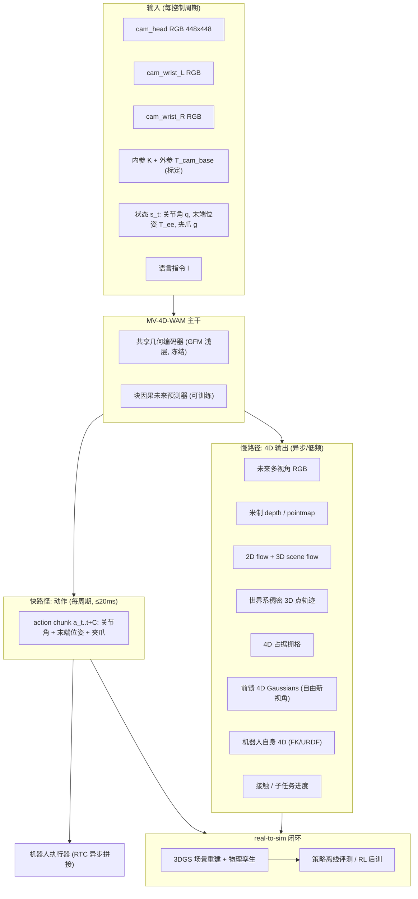

---

## 第 1 章 目标形式化、I/O 规格与 4D 输出谱系

### 1.1 形式化定义

**观测**。在控制时刻 \(t\)，系统获得

\[
o_t=\Big(\{I_{v,t-K:t}\}_{v=1}^{V},\ \{K_v, T^{base}_{cam_v}\}_{v=1}^{V},\ s_t,\ \ell\Big),\qquad V=3
\]

其中：

- \(I_{v,t-K:t}\in\mathbb{R}^{(K+1)\times 3\times H\times W}\)：第 \(v\) 路相机最近 \(K+1\) 帧（\(K=0\) 即单帧；本方案默认 \(K\in\{0,1,3\}\) 可配，见 §1.2）；
- \(K_v\in\mathbb{R}^{3\times3}\)：内参；\(T^{base}_{cam_v}\in SE(3)\)：相机到机器人 base 系的外参（head 相机为固定标定，wrist 相机由 FK 实时给出）；
- \(s_t=(q_t\in\mathbb{R}^{n_j},\ T^{base}_{ee,t}\in SE(3),\ g_t\in\mathbb{R})\)：本体状态；
- \(\ell\)：自然语言指令。

**输出（双头）**。

\[
\underbrace{\hat a_{t:t+C}=\big(\hat q_{t+1:t+C},\ \hat T^{base}_{ee,t+1:t+C},\ \hat g_{t+1:t+C}\big)}_{\text{动作 chunk，}C\in[8,50]}
\quad\Big\|\quad
\underbrace{\hat{\mathcal G}_{t:t+H}}_{\text{4D 集合，}H\in[1,16]}
\]

4D 集合定义为一个**可插拔的输出字典**（第 1.3 节谱系逐项定义）：

\[
\hat{\mathcal G}_{t:t+H}=\Big\{\hat I_{v,t+1:t+H},\ \hat D_{v,t:t+H},\ \hat X_{v,t:t+H},\ \hat F^{2D}_{v},\ \hat F^{3D},\ \hat{\mathcal T}^{world},\ \hat O^{occ},\ \hat{\mathcal{GS}},\ \hat M^{self},\ \hat c,\ \hat p\Big\}
\]

**训练目标**（总览，细节见 §3.6）：

\[
\mathcal L=\lambda_{act}\mathcal L_{act}+\lambda_{depth}\mathcal L_{depth}+\lambda_{flow}\mathcal L_{flow}+\lambda_{track}\mathcal L_{track}+\lambda_{occ}\mathcal L_{occ}+\lambda_{gs}\mathcal L_{gs}+\lambda_{rgb}\mathcal L_{rgb}+\lambda_{feat}\mathcal L_{REPA}+\lambda_{sem}\mathcal L_{sem}
\]

参考 GAM 的权重配比经验（\(\lambda_{act}=3,\ \lambda_{depth}=3,\ \lambda_{feat}=1\)）：**动作与几何同权重、表征对齐权重次之**，这是"几何监督不压制动作性能"的关键配比。

### 1.2 I/O 硬规格（可直接写进接口文档）

**输入张量规格**

| 字段 | 形状 / 类型 | 取值与约定 | 备注 |
|---|---|---|---|
| `images` | `[V=3, K+1, 3, 448, 448]` uint8 | 顺序固定 `[head, wrist_left, wrist_right]`；缺相机用零填充 + `cam_mask` | 448² 与 π0.6/GAM 一致；短视频默认 `K+1=1`（快路径）或 `4`（4D 路径） |
| `cam_mask` | `[V]` bool | 相机是否有效 | 支持 1/2/3 相机混合训练，提升鲁棒性 |
| `intrinsics` | `[V, 3, 3]` float32 | 与 resize 后分辨率一致 | 必须随 resize/crop 同步变换 |
| `extrinsics` | `[V, 4, 4]` float32 | \(T^{base}_{cam_v}\)，**米制** | wrist 相机每帧由 FK 计算 |
| `state` | `[K+1, d_s]` float32 | `d_s = n_j + 9(旋转 6D+平移3) + 1` | 双臂时拼接；归一化用数据集 1%/99% 分位数 |
| `lang` | tokens | 冻结 T5/UMT5 或 VLM 文本塔 | GAM 用冻结 T5；X-WAM 用 UMT5-XXL |
| `action_history` | `[K, d_a]` float32 | 上一次已下发的 chunk 尾部 | RTC 与训练期动作条件化需要 |

**输出张量规格**

| 字段 | 形状 / 类型 | 单位 | 监督来源 |
|---|---|---|---|
| `action_chunk` | `[C, d_a]` float32，`d_a = n_j + 9 + 1` | rad / m | 真机/仿真 demo |
| `depth` | `[V, H+1, 1, h, w]` **float16** | **米** | MapAnything/DA3 伪标签 + 仿真真值 + RGB-D 真值 |
| `pointmap` | `[V, H+1, 3, h, w]` float16 | 米（base 系） | 由 depth + K + extrinsics 反投影，或直接预测 |
| `flow2d` | `[V, H, 2, h, w]` float16 | 像素 | CoTracker3 / SEA-RAFT 伪标签 + 仿真真值 |
| `sceneflow3d` | `[V, H, 3, h, w]` float16 | **米/步** | pointmap 差分 + 自运动补偿（§4.3） |
| `tracks3d` | `[N_p, H+1, 3] + vis [N_p, H+1]` | 米（世界系） | SpatialTrackerV2 / TAPIP3D / Track4World |
| `occ` | `[H+1, Z, Y, X]` uint8 | 占据 logits，体素 2 cm | 由点云体素化 + 时序融合 |
| `gaussians` | `[N_g, 14]`（μ,s,q,α,c，+速度 3） | 米 | 渲染损失（NoPo4D/GAF 式） |
| `rgb_future` | `[V, H, 3, H, W]` uint8 | — | 未来帧本身（视频 DiT 路径） |
| `self_4d` | `[H+1, n_link, 4, 4]` + mask | 米 | FK + URDF 前向渲染（**免费真值**） |
| `contact` | `[H+1, n_obj]` / 点级 | 0/1 | 仿真真值 + 夹爪力/位移启发式 |
| `progress` | `[H+1]` ∈[0,1] | — | 子任务进度回归（τ0-WM 式 evaluator） |

> **工程红线**：`depth` **禁止**存 uint8 / 禁止 0–5 m 硬 clip（RynnWorld-4D 的教训）。深度存 float16 或 24-bit PNG（毫米整数），量化误差 ≤1 mm。

### 1.3 「4D 输出」表征谱系（越多越好，但要知道代价）

下表按「信息量 / 计算成本 / 监督可得性」排序，是本方案的输出头清单：

| # | 4D 表征 | 数学定义 | 信息量 | 增量算力 | 监督可得性 | 直接下游用途 |
|---|---|---|---|---|---|---|
| 1 | **未来多视角 RGB** | \(\hat I_{v,t+1:t+H}\) | ★★★☆（含纹理/语义，但无米制） | ★★★★★（视频 DiT，数百 ms） | ★★★★★（未来帧免费） | 人类可视化、数据增广、策略评测器 |
| 2 | **米制 depth / pointmap** | \(\hat D_v\in\mathbb{R}^{h\times w}\)（米）、\(\hat X_v=\pi^{-1}(u,v,\hat D)\) | ★★★★ | ★（DPT 头 ~50 M） | ★★★★（GFM 伪标签 + 仿真真值） | 碰撞检测、抓取点、real-to-sim 初始化 |
| 3 | **2D 光流** | \(\hat F^{2D}_{v}(u,v)=(\Delta u,\Delta v)\) | ★★★ | ★ | ★★★★ | 运动一致性正则、动静分离 |
| 4 | **3D scene flow（米制）** | \(\hat F^{3D}=X_{t+1}-X_t\)，**扣除自运动** | ★★★★ | ★ | ★★★（需 pose + 深度联合） | 物体运动预测、动态避障、可操作性 |
| 5 | **世界系稠密 3D 点轨迹** | \(\hat{\mathcal T}^{world}=\{p_i(t+h)\}_{i\le N_p,h\le H}\) + 可见性 | ★★★★★（长时程 + 遮挡感知） | ★★（3D 相关体，Track4World O(N)） | ★★★（SpaTrackV2/TAPIP3D/Track4World 伪标签） | 动作表征本身（PointWorld）、模仿学习中间表示 |
| 6 | **4D 占据栅格** | \(\hat O^{occ}_{t+h}\in\{0,1\}^{Z\times Y\times X}\) | ★★★☆ | ★★（体素头 + 3D conv） | ★★★★（点云体素化） | 运动规划、free-space 查询、安全护栏 |
| 7 | **前馈 4D Gaussians** | \(\{\mu_i,s_i,q_i,\alpha_i,c_i,v_i\}\) 随 \(t\) 形变 | ★★★★★（可自由新视角渲染） | ★★★（GS 头 + 光栅化） | ★★（渲染损失自监督） | 任意视角想象、real-to-sim 资产、遮挡推理 |
| 8 | **机器人自身 4D** | \(\hat M^{self}_{t+h}=\{T_{link}\}\) + mask/mesh | ★★★（自身部分完备） | ★（FK 前向渲染） | ★★★★★（**URDF+FK 免费精确真值**） | 自碰撞检测、可视化、自身/环境解耦 |
| 9 | **real-to-sim 数字孪生** | 3DGS 资产 + 刚/软体物理参数 | ★★★★★（可交互闭环） | ★★★★（离线重建 + 仿真器） | ★★（需物理参数辨识） | 离线策略评测、RL 后训、反事实推演 |
| 10 | **语义 4D（接触/进度/可操作性）** | \(\hat c,\hat p,\hat{\mathcal A}\) | ★★（低维但高价值） | ★（MLP 头） | ★★★（仿真真值 + 启发式） | 失败检测、重试触发、奖励信号 |

下图把上表画成气泡图（横轴=实现成本，纵轴=对控制的信息量，气泡大小=监督可得性，颜色=建议实施阶段；脚本见附录 A）：


**读图结论**：第二象限（必做，MVP 就上）= 米制 depth/pointmap + 机器人自身 4D + 2D 光流 + 3D scene flow + 语义头；第一象限（V1/V2 逐步上）= 稠密 3D 轨迹、4D 占据、4D Gaussians、real-to-sim；未来多视角 RGB 放在**训练期共训 + 离线可视化**，不进实时控制回路。

### 1.4 三大技术范式对比（以及为什么选「几何中心 + 双速率」）

| 范式 | 代表 | 主干与输出 | 优点 | 缺点 | 对本目标的可用性 |
|---|---|---|---|---|---|
| **P1 VLM-centric VLA** | π0 / π0.5 / π0.6 / GR00T N1.5-1.6 / RDT-1B / OpenVLA-OFT / X-VLA | VLM（Gemma3/Cosmos-Reason/Eagle）+ 流匹配动作专家；输出仅动作 | 语义泛化强、生态成熟（openpi/LeRobot）、工程延迟已验证（π0.6：3 相机 63 ms） | **无显式 4D 输出**；对相机位姿扰动敏感（隐式几何） | 作为**动作头与工程范式**的参考，不作为主干 |
| **P2 Video-DiT-centric WAM** | X-WAM / τ0-WM / UWM / Genie Envisioner / Cosmos Policy / GigaWorld-Policy / DreamZero | 视频扩散主干，动作与视频（±深度）在同一序列联合去噪 | 4D 像素级最丰富、可做策略评测器与数据引擎、开源复现物完备 | 延迟高（多步去噪）；几何靠像素隐式表达，米制不保证 | **MVP 起跑线 + 慢路径**；需蒸馏才能实时 |
| **P3 Geometry/4D-centric** | GAM / PointWorld / GAF / RynnWorld-4D / PAIWorld / Spatial Forcing / VGGT-DP / GeoVLA / 4D-VLA | 几何基座（DA3/VGGT/π³）为主干，未来几何（depth/point flow/4DGS）为世界预测目标 | 米制与多视角一致性天然；**抗相机扰动**；单次前向可实时（GAM 6.9 ms） | 无高保真像素；对几何伪标签质量敏感 | **主推主干**（路线 A） |

**Fast-WAM 的关键消融（决定架构的一条结论）**：在同一模型上分别去掉「训练期视频共训」与「测试期像素想象」，前者造成的成功率下降显著大于后者；因此世界模型的价值主要以**表征正则**的形式生效。这直接给出双速率设计的合法性：

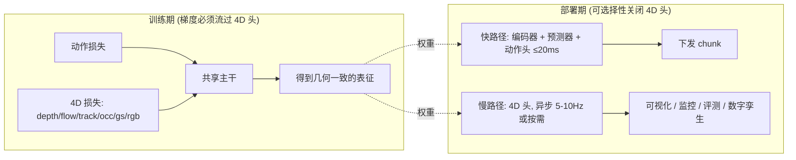

### 1.5 与「Robotic MV-4D-WM」既有工作的差距定位

本方案要同时满足三个条件，而现有工作各自只满足其中两个：

| 能力 | π0.6 类 | X-WAM 类 | GAM | RynnWorld-4D | **本方案目标** |
|---|---|---|---|---|---|
| 3 相机多视角输入 + 标定注入 | ✓（无显式标定） | ✓（无显式标定） | ✓（可选） | ✓ | ✓ **显式 K/T 注入（Geo-RoPE）** |
| 实时动作 chunk（≥50 Hz） | ✓（50 Hz） | ✗ | ✓（145 Hz） | ✗ | ✓ |
| 丰富 4D 输出 | ✗ | ✓（RGB-D） | 部分（depth） | ✓（RGB-D-Flow） | ✓ **10 类** |
| **米制尺度保证** | — | ✗ | 部分 | ✗（0–5 m clip + 8bit + median scaling 评测） | ✓ **FK 锚定 + 绝对误差评测** |
| 自由新视角 / real-to-sim | ✗ | ✗ | ✗ | ✗ | ✓（V2：4DGS + 物理孪生） |

---

## 第 2 章 可复用的零件清单（关键参考工作 7 组）

**开源程度图例**：`✅ 全开源`（代码 + 权重，可直接微调）｜`🟨 半开源`（代码或权重之一，或仅推理）｜`⬜ 仅论文/主页`｜`❓ 未核实`（本文档写作时未能确认仓库存在，落地前需人工验证）。

> **使用方式**：每张表最后一列「可复用点」是本方案实际打算「抄」的东西——抄代码、抄配置、抄数据格式、抄超参，还是只抄思想。工程排期请以这一列为准。
>
> **核实说明**：表中指标与规格来自各自公开论文/技术报告/仓库（检索截止 2026-07）。标 `❓` 的条目在写作时未能确认仓库或论文可得，**开工前必须人工核实**；关键路径上不放 `❓` 条目（替代方案见 §8.3-R7）。PAIWorld、RynnWorld-4D、EWMBench、RoboWM-Bench 等标 **【仓库】** 的条目已与本仓库 `b/p/` 中的论文源交叉核对。

### 2.1 组 1：多视角 VLA 与动作专家（抄「动作头 + 工程范式」）

| 工作 | 论文 | 主页 / GitHub | 开源 | 关键规格 | 可复用点 |
|---|---|---|---|---|---|
| **π0 / π0-FAST** | arXiv 2410.24164 / 2501.09747 | [physicalintelligence.company](https://www.physicalintelligence.company/blog/pi0) ｜ [Physical-Intelligence/openpi](https://github.com/Physical-Intelligence/openpi) | ✅ | PaliGemma 3B + 300M 流匹配动作专家；FAST 为 DCT+BPE 动作 tokenizer | **动作头结构与流匹配训练代码**；FAST tokenizer 用于自回归离散化对照实验 |
| **π0.5** | arXiv 2504.16054 | 同上（openpi 含 π0.5 权重） | ✅ | 离散 + 流匹配混合训练；开放世界泛化 | 分层「高层子任务 + 低层动作」范式；`knowledge insulation` 前身 |
| **π0.6（含 RECAP）** | 2026 技术报告 | [physicalintelligence.company](https://www.physicalintelligence.company/) | ⬜（权重未开） | **Gemma3-4B VLM + 860M 动作专家；≤4 张 448² 图（base + 双 wrist）→ 50 Hz 关节角 chunk；3 相机 + 5 步去噪 ≈ 63 ms（单 H100）**；RECAP = 优势条件化 + 真机 RL 后训 | **本方案的工程延迟基线与相机配置范式**；RECAP 的 advantage-conditioning 用于 Stage 3（§5.4） |
| **GR00T N1.5 / N1.6** | arXiv 2503.14734 + N1.6 报告 | [NVIDIA/Isaac-GR00T](https://github.com/NVIDIA/Isaac-GR00T)；HF `nvidia/GR00T-N1.6-3B` | ✅ | Eagle-2 / Cosmos-Reason VLM + 32 层 DiT 动作头；state-relative 动作；多本体 `EmbodimentTag` | **多本体 adapter 设计（不同关节数共用主干）**；数据配方与 LeRobot 兼容层 |
| **RDT-1B** | arXiv 2410.07864 | [thu-ml/RoboticsDiffusionTransformer](https://github.com/thu-ml/RoboticsDiffusionTransformer) | ✅ | 1.2B DiT 扩散策略，统一动作空间，双臂 | **统一动作空间定义（unified action vector）**——本方案的 `d_a` 布局直接借用 |
| **OpenVLA-OFT** | arXiv 2502.19645 | [moojink/openvla-oft](https://github.com/moojink/openvla-oft) | ✅ | 并行解码 + 动作 chunk + 连续动作 + L1 回归；比自回归快 26× | **「L1 回归 + 并行解码」作为动作头的低延迟备选**（对照流匹配做消融） |
| **X-VLA** | arXiv 2510.10274 | [2toinf/X-VLA](https://github.com/2toinf/X-VLA) ❓ | 🟨❓ | Soft-prompt 跨本体，0.9B 干净 DiT 架构 | 跨本体 soft prompt token 设计 |
| **FLOWER** | arXiv 2509.04996 | [intuitive-robots/flower_vla_calvin](https://github.com/intuitive-robots/flower_vla_calvin) | ✅ | 950M 小模型流匹配 VLA，中间层截断 VLM | **「VLM 只用前一半层」的算力削减技巧** |
| **SmolVLA** | arXiv 2506.01844 | [huggingface/lerobot](https://github.com/huggingface/lerobot) | ✅ | 450M，消费级 GPU 可训；异步推理栈 | **异步推理（action queue）实现**，与 RTC 配合 |
| **RoboVLMs** | arXiv 2412.14058 | [Robot-VLAs/RoboVLMs](https://github.com/Robot-VLAs/RoboVLMs) | ✅ | VLA 设计空间系统消融（4 类结构 × 8 backbone） | 选型消融方法论：哪些设计维度真的重要 |

**本组结论**：动作侧不需要创新。直接采用「**流匹配动作专家（5 步去噪）+ 可选 L1 回归头**」，`d_a` 用 RDT 式统一动作向量，多本体用 GR00T 式 embodiment adapter，工程延迟目标对齐 π0.6（3 相机 ≤63 ms）并以 GAM（6.9 ms）为上限追求。

### 2.2 组 2：统一 video-action 世界模型（抄「联合去噪 + 深度分支」）

| 工作 | 论文 | 主页 / GitHub | 开源 | 关键规格 | 可复用点 |
|---|---|---|---|---|---|
| **X-WAM** ⭐ | 2026 | [sharinka0715/X-WAM](https://github.com/sharinka0715/X-WAM) | ✅ **代码 + 权重 + 数据全开** | Wan2.2-TI2V-5B + UMT5-XXL；**新增 10 层深度分支**；**异步噪声采样 ANS**（视频/深度/动作用不同噪声级）；多视角 RGB-D + state + action 同序列去噪；`d_a=14`（双臂相对末端位姿 + 夹爪）；5800+ h 预训练；**RoboCasa 79.2% / RoboTwin2.0 90.7%** | **与本目标最接近的开源起跑线**：直接复用其 3×(RGB+Depth) 数据布局、ANS 采样器、深度分支插入方式；MVP 阶段以此为 baseline |
| **X-WAM-RoboTwin 数据集** | 同上 | HF datasets（随 X-WAM 发布） | ✅ | **3 视角（head + 双 wrist）RGB + Depth，27.5k episodes / 6.14M 帧**，320×240，每 episode ~120 条指令改写 | **直接可用的 3 相机 RGB-D 训练集**（省掉 MVP 阶段自采数据） |
| **τ0-WM** | 2026 | ⬜ | ⬜ | 统一 video-action 世界模型：VAM（视频-动作模型）+ ACVS（动作条件视频合成）；**27.3k 小时**数据；测试期 proposal→evaluation→revision（用重去噪一致性给候选动作打分） | **测试期动作重排序（evaluator）思想** → 本方案 §5.4 的 TTPA/重排序模块 |
| **UVA / UWM** | arXiv 2504.02792（UWM） | [WEIRDLabUW/unified-world-model](https://github.com/WEIRDLabUW/unified-world-model) ❓ | 🟨❓ | 统一扩散：独立控制动作与视频的扩散时间步，可退化为策略/世界模型/逆动力学 | **「按需切换角色」的时间步条件化**——本方案慢/快路径共享权重的理论依据 |
| **Genie Envisioner（GE-Base/Act/Sim）** | arXiv 2508.05635 | [AgibotTech/Genie-Envisioner](https://github.com/AgibotTech/Genie-Envisioner) | ✅ | GE-Base 视频世界模型（多视角）+ GE-Act **160M 动作解码器（部署时不渲染视频）** + GE-Sim 动作条件仿真器；配套 EWMBench | **「部署时绕过视频渲染、只跑轻量动作解码器」的完整实现**——双速率架构的现成参考 |
| **EnerVerse-AC** | arXiv 2505.09723 | [AgibotTech/EnerVerse-AC](https://github.com/AgibotTech/EnerVerse-AC) | ✅ | 动作条件世界模型作为**数据引擎 + 策略评测器** | 用世界模型做离线策略评测（§6.4） |
| **Cosmos Policy / Cosmos-Predict2.5** | NVIDIA 2025-2026 | [nvidia-cosmos/cosmos-predict2.5](https://github.com/nvidia-cosmos/cosmos-predict2.5) | ✅ | 视频世界基座后训为策略；多视角与动作条件 | 大规模视频基座的后训脚本与 tokenizer |
| **GigaWorld-1 / GigaWorld-Policy** | 2026 | 本仓库 `b/p/GigaWorld_1_...` | 🟨 | 世界模型用于**机器人策略评测**的路线图 | 评测闭环设计 |
| **VPP（Video Prediction Policy）** | arXiv 2412.14803 | [roboterax/video-prediction-policy](https://github.com/roboterax/video-prediction-policy) | ✅ | 用视频扩散的**中间表征**（而非最终像素）驱动动作 | **「取中间特征而非像素」——快路径的核心技巧** |
| **GR-1 / GR-2** | arXiv 2312.13139 / 2410.06158 | [bytedance/GR-MG](https://github.com/bytedance/GR-MG)（相关） | 🟨 | 视频生成预训练 → 动作微调的早期范式 | 历史对照，验证 co-training 有效性 |
| **Fast-WAM** ⭐ | 2026 | ⬜ | ⬜ | **190 ms 延迟的 WAM**；消融证明**训练期视频共训 > 测试期想象** | **本方案双速率设计的直接依据**（§0.1 结论 1） |

### 2.3 组 3：几何 / 4D 中心策略与世界模型（抄「主干 + 4D 头」）

| 工作 | 论文 | 主页 / GitHub | 开源 | 关键规格 | 可复用点 |
|---|---|---|---|---|---|
| **GAM（Geometric Action Model）** ⭐ | 2026 | [cvlab-kaist/Geometric-Action-Model](https://github.com/cvlab-kaist/Geometric-Action-Model) | ✅ | **DA3-Giant（ViT-G，40 blocks）在第 \(L_s=12\) 层切开**，插入 12 层因果预测器（width 1024，210 M）；冻结 0–12 层与 DPT 深度头；**一次前向同时出未来 depth + 8 步 action chunk**；1404.8 M 总参 / 983.2 M 可训；**CUDA Graph 6.9 ms → 145 Hz**；LIBERO **97.6%**、LIBERO-Plus **85.5%**、相机扰动 **83.1%**；RoboCasa-Kitchen 69.4%；预训练 784 K 轨迹（72% OXE + 18% MimicGen + 10% RoboCasa365）；\(\lambda_{act}=3,\lambda_{feat}=1,\lambda_{depth}=3\) | **路线 A 的骨架**：切层位置、冻结策略、损失权重、CUDA Graph 部署，全部直接复用 |
| **PointWorld** ⭐ | 2026（NVlabs） | [NVlabs/PointWorld](https://github.com/NVlabs/PointWorld) | ✅ Apache-2.0（含 DROID/BEHAVIOR 检查点与数据） | **世界预测与动作表征统一为「3D point flow」**：从部分可见 RGB-D 预测全场景 3D 点流，机器人动作也表示为 3D 点流 | **「动作 = 3D 点流」的统一表征** → 本方案 `tracks3d` 头与动作头的耦合方式（§3.5.4） |
| **GAF（Gaussian Action Field）** | arXiv 2506.14135 | [Gaussian Action Field 主页](https://chaiying1.github.io/GAF.github.io/) | 🟨 | 3DGS + 可学习运动属性；两张无位姿 RGB → 当前/未来/动作三种 query；V→4D→A 范式 | **4D Gaussians 头 + 「从 4D 反推动作」的 query 设计** |
| **RynnWorld-4D** | 2026 | 本仓库 `b/p/RynnWorld_4D_.../analyz_1.md` | 🟨 | **RGB-DF 三分支**（RGB + Depth + Flow 投影 4D 线索）；缺陷：0–5 m clip、8-bit 量化、评测 median scaling | **多分支投影 4D 表征结构可用；米制处理必须改造**（本方案 §4.4 的反面教材） |
| **PAIWorld** | [arXiv 2606.18375](https://arxiv.org/abs/2606.18375) | [项目页](https://guhuangai.github.io/PAIWorld-Proj/) ｜ 本仓库 `b/p/PAIWorld_.../` | 🟨（截至检索日未见代码/权重） | **Geometry-Aware Cross-View Attention + Geo-RoPE（射线方向 + 外参编码）+ Latent 3D-REPA**；2.5M 多视角视频片段预训练；WorldArena 第 1（EWMScore 72.31%），AgiBot Challenge 2026 第 2（82.45%），Scene Consistency 90.41% | **Geo-RoPE 的公式与实现（本方案 token 化核心）**；3D-REPA 表征对齐损失 |
| **Spatial Forcing** | arXiv 2510.12276 | [Spatial Forcing](https://spatial-forcing.github.io/) | 🟨 | 用 3D 基座特征**隐式对齐** VLA 中间层，无需显式深度输入 | **零成本的几何正则**（当深度伪标签不可得时的退路） |
| **VGGT-DP** | arXiv 2509.18778 | ⬜ | ⬜ | 用 VGGT 几何特征驱动扩散策略 | 几何特征注入扩散策略的接口设计 |
| **GeoVLA** | arXiv 2508.09071 | [GeoVLA](https://linsun449.github.io/GeoVLA/) | 🟨 | 点云分支 + 3D 融合注入 VLA | 点云分支与 2D 分支的融合权重 |
| **4D-VLA / SpatialVLA / DP3 / 3D-VLA** | 2503.22020 / 2501.15830 / 2403.03954 / 2403.09631 | 各自主页；DP3 [YanjieZe/3D-Diffusion-Policy](https://github.com/YanjieZe/3D-Diffusion-Policy) ✅ | ✅/🟨 | 3D 位置编码、Ego3D、稀疏点云策略 | 3D 位置编码方案对照；DP3 的稀疏点云高效编码 |
| **WAM4D / GEM-4D / Embody4D / MVISTA-4D / RoboStereo** | 2026（见 `multitrack_rb_sota_1.md`） | 见该文档 ❓ | ⬜❓ | spatial register tokens、因果混合注意力、单视角 RGBD→任意视角 RGBD、双塔 DiT（RGB + pointmap） | **思想层面**：跨视角/跨模态融合方式与测试期动作优化 |

### 2.4 组 4：几何与跟踪基座（抄「伪标签生产 + 主干权重」）

| 工作 | 论文 | 主页 / GitHub | 开源 | 关键规格 | 可复用点 |
|---|---|---|---|---|---|
| **MapAnything** ⭐ | arXiv 2509.13414 | [facebookresearch/map-anything](https://github.com/facebookresearch/map-anything) | ✅ Apache-2.0 | **factored 表征**：深度图 + 局部射线图 + 相机位姿 + **单一米制尺度因子**；统一封装 `vggt / pi3 / da3 / moge / must3r / dust3r / mast3r / pow3r / anycalib` 等推理入口；支持 12+ 任务与可选内参/位姿/深度输入 | **伪标签流水线的统一入口**（一个 API 切换多个基座）；**「显式米制尺度因子」的表征设计直接照抄** |
| **Depth Anything 3（DA3）** ⭐ | arXiv 2511.10647 | [ByteDance-Seed/Depth-Anything-3](https://github.com/ByteDance-Seed/Depth-Anything-3) | ✅ | 单一 plain transformer + 单一深度-射线目标；任意视角一致几何；Giant 版本为 GAM 主干 | **路线 A 的主干权重来源**；DPT 头结构 |
| **VGGT / VGGT-Omega** | arXiv 2503.11651（CVPR'25 Best Paper） | [facebookresearch/vggt](https://github.com/facebookresearch/vggt) | ✅ | 前馈出相机参数 + 深度 + 点图 + 轨迹；交替帧内/全局注意力 | **多视角 token 化与交替注意力**（本方案编码器结构） |
| **π³（Pi3）** | arXiv 2507.13347 | [yyfz/Pi3](https://github.com/yyfz/Pi3) | ✅ | 去参考帧偏置的置换等变视觉几何学习 | 无参考帧的对称多视角设计（3 相机无主从更自然） |
| **MoGe / MoGe-2** | arXiv 2410.19115 / 2507.02546 | [microsoft/MoGe](https://github.com/microsoft/MoGe) | ✅ | 单目开域几何 + 米制尺度 | 单目回退方案（相机故障时） |
| **Track4World** ⭐ | 2026 | ❓ | ⬜❓ | **世界系稠密 3D 跟踪（all-pixel）**，VGGT 式 ViT + 3D 相关体，任意帧对间稠密 2D+3D 流，O(N) 复杂度 | **`tracks3d` 头的结构范式**；若无代码则用 SpaTrackV2 + TAPIP3D 组合替代 |
| **SpatialTrackerV2** | arXiv 2507.12462（ICCV'25） | [henry123-boy/SpaTrackerV2](https://github.com/henry123-boy/SpaTrackerV2) | ✅ | 端到端联合出深度 + 位姿 + 3D 轨迹；单目视频可用 | **3D 轨迹伪标签主力工具** |
| **TAPIP3D** | arXiv 2504.14717 | [zbw001/TAPIP3D](https://github.com/zbw001/TAPIP3D) | ✅ | 世界空间特征云 + N2N 局部注意力，长时程 3D 点跟踪 | **世界系（而非相机系）轨迹的对齐方式**；伪标签交叉验证 |
| **CoTracker3** | arXiv 2410.11831 | [facebookresearch/co-tracker](https://github.com/facebookresearch/co-tracker) | ✅ | 2D 稠密跟踪 + 真实视频伪标签自训练 | **2D 轨迹/光流校验器**（过滤 3D 伪标签噪声） |
| **MegaSaM** | arXiv 2412.04463 | [mega-sam/mega-sam](https://github.com/mega-sam/mega-sam) | ✅ | 动态场景相机位姿 + 深度 | 无标定数据的位姿恢复（人类视频用） |
| **DynamicVGGT** | arXiv 2603.08254 | ❓ | ⬜❓ | 动态点图 + 运动感知时序注意力 + **未来点头 + 带速度的动态 3DGS 头（scene flow 监督）** | **「点图 + 速度」的 4DGS 头设计** |
| **NoPo4D** | arXiv 2605.22190 | ❓ | ⬜❓ | **无位姿多视角视频 → 前馈 4D Gaussians**；速度分解、双向运动编码、视角相关不透明度；输出 gaussians / pose / depth / flow | **前馈 4DGS 头**（本方案 `gaussians` 输出的首选参考） |

### 2.5 组 5：real-to-sim、仿真器与闭环评测（抄「数字孪生 + Gym 接口」）

| 工作 | 论文 | 主页 / GitHub | 开源 | 关键规格 | 可复用点 |
|---|---|---|---|---|---|
| **Isaac Sim / Isaac Lab** | — | [isaac-sim/IsaacLab](https://github.com/isaac-sim/IsaacLab) | ✅ | GPU 并行物理、USD 资产、域随机化 | V2 阶段大规模并行 RL 与数据生成 |
| **ManiSkill3 / SAPIEN** | arXiv 2410.00425 | [haosulab/ManiSkill](https://github.com/haosulab/ManiSkill) | ✅ | GPU 并行渲染 + 物理，30k+ FPS | 快速仿真评测与数据合成 |
| **RoboTwin 2.0** ⭐ | arXiv 2506.18088 | [RoboTwin-Platform/RoboTwin](https://github.com/RoboTwin-Platform/RoboTwin) | ✅ | 双臂多本体；**可配置导出 `rgb / depth / pointcloud / endpose / qpos / mesh_segmentation / actor_segmentation`**；head D435 + 双 wrist；强域随机化 | **4D 真值生成主力**（深度、分割、点云、接触全免费）；X-WAM 已验证在此达 90.7% |
| **RoboCasa / RoboCasa365** | arXiv 2406.02523 | [robocasa/robocasa](https://github.com/robocasa/robocasa) | ✅ | 大规模厨房场景任务集 | 长尾任务泛化评测；GAM 预训练用其 10% |
| **SimplerEnv** | arXiv 2405.05941 | [simpler-env/SimplerEnv](https://github.com/simpler-env/SimplerEnv) | ✅ | 真机-仿真评测一致性 | 低成本回归测试 |
| **SplatSim** | arXiv 2409.10161 | [SplatSim 主页](https://splatsim.github.io/) | 🟨 | 3DGS 渲染替换仿真渲染，**零样本真机 86.25% vs 真机训练 97.5%** | **3DGS 作为渲染后端**的实现路径与差距量化 |
| **RoboGSim** | arXiv 2411.11839 | [RoboGSim 主页](https://robogsim.github.io/) | ⬜ | 3DGS 数字孪生 + 真机数据回放 | 真机场景重建 → 仿真回放流程 |
| **PhysTwin** | arXiv 2503.17973 | [Jianghanxiao/PhysTwin](https://github.com/Jianghanxiao/PhysTwin) | ✅ | 从视频重建**可形变物体的物理孪生**（弹簧-质点 + GS 外观） | 软体/绳索类任务的 real-to-sim |
| **real2sim 策略评测** | arXiv 2511.04665 | HF collection ❓ | 🟨❓ | 3DGS 渲染 + 物理孪生 + Gym API 的策略评测器 | **离线策略评测闭环**的接口设计 |
| **RoboWM-Bench** | 2026 | 本仓库 `b/p/RoboWM_Bench_.../` | 🟨 | 世界模型在机器人操作中的可执行性评测 | §6.3 的 4D 侧指标来源 |

### 2.6 组 6：数据集（抄「格式 + 直接训练」）

| 数据集 | 规模 | 相机 / 模态 | 主页 | 开源 | 对本方案的用法 |
|---|---|---|---|---|---|
| **AgiBot World（2026 版）** ⭐ | 100 万+ 轨迹级 | **`top_head` / `hand_left` / `hand_right` / `head_depth` + 多路鱼眼 + 立体**，含相机参数元数据，LeRobot 式 parquet + mp4 | [OpenDriveLab/AgiBot-World](https://github.com/OpenDriveLab/AgiBot-World) | ✅ | **主力真机多视角 + 深度数据源**；相机键名与本方案 3 相机布局天然对应 |
| **RoboMIND 2.0** | 310 K 轨迹 | **6 视角 RGB-D**（Franka/UR5e 的 top/left/right，人形内置 RGB-D，AgileX/ARX 双 wrist + head），部分含触觉 | [x-humanoid-robomind.github.io](https://x-humanoid-robomind.github.io/) | ✅ | 多本体 + 多视角 RGB-D 补充；跨本体泛化验证 |
| **X-WAM-RoboTwin** ⭐ | 27.5 K episodes / 6.14 M 帧 | **3×(RGB + Depth)** + state + action + ~120 条指令改写/episode | 随 X-WAM 发布 | ✅ | **MVP 直接开训**（格式与本方案 I/O 规格几乎一致） |
| **DROID** | 76 K 轨迹 / 564 场景 | 双 Zed 立体 + wrist Zed（含内外参） | [droid-dataset.github.io](https://droid-dataset.github.io/) | ✅ | 真机野外多样性；立体真值深度 |
| **Open X-Embodiment (OXE)** | 1 M+ 轨迹 / 22 本体 | 多样（多为单视角 RGB） | [robotics-transformer-x.github.io](https://robotics-transformer-x.github.io/) | ✅ | Stage 1 广域动作预训练（GAM 用其 72%） |
| **RH20T / RH20T-P** | 110 K+ | 多视角 RGB-D + 力觉 + 音频 | [rh20t.github.io](https://rh20t.github.io/) | ✅ | 接触/力监督的稀有来源 |
| **Galaxea Open-World / RoboCOIN** | 10 K–500 K 级 | 多视角 + 全身移动操作 | 各自主页 | ✅/🟨 | 移动 + 全身 4D 扩展（V2 全身目标） |
| **EgoDex** | 829 h / 338 K 轨迹 | Apple Vision Pro ego 视频 + **3D 手部关键点** | [ml-egodex](https://github.com/apple/ml-egodex) ❓ | ✅❓ | 人类先验预训练（手部 4D 真值） |
| **Ego-Exo4D** | 1286 h | **ego + 多路 exo 同步 + 相机位姿** | [ego-exo4d-data.org](https://ego-exo4d-data.org/) | ✅ | **多视角 4D 预训练的最佳人类数据**（有外参！） |
| **HOT3D** | 833 min | 多视角 ego + 手/物 3D 位姿真值 | [facebookresearch/hot3d](https://github.com/facebookresearch/hot3d) | ✅ | 手-物交互 4D 真值 |
| **OmniWorld** | 大规模 | 多域 4D 世界建模数据集（ICLR'26） | arXiv 2509.12201 | ✅ | 4D 表征预训练补充 |

### 2.7 组 7：训练与部署框架（抄「工程栈」）

| 框架 | GitHub | 开源 | 关键能力 | 可复用点 |
|---|---|---|---|---|
| **LeRobot** ⭐ | [huggingface/lerobot](https://github.com/huggingface/lerobot) | ✅ | 数据格式（v3 parquet + mp4）、多策略实现（π0/SmolVLA/ACT/DP）、**异步推理与 RTC**（`RTCConfig(execution_horizon, max_guidance_weight, prefix_attention_schedule)`、`lerobot-rollout --inference.type=rtc`） | **数据格式 + RTC 部署直接用现成实现** |
| **openpi** | [Physical-Intelligence/openpi](https://github.com/Physical-Intelligence/openpi) | ✅ | π0/π0.5 训练与推理，JAX + PyTorch | 流匹配动作专家参考实现 |
| **RTC（Real-Time Chunking）** | arXiv 2506.07339 | ✅（LeRobot 内） | 把 chunk 拼接建模为**inpainting**：冻结已执行前缀、软掩码引导后缀；π0.5 实测 76 ms→97 ms 但可容忍 +200 ms 抖动 | **本方案部署期强制模块**（§7.3） |
| **训练期动作条件化** | arXiv 2512.05964 | ⬜ | 训练时就以「上一 chunk 尾部」为条件，推理零额外开销（比 RTC 更省） | **RTC 的更优替代**，Stage 2 起启用 |
| **RLinf** | [RLinf/RLinf](https://github.com/RLinf/RLinf) | ✅ | 具身 RL 大规模训练框架（含 VLA RL） | Stage 3 RL 后训基础设施 |
| **SimpleVLA-RL** | [PRIME-RL/SimpleVLA-RL](https://github.com/PRIME-RL/SimpleVLA-RL) | ✅ | VLA 的在线 RL（GRPO 式） | 低成本 RL 后训 |
| **WMPO / World-Env** | arXiv 2511.09515 / 2509.24948 | ⬜❓ | **在世界模型内做 policy 优化**（像素级 on-policy RL），免真机 rollout | V2 的世界模型内 RL |
| **TensorRT / torch.compile / CUDA Graph** | — | ✅ | GAM 实测：eager → compile 17.5 ms → CUDA Graph **6.9 ms** | **延迟压缩三级火箭**（§7.2） |
| **FAST tokenizer** | HF `physical-intelligence/fast` | ✅ | DCT + BPE 动作 tokenizer | 离散动作对照实验 |

### 2.8 零件清单 → 本方案模块的映射

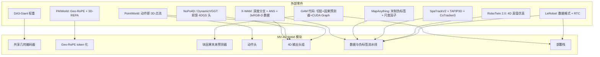

---

## 第 3 章 总体架构设计（核心章）

### 3.1 五条设计原则

1. **单主干、多头、双速率**：一个共享编码器 + 一个块因果预测器，动作头与所有 4D 头挂在同一潜表征上。训练期全部头都要有梯度；部署期动作头每周期跑，4D 头按需异步跑。
2. **几何显式化**：相机内外参不是"隐式让网络自己学"，而是通过 **Geo-RoPE / Plücker 射线**显式注入 token。这是抗相机扰动（GAM 83.1%、PAIWorld Scene Consistency 90.41%）的根因。
3. **米制第一**：所有几何输出的单位是米，尺度由机器人 FK 锚定（§4.4），不允许出现"只在相对尺度下正确"的输出头。
4. **块因果（block-causal）而非全因果**：同一时刻的多视角 token 相互可见（空间双向），跨时刻严格单向（时间因果）。这样既保留多视角一致性，又支持 KV-cache 增量推理。
5. **每个输出头可独立开关**：用 `head_mask` 配置。目的是（a）不同数据集监督不全时仍可训练，（b）部署时按算力裁剪，（c）消融实验零代码改动。

### 3.2 静态架构

#### 3.2.1 组件图

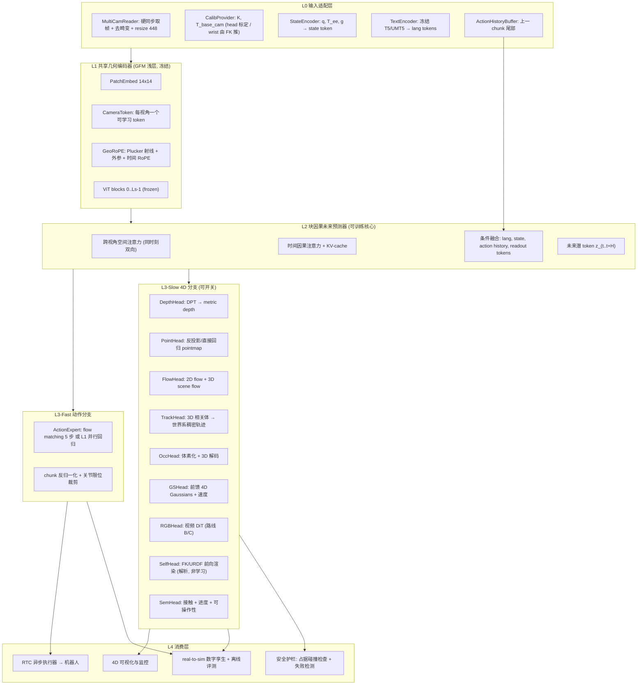

#### 3.2.2 类图与职责

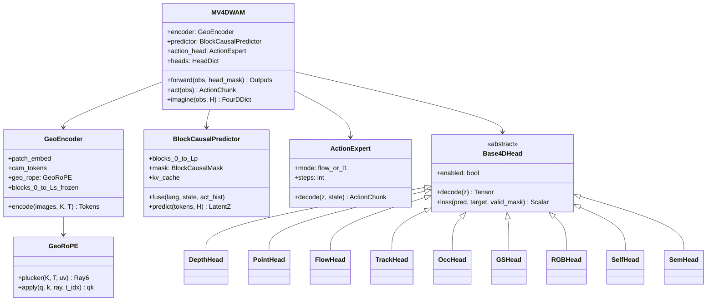

| 组件 | 职责 | 参数量（路线 A 参考） | 是否可训练 |
|---|---|---|---|
| `GeoEncoder`（DA3-Giant blocks 0–11） | 多视角 patch token + 几何位置编码 | ~380 M | **冻结** |
| `GeoEncoder`（blocks 12–39，若启用微调） | 高层几何语义 | ~640 M | 可训（GAM 做法：13–39 可训） |
| `BlockCausalPredictor`（12 层，width 1024） | 时空未来预测 + 条件融合 | ~210 M | 训练 |
| `ActionExpert` | chunk 解码 | ~8–40 M | 训练 |
| `DepthHead`（DPT，复用 GFM 原头） | metric depth | ~50 M | **冻结**（借 GFM 已学好的解码能力） |
| 其余 4D 头（Point/Flow/Track/Occ/GS/Sem） | 各自输出 | 5–60 M/头 | 训练 |
| `RGBHead`（路线 B/C 的视频 DiT） | 未来多视角 RGB | 5 B（外挂） | 单独训练/微调 |
| `SelfHead` | FK/URDF 解析渲染 | 0 | 无参数 |

**总计（路线 A 完整体）**：约 1.4–1.6 B，其中可训 ~1.0 B——与 GAM（1404.8 M 总 / 983.2 M 可训）同量级，单节点 8×A100/H100 可训。

### 3.3 Token 化与位置编码（本方案的几何核心）

#### 3.3.1 Token 序列布局

一次前向的 token 序列（长度 \(N\)）：

\[
\underbrace{[\text{lang}_{1..L_\ell}]}_{\text{冻结文本塔}}\ \Vert\ \underbrace{[\text{state}_{t-K..t}]}_{K+1}\ \Vert\ \underbrace{[\text{acthist}]}_{1}\ \Vert\ \underbrace{\big[\{\text{patch}_{v,\tau,i}\}_{v\le3,i\le P}\big]_{\tau=t-K}^{t}}_{\text{观测 patch}}\ \Vert\ \underbrace{\big[\{\text{readout}_{v,\tau,i}\}\big]_{\tau=t+1}^{t+H}}_{\text{未来查询 token}}\ \Vert\ \underbrace{[\text{act-query}_{1..C}]}_{\text{动作查询}}
\]

以 448² 输入、patch 14 计：\(P=32\times32=1024\)/视角/帧。取 \(K=0,H=4\)：观测 token \(3\times1024=3072\)，未来 readout token \(3\times4\times1024=12288\)——**过大**。因此对未来 token 做 2× 下采样（224² 等效，\(P'=256\)），得 \(3\times4\times256=3072\)。总序列长度约 \(6.4\)k，可接受。

> **工程要点**：未来 4D 输出的分辨率**不必等于**输入分辨率。深度/流/占据在 \(112^2\sim224^2\) 已足够用于抓取与避障；把算力留给动作路径。

#### 3.3.2 Geo-RoPE：把标定注入注意力

对像素 \((u,v)\) 于相机 \(v\)，其 Plücker 射线坐标为

\[
\mathbf d_{v}(u,v)=\frac{R_v K_v^{-1}[u,v,1]^\top}{\lVert K_v^{-1}[u,v,1]^\top\rVert},\qquad
\mathbf m_{v}(u,v)=\mathbf t_v\times \mathbf d_{v}(u,v),\qquad
\boldsymbol\ell_v=(\mathbf d_v,\mathbf m_v)\in\mathbb R^{6}
\]

其中 \(T^{base}_{cam_v}=[R_v\,|\,\mathbf t_v]\)。**Geo-RoPE** 将 \((\boldsymbol\ell, \tau)\) 一起编码进旋转位置编码：把注意力头的通道分成 4 组，分别用「射线方向 \(\mathbf d\) 的 3 个分量」「moment \(\mathbf m\) 的 3 个分量」「时间索引 \(\tau\)」「视角 id \(v\)」驱动旋转角：

\[
\theta^{(g)}_{k}=\omega_k\cdot \phi_g,\quad \phi_{1..3}=\mathbf d_{x,y,z},\ \ \phi_{4..6}=\mathbf m_{x,y,z}/s_{\text{scene}},\ \ \phi_{7}=\tau,\ \ \phi_8=v
\]

\[
\mathrm{RoPE}(\mathbf q)_{2k:2k+1}=\begin{pmatrix}\cos\theta_k & -\sin\theta_k\\ \sin\theta_k&\cos\theta_k\end{pmatrix}\mathbf q_{2k:2k+1}
\]

关键细节三条：

- **\(s_{\text{scene}}\) 归一化**：moment 项带米制量纲，必须除以场景尺度（本方案取 1 m）以保持数值范围一致；**但不改变输出的米制性**（输出头单位仍是米）。
- **相对性**：RoPE 的内积只依赖 \(\phi\) 的差值，因此跨视角注意力天然获得"两条射线的相对几何关系"，这正是 PAIWorld 的 Geometry-Aware Cross-View Attention 的作用机制。
- **鲁棒性训练**：训练时对外参加噪（±2 cm / ±2°）与随机丢相机（`cam_mask`），使模型不过度依赖精确标定——这是真机标定漂移下不崩的保险。

#### 3.3.3 块因果注意力掩码

设 token 的时间索引为 \(\tau(\cdot)\)。掩码定义为

\[
M_{ij}=\begin{cases}
0 & \tau(i)>\tau(j)\ \text{（可见：过去/同刻）}\\
0 & \tau(i)=\tau(j)\ \text{（同刻跨视角双向可见）}\\
-\infty & \tau(i)<\tau(j)
\end{cases}
\]

语言/状态/动作历史 token 视为 \(\tau=-\infty\)（对所有位置可见）；动作查询 token 只能看到 \(\tau\le t\) 的观测 + 条件 token（**不能看未来 4D readout**——否则部署时关闭 4D 头会造成训练-推理不一致，这是双速率能成立的必要条件）。

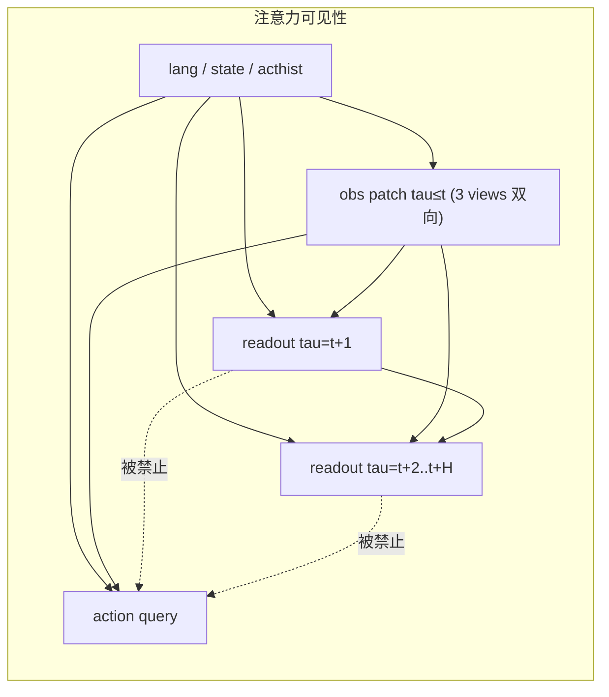

### 3.4 三条路线的详细设计与选型决策树

#### 3.4.1 路线 A：GFM-centric（主推）

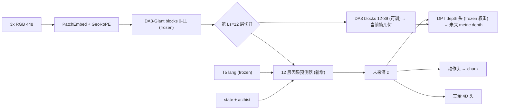

- **为什么切在 \(L_s=12\)（40 层的 30%）**：浅层是通用几何/纹理特征，几乎与任务无关，冻结可省显存又不掉点；深层已高度特化于"当前帧几何重建"，让因果预测器**并联**在浅层之后，可以自由学习"未来"而不破坏 GFM 的几何能力。GAM 的消融支持这一点（切太浅缺语义、切太深预测器学不到东西）。
- **DPT 深度头冻结复用**：预测器输出的潜表征被约束在"GFM 潜空间"内，直接喂给**原始冻结的 DPT 头**即可解出米制深度。好处：（a）不需要重新学解码器，（b）**未来深度与当前深度天然同一尺度**（这是米制一致性的关键技巧），（c）省 50 M 参数的训练。
- **延迟**：单次前向，无迭代去噪，CUDA Graph 下 6.9 ms 级（GAM 实测 145 Hz）。

#### 3.4.2 路线 B：Video-DiT-centric（4D 最丰富）

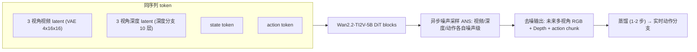

- **ANS（异步噪声采样）的作用**：训练时让动作 token 的噪声级低于视频 token，使模型学会"在视频还很糊时就能给出可用动作"；推理时对动作只跑 1–2 步、对视频跑 10+ 步，从而**在同一模型上实现双速率**。这是 X-WAM 的核心工程贡献，务必照抄。
- **深度分支**：复制 DiT 最后 10 个 block 作为深度支路，与 RGB 支路交叉注意力共享上下文。相比"把深度当成第 4 通道"，独立分支能避免深度模糊拖累 RGB，且可单独关闭。
- **适用**：数据增广、策略评测器（EnerVerse-AC 式）、演示与交付物、离线 4D 想象。**不适合**直接做 50 Hz 控制，除非蒸馏。

#### 3.4.3 路线 C：A + B 混合 + 4DGS/real-to-sim（能力上限）

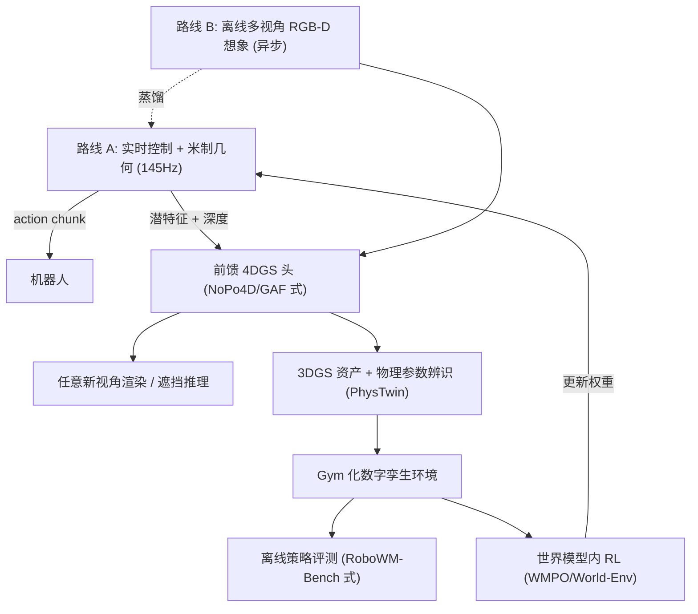

#### 3.4.4 选型决策树

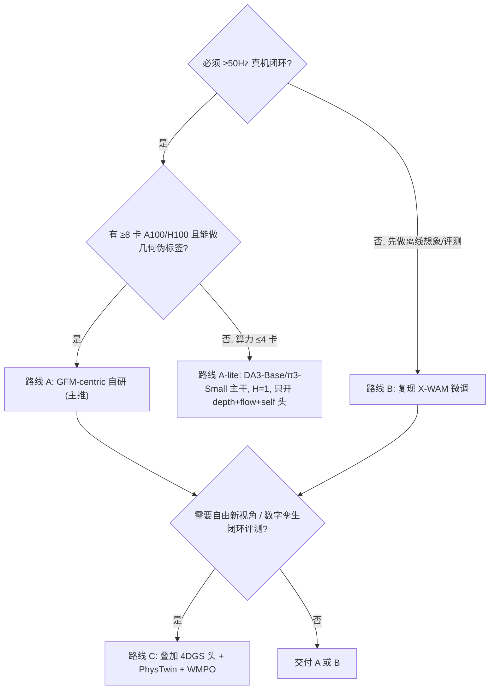

### 3.5 各输出头的结构与损失（逐个给公式）

#### 3.5.1 动作头（Fast Path）

**方案 1（默认）：流匹配（flow matching）**。给定潜条件 \(z_t\) 与状态 \(s_t\)，学习速度场 \(v_\theta\)：

\[
\mathcal L_{act}^{fm}=\mathbb E_{\epsilon\sim\mathcal N(0,I),\,u\sim\mathcal U(0,1)}\Big\lVert v_\theta\big(u,\ a^{u},\ z_t,s_t\big)-\big(a_{t:t+C}-\epsilon\big)\Big\rVert^2,\quad a^{u}=u\,a_{t:t+C}+(1-u)\epsilon
\]

推理用 5 步欧拉积分（π0.6 配置）。

**方案 2（低延迟备选）：并行 L1 回归**（OpenVLA-OFT 式）：

\[
\mathcal L_{act}^{l1}=\frac{1}{C}\sum_{c=1}^{C}\Big(\lVert \hat q_{t+c}-q_{t+c}\rVert_1+\lambda_{ee}\big\lVert \hat T_{ee}\ominus T_{ee}\big\rVert_1+\lambda_g|\hat g-g|\Big)
\]

其中 \(\ominus\) 为 \(SE(3)\) 上的对数映射误差（旋转用 6D 表示回归后 Gram-Schmidt 正交化）。

**双输出一致性约束（本方案新增）**：关节角与末端位姿必须自洽，用可微 FK 约束：

\[
\mathcal L_{fk}=\frac{1}{C}\sum_c \big\lVert \mathrm{FK}(\hat q_{t+c})\ominus \hat T^{base}_{ee,t+c}\big\rVert_1
\]

这条损失让"输出关节角 + 末端位姿"这个双头设定不产生矛盾输出，并把 URDF 知识注入模型。

#### 3.5.2 米制深度 / 点图头

\[
\mathcal L_{depth}=\underbrace{\frac{1}{|\Omega|}\sum_{p\in\Omega}\big|\hat D(p)-D(p)\big|}_{\text{绝对米制 L1}}
+\lambda_{si}\underbrace{\mathrm{SSI}\big(\hat D, D\big)}_{\text{尺度-平移不变项}}
+\lambda_{grad}\underbrace{\sum_{s}\big\lVert \nabla \hat D_s-\nabla D_s\big\rVert_1}_{\text{多尺度梯度}}
\]

**双损失的必要性**：绝对项保证米制正确（服务抓取/碰撞），SSI 项在伪标签尺度不确定的数据（人类视频、网络视频）上仍可提供形状监督。伪标签置信度低的样本自动把 \(\lambda\) 中的绝对项权重置零（用 `valid_mask`）。

点图头：\(\hat X_v = T^{base}_{cam_v}\cdot \pi^{-1}_{K_v}(u,v,\hat D_v)\)，附加**跨视角一致性损失**（3 相机看同一点应重合）：

\[
\mathcal L_{xview}=\sum_{v\ne v'}\frac{1}{|\Omega_{vv'}|}\sum_{p}\rho\Big(\big\lVert \hat X_v(p)-\hat X_{v'}(\Pi_{v\to v'}(p))\big\rVert\Big),\quad \rho=\text{Huber}
\]

#### 3.5.3 光流与 3D scene flow 头

2D 光流：\(\mathcal L_{flow2d}=\sum_h \lVert \hat F^{2D}_{t\to t+h}-F^{2D}\rVert_1\)（**在原始 float32 \((u,v)\) 场上计算，不在色轮可视化图上计算**——RynnWorld-4D 在归一化 RGB 色彩图空间算 AEPE 是错误做法，见 `analyz_1.md`）。

3D scene flow（**扣除自运动**，这是"独立于相机运动的物体运动"）：

\[
\hat F^{3D}_{t\to t+h}(p)=\underbrace{\hat X^{base}_{t+h}\big(p+\hat F^{2D}(p)\big)}_{\text{世界系目标位置}}-\underbrace{\hat X^{base}_{t}(p)}_{\text{世界系当前位置}}
\]

由于 \(X^{base}\) 已通过外参转到机器人 base 系，相机运动被自动消掉。损失：

\[
\mathcal L_{flow3d}=\frac{1}{|\Omega_{dyn}|}\sum_{p\in\Omega_{dyn}}\big\lVert \hat F^{3D}(p)-F^{3D}(p)\big\rVert_2 \quad (\text{单位：米})
\]

只在动态掩码 \(\Omega_{dyn}\)（\(\lVert F^{3D}\rVert>1\) cm）上算，避免静态背景主导（静态点占 90%+ 时不加掩码会让 EPE 指标虚低）。

#### 3.5.4 世界系稠密 3D 轨迹头（信息量最高的 4D 输出）

采样 \(N_p\)（默认 4096）个查询点，用 3D 相关体在潜特征上做迭代更新（Track4World / TAPIP3D 式）：

\[
\mathcal L_{track}=\sum_{i,h}\underbrace{w_{i,h}\big\lVert \hat p_i(t+h)-p_i(t+h)\big\rVert_1}_{\text{米制位置}}
+\lambda_{vis}\sum_{i,h}\mathrm{BCE}\big(\hat o_{i,h}, o_{i,h}\big)
\]

其中 \(w_{i,h}=o_{i,h}\)（不可见点不算位置损失）。**与动作的耦合（PointWorld 思想）**：机器人自身表面点的 3D 轨迹由 FK 精确给出，因此

\[
\hat a_{t:t+C}\ \Longleftrightarrow\ \{\hat p_i\}_{i\in \text{robot}} \quad\text{（同一物理量的两种表达）}
\]

据此加一条**动作-轨迹一致性损失**：

\[
\mathcal L_{a\text{-}trk}=\frac{1}{|\mathcal R|H}\sum_{i\in\mathcal R}\sum_{h}\big\lVert \hat p_i(t+h)-\mathrm{Render}_{FK}\big(\hat q_{t+h}\big)_i\big\rVert_1
\]

这条损失是"动作头与 4D 头互相监督"的桥梁：4D 想象错了会被动作真值纠正，动作错了会被几何一致性纠正。

#### 3.5.5 4D 占据头

点云体素化得真值 \(O\in\{0,1\}^{Z\times Y\times X}\)（2 cm 体素，工作空间 \(1.2\times1.2\times1.0\) m → \(60\times60\times50\)）：

\[
\mathcal L_{occ}=\sum_h \Big(\mathrm{FocalBCE}(\hat O_{t+h},O_{t+h})+\lambda_{lov}\,\mathcal L_{\text{Lovasz}}\Big)
\]

**未观测体素**（视锥外/被遮挡）用 `unknown` 标签并从损失中屏蔽——机器人场景遮挡严重，不屏蔽会学出"遮挡区一律空"的危险行为。

#### 3.5.6 前馈 4D Gaussians 头

每个像素预测一个 Gaussian（\(\mu\) 由 depth 反投影 + 残差，\(s,q,\alpha,c\) 由卷积头出），并预测速度 \(\mathbf v_i\) 做时间形变：

\[
\mu_i(t+h)=\mu_i(t)+\sum_{h'=1}^{h}\mathbf v_i(t+h'),\qquad
\hat I_{v'}=\mathrm{Raster}\big(\{\mu_i(t+h),s_i,q_i,\alpha_i,c_i\}, K_{v'},T_{v'}\big)
\]

\[
\mathcal L_{gs}=\sum_{v',h}\Big(\lambda_1\lVert \hat I_{v'}-I_{v'}\rVert_1+\lambda_{ssim}(1-\mathrm{SSIM})+\lambda_{lpips}\mathrm{LPIPS}\Big)+\lambda_{sf}\big\lVert \mathbf v_i-F^{3D}_i\big\rVert_1
\]

**训练技巧**：用"留一视角"策略——3 相机中留 1 个不给输入、只用于渲染监督，这样 GS 头被迫学会真正的新视角外推而不是记忆。速度项由 scene flow 直接监督（DynamicVGGT 做法），显著加快收敛。

#### 3.5.7 未来多视角 RGB 头（路线 B/C）

外挂视频 DiT，条件为 \((z_t, \text{lang}, \hat a_{t:t+C}, K, T)\)：

\[
\mathcal L_{rgb}=\mathbb E_{u,\epsilon}\big\lVert v_\psi(u, I^u, c)-(I_{t+1:t+H}-\epsilon)\big\rVert^2,\quad c=(z_t,\ell,\hat a, K,T)
\]

**动作条件化必须是"相对末端位姿 + 夹爪"**（X-WAM 的 \(d_a=14\) 布局），因为相对量跨本体/跨场景更可迁移。

#### 3.5.8 机器人自身 4D 头（免费真值，务必做）

给定预测关节角 \(\hat q_{t+h}\) 与 URDF，解析计算所有 link 位姿并可微渲染自身 mask/深度：

\[
\hat M^{self}_{t+h}=\mathrm{Rasterize}\big(\mathrm{URDF}(\hat q_{t+h}),K_v,T_v\big),\qquad
\mathcal L_{self}=\sum_{v,h}\Big(\mathrm{BCE}(\hat M^{self},M^{self})+\lambda_d\lVert \hat D^{self}-D^{self}\rVert_1\Big)
\]

**为什么这是最高性价比的 4D 监督**：真值 100% 精确（不需要伪标签）、覆盖图像 10–40% 面积、直接把"动作 → 像素级 4D 后果"的因果链焊死。它也是"输出手臂/全身 4D 运动"这个用户目标最直接、最可靠的实现方式。

#### 3.5.9 语义 4D 头

\[
\mathcal L_{sem}=\mathrm{BCE}(\hat c,c)+\lVert\hat p-p\rVert_2^2,\qquad p_{t}=\frac{t-t_{\text{sub-start}}}{t_{\text{sub-end}}-t_{\text{sub-start}}}
\]

进度头在部署期用于**失败检测与重试触发**（进度 200 ms 内无增长 → 触发重规划），也是 τ0-WM 式测试期候选动作重排序的打分器。

### 3.6 损失总表与权重

| 损失 | 符号 | 默认权重 | 数据来源要求 | Stage |
|---|---|---|---|---|
| 动作（流匹配/L1） | \(\mathcal L_{act}\) | **3.0** | demo 动作 | 1,2,3 |
| FK 自洽 | \(\mathcal L_{fk}\) | 0.5 | URDF | 1,2 |
| 米制深度 | \(\mathcal L_{depth}\) | **3.0** | RGB-D / 伪标签 | 1,2 |
| 跨视角一致 | \(\mathcal L_{xview}\) | 0.5 | 标定 | 1 |
| 2D 光流 | \(\mathcal L_{flow2d}\) | 1.0 | 伪标签/仿真 | 1 |
| 3D scene flow | \(\mathcal L_{flow3d}\) | 1.0 | 深度+流 | 1 |
| 3D 轨迹 | \(\mathcal L_{track}\) | 1.0 | SpaTrackV2/TAPIP3D | 1 |
| 动作-轨迹一致 | \(\mathcal L_{a\text{-}trk}\) | 0.5 | URDF + demo | 1,2 |
| 4D 占据 | \(\mathcal L_{occ}\) | 0.5 | 点云 | 1 |
| 4DGS 渲染 | \(\mathcal L_{gs}\) | 0.5 | 多视角 RGB | 2（V2） |
| 未来 RGB | \(\mathcal L_{rgb}\) | 1.0 | 未来帧 | 1（路线 B） |
| 表征对齐 REPA | \(\mathcal L_{REPA}\) | **1.0** | GFM 特征（教师） | 1,2 |
| 自身 4D | \(\mathcal L_{self}\) | 1.0 | URDF（免费） | 1,2 |
| 语义（接触/进度） | \(\mathcal L_{sem}\) | 0.3 | 仿真/标注 | 2 |

**REPA 项**（PAIWorld 的 Latent 3D-REPA）：把预测器的未来潜表征与"用真未来帧跑 GFM 得到的特征"做余弦对齐

\[
\mathcal L_{REPA}=1-\frac{1}{|\Omega|}\sum_{p}\cos\Big(\mathrm{proj}(z_{t+h}(p)),\ \mathrm{sg}\big[f_{GFM}(I_{t+h})(p)\big]\Big)
\]

它的价值：**不需要任何伪标签**就能提供强 4D 监督（教师是冻结的 GFM 自己），且比像素损失收敛快得多。若几何伪标签流水线来不及搭，**先只上 REPA + self-4D**也能拿到大部分几何收益。

### 3.7 动态架构：前向 / 反向数据流

#### 3.7.1 训练期前向 + 梯度流

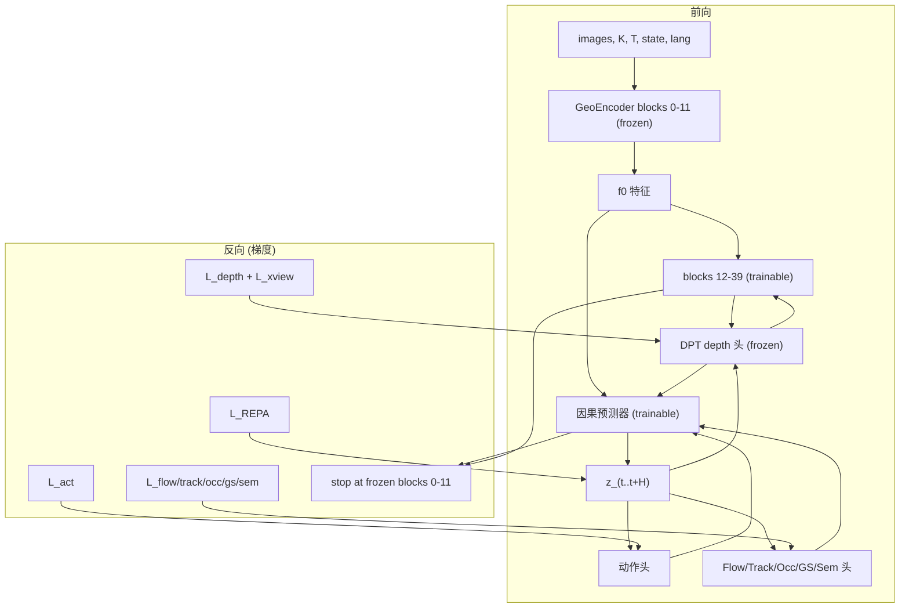

**冻结策略汇总（照抄 GAM + π0.6 Knowledge Insulation 精神）**：

| 模块 | 状态 | 理由 |
|---|---|---|
| GFM blocks 0–11 | ❄️ 冻结 | 通用几何特征，冻结省 40% 显存且防遗忘 |
| GFM blocks 12–39 | 🔥 可训 | 需适配机器人域与未来预测 |
| DPT 深度头 | ❄️ 冻结 | **保证未来深度与 GFM 当前深度同尺度**（米制一致性技巧） |
| 文本塔（T5/UMT5） | ❄️ 冻结 | 语言分布不变；省算力 |
| 因果预测器 | 🔥 可训 | 核心新增模块 |
| 动作头 | 🔥 可训 | — |
| **动作头 → VLM/GFM 的梯度** | ⚠️ **Stage 1 截断，Stage 2 放开** | Knowledge Insulation：早期让动作梯度污染表征会损害泛化；后期放开可提精度 |
| 视频 DiT（路线 B） | 🔥 单独训练/LoRA | 与主干解耦，避免相互拖累 |

#### 3.7.2 推理期时序图（双速率 + RTC）

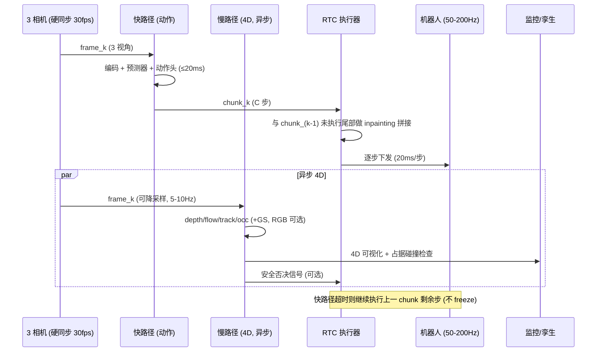

**RTC 拼接的数学形式**：设上一 chunk 已执行 \(d\) 步、剩余 \(C-d\) 步为 \(a^{prev}_{d:C}\)。新 chunk 生成时把前 \(d'\) 步当作"已知区域"做 inpainting：

\[
\hat a^{new}=\arg\min_a \ \lVert a_{0:d'}-a^{prev}_{d:d+d'}\rVert^2\ \text{s.t.}\ a\sim p_\theta(\cdot|o_t),\qquad
w(i)=\min\big(w_{max},\ w_0 e^{\beta i}\big)
\]

用软引导权重 \(w(i)\) 随步数指数衰减（LeRobot 的 `prefix_attention_schedule=EXP`，`max_guidance_weight=10.0`，`execution_horizon=10`），保证"接缝处平滑、远端自由"。**若能重训**，优先用「训练期动作条件化」（把 \(a^{prev}\) 作为输入 token），推理零额外开销。

### 3.8 参数量、显存与延迟预算（路线 A 完整体）

| 阶段 | 计算量主体 | 单次耗时（H100, bf16, CUDA Graph） | 显存 |
|---|---|---|---|
| 3×448² patch embed + blocks 0–11 | 3072 token × 12 层 | ~3.5 ms | 1.4 GB（权重 bf16） |
| 因果预测器 12 层（含 3072 readout） | ~6.4k token | ~2.5 ms | 0.5 GB |
| 动作头（flow matching 5 步） | \(C\times d_a\) 小张量 | ~0.9 ms | <0.1 GB |
| **快路径合计** | — | **≈7 ms（143 Hz）** | ~2.2 GB |
| DPT depth 头 ×3 视角 ×(H+1) | 上采样卷积 | +8 ms | +0.6 GB |
| Flow + SceneFlow 头 | 同上 | +4 ms | +0.3 GB |
| Track 头（4096 点 × H） | 3D 相关体迭代 4 次 | +12 ms | +0.8 GB |
| Occ 头（60×60×50） | 3D 解码 | +6 ms | +0.4 GB |
| GS 头 + 光栅化（3 视角） | 前馈 + raster | +25 ms | +1.5 GB |
| RGB 视频 DiT（路线 B，10 步） | 5 B DiT | +600–1200 ms | +12 GB |
| **慢路径全开（不含 RGB）** | — | **≈55 ms（18 Hz）** | ~5.8 GB |

**结论**：单张 H100/A100 即可同时跑「143 Hz 动作 + 18 Hz 全 4D（不含像素生成）」。未来 RGB 生成必须放到第二张卡或离线。

把各路线的动作路径预算画在一起（对数横轴，虚线为 50 Hz 控制预算与 GAM 实测 145 Hz 线；脚本见附录 A）：


只有「路线 A + CUDA Graph」能进入 145 Hz 区间；π0.6 式 VLA 在 3 相机 + 5 步去噪下约 63 ms，靠 RTC 仍可做 50 Hz 控制；视频 DiT 路线（10 步去噪）比控制预算高出 1.5 个数量级，**必须**放慢路径或先蒸馏。

---

## 第 4 章 数据与监督：四层金字塔与伪标签流水线

### 4.1 四层数据金字塔

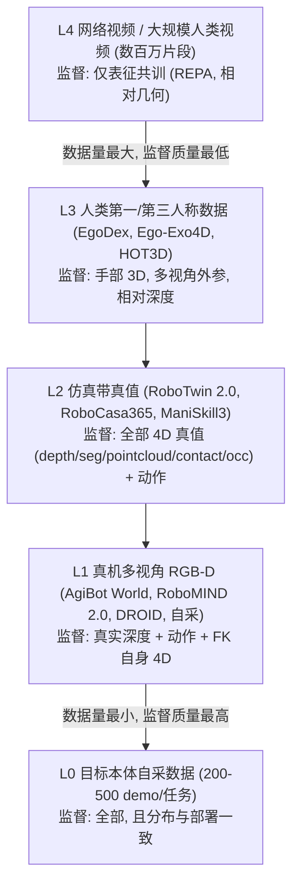

| 层 | 代表来源 | 量级目标 | 可得监督 | 训练用途 | 混合比例（Stage 1） |
|---|---|---|---|---|---|
| **L0** 目标本体自采 | 自建平台 3 相机 | 每任务 200–500 demo（π0.6/GAM 真机量级） | 全部 + 分布一致 | Stage 2 主力 | 0%（Stage 2 才用，100%） |
| **L1** 真机多视角 | AgiBot World 2026、RoboMIND 2.0、DROID、RH20T | 10⁵–10⁶ 轨迹 | 真深度（部分）、动作、FK | 广域动作 + 真实深度 | **50%** |
| **L2** 仿真真值 | RoboTwin 2.0、RoboCasa365、ManiSkill3、X-WAM-RoboTwin | 10⁴–10⁵ episodes | **全 4D 真值** | 4D 头的"干净"监督源 | **30%** |
| **L3** 人类数据 | Ego-Exo4D（有外参！）、EgoDex、HOT3D | 10³ 小时 | 手部 3D、多视角几何 | 几何/交互先验 | **15%** |
| **L4** 网络视频 | OmniWorld、通用视频 | 10⁶ 片段 | 仅相对几何 | REPA 表征共训 | **5%** |

**混合比例的依据**：GAM 的 784 K 预训练轨迹配比为 72% OXE + 18% MimicGen + 10% RoboCasa365，即「真机动作为主、仿真补几何」。本方案把仿真比例提高到 30%，因为我们要监督的 4D 头远多于 GAM（只有 depth），需要更多带完整真值的样本。

### 4.2 伪标签流水线（脚本级设计）

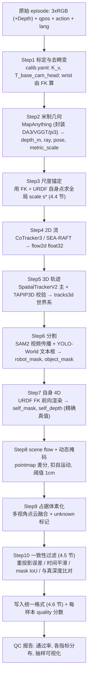

**每步的工具选择与配置建议**

| Step | 主工具 | 备选/校验 | 关键配置 | 产出 |
|---|---|---|---|---|
| 2 | **MapAnything**（统一入口） | DA3-Giant / π³ / VGGT / MoGe-2 | 输入已知 K 与 T（有标定就给，精度显著提升）；分辨率 518 | `depth_m`, `ray`, `pose`, `metric_scale` |
| 4 | **CoTracker3**（稠密） | SEA-RAFT（快） | 双向流 + 遮挡置信 | `flow2d` float32, `occ_conf` |
| 5 | **SpatialTrackerV2** | **TAPIP3D**（世界系一致性校验）、Track4World（若开源） | 4096 查询点 / 帧，滑窗 16 帧 | `tracks3d`, `visibility` |
| 6 | **SAM2**（视频传播） | YOLO-World（文本 prompt 出框） | 第 1 帧用文本 prompt 生成 box → SAM2 传播 | `robot_mask`, `object_mask` |
| 7 | **URDF + pinocchio/pytorch-kinematics** | 手眼标定结果 | 用 `nvdiffrast` 或 `pyrender` 光栅化 | `self_mask`, `self_depth`（**真值**） |
| 9 | Open3D / 自写 CUDA 体素化 | — | 2 cm 体素，`unknown` 用视锥+光线投射判定 | `occ`, `occ_valid` |

**关键实现细节（容易踩的坑）**

1. **wrist 相机外参必须每帧重算**：\(T^{base}_{cam_{wrist}}(t)=\mathrm{FK}(q_t)\cdot T^{ee}_{cam}\)，其中 \(T^{ee}_{cam}\) 是手眼标定量。用固定外参会导致 3D 轨迹全错。
2. **深度伪标签与真实深度融合**：真机若有 RealSense/Zed 深度，用它做**尺度与偏置校正**（最小二乘拟合 \(D_{gt}\approx \alpha \hat D+\beta\) 后检查 \(\alpha\in[0.95,1.05]\)），再用伪标签补真深度的空洞（金属反光/透明物）。
3. **动态掩码要区分"机器人动"与"物体动"**：\(\Omega_{dyn}^{obj}=\Omega_{dyn}\setminus \text{robot\_mask}\)。scene flow 指标只在 \(\Omega_{dyn}^{obj}\) 上报，否则机器人自身运动会主导数值。
4. **时间对齐**：多相机与关节编码器的时间戳偏差 >10 ms 就会污染 flow/track 标签。硬件层用触发同步；软件层用时间戳插值到统一时基，并记录 `sync_err_ms` 进 quality 分数。

### 4.3 3D scene flow 与自运动补偿（把 §3.5.3 落到脚本）

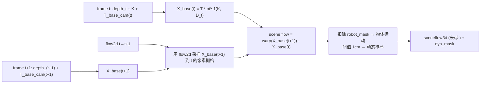

因为两帧都被外参转到**同一个 base 系**，相机自身运动（head 固定、wrist 随臂运动）被自动消除，剩下的就是**物体在世界中的真实位移**。这与"光流"的本质区别：光流里相机动一下整幅图都有巨大流场，而 base 系 scene flow 在静止背景上应恒为 0——**这也正是最好的自检指标**：

\[
\text{自检}:\quad \mathrm{median}_{p\in \text{static}}\big\lVert F^{3D}(p)\big\rVert < 5\ \text{mm}
\]

若不满足，说明标定、时间同步或深度尺度有问题，该 episode 打回。

### 4.4 米制尺度锚定（针对 RynnWorld-4D 已知缺陷的正面方案）

**问题回顾**（见 `b/p/RynnWorld_4D_.../analyz_1.md` §1.5）：深度被 clip 到 0–5 m 并 8-bit 量化（分辨率 ~2 cm，且远处更差）、多数据集尺度不统一、评测用 median scaling 抹掉尺度误差。结果是 4D 输出**不能用于抓取与碰撞检测**。

**本方案的三重锚定**

**锚定 1：机器人自身几何（最强、免费、逐帧可用）**。机器人在图像中可见的部分，其 3D 位置由 FK 精确已知。设 \(\mathcal R\) 为 `robot_mask` 内的像素集合，求解全局尺度

\[
s^\star=\arg\min_{s>0}\sum_{p\in\mathcal R}\rho\Big(\big\lVert s\cdot \hat X_{cam}(p)-X^{FK}_{cam}(p)\big\rVert\Big)
\;\Longrightarrow\;
s^\star=\mathrm{median}_{p\in\mathcal R}\frac{\lVert X^{FK}_{cam}(p)\rVert}{\lVert \hat X_{cam}(p)\rVert}
\]

（Huber 鲁棒化 + 至少 500 个有效像素才接受）。这把伪深度直接钉到**真实米制**，无需任何外部尺度先验。

**锚定 2：已知物理长度约束**。link 长度、夹爪开口宽度、标定板格距、桌面高度都是已知米制量，作为二次校验：\(|\hat L_{link}-L_{link}^{URDF}|<5\text{ mm}\)。

**锚定 3：双目/RGB-D 传感器**（若有）。用 Zed/RealSense 深度在**中距离有效区间**（0.3–2 m）做最小二乘尺度-偏置拟合，作为锚定 1 的独立交叉验证。

**存储与评测规范（强制）**

| 项 | 规范 | 反例（禁止） |
|---|---|---|
| 深度存储 | float16 或 uint16 毫米（0–65.5 m，1 mm 精度） | ❌ uint8 + 0–5 m clip |
| 远近处理 | 用 \(\log\) 域或 inverse-depth 做**网络输出参数化**，但存储与评测在线性米制 | ❌ 硬 clip 后归一化 |
| 数据集混合 | 每样本带 `scale_confidence`；低置信样本只算 SSI 损失，不算绝对损失 | ❌ 所有数据一律当米制 |
| 评测报告 | **必须报告不做 median scaling 的绝对 AbsRel / RMSE(m) / δ<1.05**，可另附对齐后数值 | ❌ 只报 median-scaled 指标 |
| scene flow | 报告 EPE(m) 与 <1 cm/<3 cm 命中率，且区分动态物体/机器人/静态背景 | ❌ 在色彩可视化图上算误差 |

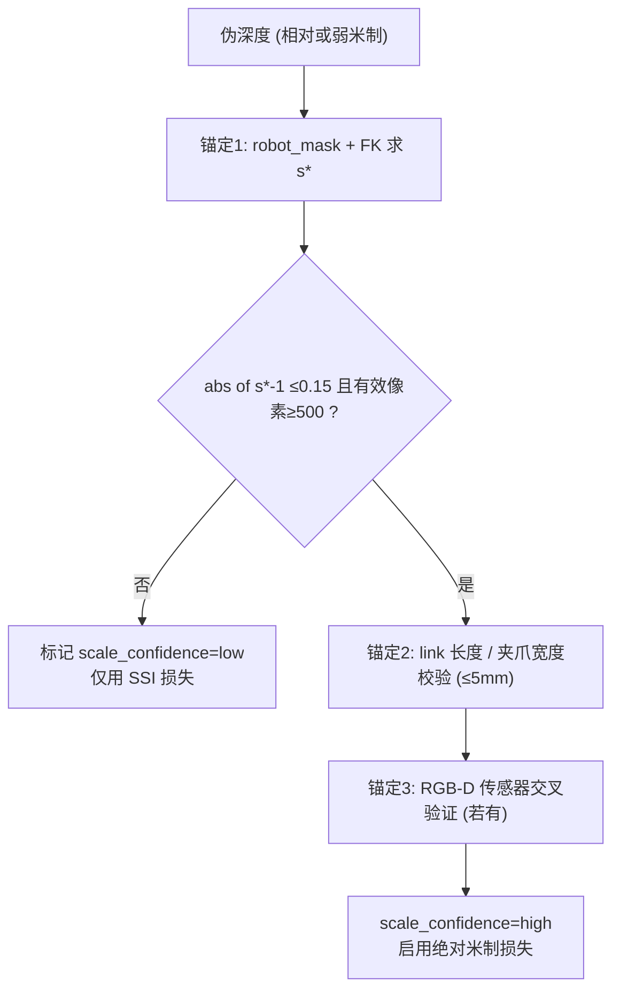

### 4.5 一致性过滤与质量分数

对每个 episode（乃至每帧）计算 5 项指标，加权成 `quality ∈ [0,1]`，训练时按 quality 做**采样权重**与**损失掩码**：

| 指标 | 定义 | 通过阈值 | 权重 |
|---|---|---|---|
| 跨视角重投影误差 | \(\mathrm{median}_{v\ne v'}\lVert \hat X_v-\hat X_{v'}\rVert\) | < 1 cm | 0.30 |
| 静态背景 scene flow | \(\mathrm{median}_{static}\lVert F^{3D}\rVert\) | < 5 mm | 0.25 |
| 时间平滑度 | \(\mathrm{median}_t \lVert \hat D_{t+1}-\mathrm{warp}(\hat D_t)\rVert\) | < 2 cm | 0.15 |
| self-mask IoU | 渲染 self_mask 与分割 robot_mask 的 IoU | > 0.75 | 0.20（**同时校验标定！**） |
| 轨迹双工具一致性 | SpaTrackV2 vs TAPIP3D 的 3D 位置中位差 | < 2 cm | 0.10 |

**self-mask IoU 的额外价值**：它同时检验「手眼标定 + FK + URDF + 分割」四件事。IoU 突然下降往往意味着**标定漂移**，可作为生产环境的健康监控指标（§7.5）。

### 4.6 统一数据格式

采用 **LeRobot v3（parquet + mp4）为主格式**，附加 4D 侧车（sidecar）文件存大体积几何量。理由：LeRobot 生态自带数据加载、可视化、RTC 部署，而深度/轨迹/占据不适合塞进 parquet。

```text
data/
  d4a_mv4d/
    meta/
      info.json                  # fps, robot_type, camera_keys, action_dim, state_dim
      episodes.jsonl             # 每 episode: length, task, quality, scale_confidence
      tasks.jsonl                # 指令文本（含 ~100 条改写，X-WAM 做法）
      calib/
        calib_head.yaml          # K, dist, T_base_cam_head
        handeye_left.yaml        # T_ee_cam (左 wrist)
        handeye_right.yaml
        robot.urdf
    data/
      chunk-000/episode_000000.parquet   # 低维: qpos, qvel, action, ee_pose, gripper, ts, progress
    videos/
      chunk-000/
        observation.images.head/episode_000000.mp4          # H.264, 448x448 或原生
        observation.images.wrist_left/episode_000000.mp4
        observation.images.wrist_right/episode_000000.mp4
    fourd/                       # 4D 侧车（本方案新增）
      chunk-000/episode_000000/
        depth_head.mkv           # FFV1 无损 16bit 灰度（毫米），或 zarr
        depth_wrist_left.mkv
        depth_wrist_right.mkv
        flow2d.zarr              # [T, V, 2, h, w] float16
        sceneflow3d.zarr         # [T, V, 3, h, w] float16
        tracks3d.npz             # points [N,T,3] float32(米) + vis [N,T] bool + query_uv
        occ.zarr                 # [T, 60, 60, 50] uint8 {0:free,1:occ,2:unknown}
        masks.mkv                # robot/object 实例 mask (调色板 PNG 序列亦可)
        self4d.npz               # link_poses [T, n_link, 4, 4] + self_mask 索引
        contact.npz              # [T, n_obj] + 接触点
        quality.json             # 5 项过滤指标数值
```

**features 键名与 shape（`info.json` 片段）**

```json
{
  "fps": 30,
  "robot_type": "dual_arm_7dof",
  "features": {
    "observation.images.head":        {"dtype": "video", "shape": [448, 448, 3]},
    "observation.images.wrist_left":  {"dtype": "video", "shape": [448, 448, 3]},
    "observation.images.wrist_right": {"dtype": "video", "shape": [448, 448, 3]},
    "observation.state":  {"dtype": "float32", "shape": [16], "names": ["q0..q6","ee_r6","ee_t3","grip"]},
    "action":             {"dtype": "float32", "shape": [17], "names": ["dq0..dq6","d_ee_r6","d_ee_t3","grip"]},
    "observation.intrinsics": {"dtype": "float32", "shape": [3, 3, 3]},
    "observation.extrinsics": {"dtype": "float32", "shape": [3, 4, 4]},
    "observation.cam_mask":   {"dtype": "bool",    "shape": [3]},
    "fourd.depth":       {"dtype": "sidecar", "shape": [3, 1, 224, 224], "unit": "meter", "storage": "uint16_mm"},
    "fourd.sceneflow3d": {"dtype": "sidecar", "shape": [3, 3, 224, 224], "unit": "meter"},
    "fourd.tracks3d":    {"dtype": "sidecar", "shape": [4096, 3],        "unit": "meter", "frame": "base"},
    "fourd.occ":         {"dtype": "sidecar", "shape": [60, 60, 50],     "voxel": 0.02},
    "fourd.self4d":      {"dtype": "sidecar", "shape": [12, 4, 4]},
    "task_progress":     {"dtype": "float32", "shape": [1]}
  }
}
```

**训练样本（dataloader 输出）张量清单**

| key | shape | dtype | 说明 |
|---|---|---|---|
| `images` | `[B,3,K+1,3,448,448]` | uint8 | 3 视角 |
| `intrinsics` / `extrinsics` | `[B,3,3,3]` / `[B,3,K+1,4,4]` | fp32 | wrist 外参逐帧 |
| `state` | `[B,K+1,16]` | fp32 | 归一化后 |
| `action_gt` | `[B,C,17]` | fp32 | \(C=8\)（Stage 1/2）或 50（长时程实验） |
| `depth_gt` | `[B,3,H+1,224,224]` | fp16 | 米；`depth_valid` 同形 bool |
| `flow2d_gt` / `sf3d_gt` | `[B,3,H,2/3,224,224]` | fp16 | — |
| `tracks_gt` / `vis_gt` | `[B,4096,H+1,3]` / `[B,4096,H+1]` | fp32/bool | base 系 |
| `occ_gt` | `[B,H+1,60,60,50]` | uint8 | 含 unknown |
| `self_mask_gt` / `self_depth_gt` | `[B,3,H+1,224,224]` | bool/fp16 | URDF 渲染 |
| `quality`, `scale_conf` | `[B]` | fp32/int | 采样权重与损失开关 |

### 4.7 数据量规划（落地排期用）

| 阶段 | 数据 | 量 | 获取方式 | 工时估计 |
|---|---|---|---|---|
| MVP | X-WAM-RoboTwin（3×RGB-D，27.5 k ep） | 直接下载 ~94 GB | 现成 | 1 天 |
| MVP | RoboTwin 2.0 自生成（补目标任务） | 5 k ep | 仿真跑，8 卡 2 天 | 3 天 |
| V1 | AgiBot World 2026 子集 + RoboMIND 2.0 | 50–100 k 轨迹 | 下载 + 伪标签 | 伪标签 GPU 约 2–4 k GPU·h |
| V1 | 自采真机 | 4–8 任务 × 300 demo | 遥操，2 人 2 周 | 含标定与 QC |
| V2 | Ego-Exo4D / EgoDex 子集 | 200–500 h | 下载 + 伪标签 | 1–2 k GPU·h |

**伪标签算力估算**：单条 100 帧 3 视角 episode，MapAnything(518) ≈ 3 s、CoTracker3 ≈ 4 s、SpaTrackV2 ≈ 8 s、SAM2 ≈ 5 s、体素化 ≈ 1 s，合计 ≈ 21 s/episode（单 A100）。10 万 episode ≈ 583 GPU·h ≈ 8 卡 3 天。**这是可接受的一次性成本**，且可只对 30% 数据做完整 4D 标签（其余只做 depth + REPA）。

---

## 第 5 章 训练方案：三阶段 + RL 后训

### 5.1 训练总览

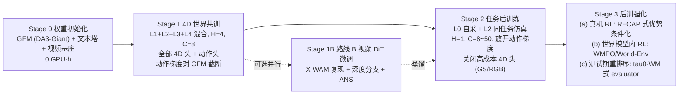

### 5.2 Stage 0：初始化清单

| 模块 | 权重来源 | 备注 |
|---|---|---|
| `GeoEncoder` + `DPT head` | `depth-anything-3` Giant（或 π³ / VGGT） | blocks 0–11 冻结；DPT 头永久冻结 |
| 文本塔 | T5-base/XXL 或 UMT5-XXL（视显存） | 冻结；离线预计算 lang embedding 缓存可省 15% 训练时间 |
| `BlockCausalPredictor` | 随机初始化（层数 12、width 1024） | 最后一层零初始化（zero-init out-proj），保证训练初期不破坏 GFM 特征 |
| `ActionExpert` | 随机 | 输出层零初始化 |
| 4D 头 | 随机（Depth 头除外） | GS 头的 \(\alpha\) 偏置初始化为 -2（初期低不透明度更稳） |
| 视频 DiT（路线 B） | `Wan2.2-TI2V-5B` + X-WAM 的深度分支权重 | 直接从 X-WAM 检查点续训最省事 |

### 5.3 Stage 1：4D 世界共训（核心阶段）

**目标**：让主干学会"给定 3 视角当前观测 + 指令 + 状态，预测未来的几何与动作"。这一阶段决定表征质量，也是 Fast-WAM 结论所指的「真正带来收益的地方」。

| 超参 | 值 | 说明 |
|---|---|---|
| 数据混合 | L1 50% / L2 30% / L3 15% / L4 5% | 按 §4.1；采样权重再乘 `quality` |
| 预测步长 \(H\) | **4** | GAM 预训练用 H=4；更长收益递减且显存暴涨 |
| 动作 chunk \(C\) | **8** | 与 GAM 一致；长 chunk 留到 Stage 2 |
| 输入 | \(K=0\)（单帧 3 视角） | 保持快路径极简；短视频输入放消融 |
| 分辨率 | 输入 448²，4D 输出 224² | §3.3.1 |
| 优化器 | AdamW，\(\beta=(0.9,0.95)\)，wd 0.05 | — |
| 学习率 | 预测器/头 \(1\!\times\!10^{-4}\)；GFM blocks 12–39 \(1\!\times\!10^{-5}\) | **分组 LR 是必须的**，同 LR 会毁掉 GFM |
| 调度 | warmup 2 k step + cosine 到 5% | — |
| 全局 batch | 1024（GAM 量级） | 8 卡时用 grad-accum 达等效 |
| 精度 | bf16 + grad checkpoint（GFM 段） | — |
| EMA | decay 0.999 | 4D 头对 EMA 敏感，收益明显 |
| 步数 | 100–150 k step | GAM: 64×GH200×96 h |
| 损失权重 | 见 §3.6 表；\(\lambda_{act}=3,\lambda_{depth}=3,\lambda_{REPA}=1\) | — |
| 动作梯度 → GFM | **截断**（Knowledge Insulation） | Stage 2 再放开 |
| 数据增强 | 外参噪声 ±2 cm/±2°、随机丢相机 \(p=0.15\)、颜色抖动、随机裁剪（同步改 K） | **抗标定漂移的核心** |

**课程（curriculum）设计**：

```mermaid
gantt
  dateFormat X
  axisFormat %s
  title Stage 1 课程安排 (按 step)
  section 几何打底
  只开 depth + REPA + self4D            :0, 20000
  section 运动加入
  加 flow2d + sceneflow3d               :20000, 40000
  section 长程加入
  加 tracks3d + occ                     :40000, 80000
  section 动作与几何联合
  动作头全权重 + a-trk 一致性            :20000, 150000
  section 可选高成本头
  GS 头 (仅 L2 仿真数据)                 :80000, 150000
```

理由：先让预测器学会"未来几何长什么样"（depth 最容易、监督最干净），再逐步引入运动量与长程量。若一开始全开，`tracks3d` 与 `occ` 的噪声梯度会拖慢深度收敛（实践中表现为深度 AbsRel 停在 0.12 不降）。

**多损失平衡的工程做法**：固定权重 + **梯度范数监控**。每 500 step 记录各头对预测器最后一层的梯度范数 \(g_k\)；若某头 \(g_k>5\bar g\)，自动把其权重乘 0.5（上限调整 3 次）。比 GradNorm 之类自适应方法更稳，也更容易复现。

### 5.4 Stage 2：任务后训练

| 超参 | 值 | 说明 |
|---|---|---|
| 数据 | L0 自采（每任务 200–500 demo）+ 同任务 L2 仿真 20% | GAM 真机实验用 169–284 demo/任务 |
| \(H\) | **1** | 部署只需短程 4D；GAM 后训同样降到 H=1 |
| \(C\) | 8（高频控制）或 30–50（长时程任务，配 RTC） | π0.6 用 50 步 @50 Hz |
| 学习率 | 预测器 \(3\!\times\!10^{-5}\)，GFM \(3\!\times\!10^{-6}\) | 小 LR 防遗忘 |
| batch | 160（GAM 后训值） | 16×GH200×48 h 量级 |
| 步数 | 20–40 k | 过拟合前早停（用真机 20-trial 曲线判定） |
| 关闭的头 | GS 头、RGB 头（成本高且对成功率贡献小） | 保留 depth/flow/track/occ/self/sem |
| 放开 | 动作梯度可回流 GFM blocks 12–39 | 最后 20% step 才放开，提精度 |
| 新增 | **训练期动作条件化**（把上一 chunk 尾部当输入 token） | 让部署期 RTC 零成本 |

**混合本体训练**：若目标平台是双臂 + 单臂两种，用 GR00T 式 `embodiment_tag` + 各自 action adapter（输入/输出线性层不共享，主干共享）。

### 5.5 Stage 3：后训强化与测试期优化（三条独立可选路径）

| 路径 | 方法 | 依赖 | 预期收益 | 成本 |
|---|---|---|---|---|
| **3a 真机 RL（RECAP 式）** | 用真机 rollout 训价值函数，得到优势 \(A\)；把 \(A\) 作为条件 token 训练策略（advantage-conditioned），推理时喂"高优势"条件 | 真机 rollout 采集 + 人工/自动奖励 | π0.6 报告在难任务上吞吐提升与错误率下降显著 | 真机时间贵，但不需要在线梯度 |
| **3b 世界模型内 RL（WMPO / World-Env）** | 用路线 B 的视频/4D 世界模型当环境，在"想象"里做 on-policy RL（GRPO/PPO） | 需要较准的世界模型 + 奖励模型 | 免真机 rollout，样本效率高 | 世界模型误差会被 RL 利用（reward hacking），需保守正则 |
| **3c 测试期候选重排序（τ0-WM 式）** | 动作头采样 \(N=8\) 个候选 chunk → 世界模型/进度头给每个候选打分（重去噪一致性 + 进度增量 + 占据碰撞代价）→ 选最优 | 慢路径可用（异步） | 不改权重就能涨点；可与安全护栏共用 | 延迟：需要慢路径在一个 chunk 周期内完成 |

**3c 的打分函数（可直接实现）**：

\[
\mathrm{score}(a^{(n)})=\underbrace{\Delta \hat p(a^{(n)})}_{\text{进度增量}}
-\lambda_{col}\underbrace{\sum_{h}\mathrm{Collide}\big(\hat O_{t+h},\ \mathrm{FK}(a^{(n)}_{t+h})\big)}_{\text{占据碰撞}}
-\lambda_{cons}\underbrace{\big\lVert \hat{\mathcal T}^{world}(a^{(n)})-\mathrm{Render}_{FK}(a^{(n)})\big\rVert}_{\text{4D 自洽性}}
-\lambda_{jerk}\lVert \nabla^2_h a^{(n)}\rVert
\]

这个式子把本方案的 4D 输出**真正用起来**了：占据用于安全、进度用于任务、轨迹自洽用于筛掉"模型自己都不相信"的动作。

### 5.6 算力估算与缩减配置

**参考锚点**：GAM 预训练 64×GH200×96 h（batch 1024）+ 后训 16×GH200×48 h（batch 160）；X-WAM 用 5800+ 小时视频数据预训练 5 B 视频模型。

| 配置 | 硬件 | 主干 | \(H\)/\(C\) | 开启的 4D 头 | Stage 1 时长 | 备注 |
|---|---|---|---|---|---|---|
| **全量** | 64×H100/GH200 | DA3-Giant | 4 / 8 | 全部（含 GS） | ~4 天 | 对标 GAM |
| **标准（推荐起步）** | 8×H100 80 G | DA3-Giant，blocks 0–19 冻结 | 4 / 8 | depth+flow+sf+track+occ+self+REPA | ~10–14 天（grad-accum ×8） | 单节点可完成 |
| **精简** | 4×A100 40 G | **DA3-Base** 或 π³-Small | 2 / 8 | depth+flow+self+REPA | ~7 天 | 224² 输入，4D 输出 112² |
| **单卡验证** | 1×RTX 4090/6000 Ada | DA3-Small，LoRA | 1 / 8 | depth+self+REPA | ~3 天（小数据 5 k ep） | 只用于打通流程/调 bug |
| **路线 B（视频）** | 8×H100 | Wan2.2-5B（LoRA 微调 X-WAM 权重） | 8 帧 | RGB+Depth | ~5–7 天 | 全量重训需 ≥64 卡 |

**显存压缩清单**（8 卡 80 G 跑 Giant 的必要手段）：GFM 段 grad-checkpoint（省 ~35%）、未来 readout token 2× 下采样（省 ~40% 序列显存）、4D 头分组反传（每 step 只对 2–3 个头计算完整损失，轮转；用无偏采样保持期望一致）、bf16 + `fused AdamW`、`FSDP` shard optimizer state。

### 5.7 消融实验计划表（决定最终交付构型）

| # | 消融项 | 对照组 | 观察指标 | 预期结论/决策点 |
|---|---|---|---|---|
| A1 | 主干：DA3-Giant vs Wan2.2-DiT vs SigLIP+Gemma | 三者同数据同步数 | 成功率、相机扰动子集、延迟 | 验证「几何主干抗扰动」（GAM 83.1% 对照） |
| A2 | 切层 \(L_s\)：6 / 12 / 20 / 30 | — | 成功率 + depth AbsRel | 复现 GAM 的 \(L_s=12\) 最优 |
| A3 | DPT 头冻结 vs 微调 | — | **未来深度与当前深度的尺度一致性** | 验证冻结带来的米制一致性 |
| B1 | 去掉 4D 共训（只训动作） | — | 成功率、OOD 鲁棒性 | 验证 Fast-WAM 结论（共训是主要收益） |
| B2 | 逐个去掉 4D 头（depth / flow / sf / track / occ / self / REPA / GS） | 8 组 | 成功率、扰动鲁棒、4D 指标 | **输出头性价比排序**，决定部署构型 |
| B3 | 只留 REPA（无任何伪标签） | — | 成功率 | 若差距 <2%，可省掉整条伪标签流水线（重要的成本决策） |
| C1 | 米制锚定 on/off（含 8-bit 量化复现 RynnWorld 设置） | — | 绝对 AbsRel/RMSE、抓取成功率 | 量化米制处理对**下游可用性**的影响 |
| C2 | Geo-RoPE on/off；外参噪声增强 on/off | 4 组 | 相机扰动子集成功率、跨视角一致性 | 验证显式标定注入的价值 |
| D1 | 动作头：flow matching(5 步) vs L1 并行 vs FAST 离散 | — | 成功率 + 延迟 | 选定部署动作头 |
| D2 | \(\mathcal L_{fk}\) 与 \(\mathcal L_{a\text{-}trk}\) on/off | — | 关节-位姿自洽误差、成功率 | 验证双输出一致性约束 |
| D3 | \(C=8\) vs 30 vs 50；RTC on/off；训练期动作条件化 on/off | — | 抖动（jerk）、成功率、时延容忍 | 定部署 chunk 长度与拼接方式 |
| E1 | 测试期重排序 \(N=1/4/8\) | — | 成功率 vs 延迟 | 决定 3c 是否上线 |
| E2 | Stage 3a/3b 各自增益 | — | 难任务成功率 | 决定 RL 投入 |

**实验记录规范**：每组消融必须同时报告「动作侧成功率」与「4D 侧指标」，并在 §6.5 的相关性表中登记——**只涨 4D 指标不涨成功率的头，一律不进部署构型**。

### 5.8 训练期常见失效模式与排查

| 现象 | 可能原因 | 排查 / 处置 |
|---|---|---|
| depth AbsRel 停在 0.10–0.15 不降 | 多数据集尺度不一致；低置信样本参与了绝对损失 | 检查 `scale_confidence` 分布；把 low 置信样本切到仅 SSI |
| 动作损失降但真机成功率不涨 | 过拟合 demo 分布；`state` 归一化用了 min-max 被离群值污染 | 换 1%/99% 分位数归一化；加外参/光照增强；早停 |
| 3D 轨迹损失震荡 | 伪标签遮挡处噪声大 | 严格用 `visibility` 掩码；提高双工具一致性阈值 |
| 静态背景 scene flow 非零 | 时间同步误差 / wrist 外参没逐帧算 | 见 §4.2 坑 1、坑 4；重跑该 episode |
| GS 头渲染全白/发散 | \(\alpha\) 初始化过高、学习率过大 | \(\alpha\) 偏置 -2；GS 头单独用 1/3 LR；先只在仿真数据上训 |
| 加入 4D 头后动作性能下降 | 梯度冲突 | 检查梯度范数监控；Stage 1 保持动作梯度对 GFM 截断；降低冲突头权重 |
| 相机扰动下崩溃 | Geo-RoPE 未启用或外参增强缺失 | 开启 §5.3 的外参噪声与随机丢相机 |
| 显存 OOM | readout token 太多 | 未来分辨率降到 112²；4D 头分组反传 |

---

## 第 6 章 双轨评测体系

### 6.1 评测总览

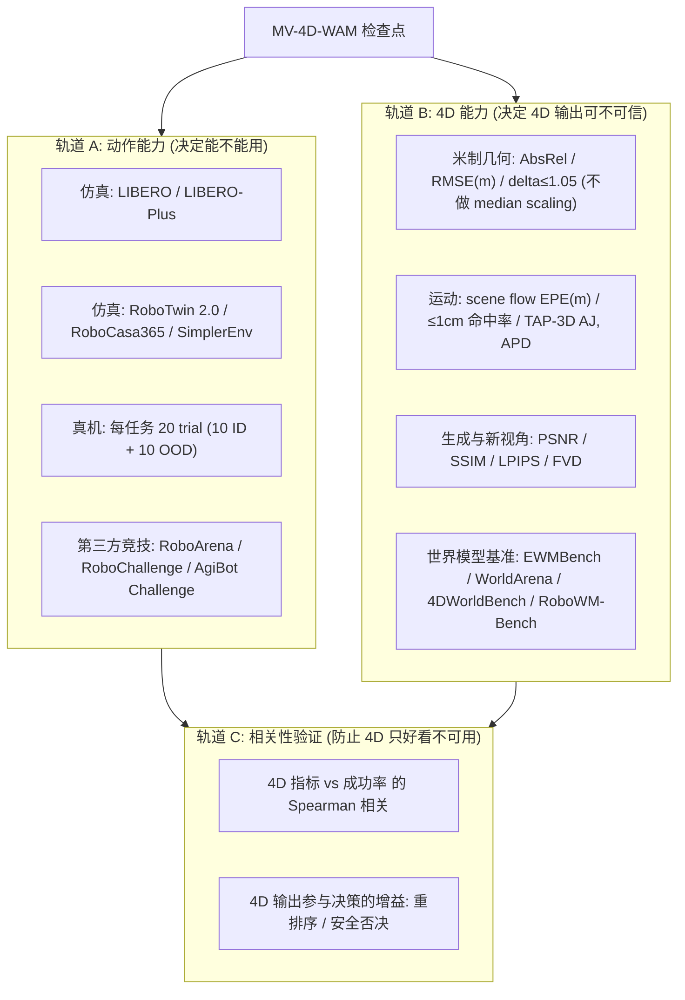

### 6.2 轨道 A：动作侧评测与目标分数

| 基准 | 配置 | 参考 SOTA | **本方案目标** | 说明 |
|---|---|---|---|---|
| **LIBERO**（4 套件均值） | 3 seed × 50 trial | GAM **97.6%**、OpenVLA-OFT 97.1% | ≥ 97% | 已饱和，仅作回归测试 |
| **LIBERO-Plus** | 7 类扰动：相机、机器人初态、语言、光照、背景、噪声、布局 | GAM **85.5%**，相机子集 **83.1%** | ≥ 86%，相机子集 ≥ 85% | **最重要的仿真鲁棒性指标**（VLM 系普遍腰斩） |
| **RoboTwin 2.0** | 双臂，域随机化开 | X-WAM **90.7%** | ≥ 90% | 与本方案 3 相机 RGB-D 设定天然一致 |
| **RoboCasa / RoboCasa365** | Kitchen 24 任务 | GAM 69.4%、X-WAM(RoboCasa) 79.2% | ≥ 80% | 长尾场景泛化 |
| **SimplerEnv** | Bridge/Fractal 视觉匹配 | 各家 60–80% | ≥ 70% | 低成本真机代理 |
| **真机（自建 4–8 任务）** | 每任务 20 trial：10 ID + 10 OOD | GAM 真机 OOD：相机平移 85 cm + 旋转 45° 仍可用 | ID ≥ 85%，OOD ≥ 70% | **最终验收指标** |
| **AgiBot World Challenge / RoboChallenge** | 第三方在线榜 | 见 `multitrack_bnchmrk_1.md` | 进入榜单前列 | 对外证明 |

**真机 OOD 的 7 类扰动清单（照 LIBERO-Plus 分类做真机版）**：

| 类别 | 具体操作 | 通过标准 |
|---|---|---|
| 相机位姿 | head 相机平移 ±15 cm / 旋转 ±20°（不重新标定 vs 重新标定各一组） | 成功率下降 <15% |
| 相机数量 | 随机遮挡 1 路 wrist 相机 | 下降 <20% |
| 光照 | 强/弱/侧光/闪烁 | 下降 <10% |
| 背景与干扰物 | 换桌布、加 5 个干扰物 | 下降 <15% |
| 物体 | 同类未见实例、位姿随机化 | 下降 <20% |
| 语言 | 10 条改写指令 | 下降 <5% |
| 机器人初态 | 关节初始位姿随机化 ±20° | 下降 <10% |

### 6.3 轨道 B：4D 侧评测（含与 `multitrack_bnchmrk_1.md` 联动）

| 维度 | 指标 | 计算约定（**关键**） | 目标值 |
|---|---|---|---|
| 米制深度 | AbsRel、RMSE(m)、\(\delta<1.05/1.25\) | **不做 median scaling**；分距离段报告（0.2–0.5 / 0.5–1.0 / 1.0–2.0 m）；同时报 median-scaled 作为参考 | AbsRel < 0.06；RMSE < 4 cm（≤1 m 段） |
| 跨视角一致 | 3 相机点图互投影中位误差 | 只在共视区 | < 1 cm |
| 3D scene flow | EPE(m)、<1 cm/<3 cm 命中率 | **分三类报告**：动态物体 / 机器人 / 静态背景；在 float32 原始场上算 | 动态物体 EPE < 2 cm |
| 2D 光流 | EPE(px) | **在原始 \((u,v)\) float32 场上算，禁止在色轮图上算** | EPE < 2 px |
| 3D 点轨迹 | TAP-3D 的 AJ / APD / OA（遮挡准确率） | 世界系；分可见/遮挡段 | APD ≥ 0.6 |
| 4D 占据 | IoU / mIoU、free-space 召回 | unknown 体素屏蔽 | IoU ≥ 0.55 |
| 新视角渲染 | PSNR / SSIM / LPIPS | **留一视角**（训练未见的第 3 相机） | PSNR ≥ 22 dB |
| 未来 RGB（路线 B） | FVD、PSNR、EWMScore | 与 EWMBench 一致的协议 | 对齐 X-WAM 水平 |
| 世界模型综合 | **EWMBench**（场景/运动/语义）、**WorldArena/EWMScore**、**4DWorldBench**、**RoboWM-Bench**（可执行性）、Omni-WorldBench（交互响应） | 直接复用本仓库 `multitrack_bnchmrk_1.md` 中的官方协议与榜单入口 | 参照该文档各榜首水平 |
| 机器人自身 4D | self-mask IoU、link 位置误差(mm) | 与 URDF 真值比 | IoU ≥ 0.9；误差 < 10 mm |

> **本仓库联动**：轨道 B 的第 4 组（世界模型综合基准）不重复定义协议，一律引用 `multitrack_bnchmrk_1.md`；2026 年 SOTA 分数对照见 `multitrack_rb_sota_1.md`（如 PAIWorld 在 WorldArena EWMScore 72.31%、Scene Consistency 90.41%；X-WAM RoboCasa 79.2%/RoboTwin2.0 90.7%）。

### 6.4 用世界模型做评测器（省真机时间的关键手段）

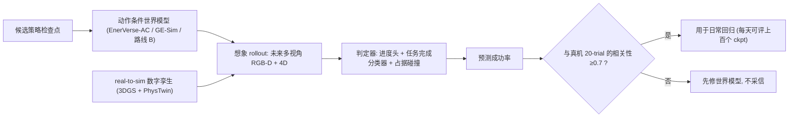

**必要的前置校准**：世界模型评测器只有在与真机成功率相关性达标时才可信。校准方式：取 10 个能力差异明显的检查点，同时做真机 20-trial 与想象评测，算 Spearman \(\rho\)；\(\rho>0.7\) 才启用。这是避免"自欺"的硬门槛（RoboWM-Bench、GigaWorld 系工作强调的核心问题）。

### 6.5 「4D 指标 ↔ 成功率」相关性验证实验设计

**动机**：用户要"4D 信息越多越好"，但工程上必须证明这些 4D 输出**真的有用**，而不是漂亮的副产物。

**实验设计**

1. **取样**：从 Stage 1/2 的训练轨迹中取 \(M=15\) 个检查点（能力从弱到强），每个都跑完整轨道 A（真机 20-trial + LIBERO-Plus）与轨道 B。
2. **相关性表**：对每个 4D 指标计算与成功率的 Spearman \(\rho\) 及偏相关（控制训练步数这一共因）。
3. **因果性（消融）**：用 §5.7-B2 的逐头消融，得到每个头的"去掉后成功率变化" \(\Delta\)。
4. **决策矩阵**：

| 4D 指标 | \(\rho\) 高？ | 消融 \(\Delta\) 显著？ | 判定 |
|---|---|---|---|
| 米制深度 AbsRel | 预期高 | 预期显著 | **进部署构型 + 进监控** |
| self-mask IoU | 中 | 预期显著（标定健康） | **进监控（早期预警）** |
| scene flow EPE | 中 | 待测 | 若 \(\Delta\)<1% 则仅训练期保留 |
| tracks3d APD | 预期高 | 待测 | 与动作耦合损失一起评估 |
| occ IoU | 低 | 通过安全否决间接有用 | 进安全护栏，不进主损失权重优先级 |
| 未来 RGB FVD | 预期低（Fast-WAM 结论） | 预期小 | **只作训练期共训与可视化** |

5. **产出**：一张「保留/裁剪」清单，直接决定 V1 部署构型与 Stage 2 的头开关。

### 6.6 评测报告模板（每次训练必须产出）

```text
report/<run_id>/
  summary.md                # 一页：动作侧 + 4D 侧核心数字 + 与上一版 diff
  action/
    libero.json  libero_plus_by_category.json  robotwin2.json  robocasa.json
    real_robot_trials.csv   # task, trial, ID/OOD, success, failure_reason, latency_p50/p99
  fourd/
    depth_metric.json       # 分距离段, 含 raw 与 median-scaled 两组
    sceneflow.json          # 分动态物体/机器人/静态
    tracks3d.json  occ.json  nvs.json  self4d.json
  correlation/
    spearman_table.csv      # 6.5 节
  viz/
    depth_gif/  flow_wheel/ tracks_3d.html  occ_bev.png  gs_novel_view.mp4
```

---

## 第 7 章 部署与工程

### 7.1 部署拓扑

```mermaid
flowchart TB
  subgraph EDGE["方案 1: 边缘一体机 (推荐生产)"]
    E1["3 相机 → USB3/GMSL 采集卡 (硬触发同步)"]
    E2["Jetson AGX Thor 或 RTX 6000 Ada"]
    E3["快路径 TensorRT + CUDA Graph"]
    E4["机器人控制器 (EtherCAT/CAN, 50-1000Hz)"]
    E1 --> E2 --> E3 --> E4
  end
  subgraph LAN["方案 2: 局域网远程推理 (研发/大模型)"]
    L1["机器人端: 采集 + 时间戳 + 压缩 (JPEG q90)"]
    L2["万兆网 / RDMA (往返 2-5ms)"]
    L3["服务器 1xH100: 快路径"]
    L4["服务器 2xH100: 慢 4D 路径 + 视频想象"]
    L1 --> L2 --> L3
    L2 --> L4
    L3 --> L1
  end
  subgraph HYB["方案 3: 混合 (推荐研发转产过渡)"]
    H1["边缘跑快路径 (动作)"]
    H2["服务器异步跑慢 4D 路径 (监控/孪生/重排序)"]
    H1 <--> H2
  end
```

**选择准则**：若控制周期 20 ms 而网络往返抖动 >5 ms，必须用边缘方案（或用 RTC 吸收抖动）。慢 4D 路径永远可以远程，因为它不在控制闭环的硬实时路径上。

### 7.2 时延预算与加速三级火箭

**端到端预算（目标：50 Hz 控制 = 20 ms 周期）**

| 环节 | 耗时 | 优化手段 |
|---|---|---|
| 相机曝光 + 传输 | 3–8 ms | 全局快门、硬触发、降分辨率传输 |
| 预处理（去畸变 + resize + normalize） | 1–2 ms | GPU 上做（`nvjpeg` + CUDA kernel），**不要在 CPU numpy** |
| 编码器（3×448²，blocks 0–11） | 3.5 ms | TensorRT FP8/INT8（视精度损失） |
| 预测器（12 层） | 2.5 ms | KV-cache（多帧输入时）、CUDA Graph |
| 动作头（5 步流匹配） | 0.9 ms | 步数 5→3 的消融；或换 L1 单步 |
| 后处理（反归一化 + 限位 + RTC 拼接） | 0.5 ms | — |
| **合计** | **≈12–20 ms** | 满足 50 Hz；GAM 实测核心网络 6.9 ms |

**加速三级火箭（GAM 实测路径）**：eager PyTorch → `torch.compile`（17.5 ms）→ **CUDA Graph（6.9 ms，145 Hz）**。CUDA Graph 的前提是**形状完全静态**：固定 \(V=3\)、\(K\)、\(C\)、去噪步数，缺相机用零填充 + `cam_mask` 而非改形状。

**进一步手段**：TensorRT engine（+10–20%）、FP8（H100/Thor，注意深度头精度）、attention kernel（FlashAttention-3）、把文本 embedding 离线缓存（指令固定时省整个文本塔）。

### 7.3 双速率调度与 RTC

```mermaid
sequenceDiagram
  participant Clk as 控制时钟 50Hz
  participant Fast as 快路径线程
  participant Slow as 慢 4D 线程 (5-10Hz)
  participant Exec as RTC 执行器
  participant Safe as 安全护栏

  loop 每 20ms
    Clk->>Exec: tick
    Exec->>Safe: 下一动作 a[i]
    Safe->>Safe: 关节限位 + 速度/加速度限 + 占据碰撞 (用最近 occ)
    Safe-->>Exec: 通过 / 否决(降速或保持)
    Exec->>Clk: 发送到控制器
  end
  par 快路径 (每 2-4 个 tick 触发一次)
    Fast->>Fast: 推理 chunk_k (≤20ms)
    Fast->>Exec: 提交 chunk_k + 生成时刻戳
    Exec->>Exec: 与未执行前缀 inpainting 拼接 (w(i)=min(10, w0*e^(beta*i)))
  and 慢路径
    Slow->>Slow: depth/flow/track/occ (+GS)
    Slow->>Safe: 更新占据图 + self-mask IoU 健康分
    Slow->>Slow: 可选: N=8 候选重排序打分回传 Fast
  end
```

**三条硬规则**：

1. **绝不"冻结等待"**：快路径超时就继续执行上一 chunk 剩余步（这是 RTC 的核心动机——冻结会造成 OOD 状态与抖动）。
2. **慢路径永不阻塞快路径**：独立 CUDA stream + 独立线程；显存预留固定池，避免动态分配抖动。
3. **安全护栏用"最近可用"的 4D**：占据图可能落后 100–200 ms，因此碰撞检查要加**时间膨胀**（把占据体素按 scene flow 前推并膨胀 2 cm）。

### 7.4 多相机同步与标定流程（工程 SOP）

```mermaid
flowchart TB
  ST1["1. 硬件: 3 相机接同一触发源 (GPIO/PTP), 记录 exposure 时间戳"]
  ST2["2. 内参: 每相机棋盘/圆点标定, 重投影误差 ≤0.3 px"]
  ST3["3. head 外参: 标定板固定于 base, 求 T_base_cam_head"]
  ST4["4. 手眼: wrist 相机 AX=XB 标定 (Tsai/Park), 求 T_ee_cam"]
  ST5["5. 验证: URDF 渲染 self_mask 与实拍 robot_mask IoU ≥0.9"]
  ST6["6. 时间: 用闪光/摆动物体测跨相机与关节编码器时延, 补偿到统一时基"]
  ST7["7. 落盘: calib/*.yaml + 版本号, 写入每 episode 元数据"]
  ST8["8. 在线监控: self-mask IoU 与跨视角重投影误差日常趋势"]
  ST1 --> ST2 --> ST3 --> ST4 --> ST5 --> ST6 --> ST7 --> ST8
  ST8 -->|IoU 下降≥0.05| ST4
```

**IoU 触发重标定**是本方案独有的闭环：由于我们已经在生产 `self_mask` 4D 输出，标定漂移会被自动发现，不需要人工定期停机标定。

### 7.5 安全护栏与失败检测

| 层 | 机制 | 用到的 4D 输出 | 动作 |
|---|---|---|---|
| L1 运动学 | 关节限位、速度/加速度/jerk 限、自碰撞（URDF） | `self_4d` | 裁剪或保持 |
| L2 环境碰撞 | 占据图查询（时间膨胀 + 2 cm 安全余量） | `occ`, `sceneflow3d` | 降速 / 否决 / 退回 |
| L3 任务级 | 进度头 200 ms 无增长；重排序分数全为负 | `progress`, `tracks3d` | 触发重规划 / 换策略 |
| L4 模型自省 | 4D 自洽性（预测轨迹 vs FK 渲染）差异突增；depth 与 RGB-D 传感器分歧突增 | 全部 | **进入保守模式**（降速 50%、缩短 chunk、请求人工） |
| L5 系统 | 相机丢帧、时间戳跳变、self-mask IoU 骤降 | `self_4d` | 报警 + 安全停 |

**L4 是本方案的差异化价值**：因为我们同时输出动作与 4D，可以做「模型对自己预测的一致性检查」——这是纯 VLA（只出动作）做不到的失败检测手段。

### 7.6 对外接口（ROS 2 定义，便于直接接入现有栈）

| 类型 | 名称 | 消息 | 频率 |
|---|---|---|---|
| Sub | `/cam/{head,wrist_l,wrist_r}/image_raw` | `sensor_msgs/Image` | 30 Hz |
| Sub | `/cam/{...}/camera_info` | `sensor_msgs/CameraInfo` | 静态/1 Hz |
| Sub | `/joint_states` | `sensor_msgs/JointState` | 200 Hz |
| Sub | `/d4a/instruction` | `std_msgs/String` | 事件 |
| Pub | `/d4a/action_chunk` | 自定义 `ActionChunk{stamp, C, joints[C][n], ee[C][7], grip[C], gen_stamp}` | 12–25 Hz |
| Pub | `/joint_trajectory_controller/command` | 标准控制器接口（RTC 执行器发） | 50–200 Hz |
| Pub | `/d4a/fourd/depth_{view}` | `sensor_msgs/Image`（16UC1, mm） | 5–10 Hz |
| Pub | `/d4a/fourd/pointcloud` | `sensor_msgs/PointCloud2`（base 系，米） | 5–10 Hz |
| Pub | `/d4a/fourd/occupancy` | `nav_msgs/OccupancyGrid` 或自定义 3D | 5–10 Hz |
| Pub | `/d4a/fourd/tracks3d` | 自定义 `Tracks3D{N, H, xyz, vis}` | 5 Hz |
| Pub | `/d4a/fourd/gaussians` | 自定义/PLY 二进制（V2） | 1 Hz |
| Pub | `/d4a/health` | `HealthStatus{self_iou, xview_err, latency_p99, mode}` | 1 Hz |
| Srv | `/d4a/imagine` | 请求 \(H\) 步 4D 想象（离线/调试） | 按需 |

---

## 第 8 章 里程碑与风险

### 8.1 三阶段路线图

```mermaid
gantt
  dateFormat YYYY-MM-DD
  axisFormat %m/%d
  title MV-4D-WAM 落地路线图 (以 2026-08-01 起算)
  section MVP 4-6 周 打通与复现
  环境与依赖 (LeRobot/openpi/RoboTwin2.0)        :m1, 2026-08-01, 5d
  复现 X-WAM (3xRGB-D, RoboCasa/RoboTwin 对齐)   :m2, after m1, 10d
  复现 GAM (LIBERO + 延迟基线 CUDA Graph)         :m3, after m1, 12d
  3 相机硬件与标定 SOP (含 self-mask IoU 验证)     :m4, 2026-08-06, 12d
  伪标签流水线 v0 (MapAnything + CoTracker3)      :m5, after m2, 8d
  MVP 验收 (复现分数 + 端到端延迟报告)             :ms1, after m3, 3d
  section V1 8-12 周 自研主干与真机
  路线 A 主干实现 (切层 + 因果预测器 + Geo-RoPE)    :v1, after ms1, 14d
  4D 头组实现 (depth/flow/sf/track/occ/self/sem)  :v2, after ms1, 18d
  Stage 1 共训 (8xH100, 10-14 天)                 :v3, after v2, 14d
  自采真机数据 (4-8 任务 x 300 demo)               :v4, after m4, 20d
  Stage 2 后训 + RTC 部署                          :v5, after v3, 10d
  双轨评测 + 相关性验证 (6.5 节)                    :v6, after v5, 7d
  V1 验收 (真机 ID 85% / OOD 70% + 4D 达标)        :ms2, after v6, 3d
  section V2 12-16 周 4DGS 与 real-to-sim 与 RL
  前馈 4DGS 头 (NoPo4D 式) + 留一视角训练           :w1, after ms2, 16d
  real-to-sim 数字孪生 (3DGS + PhysTwin)           :w2, after ms2, 18d
  世界模型评测器校准 (rho 0.7 门槛)                 :w3, after w2, 8d
  Stage 3 RL 后训 (RECAP 真机 / WMPO 想象内)        :w4, after w3, 20d
  V2 验收 (自由新视角 + 闭环评测 + 难任务提升)       :ms3, after w4, 4d
```

**每个里程碑的硬性验收标准**

| 里程碑 | 必须达到 | 交付物 |
|---|---|---|
| **MVP** | ① X-WAM 复现分数与官方偏差 <3 个点；② GAM 复现 LIBERO ≥95%，CUDA Graph 延迟 <15 ms；③ 3 相机 self-mask IoU >0.9；④ 伪标签流水线跑通 1000 episode 且通过率 >70% | 复现报告、标定 SOP、伪标签 QC 报告 |
| **V1** | ① 真机 ID ≥85%、OOD（7 类扰动均值）≥70%；② 快路径延迟 ≤20 ms、全 4D 慢路径 ≤60 ms；③ 米制深度 AbsRel <0.06（无 median scaling）；④ 完成 §5.7 的 A/B/C/D 组消融 | 模型权重、评测报告、部署镜像、消融结论 |
| **V2** | ① 留一视角 PSNR ≥22 dB；② 世界模型评测器与真机 \(\rho>0.7\)；③ RL 后训在 3 个难任务上相对 V1 提升 ≥8 个点 | 4DGS/孪生资产、RL 训练配方、闭环评测平台 |

### 8.2 人力与资源估算

| 角色 | 人数 | 主要职责 | 关键里程碑 |
|---|---|---|---|
| 模型/算法 | 2–3 | 主干与 4D 头、训练、消融 | V1-v1/v2/v3 |
| 数据工程 | 1–2 | 伪标签流水线、格式、QC | MVP-m5、V1-v4 |
| 机器人工程 | 1–2 | 标定、同步、遥操采集、RTC 部署、安全 | MVP-m4、V1-v5 |
| 仿真/评测 | 1 | RoboTwin/RoboCasa 配置、双轨评测、real-to-sim | V1-v6、V2-w2/w3 |
| **算力** | — | 训练 8×H100（V1 需约 2–3 卡月）；伪标签约 600–1500 GPU·h；推理 1 卡 | — |
| **存储** | — | 原始 + 4D 侧车约 20–50 TB（10 万 episode 量级） | — |

### 8.3 风险登记表

| # | 风险 | 概率 | 影响 | 触发信号 | 缓解措施 | 兜底方案 |
|---|---|---|---|---|---|---|
| R1 | **伪标签噪声**导致 4D 头学歪，反噬动作性能 | 高 | 中 | 深度 AbsRel 卡在 0.12；加 4D 头后成功率下降 | §4.5 五项一致性过滤 + `quality` 采样权重 + 梯度范数监控 | 退到 **只用 REPA + self-4D**（§5.7-B3 验证过的低成本构型） |
| R2 | **米制尺度漂移**（跨数据集、跨时间） | 中 | 高 | 静态背景 scene flow >5 mm；link 长度校验失败 | 三重锚定（FK/物理长度/RGB-D）+ 逐 episode 尺度记录 | 输出附带 `scale_confidence`，下游按置信度降级使用（只做碰撞粗检不做精抓取） |
| R3 | **标定漂移**（wrist 手眼、head 外参） | 高 | 高 | self-mask IoU 下降 >0.05；跨视角重投影误差上升 | §7.4 在线监控自动触发重标定；训练期外参加噪增强 | 相机冗余（丢 1 路仍可运行，训练已含随机丢相机） |
| R4 | **延迟不达标**（4D 头拖慢控制） | 中 | 高 | p99 延迟 >25 ms | 双速率 + 独立 stream + CUDA Graph 静态形状 | 部署时只开 depth+self 头；4D 全量放远程服务器异步 |
| R5 | **显存/算力不足**（Giant 主干 + 多头） | 中 | 中 | OOM 或训练周期 >3 周 | §5.6 缩减配置（DA3-Base/π³-Small、112² 输出、4D 头分组反传） | 采用「路线 A-lite」，只保 4 个头 |
| R6 | **数据许可与合规**（多来源数据集混训） | 中 | 高 | 法务审查发现 NC 许可 | 建立数据卡：逐数据集记录 license（OXE/DROID/AgiBot/RoboMIND 各不相同）；商用前剔除 NC 数据 | 只用可商用子集重训一版「clean」权重 |
| R7 | **开源依赖不可得**（表中 ❓ 项实际无代码） | 中 | 低 | 复现受阻 | 每个 ❓ 项都有替代：Track4World→SpaTrackV2+TAPIP3D；NoPo4D→DynamicVGGT/GAF；τ0-WM→自实现 evaluator | 不把关键路径压在未核实的仓库上 |
| R8 | **世界模型评测器自欺**（想象里成功、真机失败） | 中 | 中 | \(\rho<0.7\) | §6.4 强制相关性校准门槛 | 评测器只做粗筛，最终以真机 20-trial 为准 |
| R9 | **RL 后训 reward hacking**（在想象里刷分） | 中 | 中 | 想象成功率飙升但真机不涨 | KL 正则回 SFT 策略、想象步数上限、混合真机 rollout | 只做 3a（真机 RECAP）与 3c（重排序），放弃 3b |
| R10 | **多相机硬同步不达标** | 中 | 高 | `sync_err_ms` >10 ms | 硬触发/PTP；软件时基插值 | 降级为单视角 + wrist 时序错位补偿（4D 质量下降但动作可用） |
| R11 | **真机数据采集速度低于预期** | 高 | 中 | 每天 <30 demo/人 | 遥操工装优化 + 仿真补足（RoboTwin 同任务） + 数据增广（世界模型生成） | 缩减任务数量，先做 2–3 个任务打通全链路 |

### 8.4 「先做什么」优先级清单（如果只有 4 周）

1. **第 1 周**：3 相机硬件 + 标定 SOP + self-mask IoU 验证（这是所有 4D 的地基，最容易被低估）。
2. **第 2 周**：X-WAM 复现 + 用其数据格式跑通一次训练（拿到第一条 3×RGB-D → 动作的基线）。
3. **第 3 周**：GAM 复现 + CUDA Graph 延迟测量（确认实时路径可行）。
4. **第 4 周**：把 GAM 骨架 + `self_4d` 头 + `depth` 头 + REPA 拼起来在自采小数据上过拟合验证（证明"动作 + 4D 双输出"可行）。

**不要在前 4 周做**：4DGS 头、视频 RGB 头、real-to-sim、RL。它们都不在关键路径上。

---

## 第 9 章 参考文献（分类 + 开源程度）

> 标记说明：`【仓库】` = 本仓库 `b/p/` 已有该论文的 LaTeX 源或精读笔记，可直接查阅；开源程度符号同 §2 图例。

### 9.1 VLA 与动作专家

1. π0: *A Vision-Language-Action Flow Model for General Robot Control*, arXiv 2410.24164 — ✅ [openpi](https://github.com/Physical-Intelligence/openpi)
2. π0-FAST: *Efficient Action Tokenization for VLA*, arXiv 2501.09747 — ✅
3. π0.5: *A VLA with Open-World Generalization*, arXiv 2504.16054 — ✅
4. π0.6 / RECAP: *Self-Improving VLA with Experience and Corrections*（2026 技术报告）— ⬜
5. GR00T N1: *An Open Foundation Model for Generalist Humanoid Robots*, arXiv 2503.14734 — ✅ [Isaac-GR00T](https://github.com/NVIDIA/Isaac-GR00T)
6. RDT-1B: arXiv 2410.07864 — ✅
7. OpenVLA-OFT: *Fine-Tuning VLA Models*, arXiv 2502.19645 — ✅
8. X-VLA: *Soft-Prompted Transformer as Scalable Cross-Embodiment VLA*, arXiv 2510.10274 — 🟨❓
9. FLOWER: *Democratizing Generalist Robot Policies*, arXiv 2509.04996 — ✅
10. SmolVLA: arXiv 2506.01844 — ✅（LeRobot 内）
11. RoboVLMs: *Towards Generalist Robot Policies*, arXiv 2412.14058 — ✅
12. H-RDT: *Human Manipulation Enhanced Bimanual Robotic Manipulation* — 🟨 **【仓库】**`b/p/H_RDT_...`
13. Being-H0 / Being-H0.7: *VLA Pretraining from Large-Scale Human Videos* / *Latent World Action Model* — 🟨 **【仓库】**`b/p/Being_H0_...`

### 9.2 统一 video-action 世界模型（WAM）

14. **X-WAM**（Wan2.2 + 深度分支 + ANS，多视角 RGB-D）— ✅ [sharinka0715/X-WAM](https://github.com/sharinka0715/X-WAM)
15. **τ0-WM**：统一 video-action 世界模型 + 测试期 proposal-evaluation-revision — ⬜
16. **Fast-WAM**：190 ms WAM，证明「训练期共训 > 测试期想象」— ⬜
17. UWM: *Unified World Models*, arXiv 2504.02792 — 🟨❓
18. Genie Envisioner: arXiv 2508.05635 — ✅ [AgibotTech/Genie-Envisioner](https://github.com/AgibotTech/Genie-Envisioner)
19. EnerVerse-AC: arXiv 2505.09723 — ✅ **【仓库】**`b/p/EnerVerse_AC_...`
20. Cosmos-Predict2.5 / Cosmos Policy — ✅ [nvidia-cosmos](https://github.com/nvidia-cosmos/cosmos-predict2.5)
21. GigaWorld-1: *A Roadmap to Build World Models for Robot Policy Evaluation* — 🟨 **【仓库】**`b/p/GigaWorld_1_...`
22. VPP: *Video Prediction Policy*, arXiv 2412.14803 — ✅
23. GR-1 / GR-2: arXiv 2312.13139 / 2410.06158 — 🟨
24. ABot-PhysWorld: *Interactive World Foundation Model with Physics Alignment* — 🟨 **【仓库】**
25. Large Video Planner: *Enables Generalizable Robot Control* — 🟨 **【仓库】**
26. Worldscape-MoE: *Unified MoE World Model for Heterogeneous Action Control* — 🟨 **【仓库】**
27. MAGI-1: *Autoregressive Video Generation at Scale* — ✅ **【仓库】**

### 9.3 几何 / 4D 中心策略

28. **GAM**: Geometric Action Model（DA3 主干 + 因果预测器，145 Hz）— ✅ [cvlab-kaist/Geometric-Action-Model](https://github.com/cvlab-kaist/Geometric-Action-Model)
29. **PointWorld**（NVlabs，3D point flow 统一世界预测与动作）— ✅ [NVlabs/PointWorld](https://github.com/NVlabs/PointWorld)
30. GAF: *Gaussian Action Field*, arXiv 2506.14135 — 🟨
31. **RynnWorld-4D**: 4D Embodied World Models（RGB-DF 三分支）— 🟨 **【仓库】**`b/p/RynnWorld_4D_.../analyz_1.md`（含米制尺度缺陷分析 §1.5）
32. **PAIWorld**: *A 3D-Consistent World Foundation Model for Robotic Manipulation*, [arXiv 2606.18375](https://arxiv.org/abs/2606.18375)（Geo-RoPE + 跨视角几何注意力 + Latent 3D-REPA；WorldArena 第 1，EWMScore 72.31；AgiBot-Challenge2026 第 2，82.45，Scene Consistency 90.41 为全场最高）— 🟨 **【仓库】**`b/p/PAIWorld_...`（数字已与本仓库论文源核对）
33. Spatial Forcing: arXiv 2510.12276 — 🟨
34. VGGT-DP: arXiv 2509.18778 — ⬜
35. GeoVLA: arXiv 2508.09071 — 🟨
36. 4D-VLA: arXiv 2503.22020；SpatialVLA: 2501.15830；3D-VLA: 2403.09631；DP3: 2403.03954 — ✅/🟨
37. WAM4D / GEM-4D / Embody4D / MVISTA-4D / RoboStereo（2026）— ⬜❓ 详见 `multitrack_rb_sota_1.md`
38. FantasyWorld / VerseCrafter / Phys4D / NeoVerse / TeleWorld / DynamicVerse — 🟨 **【仓库】**（4D 几何控制与物理感知世界建模）

### 9.4 几何基座与跟踪

39. **MapAnything**: *Universal Feed-Forward Metric 3D Reconstruction*, arXiv 2509.13414 — ✅ [facebookresearch/map-anything](https://github.com/facebookresearch/map-anything)
40. **Depth Anything 3**, arXiv 2511.10647 — ✅
41. VGGT: arXiv 2503.11651 — ✅；VGGT-Omega — 🟨
42. π³ (Pi3): arXiv 2507.13347 — ✅
43. MoGe / MoGe-2: arXiv 2410.19115 / 2507.02546 — ✅
44. **Track4World**（世界系 all-pixel 稠密 3D 跟踪）— ⬜❓
45. SpatialTrackerV2: arXiv 2507.12462 — ✅
46. TAPIP3D: arXiv 2504.14717 — ✅
47. CoTracker3: arXiv 2410.11831 — ✅
48. MegaSaM: arXiv 2412.04463 — ✅
49. DynamicVGGT: arXiv 2603.08254 — ⬜❓
50. NoPo4D: *Feed-Forward Dynamic Gaussians from Unposed Multi-View Videos*, arXiv 2605.22190 — ⬜❓
51. Diffusion as Shader: *3D-aware Video Diffusion for Versatile Control* — ✅ **【仓库】**
52. 手/物 4D：UniHand、HandFlow、StableHand、EggHand、ArtHOI、ForeHOI — 🟨 **【仓库】**（全身/手部 4D 扩展参考）

### 9.5 real-to-sim、仿真与 RL

53. Isaac Lab — ✅ [isaac-sim/IsaacLab](https://github.com/isaac-sim/IsaacLab)
54. ManiSkill3: arXiv 2410.00425 — ✅
55. RoboTwin 2.0: arXiv 2506.18088 — ✅
56. RoboCasa: arXiv 2406.02523 — ✅
57. SimplerEnv: arXiv 2405.05941 — ✅
58. SplatSim: arXiv 2409.10161 — 🟨
59. RoboGSim: arXiv 2411.11839 — ⬜
60. PhysTwin: arXiv 2503.17973 — ✅
61. real-to-sim 策略评测: arXiv 2511.04665 — 🟨❓
62. RTC: *Real-Time Execution of Action Chunking Flow Policies*, arXiv 2506.07339 — ✅（LeRobot 内）
63. 训练期动作条件化: arXiv 2512.05964 — ⬜
64. WMPO: arXiv 2511.09515；World-Env: arXiv 2509.24948 — ⬜❓
65. RLinf — ✅ [RLinf/RLinf](https://github.com/RLinf/RLinf)；SimpleVLA-RL — ✅
66. Inference-time Physics Alignment with Latent World Models — 🟨 **【仓库】**

### 9.6 数据集

67. Open X-Embodiment — ✅；DROID — ✅；AgiBot World（2026）— ✅ [OpenDriveLab/AgiBot-World](https://github.com/OpenDriveLab/AgiBot-World)
68. RoboMIND 2.0 — ✅；RH20T — ✅；Galaxea Open-World / RoboCOIN — ✅/🟨
69. EgoDex — ✅❓ **【仓库】**`b/p/EgoDex_...`；HOT3D — ✅ **【仓库】**；Ego-Exo4D — ✅
70. OmniWorld: arXiv 2509.12201 — ✅
71. X-WAM-RoboTwin（3×RGB-D，27.5 k ep）— ✅

### 9.7 评测基准（详见 `multitrack_bnchmrk_1.md`）

72. LIBERO — ✅；**LIBERO-Plus**（7 类扰动）— 🟨❓
73. **EWMBench** — ✅ **【仓库】**`b/p/EWMBench_...`
74. **RoboWM-Bench** — 🟨 **【仓库】**
75. **4DWorldBench** — 🟨 **【仓库】**
76. WorldModelBench — 🟨 **【仓库】**；VBench-2.0 — ✅ **【仓库】**
77. WorldArena / AgiBot World Challenge（ICRA 2026 World Model 赛道）— 🟨
78. Cam4DOcc / UniOcc（4D 占据预测基准）— ✅ **【仓库】**
79. *Do generative video models understand physical principles* / GEOPHYS / Towards World Simulator — 🟨 **【仓库】**（物理合理性评测）

---

## 附录 A：配图与脚本

两张配图由 `asset/` 下脚本生成（图内文字为英文，符合仓库文档规范）：

```bash
python asset/latency_budget.py      # -> asset/latency_budget.png
python asset/4d_output_spectrum.py  # -> asset/4d_output_spectrum.png
```

| 图 | 脚本 | 出现位置 | 数据来源 | 读法 |
|---|---|---|---|---|
| **图 A-1** 各架构路线动作路径时延预算 | `asset/latency_budget.py` | §3.8 | 各阶段预算取自 §3.8 表；锚点为 GAM 实测（17.5 ms `torch.compile` → 6.9 ms CUDA Graph）、π0.6（3 相机 + 5 步 ≈63 ms）、Fast-WAM（190 ms）、视频 DiT 10 步去噪 | 对数横轴；虚线为 50 Hz 预算与 145 Hz 线；条形分段显示瓶颈在编码器还是预测器/DiT |
| **图 A-2** 4D 输出谱系气泡图 | `asset/4d_output_spectrum.py` | §1.3 | 相对刻度，依据 §1.3 谱系表的信息量/成本/监督可得性评级 | 气泡越大越容易拿到标签；颜色为建议实施阶段；左上=MVP 必做，右上=V2 再做 |

两张图的相对刻度是**设计决策的可视化**，不是实验测量结果；修改评级时请同步改脚本内的常量表与 §1.3 / §3.8 的表格，保持一致。

---

## 附录 B：术语速查

| 术语 | 含义 | 本文档位置 |
|---|---|---|
| **VLA / WAM** | Vision-Language-Action 模型 / World-Action 模型（带世界预测的策略） | §1.4 |
| **action chunk** | 一次推理输出多个时间步的动作序列 | §1.1 |
| **RTC** | Real-Time Chunking，把新旧 chunk 拼接建模为 inpainting 的实时执行方法 | §3.7.2、§7.3 |
| **GFM** | Geometric Foundation Model，前馈几何基座（VGGT/π³/DA3/MapAnything） | §2.4 |
| **Geo-RoPE** | 把相机射线与外参编入旋转位置编码 | §3.3.2 |
| **块因果（block-causal）** | 同时刻多视角双向可见、跨时刻单向可见的注意力掩码 | §3.3.3 |
| **scene flow** | 3D 点的真实位移（米），与 2D 光流（像素）不同；本方案在 base 系计算，天然扣除相机自运动 | §3.5.3、§4.3 |
| **median scaling** | 用预测/真值深度中位数比值对齐尺度后再评测——会掩盖米制误差，本方案禁止作为主指标 | §4.4、§6.3 |
| **REPA** | 表征对齐损失（用冻结基座特征当教师），无需伪标签的强几何监督 | §3.6 |
| **ANS** | 异步噪声采样，视频/深度/动作用不同噪声级，实现单模型双速率 | §3.4.2 |
| **Knowledge Insulation** | 训练早期截断动作梯度对主干的回流，防止污染表征 | §3.7.1 |
| **留一视角** | 3 相机中留 1 路不作输入、仅作渲染监督，逼迫模型学真新视角外推 | §3.5.6 |
| **4DGS** | 4D Gaussian Splatting，带时间形变的高斯点表示 | §3.5.6 |

---

## 附录 C：一页 checklist（开工即用）

**环境与代码**

- [ ] clone 并跑通 LeRobot（含 `lerobot-rollout --inference.type=rtc`）
- [ ] clone X-WAM，下载权重与 X-WAM-RoboTwin 数据，复现 RoboTwin2.0 分数
- [ ] clone GAM，复现 LIBERO 并测 CUDA Graph 延迟
- [ ] 安装 MapAnything、SpatialTrackerV2、TAPIP3D、CoTracker3、SAM2
- [ ] 部署 RoboTwin 2.0，确认可导出 `rgb/depth/pointcloud/segmentation/endpose/qpos`

**硬件与标定**

- [ ] 3 相机硬触发同步，`sync_err_ms` < 5 ms
- [ ] 内参重投影误差 < 0.3 px；head 外参标定；双 wrist 手眼标定
- [ ] URDF 渲染 self-mask 与实拍 robot-mask IoU > 0.9
- [ ] 标定文件版本化并写入每 episode 元数据

**数据**

- [ ] 建立 §4.6 目录结构与 `info.json`
- [ ] 伪标签流水线 10 步跑通，输出 `quality.json`
- [ ] 米制三重锚定生效，`scale_confidence` 分布 >70% 为 high
- [ ] 自检：静态背景 scene flow 中位数 < 5 mm

**模型与训练**

- [ ] 切层 \(L_s=12\)、冻结 blocks 0–11 与 DPT 头
- [ ] Geo-RoPE 启用；外参噪声与随机丢相机增强开启
- [ ] 分组学习率（预测器 1e-4 / GFM 1e-5）
- [ ] 课程按 §5.3 顺序开启各 4D 头；梯度范数监控上线
- [ ] Stage 1 动作梯度对 GFM 截断，Stage 2 末期放开

**评测与部署**

- [ ] 双轨评测脚本产出 §6.6 报告结构
- [ ] 深度指标**不做 median scaling**；scene flow 分三类报告
- [ ] 快路径 CUDA Graph 静态形状；p99 延迟 < 25 ms
- [ ] RTC（或训练期动作条件化）启用；超时不冻结
- [ ] 安全护栏 L1–L5 全部接线；`/d4a/health` 上线

---

## 文档变更记录

| 版本 | 日期 | 变更 |
|---|---|---|
| v1.0 | 2026-07-25 | 初版：目标形式化、7 组零件清单、三条路线与双速率架构、数据与伪标签流水线、三阶段训练、双轨评测、部署工程、里程碑与风险、分类参考文献、两张配图 |

