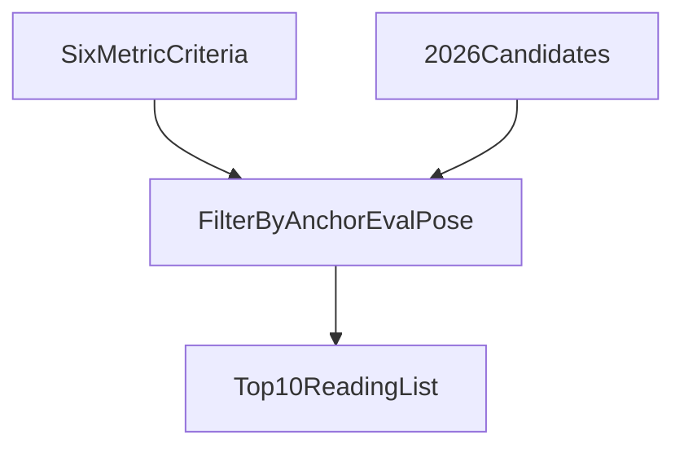
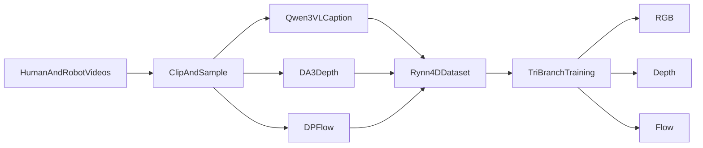
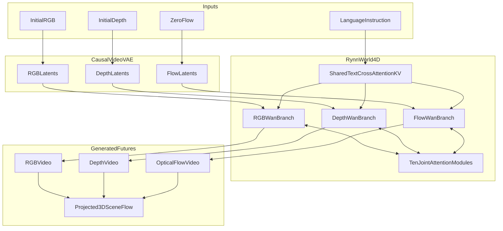
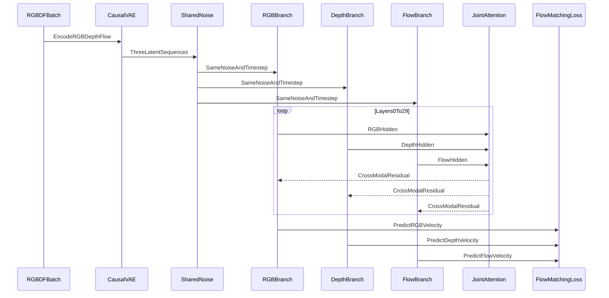
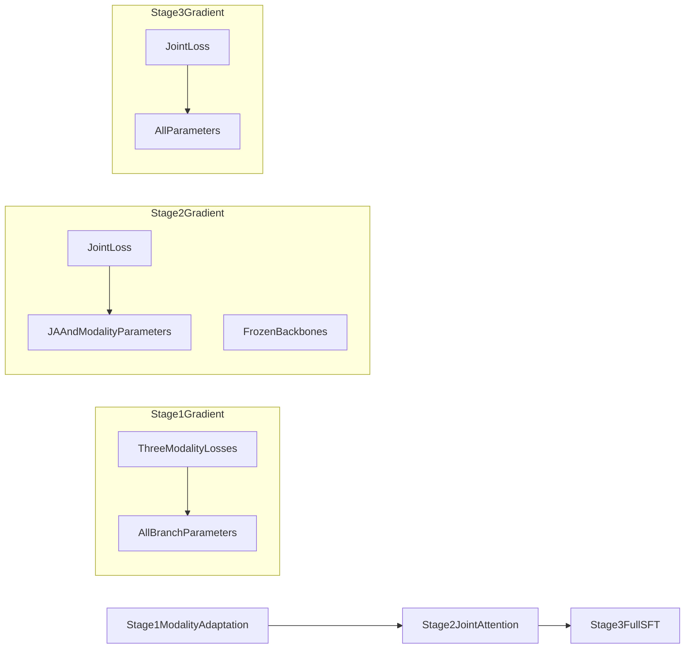
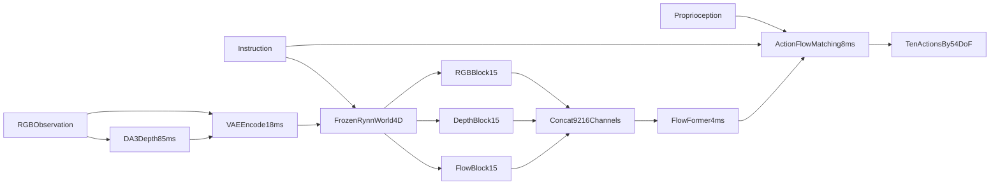
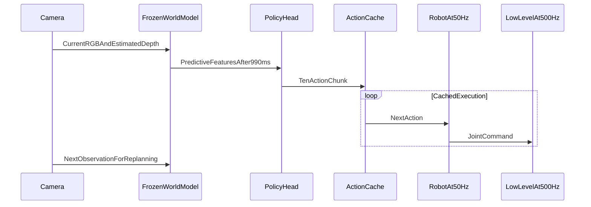
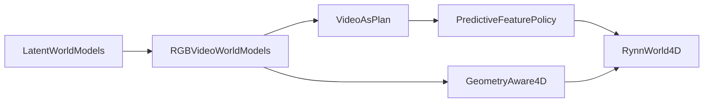

# RynnWorld-4D：面向机器人操作的 4D 具身世界模型深度分析

> 论文：**RynnWorld-4D: 4D Embodied World Models for Robotic Manipulation**  
> arXiv：[2607.06559](https://arxiv.org/abs/2607.06559)，v1 提交于 2026-07-07  
> 官方项目：[Project Page](https://alibaba-damo-academy.github.io/RynnWorld-4D.github.io/)  
> 官方代码：[alibaba-damo-academy/RynnWorld-4D](https://github.com/alibaba-damo-academy/RynnWorld-4D)  
> Hugging Face：[RynnWorld Collection](https://huggingface.co/collections/Alibaba-DAMO-Academy/rynnworld) · [RynnWorld-4D 模型页](https://huggingface.co/Alibaba-DAMO-Academy/RynnWorld-4D)  
> ModelScope：[RynnWorld-4D](https://www.modelscope.cn/models/DAMO_Academy/RynnWorld-4D)  
> 本地论文源：[`t/paper.tex`](t/paper.tex)、[`t/Sec/`](t/Sec/)  
> 核验截止：**2026-07-24**

---

## 0. 执行摘要

### 0.1 它究竟解决什么问题

RynnWorld-4D 试图弥合两个长期分离的空间：

1. 视频生成模型擅长预测“接下来画面会长什么样”，但输出通常只是 RGB 像素；
2. 机器人策略需要的是带尺度、方向和运动信息的低层动作，尤其是双臂灵巧手的 54 维关节动作。

论文的核心假设是：同步的 **RGB、Depth、Optical Flow（RGB-DF）** 比 RGB 视频更接近机器人动作所依赖的 4D 动力学。模型先学习联合预测三种视频，再冻结世界模型，从其中间层读取“未来预测特征”，经 Flow Former 和动作 Flow Matching 头输出动作块。

### 0.2 最准确的学术定位

RynnWorld-4D 更准确地说是：

> **基于 Wan2.2 视频扩散先验的、单视角 projective 4D 预测模型，加上 VPP 风格的单步预测特征动作读取器。**

这里有三个必须强调的边界：

- 它的“4D”是当前视角可见表面的 RGB、深度和帧间对应，可反投影为随时间变化的点云轨迹；它不是包含遮挡面、完整物体拓扑和全局坐标的完整 4D 场景。
- 它以“初始 RGB-D + 语言”为条件，不以候选机器人动作为条件。因此它不是标准的
  \[
 $$ p(o_{t+1}\mid o_t,a_t)$$
  \]
  式 action-conditioned forward dynamics model，也不能直接比较多个候选动作的反事实后果。
- RynnWorld-4D-Policy 不执行完整视频去噪后再求动作，而是在固定扩散时刻进行一次重型模型 forward，读取中间特征。这是其可用于控制的关键工程取舍。

### 0.3 核心贡献与证据强度

| 贡献 | 论文证据 | 本文判断 |
|---|---|---|
| RGB-DF projective 4D 表示 | 几何反投影公式、RGB/Depth/Flow 定性结果 | 思路合理，但对移动相机、遮挡与度量尺度处理不足（详见 §1.4–§1.5） |
| RGB/Depth/Flow 三分支 DiT | 结构、三阶段训练与多项消融 | 论文内部证据较强 |
| 254.4M 帧 Rynn4DDataset 1.0 | 数据来源与伪标注流程 | 规模大，但数据未公开，质量不可独立核验 |
| 预测特征驱动 54-DoF 策略 | 六个真机任务、每项 35 次 | 在作者平台上有效，但不是标准 benchmark |
| “SOTA”世界模型和策略 | 自建 50 序列和自建机器人任务 | 只能作窄范围结论，不能外推为通用 SOTA |
| 开源复现 | 世界模型代码和约 59.28 GB 权重 | 世界模型部分可复现；数据、Policy 权重、评测资产不完整 |

截至截止日论文仍是较新的 arXiv v1，尚无同行评审和独立复现。下文会严格区分“论文声称”“公开代码事实”和“分析推断”。

---

## 1. 从 2D 视频到 projective 4D

### 1.1 为什么 RGB 视频不够

RGB 视频给出外观和二维运动，但机器人操作还需要：

- 物体与末端执行器的相对深度；
- 接触点附近的局部几何；
- 双手之间的 3D 距离和遮挡关系；
- 动作后物体在三维空间中的位移方向。

普通视频模型可能生成视觉上合理、物理上却不一致的结果，例如物体尺度漂移、形状变化、手指穿透和接触后运动方向错误。论文因此没有直接构建体素、mesh 或 4DGS，而选择继续保留规则二维网格，在每个像素上增加 depth 与 flow。

### 1.2 RGB-DF 的三种信息

| 模态 | 主要信息 | 对机器人策略的作用 | 主要风险 |
|---|---|---|---|
| RGB | 纹理、语义、物体身份 | 识别对象与任务语义 | 缺尺度、受光照影响 |
| Depth | 当前可见表面到相机的距离 | 3D 距离、抓取高度、碰撞关系 | 单目伪深度尺度漂移 |
| Optical Flow | 像素从 \(t\) 到 \(t+1\) 的对应 | 运动方向、速度线索、接触结果 | 遮挡、出视野、相机自运动 |

三者共享像素网格，因此可以继续使用视频 VAE 和 DiT 的大规模生成先验。这是它相对显式体素或 4D Gaussian 表示的可扩展优势。

### 1.3 从 RGB-DF 到 3D scene flow

设像素齐次坐标为

\[
$\mathbf p_t=[u,v,1]^\top,$
\]

深度为 \($D_t(u,v)$\)，相机内参为 \($\mathbf K$\)。当前像素反投影到相机坐标：

\[
$\mathbf P_t=D_t(u,v)\mathbf K^{-1}\mathbf p_t.$
\]

若光流

\[
$\mathbf f_{\mathrm{opt}}=[\Delta u,\Delta v]^\top$
\]

把它对应到下一帧像素，则：

\[
$\mathbf P_{t+1}
=D_{t+1}(u+\Delta u,v+\Delta v)
\mathbf K^{-1}
\left(\mathbf p_t+[\Delta u,\Delta v,0]^\top\right).$
\]

逐点三维位移为：

\[
$\mathbf f_{\mathrm{3D}}=\mathbf P_{t+1}-\mathbf P_t.$
\]

论文还用深度梯度阈值过滤深度边界：

\[
$\|\nabla D\|>\tau,$
\]

减少前景/背景深度突变处的错误轨迹，并把结果投影到 BEV 可视化。来源：本地 [`t/Sec/3-method.tex`](t/Sec/3-method.tex) §3.2。

### 1.4 “metric scene flow”主张的边界

上述公式只有在若干隐含条件满足时才是严格的 metric scene flow：

1. 深度具有可信的度量尺度；
2. \(t\) 和 \(t+1\) 位于一致的相机坐标系，或已补偿相机位姿；
3. 光流对应没有被遮挡、出视野或非刚体变形破坏；
4. 相机内参 \($\mathbf K$\) 已知且正确。

论文的数据包含大量移动式第一人称视频，但公式中没有

\[
$\mathbf T_{t\rightarrow t+1}\in SE(3)$
\]

相机外参补偿。直接计算 \($\mathbf P_{t+1}-\mathbf P_t$\) 会把 egomotion 与物体运动混合。因此，“可以生成 projective 4D cues”是可靠表述，“恢复了独立于相机运动的真实物体 metric scene flow”则证据不足。

此外，训练深度被截断到 \([0,5]\) 米并量化为 8-bit 视频，评测又使用 median scaling。这个流程更适合学习相对结构，而不是证明高精度绝对尺度。

### 1.5 度量尺度：现状、筛选口径与 2026 SOTA 对标（10 篇）

**度量尺度（metric scale）** 指深度与三维位移是否落在真实物理单位（米）上，而不是“形状看起来对、整体可任意放大缩小”。本节先概括 RynnWorld-4D 的处理方式，再给出“处理足”的判据，并推荐 10 篇 2026 年（含 CVPR/3DV 2026 正式录用）在绝对尺度上更扎实的对标工作。核验截止与文首一致：**2026-07-24**。

#### 1.5.1 RynnWorld-4D 如何处理尺度，为何不足

| 环节 | 实际做法 | 对绝对尺度的含义 |
|---|---|---|
| 训练深度 | DA3 单目伪深度 → 截断 \([0,5]\) m → 8-bit 灰度 \($I=\lfloor d/5\times 255\rfloor$\) | 真值本就不干净；约 2 cm/级量化抹掉细尺度 |
| 几何公式 | \($\mathbf P=D\mathbf K^{-1}\mathbf p$\)，\($\mathbf f_{3D}=\mathbf P_{t+1}-\mathbf P_t$\) | 数学上可米制，但 \(D\) 漂则整体漂；无 \($\mathbf T_{t\to t+1}$\) |
| 评测 | AbsRel / \($\delta_1$\) 先做 median scaling | 表上主要量相对结构，不考绝对米制 |
| Policy | 读中间 4D 特征；部署侧仍可在线跑 DA3 | 真机成功不能证明世界模型输出了可信绝对尺度 |

因此：叙事中的 “metric scene flow” 强于证据；更准确的是 **相对几何 / projective 4D cues**。详见 §1.4。

**度量尺度（metric scale）** 指的是：深度/位移是不是真实物理单位（米、厘米），而不是“看起来远近对、但整体可任意放大缩小”。

---

##### 1. RynnWorld-4D 现在怎么处理尺度？

它没有单独的尺度估计模块，基本靠**深度这条管道**，而且很粗糙：

###### 训练侧（伪标签）

1. 用 **Depth Anything 3（DA3）** 估计单目深度（本身就不是传感器真值）。
2. 截断到 **\([0, 5]\) 米**。
3. 量化成 **8-bit 灰度视频**：
   $$I=\left\lfloor\frac{d}{5}\times 255\right\rfloor$$
   → 大约 **1 级灰度 ≈ 2 cm**，更细的差异被抹掉。
4. 模型学的是这种**压缩后的深度视频**，再经视频 VAE/扩散，尺度信息还会再糊一层。

出处：[`t/Sec/3-method.tex`](d:/SRC/d/D4A/b/p/RynnWorld_4D_4D_Embodied_World_Models_for_Robotic_Manipulation/t/Sec/3-method.tex)

###### 评测侧（故意“对齐尺度”）

附录写得很清楚：深度指标是 **scale-invariant**，先做 median scaling：

\[
$s=\frac{\mathrm{median}(d^*)}{\mathrm{median}(\hat d)}$
\]

再算 AbsRel / \($\delta_1$\)。也就是说：**先允许整体尺度随便漂，对齐后再比形状**。

出处：[`t/Sec/Appendix.tex`](d:/SRC/d/D4A/b/p/RynnWorld_4D_4D_Embodied_World_Models_for_Robotic_Manipulation/t/Sec/Appendix.tex)

###### 几何公式侧

反投影 \($\mathbf P=D\cdot\mathbf K^{-1}\mathbf p$\) 在数学上是 metric 的，但：

- \(D\) 若尺度漂了，\($\mathbf P$\) 和 \($\mathbf f_{3D}$\) 一起漂；
- 没有相机外参补偿时，相机自运动还会混进“物体位移”。

###### 机器人侧

Policy **不直接用** 反投影出来的绝对米制点云做控制，而是读 world model 中间特征再出关节动作；部署时深度还靠 **DA3 在线估**。所以真机成功**不能**证明世界模型输出了准确的绝对尺度。

---

##### 2. 为什么说“处理不足”？

| 问题 | 含义 |
|---|---|
| 训练是伪深度 + 截断 + 8-bit | 绝对尺度本来就不干净 |
| 评测用 median scaling | 表上的 AbsRel/δ₁ **不考绝对尺度** |
| 却说 “metric scene flow” | 表述强于证据 |
| 没有尺度校准/约束 | 没有传感器深度监督、没有已知物体尺寸锚定、没有跨帧尺度一致性损失 |
| 5 m 截断 | 更远场景直接饱和，尺度语义失真 |

一句话：它学的是**相对几何结构**；评测也主要量**结构**；但叙事里用了 **metric**，所以叫“处理不足”。

---

##### 3. “处理足了”应该是怎样？

至少满足下面几条里的多数：

1. **真值来源是 metric**  
   RealSense/Lidar/立体匹配等标定深度，而不是（或不仅是）单目伪深度。

2. **监督与表示保尺度**  
   用 float 深度（米），不要压成 8-bit 视频；或至少用更高精度编码 + 反量化。

3. **评测分两套**  
   - 相对：median/scale-invariant（像现在）  
   - 绝对：不加 median scaling 的 AbsRel、RMSE（米）、scene flow EPE（米）

4. **尺度锚定**  
   首帧用传感器深度锁定；或已知物体尺寸/机械臂标定约束整体尺度。

5. **跨帧尺度一致**  
   同一物体深度不能帧间无故漂移；最好有 pose + scale consistency。

6. **相机运动拆开**  
   有 egomotion 时，scene flow 要补偿 \($\mathbf T_{t\to t+1}$\)，否则“物体位移”不是纯物体。

做到这些，才有资格说：**输出的是可信的绝对尺度 3D 运动**。

---

##### 4. RynnWorld-4D 还可以怎么改？

按优先级：

1. **数据**：桌面操作子集用 RealSense 真深度替换/混合 DA3；保留 float32，别只存 8-bit MP4。  
2. **表示**：depth/flow 用更高精度通道，或 float latent，而不是色轮/灰度视频。  
3. **损失**：加绝对尺度损失（有真深度时）+ 跨帧尺度一致性；首帧传感器深度作 hard condition。  
4. **评测**：报告 **有/无 median scaling** 两套深度指标；scene flow 用米制 EPE，别只用色轮 RGB 距离。  
5. **几何**：加入相机位姿（VO/SLAM/IMU），补偿 egomotion 后再算 \(\mathbf f_{3D}\)。  
6. **策略接口**：若要闭环抓取距离，显式解码 metric depth/point，而不是只吃模糊中间特征。

---

**一句话**：  
RynnWorld-4D 用“DA3 伪深度 → 0–5 m 截断 → 8-bit 视频 → 扩散”管尺度，评测还先做 median scaling，所以它擅长**相对 3D 结构**，不足以支撑强 **metric** 主张；要做足，就得上真深度、保精度表示、绝对尺度评测与跨帧/相机运动校准。

#### 1.5.2 “度量尺度处理足”的筛选口径

对照上述缺口，入选论文须满足下列多数条件，而不是标题里写了 metric：

1. **表示**：显式米制几何（metric depth / pointmap / scene flow / global scale factor），不是仅相对深度或 8-bit 色图。
2. **锚定**：有可复述的尺度来源（传感器 RGB-D、立体基线、地理标注、IMU/轮速里程计、专用 scale head、绝对世界布局等）。
3. **评测**：不只靠 median scaling 后的 AbsRel；至少还报告绝对误差、米制 EPE、位姿 ATE(m)、地标真实尺寸，或明确声明无需后处理尺度对齐。
4. **时序/相机**：建模外参或 egomotion，避免把相机运动误当成物体位移。
5. **时间窗**：优先 CVPR/3DV 2026 正式录用，或 arXiv 2026；晚 2025 预印但已确认为 2026 会议正式论文者可入选。
6. **相关性**：能直接指导 RynnWorld-4D 改良（伪深度→真度量、移动相机、绝对评测、机器人锚定）。

检索源包括 arXiv HTML、CVPR 2026 Open Access、项目页、worldbench survey 等；关键词组合含 `metric-scale 4D`、`absolute scale`、`metric depth`、`scale-collapse`、`without post-hoc scale`、`odometry-anchored`。

刻意排除：RynnWorld-4D 自身；仅叙事称 metric、训练/评测仍全靠 median scaling 且无锚定机制的方法；2025 早期且无 2026 正式升级的旧文（如 Depth Pro、DiST-4D 仅作背景）。

诚实边界：即便强方法，部分 benchmark 仍沿用 median-scaling 作对齐协议（如 Any4D 的部分 tracking 表）。入选依据是 **架构/监督/锚定是否按绝对尺度设计**，不是“评测表从不做对齐”。



#### 1.5.3 推荐 Top 10（按对 RynnWorld 改良优先级）

开源核验截止与文首一致：**2026-07-24**。开源程度口径：

| 等级 | 含义 |
|---|---|
| 高 | 推理 + 权重 + 训练/评测管线基本齐备，可独立复现核心实验 |
| 中 | 有可用推理与部分权重，训练或完整 teacher/数据链仍缺 |
| 低 | 仅有空仓库/占位 README，或官方写明 Code Soon |

1. **Any4D — Unified Feed-Forward Metric 4D Reconstruction**  
   [arXiv:2512.10935](https://arxiv.org/abs/2512.10935) · CVPR 2026 · [项目页](https://any-4d.github.io/) · [GitHub](https://github.com/Any-4D/Any4D) · [HF checkpoint](https://huggingface.co/airlabshare/any4d-checkpoint) · [HF Demo](https://huggingface.co/spaces/theairlabcmu/Any4D)  
   **为何算处理足**：dense metric-scale 4D；深度/内参（egocentric）与位姿/scene flow（allocentric）因子化；可选 RGB-D、IMU、Radar Doppler 锚定。  
   **对 RynnWorld 的启示**：用因子化 4D + 可选传感器输入，替代“DA3→0–5 m→8-bit→光流反投影却忽略外参”。  
   **开源程度：中**。已有推理代码、预训练权重与 Demo；README 写明完整训练代码与更强 checkpoint “will be released soon”，复现训练链尚不完整。

2. **MapAnything — Universal Feed-Forward Metric 3D Reconstruction**  
   [arXiv:2509.13414](https://arxiv.org/abs/2509.13414) · 3DV 2026 · [项目页](https://map-anything.github.io/) · [GitHub](https://github.com/facebookresearch/map-anything) · [HF](https://huggingface.co/facebook/map-anything)  
   **为何算处理足**：显式 **metric scale factor**，把局部重建升到全局米制坐标系；深度/raymap/位姿与尺度统一监督。  
   **对 RynnWorld 的启示**：世界模型应有独立、可监督的全局尺度变量，而不是把尺度埋进 8-bit 深度灰度。  
   **开源程度：高（本清单最完整）**。代码 Apache 2.0；含数据处理、训练、推理、benchmark；HF 权重分 **CC-BY-NC** 与 **Apache 2.0** 两套变体（`facebook/map-anything` / `facebook/map-anything-apache`），商用需选 Apache 权重。

3. **AMB3R — Accurate Feed-forward Metric-scale 3D Reconstruction with Backend**  
   [arXiv:2511.20343](https://arxiv.org/abs/2511.20343) · CVPR 2026 Highlight · [项目页](https://hengyiwang.github.io/projects/amber) · [GitHub](https://github.com/HengyiWang/amb3r)  
   **为何算处理足**：VGGT 前端 + lightweight metric-scale head + 稀疏体素 backend；报告 metric-scale estimation SOTA；可扩展到 VO/SfM 且无需测试时优化。  
   **对 RynnWorld 的启示**：伪深度骨干之上至少加可训练尺度头与 3D 紧凑后端，并单独考核绝对尺度。  
   **开源程度：高**。已释出 Base 模型、AMB3R-VO、AMB3R-SfM、Benchmark、训练文档与 Google Drive checkpoint；依赖较重（PyTorch3D、flash-attn 等），但论文声称的核心资产基本齐。

4. **WorldReel — 4D Video Generation with Consistent Geometry and Motion Modeling**  
   [arXiv:2512.07821](https://arxiv.org/abs/2512.07821) · CVPR 2026 · [项目页](https://bshfang.github.io/worldreel/) · [GitHub](https://github.com/bshfang/WorldReel)  
   **为何算处理足**：生成侧同时输出 RGB + pointmaps + camera trajectory + dense flow；合成数据提供精确 4D 监督；评测含深度与 ATE/RTE/RRE。  
   **对 RynnWorld 的启示**：最接近生成式世界模型路线，但显式解耦相机轨迹与场景运动——正是 projective RGB-DF 缺的一环。  
   **开源程度：低**。官方仓库存在，但 Training / Inference / Checkpoints 三项均未勾选，实质为占位 README，“coming soon”。

5. **FoundationGeo — Learning Spatial Pixel-Wise Fields for Monocular Metric Geometry**  
   [arXiv:2607.11588](https://arxiv.org/abs/2607.11588)（ECCV 2026） · [项目页](https://mx-liu6.github.io/FoundationGeo-web/) · [GitHub](https://github.com/mx-liu6/FoundationGeo) · [HF](https://huggingface.co/mxliu-hku/FoundationGeo-1.1)  
   **为何算处理足**：可学习 **pixel-wise scale field** \(\hat{\mathbf{S}}\) 将仿射不变几何校准到米制；诊断相对→绝对的剩余 gap。  
   **对 RynnWorld 的启示**：尺度往往不是一个全局标量；桌面操作也可用空间变化的尺度校准场。  
   **开源程度：高**。MIT 许可；Stage-I/II 权重、训练脚本、评测管线已发布；TODO 中仅 “full model zoo” 未完成。训练数据需自备到 `data/train` 约定格式。

6. **UniDAC — Universal Metric Depth Estimation for Any Camera**  
   [arXiv:2603.27105](https://arxiv.org/abs/2603.27105) · [CVPR 2026 PDF](https://openaccess.thecvf.com/content/CVPR2026/papers/Ganesan_UniDAC_Universal_Metric_Depth_Estimation_for_Any_Camera_CVPR_2026_paper.pdf) · [项目页](https://girish1511.github.io/UniDAC/) · [GitHub](https://github.com/girish1511/UniDAC)  
   **为何算处理足**：相对深度 + Depth-Guided Scale Estimation（高分辨率尺度图）；消融对比 no scaling / median scaling / depth-guided scaling；跨相机统一 metric。  
   **对 RynnWorld 的启示**：评测应报告无对齐误差；表示上用尺度图而非 8-bit 深度视频。  
   **开源程度：高**。README 已勾选：checkpoint、zero-shot 评测、数据准备、训练代码、Demo（含未知相机参数经 AnyCalib）。属本清单中 metric depth 侧最易落地之一。

7. **MetricAnything — Scaling Metric Depth Pretraining with Noisy Heterogeneous Sources**  
   [arXiv:2601.22054](https://arxiv.org/abs/2601.22054) · ECCV 2026 · [项目页](https://metric-anything.github.io/metric-anything-io/) · [GitHub](https://github.com/metric-anything/metric-anything) · [Student DepthMap](https://huggingface.co/yjh001/metricanything_student_depthmap) · [Student PointMap](https://huggingface.co/yjh001/metricanything_student_pointmap)  
   **为何算处理足**：专门研究噪声异构真值上的 metric depth 可扩展预训练，证明 metric 轨迹存在清晰 scaling law。  
   **对 RynnWorld 的启示**：Rynn4DDataset 若继续用伪深度，应走抗噪 metric 预训练，而不是直接当真值。  
   **开源程度：中**。两个 prompt-free student 权重与推理脚本可用，并有 HF Spaces Demo；teacher（Sparse Metric Prompt）权重与完整预训练代码仍标 TBD/Coming Soon；~20M 训练数据未随仓库完整放出。

8. **Honey, I Shrunk the Arc de Triomphe!（MetricScenes / WildMoGe）**  
   [arXiv:2606.02379](https://arxiv.org/abs/2606.02379) · [项目页](https://metricscenes.github.io/) · [GitHub](https://github.com/MetricScenes/MetricScenes) · [HF Dataset](https://huggingface.co/datasets/yx642/MetricScenes) · [WildMoGe 权重](https://huggingface.co/yx642/WildMoGe)  
   **为何算处理足**：用 geo-tag 与立体基线恢复绝对尺度；正面攻击 scale-collapse；用地标真实尺寸做可解释验证。  
   **对 RynnWorld 的启示**：绝对尺度要用物理锚点验；仅靠室内短距伪深度会系统偏差。  
   **开源程度：中–高（数据侧强）**。数据集 CC BY 4.0（源图像保留原许可）；仓库含 Poisson depth completion 与 georegistration 管线；WildMoGe 权重已发，推理/评测指引依赖上游 [MoGe](https://github.com/microsoft/MoGe)，仓库本身不是完整端到端训练框架。

9. **GuidedSceneGen — Scene Generation at Absolute Scale**  
   [arXiv:2603.13910](https://arxiv.org/abs/2603.13910) · [项目页](https://d3ixi.github.io/GuidedSceneGen/) · [GitHub](https://github.com/d3ixi/GuidedSceneGen)  
   **为何算处理足**：生成全程保持 absolute world coordinate frame；布局代理 + metric depth 对齐损失约束相机尺度。  
   **对 RynnWorld 的启示**：生成式管线也应从第一帧起锁死绝对坐标系。  
   **开源程度：低**。仓库仅有引用与项目页链接，无代码、权重或数据脚本。

10. **PRISM-SLAM — Probabilistic Ray-Grounded Inference for Scale-aware Metric SLAM**  
    [arXiv:2605.19257](https://arxiv.org/abs/2605.19257) · [项目页](https://prismslam-cmd.github.io/prismslam_pr/)  
    **为何算处理足**：VFM 深度先验进入贝叶斯因子图；声称无需 post-hoc scale correction，metric SE(3) ATE 接近 oracle-aligned Sim(3)。  
    **对 RynnWorld 的启示**：Policy/闭环若要米制可操作，需要运行时尺度可辨识锚定，不能只吃模糊 4D latent。  
    **开源程度：低（尚无公开 GitHub）**。项目页按钮为 “Code Soon”；截至核验日未发现可用官方代码仓。

**开源速览表**

| # | 方法 | GitHub | 开源程度 | 已公开 | 仍缺 |
|---|---|---|---|---|---|
| 1 | Any4D | [Any-4D/Any4D](https://github.com/Any-4D/Any4D) | 中 | 推理、权重、Demo | 完整训练、更强 ckpt |
| 2 | MapAnything | [facebookresearch/map-anything](https://github.com/facebookresearch/map-anything) | 高 | 训练/推理/数据/双许可权重 | — |
| 3 | AMB3R | [HengyiWang/amb3r](https://github.com/HengyiWang/amb3r) | 高 | Base+VO+SfM+训练+评测+权重 | 更多前端骨干适配 |
| 4 | WorldReel | [bshfang/WorldReel](https://github.com/bshfang/WorldReel) | 低 | 占位 README | 训练/推理/权重 |
| 5 | FoundationGeo | [mx-liu6/FoundationGeo](https://github.com/mx-liu6/FoundationGeo) | 高 | Stage-I/II 权重、训练、评测 | full model zoo；训练数据自备 |
| 6 | UniDAC | [girish1511/UniDAC](https://github.com/girish1511/UniDAC) | 高 | 训练、Demo、ckpt、评测 | — |
| 7 | MetricAnything | [metric-anything/metric-anything](https://github.com/metric-anything/metric-anything) | 中 | student 权重+推理+Demo | teacher、完整预训练数据/代码 |
| 8 | MetricScenes | [MetricScenes/MetricScenes](https://github.com/MetricScenes/MetricScenes) | 中–高 | 数据集、补全/配准脚本、WildMoGe 权重 | 独立端到端训练框架 |
| 9 | GuidedSceneGen | [d3ixi/GuidedSceneGen](https://github.com/d3ixi/GuidedSceneGen) | 低 | 空仓占位 | 代码/权重/数据 |
| 10 | PRISM-SLAM | 无 | 低 | 仅项目页/论文 | 全部实现资产 |

若只挑“现在就能跑、且与度量尺度强相关”的优先克隆：**MapAnything、AMB3R、UniDAC、FoundationGeo**；数据侧优先看 **MetricScenes**；生成式对标暂只能读 **WorldReel / GuidedSceneGen** 论文。

#### 1.5.4 与 RynnWorld-4D 缺口的对照

| RynnWorld 缺口 | 优先对标论文 |
|---|---|
| 无显式全局尺度变量 | MapAnything, AMB3R, FoundationGeo, UniDAC |
| 伪深度 + 8-bit + median 评测 | MetricAnything, MetricScenes, UniDAC |
| 忽略相机外参 / 自运动 | Any4D, WorldReel, PRISM-SLAM |
| 生成式却要 metric scene flow | Any4D, WorldReel, GuidedSceneGen |

#### 1.5.5 对 RynnWorld-4D 的改良优先级（由本节导出）

1. 桌面操作子集引入传感器真深度或立体/里程计锚定；深度用 float 表示，避免仅存 8-bit 视频。  
2. 增加可监督的全局尺度变量或尺度图（对标 MapAnything / UniDAC / FoundationGeo）。  
3. 评测同时报告 **有/无 median scaling** 的深度误差，以及米制 scene flow EPE。  
4. 生成与反投影路径显式建模相机轨迹（对标 WorldReel / Any4D）。  
5. Policy 侧若依赖距离，增加运行时尺度可辨识锚定（对标 PRISM-SLAM），而非仅读中间特征。

---

## 2. 输入、输出与数据格式

### 2.1 世界模型

| 项目 | 训练/生成规格 |
|---|---|
| 条件输入 | 初始 RGB-D 帧 + 文本任务描述 |
| Flow 初始帧 | zero-flow frame |
| 输出 | 同步 RGB、Depth、Optical Flow 视频 |
| 论文训练像素序列 | \(81\times480\times640\) |
| VAE 时间压缩 | \(4\times\) causal compression |
| Latent 时间长度 | \(T=(81-1)/4+1=21\) |
| 每模态 latent | \(\mathbf z_t^m\in\mathbb R^{T\times C\times H\times W}\) |
| 主干 | Wan2.2-TI2V-5B，30 层 DiT |
| Hidden / FFN | \(d=3072\) / 14336 |

第一帧是 I2V 的干净条件 latent，不参与未来帧损失；监督只覆盖 `[1:]`。

### 2.2 Policy

| 项目 | 规格 |
|---|---|
| 运行时视觉输入 | 单 RGB 帧；DA3 在线估深 |
| 世界模型读取点 | diffusion timestep \(t=500\)，block 15 |
| 读取方式 | 单次 forward，不做完整视频去噪 |
| 三分支特征 | 每支 3072 维，channel concat 后 9216 维 |
| 其他条件 | 文本 embedding \(l_{\mathrm{emb}}\)、proprioception \(p_0\) |
| 动作维数 | 54：双臂 \(2\times7\) + 双手 \(2\times20\) |
| Action chunk | 10 个动作 |
| 动作采样 | Flow Matching，4-step Euler ODE |

论文一处写 Policy 条件为当前 RGB-D，实验实现又写“单 RGB observation”，延迟表包含 DA3 depth estimation。合理解释是：部署只直接采集 RGB，再在线估计 depth，随后按 RGB-D 条件进入模型。

---

## 3. Rynn4DDataset 1.0

### 3.1 数据组成

论文报告总规模超过 **254.4M 帧**：

- 人类第一人称：[EPIC-KITCHENS](https://epic-kitchens.github.io/)、EgoVid；
- 机器人操作：RoboMIND、RDT-1B、Galaxea、RoboCoin、AgiBot。

这些数据同时提供广泛的人类交互先验与机器人执行轨迹，但不是天然带齐 RGB、metric depth、flow 和精细文本的 4D 真值数据，因此作者构造了大规模伪标注流水线。

### 3.2 Caption 生成

1. 视频以 1 FPS 采样；
2. 切分为 5 秒片段；
3. Qwen3-VL 描述主体动作、背景、对象交互与场景上下文；
4. 最大输出 512 tokens，temperature 0.7；
5. 结果保存为 JSON。

这套 prompt 强调完整场景描述，而非结构化机器人 action。它适合提供语义条件，但也可能生成事实错误或把不可见意图写入描述。

### 3.3 Optical Flow 伪标注

- 使用 DPFlow；
- 原生分辨率处理相邻帧；
- 用 Middlebury 色轮编码；
- 保存为 25 FPS MP4。

需要注意：模型实际学习的是经过色轮编码和视频压缩后的 flow visualization，而不一定是原始 float32 \((u,v)\) 场。附录又在归一化 RGB 色彩图空间计算所谓 AEPE。这和标准光流 benchmark 的像素端点误差不是同一量纲。

### 3.4 Depth 伪标注

- 使用 Depth Anything 3 的 `DA3NESTED-GIANT-LARGE-1.1`；
- 30 FPS；
- 处理短边 392；
- 双线性上采样回原分辨率；
- 截断到 \([0,5]\) 米；
- 量化为：

$$I=\left\lfloor\frac d{d_{\max}}\times255\right\rfloor.$$

量化后约 1 个灰度级对应 \($5/255\approx1.96$\) cm；再叠加单目深度估计误差和视频编码误差，它更适合作为结构正则，而非精密几何真值。

### 3.5 数据风险



风险主要有：

- **教师偏差闭环**：模型可能主要学会复制 DA3/DPFlow 的偏差；
- **跨数据源偏差**：不同帧率、相机、动作分布和视频压缩方式不一致；
- **同源测试偏乐观**：50 条世界模型测试视频来自 RoboMIND/RDT-1B/Galaxea，与训练来源重合；
- **不可审计**：截至 2026-07-24，Rynn4DDataset 1.0 未公开；[GitHub Issue #1](https://github.com/alibaba-damo-academy/RynnWorld-4D/issues/1) 中维护者表示仍在内部讨论发布方式。

---

## 4. 静态架构

### 4.1 组件关系



### 4.2 为什么三分支而非通道拼接

RGB、Depth、Flow 的统计分布差异很大：

- RGB 关注颜色、纹理和语义；
- Depth 关注平滑表面与边界不连续；
- Flow 关注方向、速度和运动边界。

如果简单共用 FFN，三种模态会争夺同一非线性表征空间。论文的 shared FFN 消融出现全面下降，支持“保留独立模态容量，再有限交互”的设计。

Depth 和 Flow 分支从 Wan RGB 组件复制初始化，包括 patch embedding、self-attention、normalization 和 FFN。这不是从零训练几何模型，而是先复用视频时空先验，再通过 Modality Adaptation 迁移分布。

### 4.3 Joint Cross-Modal Attention

每 3 个 block 插入一次 JA，位置为

\[
$0,3,6,\ldots,27$,
\]

共 10 个。对于模态

\[
$m\in\{\mathrm{rgb},\mathrm{depth},\mathrm{flow}\},$
\]

先加入零初始化 modality embedding 并归一化：

\[
$\tilde{\mathbf z}_l^m
=\operatorname{LN}^m(\mathbf z_l^m+\mathbf e^m).$
\]

每支生成一套 Q/K/V：

\[
$\mathbf Q_l^m
=\operatorname{RMSNorm}_q(\operatorname{QProj}_l^m(\tilde{\mathbf z}_l^m)),$
\]

\[
$[\mathbf K_l^m,\mathbf V_l^m]
=\operatorname{KVProj}_l^m(\tilde{\mathbf z}_l^m).$
\]

模态 \(m\) 的 query 只读取另外两种模态：

\[
$\mathbf K_l^{\mathrm{cross}}
=\operatorname{concat}\{\mathbf K_l^j\}_{j\ne m},
\quad
\mathbf V_l^{\mathrm{cross}}
=\operatorname{concat}\{\mathbf V_l^j\}_{j\ne m}.$
\]

这种 K/V 复用使参数量从作者估算的 \(18d^2\) 降到 \(12d^2\)。

### 4.4 Frame-wise 3D RoPE 到底是什么

token 从

\[
$[B,T\cdot S,d]$
\]

reshape 为

\[
$[B\cdot T,S,d],$
\]

意味着 JA 只在同一时间帧内做跨模态空间注意力。所谓“3D RoPE”编码的是视频 token 的 \((t,h,w)\)，不是物理坐标 \((X,Y,Z)\)。由于同帧 JA 中 \(\Delta t=0\)，实际提供区分力的主要是空间相位。

它能帮助 RGB、Depth、Flow 在同一空间位置附近对齐，但：

- 没有相机内参；
- 没有极线或硬投影约束；
- 仍允许全帧 token 互相注意，而非强制同像素匹配。

因此它是空间位置偏置，不是严格 3D 几何层。

### 4.5 Zero-init 与 gate

残差写为：

\[
$\hat{\mathbf z}_l^m
=\mathbf z_l^m
+\tanh(g_l^m)\operatorname{OutProj}_l^m(\mathbf A_l^m).$
\]

其中 OutProj 零初始化，\(g_l^m=1\)。初始时联合路径输出为零，所以不会突然破坏 Stage 1 的独立分支；同时 \(\tanh(1)\neq0\)，避免 gate 与输出同时为零导致联合路径梯度“死锁”。

---

## 5. 动态架构：世界模型训练与推理

### 5.1 Flow Matching

每个模态沿直线路径加噪：

\[
\mathbf z_t^m=(1-t)\mathbf z_0^m+t\boldsymbol\epsilon^m.
\]

目标速度是：

\[
\boldsymbol\epsilon^m-\mathbf z_0^m.
\]

总损失：

\[
\mathcal L_{\mathrm{total}}
=\sum_m\lambda_m
\mathbb E\left[
\left\|
\mathbf v_\theta^m(\mathbf z_t^m,t,\mathbf c)_{[1:]}
-(\boldsymbol\epsilon^m-\mathbf z_0^m)_{[1:]}
\right\|_2^2
\right].
\]

三模态共享同一个 Gaussian noise：

\[
\boldsymbol\epsilon^{rgb}
=\boldsymbol\epsilon^{depth}
=\boldsymbol\epsilon^{flow}.
\]

这会让三条 denoising trajectory 在时间上同步，降低随机噪声差异造成的模态错位。

### 5.2 Forward 数据流



### 5.3 三阶段训练与梯度流

| 阶段 | Fusion | 可训练参数 | 冻结参数 | LR | Flow 权重 | Branch Dropout |
|---|---|---|---|---:|---:|---:|
| Stage 1 Modality Adaptation | 无 | 三个完整分支 | 无 | \($2\times10^{-5}$\) | 0.5 | 无 |
| Stage 2 Joint Attention | JA | JA projection、RMSNorm、modality LN、gate、embedding | 三分支 backbone/SA/FFN | \($5\times10^{-5}$\) | 1.0 | 0.2 |
| Stage 3 Full SFT | JA | 全部参数 | 无 | \($1\times10^{-5}$\) | 1.0 | 0.1 |



通用训练配置：

- AdamW，\(\beta_1=0.9,\beta_2=0.95\)，weight decay \(10^{-4}\)；
- cosine scheduler + linear warmup；
- 每阶段仅加载上一阶段 model weights，optimizer/scheduler 重置；
- EMA 0.9999，shadow weights 放 CPU；
- bf16、gradient checkpointing；
- Stage 2/3 使用 DeepSpeed ZeRO-2 + optimizer offload；
- per-GPU batch 1，gradient accumulation 2–4。

论文未公开每阶段训练步数/epoch、GPU 数量和总算力，因此无法估计完整训练成本。

### 5.4 Branch Dropout

Stage 2/3 以 \($p_{\mathrm{drop}}$\) 随机选 Depth 或 Flow，把其未来 `[1:]` noisy latent 替换成纯噪声，迫使 JA 从其他模态恢复。RGB 永不 drop，因为它是 appearance anchor。

它类似跨模态 masked modeling，但不是直接丢弃 branch，而是给出统计上看似有效、内容上无信息的 latent，训练模型识别并修复损坏模态。

---

## 6. RynnWorld-4D-Policy

### 6.1 结构



整个 RynnWorld-4D backbone 冻结，仅训练：

- Flow Former；
- action Flow Matching head。

优化器为 AdamW，LR \(10^{-4}\)，\(\beta=(0.9,0.9)\)，weight decay 0.05；2% warmup、8% hold、90% cosine decay，100 epochs。

### 6.2 Flow Former

三分支中间特征：

\[
$F_p\in\mathbb R^{B\times T\times3C\times H\times W}.$
\]

learnable query 在每个时间帧做空间 cross-attention：

\[
$$\mathbf Q_i'
=\operatorname{SpatCrossAttn}(\mathbf Q_i,F_p[i]),$$
\]

再跨时间做 self-attention：

\[
$$\mathbf Q''
=\operatorname{FFN}(\operatorname{TempSelfAttn}(\mathbf Q')).$$
\]

随后动作速度场：

\[
$v_\phi(\mathbf a_t,t\mid\mathbf Q'',l_{\mathrm{emb}},p_0)$
\]

经四步 Euler ODE 输出动作块。

### 6.3 它是不是 inverse dynamics

经典 inverse dynamics 通常从真实或完整预测的状态对 \($(s_t,s_{t+1})$\) 反推动作。RynnWorld-4D-Policy 读取的是固定噪声时刻的预测中间特征，并没有先解码出确定的 \($s_{t+1}$\)。因此更准确的说法是：

> 它是以预测式世界模型 latent 为条件的动作策略，而不是严格的显式 inverse-dynamics solver。

这并不削弱工程价值：中间 latent 比完整视频便宜，也可能携带尚未被解码器损失压缩的几何/运动信息。但它不能保证 latent 所“想象”的未来和最终动作因果一致。

### 6.4 闭环控制与“9 Hz”

论文延迟表：

| 阶段 | 延迟 | 比例 |
|---|---:|---:|
| DA3 depth | 85 ms | 7.7% |
| VAE 与 latent | 18 ms | 1.6% |
| RynnWorld-4D 单次 forward | 990 ms | 89.5% |
| reshape/concat | 1 ms | 0.1% |
| Flow Former | 4 ms | 0.4% |
| Action head | 8 ms | 0.7% |
| 总计 | **1106 ms** | 100% |



关键区别：

- **视觉规划频率**：
  \[
  1/1.106\approx0.9\ \mathrm{Hz}.
  \]
- **论文所谓有效控制频率**：每次给 10 个动作，按摊销得到约 \(9\) Hz。
- **命令接口**：缓存动作以 50 Hz 下发，低层接口 500 Hz。

因此不能把“9 Hz closed-loop”理解为每 111 ms 重新看一次图像并重规划。模型约每 1.1 秒刷新一次视觉世界状态，中间执行缓存动作。对快速接触或突发扰动，这仍是一段较长的开环窗口。

论文还有一处时间关系未完全解释：10 actions 若严格以 50 Hz 执行只覆盖 0.2 秒，而完整 forward 约 1.1 秒。公开文本没有清楚说明动作是否重复、插值或采用不同 policy step duration。

---

## 7. 世界模型实验

### 7.1 评测设置

- 50 条 held-out 视频；
- 来源：RoboMIND、RDT-1B、Galaxea；
- 与训练数据源同域；
- 无多随机种子和置信区间。

指标：

- RGB：IQ、MS、SC、Subj.、SSIM、PSNR、LPIPS；
- Depth：AbsRel、\(\delta_1\)；
- Flow：AEPE。

### 7.2 主结果

| 方法 | IQ↑ | MS↑ | SC↑ | Subj.↑ | SSIM↑ | PSNR↑ | LPIPS↓ | AbsRel↓ | \(\delta_1\)↑ | AEPE↓ |
|---|---:|---:|---:|---:|---:|---:|---:|---:|---:|---:|
| CogVideoX | 0.604 | 0.976 | 0.866 | 0.917 | 0.534 | 12.17 | 0.577 | N/A | N/A | N/A |
| Wan2.2-TI2V-5B | 0.555 | 0.970 | 0.886 | 0.909 | 0.593 | 14.54 | 0.489 | N/A | N/A | N/A |
| Wan2.1-I2V-14B | **0.684** | 0.988 | 0.891 | 0.956 | 0.536 | 12.72 | 0.568 | N/A | N/A | N/A |
| Free4D | 0.354 | 0.993 | 0.787 | 0.848 | 0.492 | 12.40 | 0.597 | 0.804 | 0.179 | N/A |
| TesserAct | 0.608 | 0.992 | 0.904 | 0.956 | 0.693 | 16.91 | 0.335 | 0.699 | 0.279 | N/A |
| 4DNeX | **0.637** | 0.994 | 0.917 | 0.986 | 0.649 | 14.47 | 0.404 | 0.423 | 0.327 | N/A |
| **RynnWorld-4D** | 0.635 | **0.995** | **0.957** | **0.992** | **0.754** | **17.85** | **0.269** | **0.310** | **0.610** | **0.170** |

### 7.3 应如何解读

积极结论：

- 结构一致性 SC、重建指标、depth 指标显著改善；
- \($\delta_1=0.610$\) 明显高于所列 4D 基线；
- 模型能原生同步输出 flow。

不能成立的强结论：

- 它不是所有指标第一：IQ 低于 Wan2.1，也略低于 4DNeX；
- Flow baseline 全部 N/A，所以 0.170 不是竞争性榜首，只是唯一能力展示；
- baseline 输入、输出、denoising steps、CFG、深度归一化方式不同；
- 50 条同域序列不足以支持通用 4D 世界模型 SOTA；
- depth/flow “GT”很可能来自同类伪标签流水线，指标更接近教师一致性。

### 7.4 指标陷阱

论文附录明确说明 AEPE 在 Middlebury 色轮编码后的 normalized RGB space 计算：

\[
$\mathrm{AEPE}_{color}
=\frac1{|\mathcal V|}
\sum_p
\|\hat{\mathbf c}_p-\mathbf c_p^*\|_2.$
\]

它不等同标准光流：

\[
$\mathrm{EPE}_{flow}
=\frac1{|\mathcal V|}
\sum_p
\sqrt{(\hat u_p-u_p^*)^2+(\hat v_p-v_p^*)^2}.$
\]

颜色编码会压缩幅度并引入周期性，MP4 还会加入压缩误差。因此该值不应和 Sintel/KITTI 等光流 benchmark 的 EPE 横向比较。

---

## 8. 世界模型消融

| 变体 | IQ↑ | SC↑ | PSNR↑ | LPIPS↓ | AbsRel↓ | \(\delta_1\)↑ | AEPE↓ |
|---|---:|---:|---:|---:|---:|---:|---:|
| 完整模型 | 0.635 | 0.957 | 17.85 | 0.269 | 0.310 | 0.610 | 0.170 |
| Independent Branches | 0.613 | 0.922 | 17.26 | 0.346 | 0.737 | 0.245 | 0.247 |
| w/o MA | 0.621 | 0.952 | 17.85 | 0.303 | 0.507 | 0.479 | 0.231 |
| w/o 4D Pre-training | 0.615 | 0.879 | 16.25 | 0.344 | 0.797 | 0.263 | 0.729 |
| w/o RoPE in JA | 0.628 | 0.935 | 17.10 | 0.295 | 0.420 | 0.450 | 0.210 |
| shared FFN | 0.618 | 0.902 | 16.50 | 0.320 | 0.580 | 0.380 | 0.280 |

### 8.1 最有效：大规模 4D 预训练

去掉 Rynn4DDataset 预训练后：

- AEPE：0.170 → 0.729；
- AbsRel：0.310 → 0.797；
- SC：0.957 → 0.879。

这是最大幅度退化，说明数据规模比单一结构技巧更关键。但消融没有说明“limited task-specific data”的精确规模，也没有等算力/等数据量对照，因此无法分离数据量、数据多样性和训练时长的贡献。

### 8.2 Joint Attention 对几何最关键

Independent Branches 的 AbsRel 从 0.310 恶化到 0.737，说明同步训练和跨模态交互显著改善深度。这个结果支持“Depth/Flow 对 RGB 具有正则作用”，但尚未证明输出满足严格几何约束。

### 8.3 Modality Adaptation 是必要 warm-up

跳过 Stage 1 后，\($\delta_1$\) 从 0.610 降到 0.479。复制 RGB 权重并不等于已学会 depth/flow 分布，先独立适配能避免联合训练初期的梯度干扰。

### 8.4 3D RoPE 有效但作用应谨慎命名

去掉 JA RoPE：

- \($\delta_1$\)：0.610 → 0.450；
- AEPE：0.170 → 0.210。

它证明 token positional bias 对同帧跨模态融合有效，但没有独立机器人成功率消融，也没有证明其编码真实 3D 坐标。

### 8.5 独立 FFN 的价值

shared FFN 全面变差，说明模态专用非线性容量重要。其代价是参数量和显存大幅增加；论文没有报告同参数量 MoE、adapter 或 low-rank specialization 对照。

---

## 9. 真实机器人实验

### 9.1 平台与数据

- 双 TIANJI M6：\(2\times7\) DoF；
- 双 WUJI HAND：\(2\times20\) DoF；
- 总动作维度 54；
- RealSense D435i 第一人称相机；
- HTC Vive + Pinocchio IK + Ruckig 采集双臂；
- Manus glove → 21 点 MediaPipe skeleton → 20-DoF 手部 retargeting；
- Policy 数据每任务 200 episodes，共 1200；
- 世界模型额外使用同任务 2400 episodes。

### 9.2 六项任务

1. Dual Picking；
2. Block Pushing；
3. Hand-over；
4. Bimanual Lifting；
5. Lid Placement；
6. Bowl Stacking。

每项 35 次连续试验，120 秒内完成算成功，并随机化物体 6-DoF pose。

### 9.3 成功率

| 方法 | Dual Pick | Block Push | Hand-over | Bimanual Lift | Lid Place | Bowl Stack | 六项均值 |
|---|---:|---:|---:|---:|---:|---:|---:|
| Diffusion Policy | 77.14 | 85.71 | 17.14 | 88.57 | 57.14 | 57.14 | 63.81 |
| \(\pi_0\) | 88.57 | 94.29 | 2.86 | 91.43 | 34.29 | 51.43 | 60.48 |
| \(\pi_{0.5}\) | 94.29 | **100.00** | 0.00 | 94.29 | 37.14 | 42.86 | 61.43 |
| **RynnWorld-4D-Policy** | **94.29** | 97.14 | **28.57** | **97.14** | **65.71** | **65.71** | **74.76** |

它在作者平台上的均值最高，尤其在 Hand-over、Lid Placement、Bowl Stacking 上领先。

### 9.4 统计边界

35 次试验意味着成功率步长是：

\[
1/35\approx2.86\%.
\]

65.71% 对 57.14% 实际是 23/35 对 20/35。二者 Wilson 95% 置信区间约为 49%–79% 与 41%–72%，高度重叠。论文没有显著性检验、多批随机种子或跨实验日稳定性。

### 9.5 公平性问题

- RynnWorld-4D 接触了同任务家族的额外 2400 世界模型 episodes；
- Policy 又使用 1200 action episodes；
- baseline 是否得到同样世界模型数据、微调预算和超参搜索没有充分说明；
- \(\pi_0/\pi_{0.5}\) 的原始机器人形态与 54-DoF Wuji Hand 不同；
- 未比较 ACT、VPP、EnerVerse-A、GR-2、OpenVLA 或 TesserAct policy。

所以应写成“在该统一硬件和作者实现下总体领先”，而不是“普遍优于 VLA foundation models”。

---

## 10. Policy 消融：真正起作用的是哪种模态

| 变体 | Dual Pick | Block Push | Hand-over | Bimanual Lift | Lid Place | Bowl Stack | 均值 |
|---|---:|---:|---:|---:|---:|---:|---:|
| 完整 RGB+Depth+Flow | 94.29 | 97.14 | 28.57 | 97.14 | 65.71 | 65.71 | 74.76 |
| w/o RynnWorld / ResNet-18 | 71.43 | 88.57 | 11.43 | 85.71 | 51.43 | 60.00 | 61.90 |
| RGB | 77.14 | 91.43 | 14.29 | 91.43 | 57.14 | 60.00 | 65.71 |
| RGB+Depth | 91.43 | 91.43 | **28.57** | **97.14** | 60.00 | 62.86 | 71.90 |
| RGB+Flow | 85.71 | 88.57 | 20.00 | 88.57 | 54.29 | 62.86 | 66.19 |

### 10.1 Predictive backbone 有价值，但对照不充分

完整模型比 ResNet-18 高约 12.86 个均值百分点。但两者同时改变：

- 参数规模；
- 视频预训练规模；
- 时序容量；
- RGB-D-Flow 多模态输入；
- 预测式噪声任务。

因此这个消融不能独立证明收益来自“正确世界动力学”。更强对照应包括：

- 同规模 RGB-only Wan；
- 随机初始化或打乱时间的三分支；
- 完整去噪结果 vs 单步中间特征；
- 不同 timestep/block；
- 相同参数量的非预测视频 encoder。

### 10.2 Depth 是最稳定的增益来源

RGB → RGB+Depth 的均值约增加 6.19 点，Hand-over 与 Bimanual Lifting 已达到完整模型水平。Depth 对空间精度和双臂相对位置的贡献较明确。

### 10.3 Flow 的独立贡献较弱

RGB+Flow 均值只比 RGB 高约 0.48 点，且在 Block Pushing、Bimanual Lifting、Lid Placement 上更低。完整模型比 RGB+Depth 均值再高约 2.86 点，但没有 RGB+Depth+随机 Flow 或 RGB+Depth 且等容量对照。

因此，“Flow 提供有用运动补充”可以成立，“Flow 是策略成功的决定性因素”目前证据不足。

---

## 11. 纵向演进



### 11.1 低维 latent world model

[World Models](https://arxiv.org/abs/1803.10122) 将观测编码、潜在动力学和控制器分开，确立“先学习世界，再服务策略”的范式。RynnWorld-4D 的区别是使用大规模视频 DiT 表示高维可视未来，而非小型 recurrent latent。

### 11.2 RGB 视频世界基础模型

[Wan](https://arxiv.org/abs/2503.20314)、CogVideoX、[Cosmos](https://arxiv.org/abs/2501.03575) 展示了大型视频模型的时空生成先验。它们的物理知识通常隐式存在于 RGB latent 中，缺少显式 depth/flow 和低层动作接口。RynnWorld-4D 直接从 Wan2.2-TI2V-5B 扩展。

### 11.3 Video-as-plan

[UniPi](https://arxiv.org/abs/2302.00111) 用当前图像与语言生成视频计划，再用 inverse dynamics 恢复动作；[RoboDreamer](https://proceedings.mlr.press/v235/zhou24f.html) 增加组合语言与空间关系。它们需要完整视频生成，且二维视频到动作存在深度歧义。

### 11.4 视频与动作联合建模

[GR-2](https://arxiv.org/abs/2410.06158) 用大规模互联网视频预训练，在同一序列模型中联合预测多视角视频与动作。另一条路线如 [ACT](https://www.roboticsproceedings.org/rss19/p016.html)、[Diffusion Policy](https://doi.org/10.15607/rss.2023.xix.026)、[OpenVLA](https://arxiv.org/abs/2406.09246)、[\(\pi_0\)](https://arxiv.org/abs/2410.24164) 直接从视觉语言到 action chunk，不显式生成世界。

### 11.5 读取视频模型内部特征

[VPP](https://arxiv.org/abs/2412.14803) 不完成全部 denoising，而从固定噪声时刻读取视频扩散中间特征训练策略；RynnWorld-4D 的 Policy 代码血缘直接来自这一路线。[EnerVerse](https://papers.neurips.cc/paper_files/paper/2025/file/360052c2c6d0c8ec24c476d43236ab25-Paper-Conference.pdf) 同样使用生成模型内部特征预测动作，并更强调多视角与长时记忆。

### 11.6 显式几何 4D

- [TesserAct](https://openaccess.thecvf.com/content/ICCV2025/papers/Zhen_Learning_4D_Embodied_World_Models_ICCV_2025_paper.pdf)：RGB+Depth+Normal；
- [4DNeX](https://arxiv.org/abs/2508.13154)：RGB+XYZ pointmap；
- [Free4D](https://openaccess.thecvf.com/content/ICCV2025/html/Liu_Free4D_Tuning-free_4D_Scene_Generation_with_Spatial-Temporal_Consistency_ICCV_2025_paper.html)：视频扩散、多视角一致性与 4DGS 优化。

RynnWorld-4D 用 Flow 替代 Normal，使帧间运动更显式；同时比 pointmap/4DGS 更容易复用二维 VAE/DiT，但几何完整性也更弱。

---

## 12. 横向比较

| 方法族 | 条件 | 世界输出 | 动作输出 | 优势 | 相对 RynnWorld-4D 的差异 |
|---|---|---|---|---|---|
| Cosmos-Predict | 图像/视频/文本 | RGB future | 无原生动作头 | 通用 Physical AI 基座 | 无显式 RGB-DF |
| TesserAct | RGB-DN+语言 | RGB-D-Normal | 有策略实验 | 表面几何明确 | Normal 静态；Flow 更贴近运动 |
| 4DNeX | 图像+文本 | RGB+XYZ | 无本文同类策略 | 动态点云直接 | 更显式几何，复用 2D 先验更难 |
| Ctrl-World | 当前状态+动作 | 多视角动作后果 | 用于评估 VLA | 真正 action-conditioned | Rynn 不能做反事实 rollout |
| UniPi/RoboDreamer | 图像+语言 | RGB video plan | inverse dynamics | 语义计划直观 | 完整去噪慢、缺显式深度 |
| VPP | 当前观察 | 预测 latent | action chunk | 单步读取快 | Rynn 增加 RGB-D-Flow |
| EnerVerse | 多视角+动作/记忆 | 长时未来 | action head | 多视角、memory、延迟更低 | Rynn 单视角几何模态更显式 |
| GR-2 | 视频+语言 | video tokens | 联合动作 | 视频与动作统一建模 | Rynn 是独立世界模型+策略头 |
| ACT | 图像+本体 | 无 | action chunk | 小数据双臂精细控制 | 无世界预测；论文未比较 |
| Diffusion Policy | 图像+本体 | 无 | diffusion action | 强任务策略 | 不使用额外世界视频预训练 |
| OpenVLA/RT-2 | 图像+语言 | 无 | 离散/连续动作 | 跨任务语义泛化 | Rynn 偏任务内几何精度 |
| \(\pi_0/\pi_{0.5}\) | VLM+本体 | 无 | flow-matching action | 大规模跨机器人先验 | Rynn 依赖特定世界模型 latent |

### 12.1 与 Ctrl-World 的根本差异

Ctrl-World 预测：

\[
\hat o_{t+1:t+H}=f(o_t,a_{t:t+H}),
\]

可以回答“执行动作 \(a\) 会发生什么”。RynnWorld-4D 预测：

\[
\hat o_{t+1:t+H}=g(o_t,\text{text}),
\]

再由 latent 生成动作。它回答的是“按语言任务，可能出现怎样的未来”，不是“特定动作的后果”。所以二者在控制范式上不可互换。

### 12.2 与 EnerVerse 的实时性

EnerVerse 报告 RTX 4090 上约 280 ms/8-action chunk；RynnWorld-4D 在 RTX 5090 FP8 上约 1106 ms/10-action chunk。硬件、任务和模型规模不同，不能直接排名，但至少说明 Rynn 的三分支 5B backbone 并不天然轻量，论文“high-frequency”主要依靠 chunk amortization。

### 12.3 与 TesserAct/4DNeX 的表示取舍

- Normal：局部表面方向好，时间对应弱；
- XYZ pointmap：几何直接，受尺度与坐标一致性影响；
- Depth+Flow：易与像素对齐、运动直观，但受相机运动与遮挡影响。

没有一种表示在所有场景都更优。RynnWorld-4D 更适合固定或缓慢移动的第一人称相机、可见表面主导、需要快速从视频先验迁移的场景。

---

## 13. 官方发布与代码审计

### 13.1 Hugging Face 页面必须区分

官方 [RynnWorld Collection](https://huggingface.co/collections/Alibaba-DAMO-Academy/rynnworld) 是系列聚合页，包含 RynnWorld-4D、RynnWorld-Teleop、RynnWorld-Teleop-Causal 及论文条目。

独立模型页不含 `/collections/`：

- [RynnWorld-4D](https://huggingface.co/Alibaba-DAMO-Academy/RynnWorld-4D)；
- [RynnWorld-Teleop](https://huggingface.co/Alibaba-DAMO-Academy/RynnWorld-Teleop)；
- [RynnWorld-Teleop-Causal](https://huggingface.co/Alibaba-DAMO-Academy/RynnWorld-Teleop-Causal)。

Teleop-Causal 的 streaming、causal attention、KV cache 与实时 checkpoint 属于另一个模型，不能当作 RynnWorld-4D 本文能力或权重。

### 13.2 RynnWorld-4D 权重

HF API 截至核验日列出：

| 文件 | 大小 |
|---|---:|
| `pytorch_model/mp_rank_00_model_states.pt` | 29,830,685,023 bytes |
| `ema_weights.pt` | 29,453,170,031 bytes |
| 合计 | **59,283,855,054 bytes** |

模型以 Wan2.2-TI2V-5B-Diffusers 为 base model，许可证标为 Apache-2.0。两个文件是自定义 PyTorch/DeepSpeed checkpoint，不是完整的标准 Diffusers pipeline；仍需下载 Wan 基座和官方代码。

安全上，`.pt` 常通过 Python pickle 机制加载。应只使用官方文件并核对模型页 SHA256，避免加载不可信 checkpoint。

### 13.3 论文模块到代码文件

| 论文模块 | 官方代码 |
|---|---|
| 世界模型训练入口 | [`finetune_rynnworld4d.py`](https://github.com/alibaba-damo-academy/RynnWorld-4D/blob/main/finetune_rynnworld4d.py) |
| 三分支 trainer | [`rynnworld4d_trainer.py`](https://github.com/alibaba-damo-academy/RynnWorld-4D/blob/main/core/finetune/models/wan_i2v/rynnworld4d_trainer.py) |
| 基础三分支模块 | [`module.py`](https://github.com/alibaba-damo-academy/RynnWorld-4D/blob/main/core/finetune/models/wan_i2v/module.py) |
| Joint Attention | [`module_joint.py`](https://github.com/alibaba-damo-academy/RynnWorld-4D/blob/main/core/finetune/models/wan_i2v/module_joint.py) |
| Stage-3 推理 | [`inference-sft.py`](https://github.com/alibaba-damo-academy/RynnWorld-4D/blob/main/inference-sft.py) |
| 数据加载 | [`wan_dataset.py`](https://github.com/alibaba-damo-academy/RynnWorld-4D/blob/main/core/finetune/datasets/wan_dataset.py) |
| Policy 说明 | [`rynnworld4d_policy/README.md`](https://github.com/alibaba-damo-academy/RynnWorld-4D/blob/main/rynnworld4d_policy/README.md) |
| Policy 特征提取 | [`wan_feature_extractor.py`](https://github.com/alibaba-damo-academy/RynnWorld-4D/blob/main/rynnworld4d_policy/policy_models/module/wan_feature_extractor.py) |
| Action Flow Matching | [`flow_matching.py`](https://github.com/alibaba-damo-academy/RynnWorld-4D/blob/main/rynnworld4d_policy/policy_models/edm_diffusion/flow_matching.py) |
| Policy 服务 | [`serve_rynnworld4d_policy.py`](https://github.com/alibaba-damo-academy/RynnWorld-4D/blob/main/rynnworld4d_policy/serve_rynnworld4d_policy.py) |

### 13.4 已公开与未公开

| 项目 | 状态 |
|---|---|
| 世界模型训练/推理代码 | 已公开 |
| Stage-3 主权重与 EMA | 已公开 |
| Rynn4DDataset 1.0 | **未公开** |
| Qwen/DA3/DPFlow 完整数据生成流水线 | 未完整公开 |
| 固定世界模型测试集与评测脚本 | 未公开 |
| Policy 训练代码 | 部分公开 |
| Policy checkpoint | **未公开** |
| 1200/2400 真机 episodes | 未公开 |
| 真机部署校准与完整评测协议 | 未公开 |
| RGB-DF 到 3D scene flow 完整工具链 | 未发现完整发布 |

### 13.5 Issues 与 PR

截至截止日：

- Issues：开放 1、关闭 0；
- PR：开放、关闭、合并均为 0；
- 唯一 [Issue #1](https://github.com/alibaba-damo-academy/RynnWorld-4D/issues/1) 请求发布 Rynn4DDataset，维护者回复仍在讨论发布方式。

这说明仓库尚处早期发布阶段，没有足够社区复现反馈可用于证明稳定性。

### 13.6 论文、模型卡与代码配置漂移

公开材料存在下列需复现者自行校准的差异：

1. 论文训练规格为 \(81\times480\times640\)，公开脚本/模型卡主要出现 \(25\times480\times832\)；
2. 模型卡描述 Stage-3 双向 JA 和 cosine decay，部分 shell 配置使用 `joint_unidirectional=True`；
3. 模型卡示例包含当前 `inference-sft.py` 不接受的 CLI 参数；
4. 推理默认 joint layer、RoPE、EMA 等设置与模型卡不完全一致；
5. `per_dataset_samples` 默认值可能触发未发布 manifest，而非用户 `sample.json`；
6. Policy YAML 与构造函数参数存在不兼容风险；
7. 无 checkpoint 时服务端可能启动随机动作头，不能视为可用策略。

这些不是论文思想本身的否定，但会阻断“按 README 一次运行即复现论文”的路径。

### 13.7 最低可行世界模型推理路径

```bash
python inference-sft.py \
  --model_path ./pretrained/Wan2.2-TI2V-5B-Diffusers \
  --checkpoint_path ./pretrained/RynnWorld-4D \
  --json_path ./data/sample.json \
  --output_dir ./results/rynnworld4d \
  --per_dataset_samples 0 \
  --fusion_mode joint \
  --joint_start_layer 0 \
  --joint_end_layer 30 \
  --joint_every_n_layers 3 \
  --joint_frame_wise True \
  --joint_use_rope True \
  --zero_fusion False \
  --use_ema True
```

这一路径即使成功，也只证明公开样例能生成 RGB/Depth/Flow，不等价于复现：

- 三阶段训练；
- 论文定量表；
- RynnWorld-4D-Policy；
- 六项机器人成功率；
- 9 Hz 部署链路。

---

## 14. SOTA 声称的正确边界

### 14.1 世界模型

可以成立：

> 在作者构建的 50 条同源机器人视频测试集及其适配协议下，RynnWorld-4D 在列出的结构、重建和深度指标上多数最好，并且是表中唯一原生输出 flow 的方法。

不能直接成立：

> RynnWorld-4D 是所有 4D world model、所有数据集、所有表示和所有生成质量指标上的通用 SOTA。

### 14.2 机器人策略

可以成立：

> 在 Tianji M6 + Wuji Hand、六个自建任务、作者统一实现和每项 35 次测试中，RynnWorld-4D-Policy 的六项平均成功率最高。

不能直接成立：

> 它普遍优于 \(\pi_0/\pi_{0.5}\)、OpenVLA 或所有机器人策略。

原因是机器人形态、数据量、微调配方、任务分布和评测平台都没有标准化。

### 14.3 证据评级

| 结论 | 评级 | 理由 |
|---|---|---|
| JA/MA/独立 FFN 改善作者指标 | 中等 | 有定量消融，但无多 seed |
| 大规模 4D 预训练非常重要 | 中等 | 退化巨大，但非等算力对照 |
| Depth 对策略有明显帮助 | 中等 | 多任务一致改善 |
| Flow 对策略必不可少 | 较弱 | 独立增益小且有任务退化 |
| 通用 4D SOTA | 证据不足 | 自建 50 序列、协议不统一 |
| 通用机器人 SOTA | 证据不足 | 自建平台、35 trials、比较有限 |
| 完整可复现 | 不成立 | 数据、Policy 权重和评测资产缺失 |

---

## 15. 局限与开放问题

### 15.1 作者自述

1. 三分支扩散计算昂贵，RTX 5090 FP8 仍约 1.1 秒一次世界模型 forward；
2. 主要面向 egocentric view，多视角与多机器人协作尚未覆盖。

### 15.2 本文进一步识别

- 相机自运动未进入 scene flow 公式；
- depth 是截断、量化的单目伪标签；
- flow 是色彩图视频，AEPE 指标非标准；
- 遮挡与 disocclusion 没有显式建模；
- 世界模型不以动作条件，不能做反事实规划；
- Policy 只读固定 timestep/block，选择依据和敏感性未消融；
- 完整模型与 ResNet-18 对照同时改变过多变量；
- 没有标准仿真 benchmark，如 LIBERO、RLBench、RoboCasa；
- 没有跨机器人 embodiment 测试；
- 没有 failure taxonomy、碰撞率或安全指标；
- 数据和 Policy 权重未公开；
- 论文、模型卡、配置存在关键漂移。

### 15.3 建议补做实验

1. 加入相机 pose compensation 后评估真实 3D scene flow；
2. 用 float flow 与 metric sensor depth 重新评测；
3. 在标准光流/深度/4D benchmark 上测试；
4. 加入等规模 RGB-only Wan、随机动态模型和不同 timestep/block 对照；
5. 做 RGB+Depth+random Flow 和 shuffled Flow；
6. 报告多 seed、置信区间与跨日真机稳定性；
7. 与 ACT、VPP、EnerVerse-A、GR-2、OpenVLA 做同数据同机器人比较；
8. 公开数据 manifest、评测脚本、Policy checkpoint 和 deployment calibration；
9. 将动作作为世界模型条件，支持 counterfactual rollout；
10. 蒸馏或稀疏化三分支，使视觉重规划频率真正达到 10 Hz 量级。

---

## 16. 适用与不适用场景

### 16.1 更适合

- 第一人称、近距离、桌面操作；
- 可见表面占主导、遮挡相对有限；
- 高自由度双臂/灵巧手；
- 任务需要细致深度与运动线索；
- 有大量无动作标签视频、少量动作示范；
- 允许约 1 秒级视觉重规划和 action chunk。

### 16.2 不宜直接使用

- 高速动态抓取、抛接、碰撞控制；
- 需要毫秒级视觉反馈的控制；
- 大范围移动相机且无 pose compensation；
- 严重遮挡或需要完整物体背面建模；
- 需要比较候选动作后果的 model-based planning；
- 多机器人、多视角一致协作；
- 对可验证 metric geometry 有严格要求的安全场景。

---

## 17. 关键未公开或未说明细节

- Stage 1/2/3 训练步数、epoch、GPU 数与总算力；
- 世界模型完整生成的 denoising steps、CFG scale；
- VAE latent 通道数与空间压缩后 \(H,W\)；
- Flow Former query 数量和输出维度；
- proprioception \(p_0\) 的详细格式；
- 文本 embedding \(l_{\mathrm{emb}}\) 来源；
- action 是 absolute joint、delta joint 还是其他控制量；
- 相机内参 \(\mathbf K\) 与 depth-edge 阈值 \(\tau\)；
- “w/o 4D pretraining”的精确训练数据量；
- baseline 的完整微调预算；
- Policy 是否读取 EMA backbone；
- 10 action、50 Hz 与 1.1 秒 cycle 的严格时序关系。

这些信息在本地 [`t/Sec/3-method.tex`](t/Sec/3-method.tex)、[`t/Sec/4-exp.tex`](t/Sec/4-exp.tex) 与 [`t/Sec/Appendix.tex`](t/Sec/Appendix.tex) 中均未完整给出。

---

## 18. 总结

RynnWorld-4D 的价值不在于首创视频世界模型、几何视频或预测特征策略，而在于把三条路线较完整地组合起来：

1. Wan2.2 的大规模视频生成先验；
2. RGB-Depth-Flow 的 projective 4D 几何/运动表示；
3. VPP 式单步预测特征动作读取。

论文内部最有说服力的证据是：三阶段训练、JA、独立 FFN 与大规模 4D 预训练在作者协议下均产生显著收益；Depth 对真实机器人策略也有稳定贡献。最需要谨慎的部分是：“metric 4D”“9 Hz closed-loop”“Flow 必不可少”和“通用 SOTA”四类表述。

综合判断：

> **RynnWorld-4D 是一个有明确工程创新、值得继续跟踪的 projective 4D embodied world model；其世界模型研究代码与权重已经实质发布，但论文级完整复现链仍因数据、Policy、评测资产和配置一致性问题而断裂。**

---

## 19. 参考资料与出处索引

### 19.1 本文与官方来源

1. [RynnWorld-4D arXiv](https://arxiv.org/abs/2607.06559)：架构、数据、公式、实验、消融、延迟与局限。
2. [官方项目页](https://alibaba-damo-academy.github.io/RynnWorld-4D.github.io/)：官方演示、摘要和能力展示。
3. [官方 GitHub](https://github.com/alibaba-damo-academy/RynnWorld-4D)：训练、推理和 Policy 代码。
4. [RynnWorld Collection](https://huggingface.co/collections/Alibaba-DAMO-Academy/rynnworld)：系列模型与论文聚合。
5. [RynnWorld-4D 模型页](https://huggingface.co/Alibaba-DAMO-Academy/RynnWorld-4D)：权重、模型卡、base model、许可证。
6. [ModelScope](https://www.modelscope.cn/models/DAMO_Academy/RynnWorld-4D)：官方镜像。
7. [Issue #1](https://github.com/alibaba-damo-academy/RynnWorld-4D/issues/1)：Rynn4DDataset 尚未发布的直接证据。
8. [`t/Sec/1-intro.tex`](t/Sec/1-intro.tex)：问题定义与贡献。
9. [`t/Sec/3-method.tex`](t/Sec/3-method.tex)：数据、scene flow、JA、训练目标与 Policy。
10. [`t/Sec/4-exp.tex`](t/Sec/4-exp.tex)：实现、benchmark、主结果和消融。
11. [`t/Sec/Appendix.tex`](t/Sec/Appendix.tex)：机器人、指标、baseline 与 flow AEPE 定义。
12. [`t/Sec/5-conclusion.tex`](t/Sec/5-conclusion.tex)：作者自述局限。

### 19.2 官方代码证据

1. [`module_joint.py`](https://github.com/alibaba-damo-academy/RynnWorld-4D/blob/main/core/finetune/models/wan_i2v/module_joint.py)：JA、3D RoPE 和 frame-wise attention。
2. [`rynnworld4d_trainer.py`](https://github.com/alibaba-damo-academy/RynnWorld-4D/blob/main/core/finetune/models/wan_i2v/rynnworld4d_trainer.py)：三分支损失、共享噪声和 Branch Dropout。
3. [`inference-sft.py`](https://github.com/alibaba-damo-academy/RynnWorld-4D/blob/main/inference-sft.py)：世界模型 checkpoint 加载与同步推理。
4. [`wan_feature_extractor.py`](https://github.com/alibaba-damo-academy/RynnWorld-4D/blob/main/rynnworld4d_policy/policy_models/module/wan_feature_extractor.py)：Policy 中间特征读取。
5. [`flow_matching.py`](https://github.com/alibaba-damo-academy/RynnWorld-4D/blob/main/rynnworld4d_policy/policy_models/edm_diffusion/flow_matching.py)：动作 Flow Matching。

### 19.3 演进与横向比较

1. [World Models](https://arxiv.org/abs/1803.10122)：潜在世界模型历史范式。
2. [Wan](https://arxiv.org/abs/2503.20314)：RynnWorld-4D 的视频生成基础。
3. [Cosmos World Foundation Model](https://arxiv.org/abs/2501.03575)：Physical AI 视频世界基础模型。
4. [UniPi](https://arxiv.org/abs/2302.00111)：video-as-plan 与 inverse dynamics。
5. [RoboDreamer](https://proceedings.mlr.press/v235/zhou24f.html)：组合语言条件视频世界模型。
6. [GR-2](https://arxiv.org/abs/2410.06158)：视频与动作联合预测。
7. [VPP](https://arxiv.org/abs/2412.14803)：视频扩散预测特征策略。
8. [EnerVerse](https://papers.neurips.cc/paper_files/paper/2025/file/360052c2c6d0c8ec24c476d43236ab25-Paper-Conference.pdf)：多视角 world model 与动作头。
9. [TesserAct](https://openaccess.thecvf.com/content/ICCV2025/papers/Zhen_Learning_4D_Embodied_World_Models_ICCV_2025_paper.pdf)：RGB-D-Normal 4D world model。
10. [4DNeX](https://arxiv.org/abs/2508.13154)：RGB+XYZ 动态点云生成。
11. [Free4D](https://openaccess.thecvf.com/content/ICCV2025/html/Liu_Free4D_Tuning-free_4D_Scene_Generation_with_Spatial-Temporal_Consistency_ICCV_2025_paper.html)：4DGS 路线。
12. [Ctrl-World](https://arxiv.org/abs/2510.10125)：action-conditioned 多视角世界模型。
13. [ACT](https://www.roboticsproceedings.org/rss19/p016.html)：双臂 action chunking。
14. [Diffusion Policy](https://doi.org/10.15607/rss.2023.xix.026)：动作空间扩散策略。
15. [RT-2](https://proceedings.mlr.press/v229/zitkovich23a.html)：视觉语言动作模型。
16. [OpenVLA](https://arxiv.org/abs/2406.09246)：开源 VLA。
17. [\(\pi_0\)](https://arxiv.org/abs/2410.24164)：Flow Matching 动作专家。
18. [\(\pi_{0.5}\)](https://arxiv.org/abs/2504.16054)：开放环境 VLA。

### 19.4 度量尺度处理充分的 2026 对标（§1.5）

开源核验截止：**2026-07-24**。

1. [Any4D](https://arxiv.org/abs/2512.10935) · [GitHub](https://github.com/Any-4D/Any4D)：CVPR 2026；开源**中**（推理+权重；训练待发）。
2. [MapAnything](https://arxiv.org/abs/2509.13414) · [GitHub](https://github.com/facebookresearch/map-anything)：3DV 2026；开源**高**（训练/推理/数据/双许可权重）。
3. [AMB3R](https://arxiv.org/abs/2511.20343) · [GitHub](https://github.com/HengyiWang/amb3r)：CVPR 2026 Highlight；开源**高**（Base+VO+SfM+训练+评测）。
4. [WorldReel](https://arxiv.org/abs/2512.07821) · [GitHub](https://github.com/bshfang/WorldReel)：CVPR 2026；开源**低**（占位，代码/权重未发）。
5. [FoundationGeo](https://arxiv.org/abs/2607.11588) · [GitHub](https://github.com/mx-liu6/FoundationGeo)：ECCV 2026；开源**高**（Stage-I/II 权重+训练+评测，MIT）。
6. [UniDAC](https://arxiv.org/abs/2603.27105) · [GitHub](https://github.com/girish1511/UniDAC)：CVPR 2026；开源**高**（训练+Demo+ckpt+评测）。
7. [MetricAnything](https://arxiv.org/abs/2601.22054) · [GitHub](https://github.com/metric-anything/metric-anything)：ECCV 2026；开源**中**（student 可用；teacher/完整预训练待发）。
8. [MetricScenes / WildMoGe](https://arxiv.org/abs/2606.02379) · [GitHub](https://github.com/MetricScenes/MetricScenes)：开源**中–高**（数据集+管线+WildMoGe 权重；推理靠 MoGe）。
9. [GuidedSceneGen](https://arxiv.org/abs/2603.13910) · [GitHub](https://github.com/d3ixi/GuidedSceneGen)：开源**低**（空仓占位）。
10. [PRISM-SLAM](https://arxiv.org/abs/2605.19257)：开源**低**（项目页 Code Soon，尚无公开仓）。


# 其它

## 什么是 projective 4d ? 什么是 VPP 风格? 什么是单步预测特征动作读取器?

这句话是在给 RynnWorld-4D **定位**：它不是“完整 3D 场景 + 时间”的世界模型，也不是“先完整生成视频再反推动作”的流水线，而是两块拼在一起。

### 1. projective 4D 是什么？

**Projective** = 仍贴在相机投影平面（像素网格）上，而不是重建完整体素/mesh/4DGS。

论文把未来世界表示成同步的三条 2D 视频：

| 模态 | 含义 |
|---|---|
| RGB | 看起来怎样 |
| Depth | 每个像素离相机多远 |
| Optical Flow | 像素如何移动到下一帧 |

合称 **RGB-DF**。深度把像素抬成 3D 点，再结合光流可得到近似的 **3D scene flow**。所以叫 “4D”（空间 3D + 时间），但前缀 **projective** 强调：

- 只描述**当前视角可见表面**；
- 不保证遮挡背面、完整物体拓扑；
- 方便继续用 Wan 这类**二维视频扩散**先验。

对比：真正的完整 4D 更像动态点云、NeRF/4DGS 等显式 3D 表示。

---

### 2. VPP 风格是什么？

**VPP**（Video Prediction Policy）一类做法：

> 不把视频扩散模型完整去噪成好看的未来视频，  
> 而是在某个固定噪声时刻，**读出中间层特征**，再拿这些特征训动作策略。

RynnWorld-4D-Policy 走同一路子：世界模型当 **predictive encoder**，不是“先出完整 RGB/Depth/Flow 视频，再从像素求动作”。

---

### 3. 单步预测特征动作读取器是什么？

拆开看：

1. **单步**：Policy 对冻结的 RynnWorld-4D 只做 **一次** forward（论文约在 \(t=500\)、block 15），不做几十步完整去噪。  
2. **预测特征**：读的是“想象未来会怎样”的中间 latent（RGB/Depth/Flow 拼接），不是最终解码视频。  
3. **动作读取器**：后面的 Flow Former + Flow Matching 头，把这些特征读成 **\(10\times54\)** 维动作块。

所以整句可意译为：

> 先用 Wan2.2，在像素平面上联合预测 RGB–深度–光流（projective 4D）；  
> 控制时不完整生成视频，而是像 VPP 一样，**只做一次前向、取出预测特征，直接读成机器人动作**。

---
## RGB-DF 是什么
**RGB-DF** 是 RynnWorld-4D 里用的一种「轻量 4D」表示：把每一帧同时存成三种对齐的信号——

| 字母 | 含义 | 提供什么信息 |
|------|------|----------------|
| **RGB** | 彩色图像 | 外观、纹理、语义 |
| **D** | Depth（深度图） | 几何结构（离相机多远） |
| **F** | optical **Flow**（光流） | 像素级运动（下一点往哪移） |

合起来叫 **RGB-DF**：不是某一种叫 “optical flow (RGB-DF)” 的新传感器，而是 **RGB + Depth + Flow** 的联合表示。

---
## 光流（optical flow）是什么

光流描述的是：相邻两帧之间，**每个像素在图像平面上怎么移动**。

直观例子：夹爪向右伸，图像里夹爪区域的光流向量大致指向右；背景若因相机动而左移，背景光流指向左。  
它是 **2D 运动场**，单位通常是像素/帧，不是直接的 3D 速度。

### 为什么要和 RGB、Depth 绑在一起

- 只有 RGB：好看，但缺几何、运动含糊  
- 加上 Depth：能知道「在哪、有多远」  
- 再加上 Flow：能知道「怎么动」  

RynnWorld-4D 的论点是：这三者一起，比纯 2D 视频更接近机器人要的末端动作空间；再用 Depth + Flow 还可以反推近似的 **3D scene flow**（点在三维里怎么挪）。

一句话：**RGB-DF = 外观 + 深度几何 + 光流运动**，用来表征场景随时间的 4D 演化。

---
## 如何`反投影为随时间变化的点云轨迹`

这句话说的是一个**几何后处理**，不是再训一个网络。核心就是：有了深度和光流，就能把每个像素变成 3D 点，再顺着光流把点“拽”到下一帧，连起来就是轨迹。

---

### 1. 具体怎么做（按 RynnWorld-4D）

需要已知：

- 深度图 \(D_t(u,v)\)
- 光流 \(\mathbf f=(\Delta u,\Delta v)\)：像素从 \(t\) 到 \(t+1\) 的位移
- 相机内参 \(\mathbf K\)

#### 步骤 A：把当前像素反投影成 3D 点

像素 \((u,v)\) 的齐次坐标 \(\mathbf p_t=[u,v,1]^\top\)：

\[
\mathbf P_t = D_t(u,v)\cdot \mathbf K^{-1}\mathbf p_t
\]

这就是针孔相机的标准反投影：深度 × 射线方向。整张深度图反投影后，得到当前帧点云 \(\mathcal C_t\)。

#### 步骤 B：用光流找下一帧对应点

光流说：\((u,v)\) 跑到 \((u+\Delta u,\,v+\Delta v)\)。下一帧该点的 3D 位置用**下一帧深度**再反投影：

\[
$$\mathbf P_{t+1}
=
D_{t+1}(u+\Delta u,\,v+\Delta v)
\cdot
\mathbf K^{-1}
\bigl(\mathbf p_t+[\Delta u,\Delta v,0]^\top\bigr)$$
\]

#### 步骤 C：3D scene flow = 点的三维位移

\[
$\mathbf f_{3D}=\mathbf P_{t+1}-\mathbf P_t$
\]

#### 步骤 D：串成“随时间变化的点云轨迹”

对多帧重复：

\[
$$\mathbf P_0 \xrightarrow{\mathbf f_{3D}^{(0)}} \mathbf P_1 \xrightarrow{\mathbf f_{3D}^{(1)}} \mathbf P_2 \cdots$$
\]

每个像素一条轨迹；所有轨迹合在一起，就是动态点云。论文还会用 \(\|\nabla D\|>\tau\) 滤掉深度边界噪声，再投到 BEV 可视化。

出处：本地 [`t/Sec/3-method.tex`](d:/SRC/d/D4A/b/p/RynnWorld_4D_4D_Embodied_World_Models_for_Robotic_Manipulation/t/Sec/3-method.tex) §3.2；论文 [arXiv:2607.06559](https://arxiv.org/abs/2607.06559)。

---

### 2. 直观例子

桌子上一个杯子：

1. 深度告诉你杯子表面每个像素离相机 0.8 m  
2. 反投影得到杯子表面的 3D 点  
3. 光流说杯子向右移了 12 像素  
4. 到下一帧深度图的对应像素再反投影  
5. 两点相减，得到杯子在相机坐标系里向右移了约几厘米  

RGB 只负责“看起来像什么”；**几何运动来自 Depth + Flow**。

---

### 3. 必须满足的假设

| 假设 | 不满足会怎样 |
|---|---|
| 深度有可信尺度 | 轨迹只相对正确，不是真正 metric |
| 相机位姿不变，或已补偿 egomotion | 相机移动时，会把相机自运动当成物体运动 |
| 光流对应有效 | 遮挡、出视野、反光处轨迹会断或错 |
| \(\mathbf K\) 正确 | 整幅点云尺度/形状会歪 |

RynnWorld-4D 的深度是伪标签、截断到 0–5 m 并 8-bit 量化，且公式里**没有**相机外参补偿，所以更准确说法是：**projective 点云轨迹 / 近似 scene flow**，不是严格、独立于相机运动的真实物体 metric scene flow。

另外：官方仓库目前**未见**完整 RGB-DF→3D scene flow 工具链发布；论文主要是公式 + 可视化，不是可直接调用的独立模块。

---

### 4. 相关论文与开源代码

#### A. 和本文最接近：RGB-D + 运动 → 3D scene flow

| 工作 | 做什么 | 链接 |
|---|---|---|
| **RAFT-3D** | 从 RGB-D 估计逐像素 3D 运动（SE(3) 场），比“光流+反投影”更完整 | 论文 [arXiv:2012.00726](https://arxiv.org/abs/2012.00726) · 代码 [princeton-vl/RAFT-3D](https://github.com/princeton-vl/RAFT-3D) |
| **PD-Flow** | 实时 RGB-D scene flow（变分优化） | [MarianoJT88/PD-Flow](https://github.com/MarianoJT88/PD-Flow) |
| **Joint-VO-SF** | 同时估计视觉里程计 + scene flow | [MarianoJT88/Joint-VO-SF](https://github.com/MarianoJT88/Joint-VO-SF) |
| **FlowNet3D** | 直接在点云上回归 3D scene flow | [xingyul/flownet3d](https://github.com/xingyul/flownet3d) |

#### B. 只做“深度反投影成点云”（Open3D）

不涉及光流，但步骤 A 就是标准做法：

```python
# 伪代码：深度 → 点云
# Open3D: create_from_depth_image / RGBDImage
# docs: https://www.open3d.org/docs/latest/tutorial/pipelines/rgbd_integration.html
```

#### C. 自己拼“光流 + 深度 → 轨迹”的最小实现思路

```python
# 伪代码（单帧对）
# fx, fy, cx, cy = K
# X = (u - cx) / fx * D_t[v, u]
# Y = (v - cy) / fy * D_t[v, u]
# Z = D_t[v, u]
# u2, v2 = u + du, v + dv
# X2 = (u2 - cx) / fx * D_t1[v2, u2]
# ...
# f3d = (X2-X, Y2-Y, Z2-Z)
```

光流可用 [RAFT](https://github.com/princeton-vl/RAFT)、论文里的 [DPFlow](https://github.com/hmorimitsu/dpflow)（若已开源）等；深度可用 Depth Anything / RealSense 真值。

---

**一句话**：  
`反投影为随时间变化的点云轨迹` = **深度把像素变成 3D 点，光流把点在图像上对应到下一帧，再用下一帧深度重新抬起，差分得到 3D 位移，多帧串成轨迹**。这是经典针孔几何，不是 RynnWorld-4D 独创；更成熟的学习式实现可看 [RAFT-3D](https://github.com/princeton-vl/RAFT-3D)。

---
## 'egomotion'是什么? `生成 projective 4D cues` 指什么?  `恢复了独立于相机运动的真实物体 metric scene flow`什么意思

这三个词说的是同一条几何公式里的三层意思，一层比一层更强。

---

### 1. egomotion 是什么？

**Egomotion（自我运动）** = **相机自己在动**（平移/旋转），不是场景里物体在动。

第一人称/手持/头戴相机视频里很常见：人一转头，画面里所有像素都在动，但杯子可能根本没动。

所以任意一点从 \(t\) 到 \(t+1\) 的表观三维位移，通常混了两件事：

\[
$$\underbrace{\mathbf P_{t+1}-\mathbf P_t}_{\text{公式直接算出来的}}
=
\underbrace{\text{物体真实位移}}_{\text{object motion}}
+
\underbrace{\text{相机位姿变化造成的表观位移}}_{\text{egomotion}}$$
\]

要拆开，需要相机外参 \(\mathbf T_{t\to t+1}\in SE(3)\)。RynnWorld 的公式里没有这一步。

---

### 2. “生成 projective 4D cues” 指什么？

**Cues** = 可供下游用的线索/信号，不是完整世界状态。

**Projective 4D** = 仍贴在相机像素网格上的、带时间的几何线索：

| 模态 | 提供什么 |
|---|---|
| RGB | 外观 |
| Depth | 每个像素到相机的距离 |
| Optical Flow | 像素在图像平面上的对应 |

合起来叫 **RGB-DF**：在当前视角下，可见表面“长什么样、多远、往哪漂”。  
再反投影，可得到**相机坐标系**里的点云轨迹——这就是文档说的 **projective 4D cues**：可生成、可反投影、可给 Policy 当几何/运动提示。

它**不保证**：

- 遮挡背面也重建好了  
- 世界坐标系绝对对齐  
- 物体运动与相机运动已分离  

所以“能生成 projective 4D cues”是**弱而可靠**的说法。

---

### 3. “恢复了独立于相机运动的真实物体 metric scene flow” 是什么意思？

拆开四段：

| 短语 | 含义 |
|---|---|
| **metric** | 位移单位是米，不是相对/任意尺度 |
| **scene flow** | 每个 3D 点从 \(t\) 到 \(t+1\) 的三维位移 \($\mathbf f_{3D}$\) |
| **真实物体** | 物体在世界里真的移动了多少，不是画面看起来漂了多少 |
| **独立于相机运动** | 已扣掉 egomotion；相机动、物体不动时，\($\mathbf f_{3D}\approx\mathbf 0$\) |

理想情况（世界系）：

$$\mathbf f_{\text{object}}
=
\mathbf T_{t\to t+1}^{-1}\mathbf P_{t+1}^{\text{(cam)}}
-
\mathbf P_t^{\text{(cam)}}
\quad\text{（示意：先补偿相机再相减）}$$

论文实际做的是：

$$\mathbf f_{3D}=\mathbf P_{t+1}-\mathbf P_t
\quad\text{（两帧都在各自相机坐标系里直接减）}$$

相机一动，静态背景也会冒出很大的“假位移”。  
因此：**说它恢复了“与相机无关的真实物体米制 scene flow”证据不足**；更稳妥的说法是：它生成了当前视角下的 projective 几何/运动线索，并可粗略反投影成 3D 轨迹。

---

**一句话对照**

- **egomotion**：相机自己动  
- **projective 4D cues**：RGB+Depth+Flow 这套贴在像素上的 4D 提示  
- **独立于相机的物体 metric scene flow**：世界里物体真实米制位移（已去掉相机运动）——论文公式还没做到这一层

## Optical flow 与 scene flow 有什么不同

**Optical flow** 是图像平面上的 2D 运动；**scene flow** 是三维空间里的 3D 运动。

| | Optical flow | Scene flow |
|---|---|---|
| 定义 | 像素从 \(t\) 到 \(t+1\) 在图像上的位移 | 对应 3D 点在空间中的位移 |
| 维度 | 2D：\((\Delta u,\Delta v)\)，单位通常是像素 | 3D：\((\Delta X,\Delta Y,\Delta Z)\)，理想单位是米 |
| 坐标系 | 图像平面 | 相机/世界 3D 空间 |
| 直接告诉你什么 | “这个像素往右下漂了多少” | “这个点在空间里移了多少” |
| 缺什么 | 没有深度，不知道远近、真实速度 | 需要深度/点云 + 对应关系，算起来更难 |

直觉例子：杯子往相机方向靠近 10 cm。

- **Optical flow**：轮廓变大，边缘像素往外漂；中心附近位移可能很小。你只看到“画面怎么变”。
- **Scene flow**：中心点大约是 \((0,0,-0.1)\) m（朝相机）。你看到的是“物体在空间怎么动”。

二者关系（针孔相机、有深度时）大致是：

1. 用光流找到像素对应：\((u,v)\to(u+\Delta u,v+\Delta v)\)
2. 用两帧深度反投影成 \(\mathbf P_t\)、\(\mathbf P_{t+1}\)
3. \(\mathbf f_{\mathrm{3D}}=\mathbf P_{t+1}-\mathbf P_t\) 就是 scene flow

所以：**optical flow = 2D 对应；scene flow = 把对应抬到 3D 后的位移。**  
RynnWorld 生成的是 optical flow（再加 depth），scene flow 是后处理推出来的，不是网络直接输出的第三种视频。

---
## median scaling 是什么意思
**Median scaling** 是深度评测里常用的**整体尺度对齐**：先把预测深度整体乘一个标量，再和真值比误差。这个标量用两边深度的**中位数比值**来定。

RynnWorld 附录里的做法是：

\[
$s=\frac{\mathrm{median}(d^*)}{\mathrm{median}(\hat d)}$
\]

然后用对齐后的预测 \(s\cdot\hat d\) 去算 AbsRel：

\[
$\mathrm{AbsRel}=\frac{1}{|\mathcal V|}\sum_{p}\frac{|s\cdot\hat d_p-d^*_p|}{d^*_p}$
\]

**在干什么：**  
单目深度常常整体偏大或偏小（形状对、绝对米数不对）。Median scaling 先问：  
“若只允许整体放大/缩小一次，最好的对齐系数是多少？”  
用中位数比均值更抗离群点。

**例子：**  
真值深度中位数 \(2.0\) m，预测中位数 \(1.0\) m → \(s=2\)。整张图预测乘 2 后再比相对误差。  
若乘完后边界、比例仍对，AbsRel 会好看；**绝对尺度本身并没有被考到**。

**和“绝对尺度评测”的区别：**

| | Median scaling（scale-invariant） | 不做对齐（绝对尺度） |
|---|---|---|
| 先做什么 | 乘全局 \(s\) | 直接比米制数值 |
| 考什么 | 相对形状/结构 | 真的是不是 2 m |
| RynnWorld | 深度指标用这个 | 基本没报 |

所以文档说它是 **scale-invariant**：评测允许尺度漂，只量结构像不像，不能据此宣称模型输出了可信的绝对米制深度。

---
## AbsRel、RMSE（米）、scene flow EPE（米）分别是什么
这三项都是**几何误差指标**；括号里的“（米）”表示按绝对物理单位算，且**不做** median scaling。


### 1. AbsRel（Absolute Relative Error）

**绝对相对误差**：每个像素看“偏了真值的百分之几”，再平均。

\[
\mathrm{AbsRel}=\frac{1}{N}\sum_{i}\frac{|\hat d_i-d_i^*|}{d_i^*}
\]

- \(\hat d\)：预测深度  
- \(d^*\)：真值深度  
- 无量纲（相对比例）；例如真值 2 m、预测 2.2 m → 该点相对误差 \(0.1\)

**为何常用**：远近物体尺度差很大时，纯米制误差会被远处主导；除以 \(d^*\) 后近处、远处更可比。

文档说的“不加 median scaling 的 AbsRel”：分子里直接用 \(\hat d\)，**不先乘** \(s=\mathrm{median}(d^*)/\mathrm{median}(\hat d)\)。整体尺度漂了，AbsRel 会明显变差。


### 2. RMSE（米）（Root Mean Square Error）

**均方根误差**，单位是米：

\[
\mathrm{RMSE}=\sqrt{\frac{1}{N}\sum_{i}(\hat d_i-d_i^*)^2}
\quad[\mathrm{m}]
\]

- 对大误差更敏感（平方）  
- 直接读作“平均大概偏了多少米”  
- 不做尺度对齐时，整体放大/缩小会直接反映在 RMSE 里

和 AbsRel 对比：AbsRel 偏“相对准不准”；RMSE 偏“绝对差多少米”。


### 3. Scene flow EPE（米）（End-Point Error）

**端点误差**：预测的 3D 位移向量与真值位移向量之间的欧氏距离，再平均。

设真值 scene flow 为 \(\mathbf f_i^*=(X,Y,Z)\)，预测为 \(\hat{\mathbf f}_i\)：

\[
\mathrm{EPE}=\frac{1}{N}\sum_{i}\|\hat{\mathbf f}_i-\mathbf f_i^*\|_2
\quad[\mathrm{m}]
\]

- 量的是**三维运动**准不准，不是深度图本身  
- 单位是米（每个点位移差了多少米）  
- Optical flow 也有 EPE，但是像素单位；这里强调 **scene flow EPE（米）** 才是空间位移误差

RynnWorld 论文里的 flow AEPE 是在**色轮 RGB 图**上算的 \(\ell_2\)，**不是**标准的米制 scene flow EPE。

### 对照3者

**对照一句话**

| 指标 | 比什么 | 单位 | 考什么 |
|---|---|---|---|
| AbsRel（无对齐） | 深度相对偏差 | 无量纲 | 绝对尺度 + 相对结构 |
| RMSE（米） | 深度绝对偏差 | m | 偏了多少米 |
| Scene flow EPE（米） | 3D 位移向量 | m | 运动偏了多少米 |


---
## optical flow 图 怎么看
**Optical flow 图**一般不是灰度“速度图”，而是用 **Middlebury 色轮**把每个像素的 2D 位移 \((\Delta u,\Delta v)\) 画成颜色。RynnWorld 也是这种编码。

---

### 色轮怎么读

把位移想成平面上的一个箭头：

- **颜色（色相 hue）** → 运动**方向**
- **深浅/饱和度** → 运动**快慢（幅度）**
  - 靠近白色/很淡：几乎不动（\(\approx 0\)）
  - 颜色越艳、越满：位移越大

常见方向对应（示意，具体以图旁色轮为准）：

| 颜色倾向 | 大致方向（图像坐标） |
|---|---|
| 红 / 粉 | 向右 |
| 蓝 / 青 | 向左 |
| 绿 / 黄绿 | 向下或斜下（视色轮） |
| 黄 / 橙 | 向上或斜上 |

不同实现色轮朝向可能略有差别，**一定要看图旁边的色轮图例**。

---

### 看图时抓什么

1. **同色大块**：一整片物体在做近似刚体运动（杯子整体往右推 → 杯子区域差不多同色）。  
2. **边界变色**：运动边界；遮挡/露出处颜色往往乱或断裂。  
3. **背景几乎白/灰**：相机不动、背景静；若背景也五颜六色，多半是 **egomotion**（相机自己在动）。  
4. **手/物体边缘高饱和**：局部运动大；中心也可能因纹理少而估不准。

---

### 和真实运动的关系（别误会）

- 看的是**像素在画面里漂哪**，不是米制 3D 速度。  
- 物体朝相机靠近：轮廓外扩，边缘有径向向外的 flow，中心可能很小。  
- 颜色好看 ≠ 几何准；RynnWorld 还把 flow 存成色轮 MP4，评测 AEPE 有时在 RGB 色图上算，和标准像素 EPE 不是一回事。

---

### 一眼检查清单

```text
几乎全白/很淡？ → 场景接近静止（或 flow 估崩了）
大片同色？     → 整块在平移
背景也彩色？   → 相机在动，或光流把全局运动画进去了
物体边缘彩虹乱？→ 遮挡/深度跳变，不可靠
```

**一句话**：optical flow 图 = **方向看颜色，快慢看深浅**；先找色轮图例，再看哪块在动、背景静不静。


## 深度图怎么看
**深度图**表示：每个像素对应点到相机的距离。颜色/灰度只是把这个距离画出来，方便人眼看。

---

### 常见画法

| 编码 | 通常含义 |
|---|---|
| **灰度**（RynnWorld 这类） | 黑 = 近，白 = 远（也有反过来的，看图例） |
| **伪彩色**（jet / magma 等） | 蓝/紫偏近，红/黄偏远（以 colorbar 为准） |
| **数值图** | 直接标米数，最不容易误会 |

RynnWorld 训练用的深度视频：截断到 \([0,5]\) m，再压成 8-bit 灰度  
\(I=\lfloor d/5\times 255\rfloor\) → **越亮往往越远**（在 \(0\sim5\) m 内）。

---

### 怎么读

1. **先找图例 / colorbar**  
   确认“亮=远还是亮=近”，以及单位是米还是相对深度。

2. **看相对结构（形状）**  
   - 手、杯子应比桌面“更近一档”  
   - 物体轮廓应和 RGB 大致对齐  
   - 平面（桌面）灰度应平滑渐变，不该像迷彩一样乱跳

3. **看绝对尺度（如果声称 metric）**  
   - 已知物体：杯子高约 10–15 cm，桌面距离是否合理  
   - RynnWorld 评测常做 median scaling，**表好看 ≠ 米数准**

4. **盯住常见伪影**  
   - **飞边 / 边缘变胖**：物体轮廓深度糊到背景  
   - **天空/反光发黑或发白**：无纹理、镜面难估  
   - **远景糊成一片同色**：被 5 m 截断或量化抹平  
   - **帧间闪烁**：同一物体深度忽近忽远 → 尺度不稳定

---

### 和 RGB、光流一起看

| 对照 | 正常时应看到 |
|---|---|
| RGB 轮廓 vs 深度边缘 | 大致重合 |
| 手伸向杯子 | 手的深度逐渐接近杯子 |
| Optical flow 大块运动区 | 深度图上对应物体，不该整片背景一起跳 |

---

### 一眼检查清单

```text
近处物体更“近色”、远处更“远色”？ → 相对结构 OK
桌面/墙是否平滑？                 → 几何是否稳
边缘是否和 RGB 对齐？             → 有没有飞边
同一物体相邻帧深度是否乱跳？       → 尺度/时序稳不稳
超过 5 m 的东西是否全糊成最远？   → 截断饱和（RynnWorld 会有）
```

**一句话**：深度图 = **每个像素多远**；先确认亮暗方向和图例，再看相对前后关系是否合理，最后才谈绝对米数准不准。

---
## '原始 float32 \((u,v)\) 场'是什么?  `在归一化 RGB 色彩图空间计算所谓 AEPE`什么意思
这两句说的是：**光流“真值”本来长什么样**，以及 **RynnWorld 实际怎么存、怎么算误差**。

---

### 1. “原始 float32 \((u,v)\) 场”是什么？

标准光流在每个像素上存的是**两个浮点数**：

\[
\mathbf f(u,v)=(\Delta u,\Delta v)
\]

含义：这个像素到下一帧大约往右/下漂了多少**像素**。

- 类型通常是 `float32`
- 形状常见为 \(H\times W\times 2\)（或两个 \(H\times W\)）
- 例子：\((3.2,\ -1.5)\) = 右移 3.2 像素、上移 1.5 像素
- 标准数据集（Sintel、KITTI）和标准 AEPE 都在这个空间算

这就是“原始 float32 \((u,v)\) 场”：**还没画成彩图、也没压成 MP4 的数值光流**。

RynnWorld 数据管线却是：

```text
DPFlow 估出 (u,v)
  → Middlebury 色轮画成 RGB 图
  → 存成 MP4（再经视频压缩）
  → 模型当“第三种视频”来学
```

学到的主要是**彩色可视化**，不是干净的 float \((u,v)\)。色轮是非线性、有饱和/量化；MP4 还有压缩失真。

---

### 2. “在归一化 RGB 色彩图空间计算所谓 AEPE”指什么？

附录先写了**标准公式**（像素空间）：

\[
\mathrm{AEPE}=\frac{1}{N}\sum_p\sqrt{(\hat u-u^*)^2+(\hat v-v^*)^2}
\quad\text{（单位：像素）}
\]

紧接着又说：预测和真值都是 Middlebury **色轮 RGB 图**，所以实际算的是：

\[
\mathrm{AEPE}_{\text{色图}}
=\frac{1}{N}\sum_p
\big\|
\hat{\mathbf c}_p-\mathbf c^*_p
\big\|_2
\]

其中 \(\mathbf c=(R,G,B)\) 在 **归一化 RGB** 里，一般是把 0–255 除以 255，落到 \([0,1]^3\)。

也就是：

| | 标准光流 AEPE | RynnWorld 实际 AEPE |
|---|---|---|
| 比较对象 | \((\hat u,\hat v)\) vs \((u^*,v^*)\) | 色轮图颜色 \(\hat{\mathbf c}\) vs \(\mathbf c^*\) |
| 单位 | **像素** | **颜色距离**（约在 \([0,\sqrt{3}]\)） |
| 含义 | 位移偏了多少像素 | 两张彩图颜色差多少 |

名字都叫 AEPE，**量纲和物理含义已经不是一回事**。

---

### 3. 具体怎么做？（按附录描述复现）

对每一帧（通常跳过第 1 帧，因为没有光流）：

1. 读预测 flow 色图 \(\hat I\)、真值 flow 色图 \(I^*\)（都是 RGB）
2. 归一化：\(\hat{\mathbf c}=\hat I/255,\ \mathbf c^*=I^*/255\)（若已是 \([0,1]\) 则跳过）
3. 逐像素：
   \[
   e_p=\sqrt{(\hat R-R^*)^2+(\hat G-G^*)^2+(\hat B-B^*)^2}
   \]
4. 对有效像素求平均 → 该帧 AEPE  
5. 再对所有样本、所有有效帧平均

伪代码：

```python
# pred_rgb, gt_rgb: float in [0,1], shape (H,W,3)
aepe = np.linalg.norm(pred_rgb - gt_rgb, axis=-1).mean()
```

**不是**：

```python
# 标准做法（他们名义公式，但附录说实际没这么干）
aepe = np.linalg.norm(pred_uv - gt_uv, axis=-1).mean()  # pred_uv: (H,W,2) in pixels
```

---

### 为何文档要强调这一点？

1. **训练目标偏了**：学的是“色轮长得像”，不是“\((u,v)\) 准”。  
2. **指标不可比**：不能拿他们的 AEPE 数字直接和 Sintel/KITTI 的像素 AEPE 比。  
3. **附录自相矛盾**：先写 \((u,v)\) 公式，又说在 RGB 色图上算——分析里说的“所谓 AEPE”就是在点这个名实不符。

**一句话**：float32 \((u,v)\) 场 = 真正的像素位移图；他们存的是色轮 RGB，AEPE 也是在 **归一化颜色差** 上算的，不是标准的像素端点误差。

---
## rynnworld-4d 是用什么模型处理作为instruction的文本的

要分清两件事：**造训练字幕** 和 **推理时编码 instruction**，用的不是同一个模型。

| 环节 | 用什么 | 角色 |
|---|---|---|
| 数据标注（写 caption） | **Qwen3-VL** | 看视频片段，生成文字描述，当训练用的语言标签 |
| 世界模型吃 instruction | **Wan2.2 自带的 UMT5-XXL**（`umt5_xxl` / `google/umt5-xxl`） | 把文本编成 embedding，再经 text cross-attention 注入三分支 DiT |

所以：

- **不是**用 Qwen / Qwen-VL 当推理时的 text encoder。  
- **Qwen3-VL** 只出现在数据管线的 Video Captioning（论文 [`t/Sec/3-method.tex`](d:/SRC/d/D4A/b/p/RynnWorld_4D_4D_Embodied_World_Models_for_Robotic_Manipulation/t/Sec/3-method.tex)）。  
- RynnWorld-4D 基于 **Wan2.2-TI2V-5B**，文本条件继承 Wan 的 **UMT5-XXL**；三分支共享的是这套 text cross-attention 的 K/V，不是再挂一个 Qwen。

**一句话**：字幕用 **Qwen3-VL** 生成；真正处理 instruction 的是 **UMT5-XXL**，不是 Qwen，也不是 Qwen-VL。