# D4A 方案 1-C：可动基座双臂半人形机器人的 4D 世界-动作模型（4D-WAM）技术方案

> 版本：v2.1（2026-07-25，整合七路专项调研）
> **本体设定**：可动基座 + 双臂的半人形机器人（含可动躯干/头部）。
> **传感设定**：3 路相机 = 1 路头部 + 2 路腕部，**全部处于运动状态**；已标定、已硬件同步。
> **输入**：3 路相机图像/短视频 + 全身状态 + 语言指令（及一切可从中派生的信息）。
> **输出**：(a) 动作块——多时间步的双臂关节角 + 双臂末端位姿 + 基座/躯干运动；(b) 尽可能丰富的 4D 信息——未来短时间窗内机器人全身与场景在 3D 空间中如何演化。
> **放宽的约束**：控制频率 **10 Hz 即可**；**算力不设限**。
> **不在范围内**：触觉与力控；项目管理（排期、人力、成本、里程碑）。
>
> 本文定位：技术选型全景 + 架构方案。所有关键结论均标注出处链接。

---

## 目录

- [0. TL;DR：一页纸结论](#0-tldr一页纸结论)
- [1. 问题设定：两条放宽的约束改变了什么](#1-问题设定两条放宽的约束改变了什么)
- [2. 领域全景地图：把相关工作放进一张图](#2-领域全景地图把相关工作放进一张图)
- [3. 输入侧设计：三路全动态相机的特殊性](#3-输入侧设计三路全动态相机的特殊性)
- [4. 输出侧设计：全身动作 + 6 个层次的 4D 信息](#4-输出侧设计全身动作--6-个层次的-4d-信息)
- [5. 架构候选与决策](#5-架构候选与决策)
- [6. 推荐方案详解](#6-推荐方案详解)
- [7. 数据方案与伪标签流水线](#7-数据方案与伪标签流水线)
- [8. 评测方案](#8-评测方案)
- [9. 工程实现要点](#9-工程实现要点)
- [10. 风险清单与缓解措施](#10-风险清单与缓解措施)
- [11. 能力分级与依赖关系](#11-能力分级与依赖关系)
- [12. 参考资料总表](#12-参考资料总表)
- [附录 A：关键设计判断速查](#附录-a关键设计判断速查)

---

## 0. TL;DR：一页纸结论

**你要做的东西在 2026 年有一个正式的名字：World Action Model（WAM）**——即"把预测出的未来显式地放进动作生成路径里"的一类具身基础模型。它与普通 VLA 的区别在于：VLA 是 `观测 → 动作`，世界模型是 `观测 + 动作 → 未来`，而 WAM 要求"预测出来的未来必须参与产生 / 打分 / 训练动作"。这个定义与分类法来自 2026 年的两份综述（[World Action Models: A Survey](https://www.alphaxiv.org/abs/2606.20781)、[项目主页与论文列表](https://world-action-models.github.io/)、[The Next Frontier in Embodied AI](https://arxiv.org/pdf/2605.12090)），以及 [NVIDIA 的 WAM 技术博客](https://developer.nvidia.com/blog/pretrained-to-imagine-fine-tuned-to-act-the-rise-of-world-action-models/)。你的需求正好是 WAM 中"预测基底 = 4D 几何"的那一支。

**十三条核心结论：**

**1. 「10 Hz」的真实推理预算不是 100 ms，而是约 2 秒——这是全文最大的杠杆。** 常见的误读是把 10 Hz 换算成 100 ms 单次推理预算。但只要接受异步执行（你已经接受了），真正的约束就变成 [DreamZero](https://arxiv.org/abs/2602.15922) 的表述：**"推理必须在当前动作块耗尽前完成"**。10 Hz 下 20 步的动作块 = 2 秒，比 100 ms 宽松 20 倍。实证：[RynnWorld-4D-Policy](https://arxiv.org/html/2607.06559) 单次前向实测 **1106 ms**，靠 K=10 的动作块拿到 **9 Hz 有效控制频率**；DreamZero 在 48 步 @30 Hz（1.6 s）块长下把预算定为 200 ms 而非 33 ms。**这条重新划定了整个可行域**：14B 视频骨干、多步扩散、在线增量 3D 重建、大规模候选打分，全都进入预算之内。

**2. 但有一个必须配套的机制，否则异步会崩。** [VLASH](https://arxiv.org/abs/2512.01031) 式的 future-state-aware 处理——把上一个动作块前滚到执行时刻的状态再喂给模型，消除"预测区间与执行区间错位"。[LingBot-VA](https://arxiv.org/abs/2601.21998) 的消融很直白：FDM-grounded 异步 **90.4** vs 朴素异步 **74.3**；在 3 步任务上是 **85.6 vs 32.9**——朴素异步直接崩掉。

**3. 算力该花在视频/世界模型骨干上，不该花在把 VLM 基座堆大上。** DreamZero 的同配置对照：WAM **14B → 50%**，WAM **5B → 21%**，而 VLA 用 **8B 和 32B** VLM 初始化都是 **0%** 任务进度。论文原话是"扩大模型容量本身并不解决 VLA 处理多样化数据分布的困难"。**结论：上 Wan2.x-14B 或 Cosmos-Predict 14B 级别的视频骨干，不要上 32B 的 VLM。**

**4. 有一个与你硬件几乎逐项同构的开源生态，应当替代双足人形成为主参照。** [Galaxea R1-Lite / R1 Pro](https://arxiv.org/abs/2509.00576)：全向轮式基座 + 4-DoF 躯干 + 双 6-DoF 臂 + **ZED 2 头部相机 + 双 ZED-Mini 腕部相机** + T265 视觉里程计。配套 **500+ 小时开源数据集**（LeRobot 格式）、开源 VLA（[G0 / G0.5](https://github.com/OpenGalaxea/G0)，含 `r1pro_wbc` 全身控制配置）、开源仿真，以及 CoRL 2025 的 [BEHAVIOR Robot Suite](https://behavior-robot-suite.github.io/) 用它做全身策略学习并公布了完整超参。**这是全文最省事的一条建议：你的相机配置、自由度分组、坐标系问题在这套生态里都已经被解决过一遍。**

**5. 三路相机全部在动——这是本方案与几乎所有公开工作最大的差异，必须专门设计。** 常见设定（DROID、ALOHA、大部分 VLA）都有至少一路固定的第三人称相机作为稳定参照系。你没有：头部相机随基座平移 + 头部转动，腕部相机随手臂高速运动。带来三个直接后果：(a) **4D 必须在"机器人基座系"里预测，而不是相机系**（§3.2）；(b) 自运动与场景运动必须显式解耦，否则模型学到的"运动"绝大部分是自己造成的；(c) [WholeBodyVLA 的实证](https://arxiv.org/html/2512.11047v1)非常关键——他们发现"操作视频里相机几乎静止、移动视频里相机持续变化"这两种模式**混在一起训练潜动作模型会互相干扰**，必须训练两个独立的 LAM。这个发现应当直接推广到你的 4D 预测头。

**6. 「在机器人自身坐标系下把观测重表达成 pointmap」是本设定下投入产出比最高的单项改造，且已有精确量化。** [See like a Robot](https://arxiv.org/abs/2607.11498) 做了完整的阶梯消融：纯 RGB **27.9** → +Plücker 射线 **28.7** → +深度 **31.6** → **机器人基座系 pointmap 34.7** → **末端执行器系 pointmap 36.9**。更关键的是鲁棒性：在随机化视角下，纯 RGB 掉 **9.6 分**，pointmap 只掉 **1.8 分**；基座系掉 2.0，EE 系只掉 **0.3**。注入方式也做了对照——**逐元素相加到 RGB token（34.7）> 拼接（30.7）> 点云+MLP（24.2）**。用在 π0.5 上是 55.3 → **62.9**。**你三路相机全动，正是"随机化视角"的极端情形，这条收益会被放大。**

**7. 好消息：你的相机外参有一大半是解析可得的，而且已有工作证实这条路走得通。** 头部相机相对基座的位姿 = 躯干 + 颈部关节角经 FK 得到；腕部相机相对基座的位姿 = 手臂关节角经 FK 得到。**只有"基座在世界系中的位姿"需要里程计/SLAM。** [G³VLA](https://arxiv.org/abs/2606.02123) 的真机实验用的正是这个配置——"内参一次标定、外参每帧由 FK 计算"——消融显示去掉射线嵌入 −2.0、去掉 PRoPE −1.1。这是一个极强的先验，应该被用满（§3.4）。

**8. 全身 4D 的"解析捷径"在移动本体上价值更大，而且是一块公认的空白。** 你在预测未来的基座运动 + 躯干 + 双臂关节角，配合 URDF 前向运动学与可微渲染，就能**解析地、零误差地**得到未来每一时刻整个机器人在世界系中的 6-DoF 连杆位姿、网格序列、点云、swept volume、逐视角掩膜与深度。**这部分 4D 完全不需要神经网络去猜**，神经网络只负责"场景与被操作物体"。两轮独立调研都确认：**目前没有任何 VLA 把自身未来 swept volume 作为预测头输出**（现有 swept volume 工作如 NeuralSVCD 都是独立的碰撞检测模块），也**没有任何工作把 URDF 自渲染深度当作免费的度量锚点**去校准生成式 4D。这是本方案可以直接吃到的结构性红利（§4.3）。

**9. 双臂动作头绝对不要用一个 monolithic 向量，而且"结构化"要一路结构到基座和躯干。** 双臂侧：[Co-VLA](https://arxiv.org/html/2606.20285v1) 的"**共享协同 latent + 每臂残差 latent**"（SAE）在紧耦合任务上 **+27 个百分点**，真机 OOD 13% → 27%；[TwinVLA](https://arxiv.org/html/2511.05275v1)（ICLR 2026，[开源](https://github.com/jellyho/TwinVLA)）用两份预训练单臂 VLA + joint attention，**无需双臂预训练**就超过同规模 RDT-1B。全身侧：[WB-VIMA](https://behavior-robot-suite.github.io/) 用**沿运动学链自回归去噪**（base 3 维 → torso 4 维 → arms 14 维，每段以上游已去噪结果为条件），理由是"躯干膝关节 10° 的误差会造成末端 0.14 m 偏移"；[AC-DiT](https://arxiv.org/abs/2507.01961) 的 mobility-to-body 条件是同一思路的另一实现。**三条独立路线收敛到同一结论：分组 + 沿运动学链条件依赖。**

**10. 但结构化本身不够——没有显式的"协同门控"，跨臂技能组合会归零。** 这是本轮调研最刺眼的一个数字：[SkillVLA](https://arxiv.org/abs/2606.16652) 在"左右臂各自见过、但组合没见过"的任务上测出 **π0.5 和 π0-FAST 均为 0%**，TwinVLA **4%**，而带可学习协同门控 α 的 SkillVLA 为 **51%**。同时 Co-VLA 自己的消融也给了反面证据：**SAE 单独用会掉分（63% → 57%）**，必须配合 LAC 辅助损失才有正收益。**结论：结构化分解 + 显式协同门控 + 协同辅助损失，三者是一个不可拆的包。**

**11. 基座运动用「离散命令接口」而不是「连续速度指令」；但不要引入双足那套平衡控制器。** [WholeBodyVLA](https://arxiv.org/html/2512.11047v1) 的直接对照：把 LMO 离散命令换成常规连续速度跟踪 RL 控制器，**成功率掉 24 个百分点，91.7% 的差距集中在含移动的子目标上**。另一方面，[OpenHLM](https://arxiv.org/abs/2606.22174) 的单变量对照显示"解耦控制让人形退化成与轮式双臂平台类似的行为"——**反过来读，你本来就是轮式，解耦造成的能力上限损失基本不存在**。所以：软耦合（单网络内保持结构化条件依赖）即可，不必移植双足的 System 0 高频平衡策略。

**12. 底座选择：π0.5 初始化在全身本体上迁移得出奇地好，而且这一点用 action MSE 看不出来。** OpenHLM 的受控实验：π0.5 初始化与 PaliGemma 初始化在**留出集动作 MSE 上几乎无差异**，但真机上前者会"抓失败→重试"，后者几乎不会恢复。结论是"**action MSE 是衡量机器人预训练价值的糟糕代理指标**"。他们还发现"**在静态与轮式双臂平台上预训练的 VLA，迁移到全身本体的完整动作空间时表现出奇地好**"——你的本体正是轮式可动基座双臂。（注意：Co-VLA 的对照里 π0.5 在纯双臂任务上并不一致优于 π0，收益主要来自全身/长程。）

**13. 你要做的"移动 + 4D"是一块真空白，没有配方可抄。** 4D 世界模型（TesserAct、4D-VLA、RynnWorld-4D）全部是固定基座；导航侧的未来预测（SparseVideoNav）不带操作；统一 VLA+世界模型（RynnVLA-002、Genie Envisioner）不带基座。**没有任何公开工作同时预测"走过去会看到什么"和"操作会发生什么"。** 落地方案见 §4.3：把 4D 拆成**确定性 ego 支**（动作块 + URDF FK 免费得到）和**学习式 scene 支**（在动作块起点的基座帧下预测），这样基座运动不会被建模两遍。

**推荐架构（一句话）**：π0.5 或 GR00T N1.7 权重初始化 → 输入侧换成**基座系/EE 系 pointmap + 解析外参射线嵌入**（逐元素相加注入）→ **共享/残差双臂结构化专家 + 协同门控 + 沿运动学链自回归到基座与躯干** → 挂**闭环 4D 世界分支**（ego 支解析、scene 支生成，1–5 Hz 慢分支，动作专家 10 Hz 读其 latent）→ 用动作块的 2 秒预算做**测试时候选打分**。

---

## 1. 问题设定：两条放宽的约束改变了什么

### 1.1 形式化定义

**本体**：可动基座（轮式或类似）+ 可动躯干（升降/俯仰）+ 双臂 + 可动头部的半人形机器人。

记：

- **观测** $o_t = \{ I_t^{(\text{head})}, I_t^{(\text{L-wrist})}, I_t^{(\text{R-wrist})} \}$，可以是单帧，也可以是长度 $K$ 的短视频片段 $o_{t-K:t}$。**三路相机全部随本体运动。**
- **相机参数** $\mathcal{C}_t = \{K^{(v)}, T^{(v)}_{\text{cam}\leftarrow\text{base}}(q_t)\}$。注意这里带 $t$ 和 $q_t$：外参**随关节角变化，且可由 FK 解析计算**。这与"固定外参"的常规设定不同，是本方案的一个关键抓手。
- **本体状态** $s_t$：双臂关节角 $q^{\text{arm}}_t \in \mathbb{R}^{2n_a}$、躯干/颈部关节角 $q^{\text{torso}}_t, q^{\text{neck}}_t$、关节速度、双臂末端位姿 $T^{\text{ee,L}}_t, T^{\text{ee,R}}_t \in SE(3)$、双手夹爪开度、基座在 episode 世界系中的位姿 $T^{\text{base}}_t$ 及其速度。
- **语言指令** $\ell$。
- **输出 1（动作块）**：

$$a_{t:t+H} = \Big\{\big(q^{\text{arm,cmd}}_{t+i},\ T^{\text{ee,L/R,cmd}}_{t+i},\ g^{\text{L/R,cmd}}_{t+i},\ u^{\text{base}}_{t+i},\ q^{\text{torso/neck,cmd}}_{t+i}\big)\Big\}_{i=0}^{H-1}$$

  即：双臂关节角、双臂末端位姿、双夹爪、基座命令、躯干/头部命令。$H$ 建议 16–50（10 Hz 下对应 1.6–5 s 的未来）。
- **输出 2（4D 未来）**：$\mathcal{W}_{t:t+\Delta}$，六个层次，见 §4.2。**表达在基座系或 episode 世界系中，不在相机系中**（原因见 §3.2）。

模型 $\pi_\theta: (o_{t-K:t}, \mathcal{C}_t, s_t, \ell, \mathcal{M}_t) \mapsto (a_{t:t+H}, \mathcal{W}_{t:t+\Delta})$，其中 $\mathcal{M}_t$ 是可选的持久空间记忆（§3.6）。

> **WAM 的契约**：$\mathcal{W}$ 必须影响 $a$——通过"生成"（用未来去解码动作）、"打分"（用未来去筛选候选动作）或"训练"（用未来当监督）三者之一。否则它只是一个带辅助头的 VLA。这一点在 [WAM 综述](https://world-action-models.github.io/) 中被明确定义为边界条件。**在 10 Hz 预算下，你可以同时用满这三条通路**，这是本方案与算力受限方案最大的不同。

### 1.2 「10 Hz + 无限算力」解锁了什么

这是本方案最重要的前提变化。但在列表之前，必须先纠正一个几乎所有人都会犯的换算错误。

#### 1.2.1 先纠正一个关键换算：预算是 2 秒，不是 100 ms

**错误的推理**："控制频率 10 Hz ⇒ 每次推理必须在 100 ms 内完成。"

**正确的约束**（[DreamZero](https://arxiv.org/abs/2602.15922) 的原始表述）：**推理必须在当前正在执行的动作块耗尽之前完成。**

在动作块 + 异步执行的范式下，模型在 $t_0$ 输出块 $a_{t_0:t_0+H}$，机器人开始执行；模型立刻用 $t_0$ 的观测开始算下一块，只要在 $t_0 + H/f$ 之前算完就不会有空档。**10 Hz、$H=20$ ⇒ 预算 2 秒。**

三个实证锚点：

| 系统 | 单次前向耗时 | 块长 | 有效控制频率 | 来源 |
|---|---|---|---|---|
| RynnWorld-4D-Policy | **1106 ms** | K=10 | **9 Hz** | [RynnWorld-4D](https://arxiv.org/html/2607.06559) |
| DreamZero（14B Wan2.1-I2V） | ~200 ms 目标 | 48 步 @30 Hz = 1.6 s | 30 Hz | [DreamZero](https://arxiv.org/abs/2602.15922) |
| Fast-WAM | 190 ms | — | — | [鲁棒性对比研究](https://arxiv.org/html/2603.22078v2) |

RynnWorld-4D 这一行最能说明问题：**单次前向比"100 ms 预算"超了 11 倍，却仍然是一个 9 Hz 的实时系统。**

**但异步不是免费的，有一个必须配套的机制。** 模型看到的是 $t_0$ 的观测，产出的块却从 $t_0 + \delta$ 开始执行，中间有一段错位。处理办法是 [VLASH](https://arxiv.org/abs/2512.01031) 式的 future-state-aware 输入：用上一个动作块把状态前滚到预计的执行起点，再送进模型。[LingBot-VA](https://arxiv.org/abs/2601.21998) 的消融给出了这条机制的代价：

- 整体任务进度：FDM-grounded 异步 **90.4** vs 朴素异步 **74.3**
- 3 步长程任务：**85.6 vs 32.9**——朴素异步直接崩塌

**这条应当作为硬性设计要求写进方案，而不是一个优化项。**

#### 1.2.2 重新划定的可行域

| 技术 | 常规 30–50 Hz 下 | 10 Hz（≈2 s 块预算）下 | 依据 |
|---|---|---|---|
| **闭环生成未来视频/4D 再产生动作** | 不可行（数百 ms 到数秒） | **可行且推荐**：RynnWorld-4D 1106 ms 前向仍达 9 Hz | [RynnWorld-4D](https://arxiv.org/html/2607.06559)、[DreamZero](https://arxiv.org/abs/2602.15922) |
| **测试时候选采样 + 打分** | 完全没预算 | **可行**：N 个候选 batch 并行，墙钟时间几乎不变 | §5.5 |
| **大视频骨干**（14B+ 视频扩散） | 通常上限 2–3B | **可行且是主要收益来源**（见下条对照） | [DreamZero](https://arxiv.org/abs/2602.15922) |
| **大 VLM 基座**（32B） | 上不去 | **上得去但没用**——见下 | [DreamZero](https://arxiv.org/abs/2602.15922) |
| **推理时输出完整稠密 4D** | 必须"训练时挂头、推理时丢头" | **可以常开** | §4.2 |
| **多步扩散去噪** | 必须蒸馏到 1–2 步 | 可用 10–50 步 | — |
| **在线增量 3D 重建 / 持久空间记忆** | 通常放弃 | **可行，对移动本体尤其重要** | §3.6 |
| **同时跑多个 4D 表征头** | 只能挑一两个 | **全都要** | §4.2 |

#### 1.2.3 算力该花在哪：一组决定性的对照

DreamZero 在同一套配置下做了参数量的交叉对照，结果非常反直觉：

| 配置 | 任务进度 |
|---|---|
| **WAM 14B**（大视频骨干） | **50%** |
| WAM 5B | 21% |
| VLA + 8B VLM | **0%** |
| VLA + 32B VLM | **0%** |

论文原话："扩大模型容量本身并不解决 VLA 处理多样化数据分布的困难。" **也就是说：从 8B VLM 堆到 32B VLM，收益是零；而从 5B 视频骨干堆到 14B，收益是 2.4 倍。** 对你的资源分配，这条比任何架构讨论都更直接。

DreamZero 还有一个相关观察值得记住：**"在 14B 规模下，跳过视频生成带来的加速很有限——耗时主要被去噪步数和 DiT 块数支配。"** 这意味着"训练时生成、推理时屏蔽"这种为省算力而生的非对称设计，在大骨干上根本省不下多少，反而白白丢掉了推理时的 4D 输出。

**一句话**：常规 VLA 方案里大部分架构妥协都是为了实时性。约束放宽后应当**主动选择更重的架构**——但要重在视频/世界模型侧，不是重在 VLM 侧。

#### 1.2.4 两个不会因为算力消失的前提

1. **100 ms 的感知-动作延迟下限依然存在。** 对精细接触任务（插拔、对孔），这是真实的物理限制。解决办法不是提频，而是**动作块 + 时序集成 + 底层高频控制器**：顶层 10 Hz 给未来 1–5 s 的意图，底层 200 Hz+ 控制器负责跟踪与局部纠偏。这是 §5 推荐三层架构的根本原因。
2. **动作块拼接的抖动不会因为算力消失。** 需要 [Real-Time Chunking (RTC)](https://www.pi.website/research/real_time_chunking) 或 LeRobot 的 `weighted_average`。[OpenHLM](https://arxiv.org/abs/2606.22174) 给了一个相关数据点：全身控制器的**未来帧预览延迟 Δt = 0.2 s 是最优点**——Δt=0 时移动顿挫踏地，Δt=0.6 s 时演示时长从 35 s 涨到 41 s、任务进度崩到 13%。

#### 1.2.5 「无限算力」也有一个用不掉的方向

这一点很容易被忽略：**算力可以扩"宽度"，扩不了"深度"。**

- **可以并行扩宽**：N 个候选动作块同时采样、同时用世界模型 rollout、同时打分 → 加 GPU 就能加 N，墙钟时间几乎不变。
- **无法并行扩深**：扩散去噪的 50 步是串行的；CEM/MPPI 的迭代轮次是串行的；自回归生成未来帧是串行的。**这些加多少 GPU 都不会变快。**

所以在设计测试时扩展（§5.5）时，应当优先选择"宽度型"方案（best-of-N + 并行验证），而不是"深度型"方案（多轮 CEM 优化）。这也解释了为什么 [V-JEPA 2-AC](https://arxiv.org/abs/2506.09985) 在潜空间做 CEM（8000 条 rollout，4090 上 16 秒）能跑，而 Cosmos 在像素空间做同样的事需要 **4 分钟/动作**——潜空间把串行深度的单步成本压下来了，快 15 倍还多跑 10 倍样本。

### 1.3 本设定新增的三个核心难点

相比"固定第三人称相机 + 单臂固定基座"的标准设定，你的设定多了三重耦合：

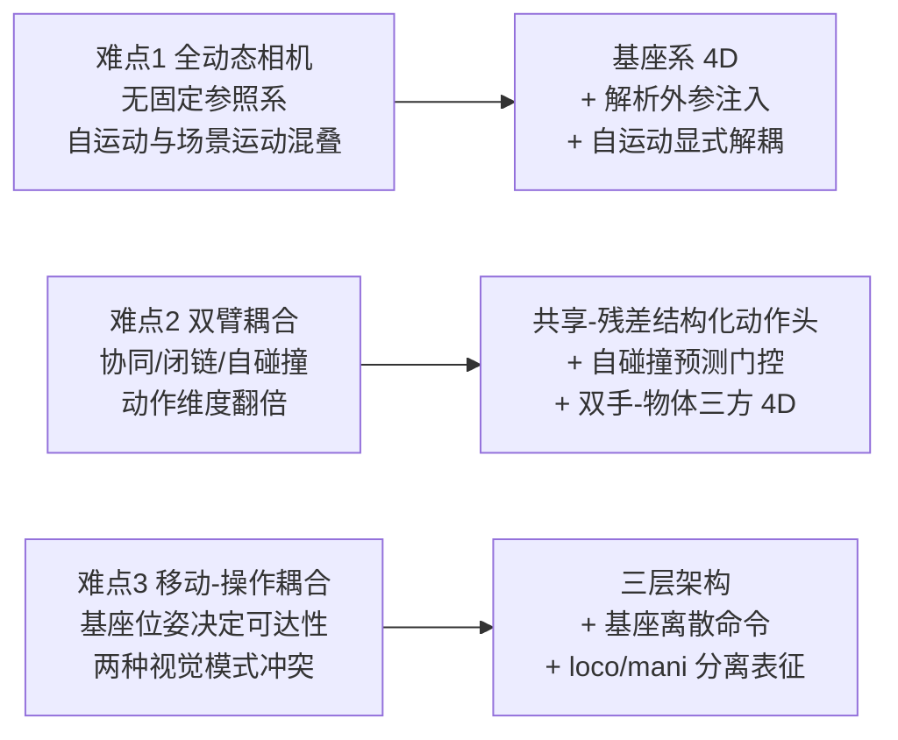

| 难点 | 具体表现 | 本方案的对策 | 章节 |
|---|---|---|---|
| **全动态相机** | 没有任何一路相机提供稳定参照系；光流/点轨迹里绝大部分位移来自自运动；腕部相机运动模糊严重、遮挡频繁 | 4D 统一在**基座系**预测；用解析 FK 把自运动精确扣除；头部与腕部分角色（头部管全局 4D，腕部管接触区精细 4D） | §3.2、§3.4、§3.7 |
| **双臂耦合** | 紧耦合任务（双手抬同一刚体）形成闭运动链；自碰撞风险；两臂节奏经常不同步（一只手不动、另一只在动） | 共享协同 latent + 每臂残差（Co-VLA）；自碰撞短时风险估计器门控（CoFreeVLA）；4D 里显式建模"双手-物体"三方接触 | §4.1、§4.4 |
| **移动-操作耦合** | 基座停在哪决定能否够到；移动与操作的视觉变化模式完全不同；移动引入运动模糊与曝光变化 | 基座用离散命令接口；loco 与 mani 用**分离的**潜表征/预测头（WholeBodyVLA 实证）；4D 里预测"基座落位可达性" | §4.1、§3.3、§2.9 |

### 1.4 三组核心设计张力

| 张力 | 一端 | 另一端 | 常规答案 | **本设定下的答案** |
|---|---|---|---|---|
| **实时性 vs 4D 丰富度** | 生成完整未来 4D 再解码动作，推理数百 ms–数秒 | 直接回归动作，零 4D 输出 | 异步双频：4D 分支 1–5 Hz，动作分支 30–100 Hz（[Genie Envisioner](https://arxiv.org/html/2508.05635) 的 slow-fast、[EnerVerse](https://arxiv.org/html/2501.01895v3) 复用首步去噪特征、[RynnWorld-4D](https://arxiv.org/html/2607.06559) 单次前向 9 Hz+） | **这条张力基本消失。** 10 Hz 下可以直接闭环生成。仍保留双频，但目的从"省算力"变成"让 4D 分支看更长的时间窗" |
| **显式几何 vs 隐式表征** | 显式点云/高斯/占据，可解释、可导出 | 隐式 latent，紧凑、快 | 训练显式、推理隐式（[GaussianDream](https://arxiv.org/html/2605.20752) 的非对称设计） | **两者都要**：隐式 latent 走动作通路（快、稳），显式几何走输出通路（满足"4D 越多越好"）与打分通路（碰撞/可达性检查） |
| **生成式 vs 判别式 4D** | 视频扩散生成未来 RGB-D，可无限外推但会幻觉 | 直接回归深度/流/轨迹，准确但表达受限 | 混合 | **三分**：机器人本体用**解析 FK**（零误差）；短时窗（≤1 s）场景用**判别式回归**；长时窗与"如果这样做会怎样"的反事实用**生成式** |
| **本体系 vs 世界系**（本设定新增） | 一切在基座系表达，跟着机器人走 | 一切在 episode 世界系表达，稳定但需要里程计 | — | **双系并存**：4D 在基座系预测（与动作同系，便于耦合），持久记忆在世界系累积（§3.2 详述） |
| **端到端 vs 分层**（本设定新增） | 一个模型直出全身关节命令 | VLA 出中层指令 + 低层控制器执行 | — | **分层**。[WholeBodyVLA](https://arxiv.org/html/2512.11047v1) 与 [OpenHLM](https://arxiv.org/abs/2606.22174) 都用三层；但 OpenHLM 同时指出"whole-body native"的端到端做法在垂直大范围任务上更强，两者要按任务类型取舍（§5.0） |

### 1.5 一个容易被忽略的关键判断

> **4D 输出的价值有三重：当监督信号、当决策依据、当产品功能。算力不限时，三重都要吃满。**

- 作为**监督信号**：稠密的深度/流/点轨迹损失能把稀疏的动作模仿信号放大成像素级监督，显著提升样本效率与空间精度。[Spatial Forcing](https://github.com/OpenHelix-Team/Spatial-Forcing) 报告仅用 ~30 行代码做特征对齐，就带来 LIBERO ~98.5% 与最高 3.8× 的训练加速。
- 作为**决策依据**（算力受限时通常被放弃的那一重）：用预测出的 4D 去**筛选候选动作**——碰撞检测、自碰撞检测、可达性检查、任务进度打分。这正是 WAM 定义里"用未来给动作打分"那条通路，10 Hz 下完全做得起，而且对双臂/移动本体价值极高（自碰撞与撞环境是这类本体的主要失败模式）。
- 作为**产品功能**：安全预检可视化、人机协作意图展示、real-to-sim 回放与离线评测、失败归因。

三重价值对应三条不同的系统通路，架构上就应分开并可独立开关（§6.5）。

---

## 2. 领域全景地图：把相关工作放进一张图

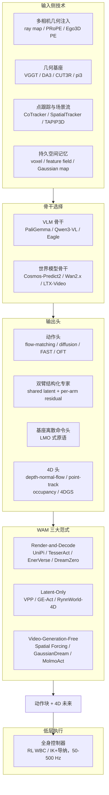

### 2.1 VLA 主线：可直接站上去的开源底座

| 模型 | 年份 | 规模 | 骨干 | 动作头 | 开源 / 许可证 | 关键可借鉴点 |
|---|---|---|---|---|---|---|
| [OpenVLA](https://github.com/openvla/openvla) | 2024 | 7B | Llama-2 + DINOv2/SigLIP | 离散动作 token | MIT | 社区最广的 baseline；OpenVLA-OFT 提供并行回归头 |
| [Octo](https://octo-models.github.io/) | 2024 | 93M | 从零训练 Transformer | 扩散 | MIT | 轻量、单卡 4090 可跑 20–30 Hz |
| [π0 / π0-FAST / π0.5](https://github.com/Physical-Intelligence/openpi) | 2024–2025 | ~3B | PaliGemma | flow matching / FAST 离散 | Apache 2.0（openpi） | **首选底座之一**；提供 JAX 与 PyTorch 双实现，`pi05_base`/`pi05_droid` 权重可直接微调 |
| [π*0.6 + RECAP](https://arxiv.org/html/2511.14759v2) | 2025.11 | — | π0.5 系 | flow matching + advantage token | 论文（方法可复现，[RLinf 有实现](https://rlinf.readthedocs.io/en/latest/rst_source/examples/embodied/recap.html)） | 用"优势条件化"把 RL 变成条件监督学习，绕开 flow matching 没有 log-prob 的难题；硬任务吞吐翻倍、失败率减半 |
| [GR00T N1.7](https://github.com/NVIDIA/Isaac-GR00T) | 2026 | 3B | Cosmos-Reason2-2B（Qwen3-VL 架构） | Action Cascade 双系统 + flow matching | **Apache 2.0，可商用** | **首选底座之一**；LIBERO 平均 96.5%；预训练含 20K 小时 EgoScale 人类第一视角视频；原生 embodiment head 机制便于跨本体 |
| [Gemini Robotics 1.5 / ER 1.5](https://arxiv.org/abs/2510.03342) | 2025.10 | 闭源 | Gemini | — | ER 版本经 Gemini API 可用 | **Motion Transfer** 跨本体迁移思路 + "行动前思考"的交错推理，值得借鉴设计而非直接用 |
| [MolmoAct](https://github.com/allenai/MolmoAct) | 2025 | 7B | Qwen2.5-7B + SigLip2 | 三段自回归：depth token → visual trace → action | 完全开源（权重+数据+代码） | **与你的需求最贴近的"可解释 4D 输出"范式**：先出深度感知 token，再出图像空间 2D 路点轨迹，最后出动作 |
| [SmolVLA](https://huggingface.co/blog/smolvla) | 2025 | 450M | SmolVLM | flow matching | Apache 2.0 | 边缘部署 / 快速迭代基线 |
| [StarVLA](https://github.com/StarVLA/StarVLA) | 2026.04 | 框架 | 可插 Qwen3-VL / InternVL / **Cosmos-Predict2** | 可插 FAST / OFT / π-flow / GR00T 双系统 | MIT | **强烈推荐作为实验框架**：backbone × action head 正交解耦，同一套数据接口与评测接口，覆盖 LIBERO / SimplerEnv / RoboTwin 2.0 / RoboCasa GR1 / BEHAVIOR-1K |

### 2.2 世界模型主线

| 模型 | 年份 | 可用性 | 对本项目的价值 |
|---|---|---|---|
| [NVIDIA Cosmos 3](https://github.com/NVIDIA/Cosmos) | 2026.05 | **开源**（Nano 16B / Super 64B，OpenMDW-1.1） | omnimodal MoT（自回归塔 + 扩散塔），原生支持 `action+video→video`（前向动力学）、`video+text→action`（策略/逆动力学）。官方明确把它定位为 **WAM 的骨干**。已放出 `Cosmos3-Nano-Policy-DROID` |
| [Cosmos Policy](https://github.com/NVlabs/cosmos-policy) | 2026.01 | **开源** | **架构上最优雅的统一方案**：不改任何结构，把 proprio / action chunk / future proprio / future images / value 全部编码成"隐帧"注入 Cosmos-Predict2-2B 的 latent diffusion 序列。LIBERO 98.5%、RoboCasa 67.1%。动作只用 5 步去噪，未来状态和 value 各 1 步 |
| [V-JEPA 2 / V-JEPA 2-AC](https://github.com/facebookresearch/vjepa2) | 2025.06 | 开源 | 1.2B，100 万小时视频预训练 + 仅 62 小时 DROID 后训练得到动作条件世界模型，用 MPC + 图像目标做零样本规划。**隐空间路线的最强代表**，适合作为"轻量 4D 隐式分支"的参考 |
| [Genie 3](https://deepmind.google/models/genie/) | 2025.08 | **仅研究预览，不可用** | 720p / 24fps 实时交互、数分钟一致性。只能作为"交互式世界模型天花板"的参照，不能进方案 |
| [Genie Envisioner (GE-Base/Act/Sim)](https://github.com/AgibotTech/Genie-Envisioner) | 2025.08 | 开源 | **与本项目形态最接近的完整平台**：多视角指令条件视频扩散（GE-Base，LTX-Video 系）+ 160M 轻量动作解码器（GE-Act，通过 cross-attention 读取多尺度全分辨率 latent）+ 动作条件神经仿真器（GE-Sim）+ 评测套件（EWMBench）。采用 **slow-fast 异步推理**：GE-Base 低频单步去噪，GE-Act 高频多步去噪 |

### 2.3 4D 具身世界模型（本项目的直接同类）

这是最值得逐篇精读的一组。

| 工作 | 时间 | 4D 表示 | 骨干 | 动作接口 | 开源 |
|---|---|---|---|---|---|
| [TesserAct](https://github.com/UMass-Embodied-AGI/TesserAct)（ICCV 2025） | 2025.04 | **RGB-D-N**（RGB + 深度 + 法线）视频 → 重建 4D 场景 | 视频扩散微调 | 从 4D 场景反解逆动力学 | ✅ 权重 + 训练/推理/数据生成脚本 + LoRA 微调脚本 |
| [EnerVerse / EnerVerse-A](https://arxiv.org/html/2501.01895v3) | 2025.01 | 多视角未来"具身空间" + 4DGS 数据引擎（EnerVerse-D） | chunk-wise 自回归视频扩散 + 稀疏上下文记忆 | 策略头复用首步去噪特征，**RTX 4090 上 8 步动作块约 280 ms** | 部分 |
| [RynnWorld-4D](https://huggingface.co/Alibaba-DAMO-Academy/RynnWorld-4D) | **2026.07** | **RGB-D-F**（RGB + 深度 + 光流），可反投影为**度量尺度 3D 场景流** | Wan2.2-TI2V-5B，三分支 DiT + 跨模态联合注意力 + frame-wise 3D RoPE（每 3 层做一次，共 30 层） | **RynnWorld-4D-Policy**：flow-matching 动作头直接消费内部 4D latent，单次前向，绕过多步去噪，**9 Hz+ 闭环双臂** | ✅ HF 权重 |
| [ORV](https://orangesodahub.github.io/ORV/)（CVPR 2026） | 2026 | **4D 语义占据栅格**（T×400×400×400）渲染成 2D 后作为软引导 | 视频扩散 + Action-Expert AdaLN 调制 | 动作作为条件 | ORV-Data 数据集 |
| [Structured 4D Latent Predictive Model](https://arxiv.org/html/2607.01166v1) | 2026.07 | **稀疏体素结构化 3D latent**（TRELLIS 式），可解码为 3DGS | latent 扩散 | goal-conditioned 逆动力学模块 | 论文 |
| [Geometry-aware 4D Video Generation](https://arxiv.org/html/2507.01099v3) | 2025.07 | 多视角 RGB-D，训练时用**跨视角 pointmap 对齐**监督 | 视频扩散 | 用现成 6-DoF 位姿跟踪器从生成的 4D 视频里反解末端轨迹 | 论文 |
| [GWM](https://arxiv.org/html/2508.17600v1)（ICCV 2025） | 2025.08 | **3D 高斯**：Gaussian VAE + latent DiT，动作条件下推演高斯基元传播 | latent DiT | 既可做表征增强，也可当 MBRL 的神经仿真器 | 论文 |
| [ManiGaussian](https://guanxinglu.github.io/ManiGaussian/) | 2024 | 动态高斯 + 高斯世界模型 | — | 未来场景重建作监督 | ✅ |
| [GaussianDream](https://arxiv.org/html/2605.20752) | 2026 | **前馈 3D 高斯 world model 插件** | VGGT 多尺度特征 + 可学习 query + TGE 模块（12 blocks / 8 heads） | **非对称**：训练时双头（当前重建 + 未来演化，监督 RGB/深度/伪 3D 场景流，horizon t+1..t+5）；**推理时全部丢弃，只留 1024 个 prefix token（reshape 成 32×32）** | 代码仓库已公布 |

**读这张表最重要的两个 takeaway：**

1. **"RGB + 深度 + 法线/光流"的多通道联合生成，是目前把 2D 视频模型升级为 4D 世界模型最经济的做法**（TesserAct → RynnWorld-4D 这条演化线）。因为深度让像素可以反投影成 3D，光流/场景流让 3D 点可以随时间移动，两者一起就构成了"4D"。而且伪标签可以用现成模型（Depth Anything 3 / RAFT 系）大规模生产。
2. **推理成本的解法已经收敛到"直接吃世界模型的中间 latent，而不是等它把像素解码出来"**（VPP → GE-Act → RynnWorld-4D-Policy → GaussianDream）。这是必须采纳的设计。

### 2.4 3D/4D 增强的 VLA（不生成视频，但注入几何）

| 方法 | 核心机制 | 数据 | 结论 |
|---|---|---|---|
| [SpatialVLA](https://arxiv.org/abs/2501.15830)（RSS 2025） | Ego3D 位置编码（把估计深度转成 3D 坐标注入视觉 token）+ 自适应动作栅格 | 110 万条 | 去掉 ego3d 后，变体聚合成功率从 81.6%/79.2% 掉到 68.9%/66.7% |
| [BridgeVLA](https://github.com/BridgeVLA/BridgeVLA)（NeurIPS 2025） | 点云 → 3 个正交投影图 → 输出 3 张 2D 热力图定位末端 | — | 输入输出统一到 2D 空间，数据效率极高 |
| [4D-VLA](https://github.com/LogosRoboticsGroup/4D-VLA)（NeurIPS 2025） | RGB-D 序列 + 3D 坐标嵌入 + **memory bank 采样** | DROID 预训练 | 提出"坐标系混乱 / 状态混乱"问题；实测 DROID 中 **67% 样本机器人底座被遮挡** |
| [3DVLA](https://doi.org/10.48550/arxiv.2605.29416) | 多视角空间融合到统一 3D memory bank + 物体中心 3D 实例 token + 掩码 3D 自监督补全 | — | 即插即用，在 LIBERO-Plus / RoboTwin 2.0 上稳定提升 |
| [G³VLA](https://arxiv.org/html/2606.24472) | **内参条件 ray embedding + PRoPE 投影位置编码 + 双向跨视角融合**；几何监督来自 GT pointmap 或置信度门控的 π³X 教师 | 无需深度传感器 | 在 π0 / π0.5 / GR00T 1.5 上都有提升；结论是"几何 token 需要能直接触达动作生成通路" |
| [Spatial Forcing](https://github.com/OpenHelix-Team/Spatial-Forcing)（ICLR 2026） | 把 VLA 中间层视觉 token 与 **VGGT 特征做余弦相似度对齐**，约 30 行代码 | 无需额外传感器 | LIBERO ~98.5%，训练加速最高 3.8×；提供 OpenVLA 与 π0 两版实现 |
| [MolmoAct](https://github.com/allenai/MolmoAct) | depth perception token（VQVAE 编码 Depth-Anything-V2 深度图）→ visual reasoning trace（图像空间 2D 路点，整数 ∈ [0,256)）→ action token | MolmoAct Dataset 1 万条 | SimplerEnv VM 70.5%，LIBERO 86.6%；**trace 可被人手动编辑来引导机器人** |
| [UniviewVLA](https://arxiv.org/html/2606.21501) | 用世界模型从 2 路标准相机**想象**出辅助视角，每个生成视角压到 16 token，用"动作熵"选最有信息量的视角 | — | 部署时不需要额外相机就能缓解遮挡 |

### 2.5 点轨迹 / 流场作为中间表征

这条线对你"输出 4D 信息"的需求特别友好，因为**点轨迹本身就是一种极其紧凑的 4D 表示**（N 个点 × T 个时刻 × 3 维坐标）。

| 方法 | 表示 | 关键结论 |
|---|---|---|
| [ATM (Any-point Trajectory Modeling)](https://xingyu-lin.github.io/atm/) | 第三人称 + 腕部视角各取固定 64 个点的 2D 轨迹 | 130+ 任务上比强视频预训练基线平均高 80%；**给了轨迹之后策略甚至不再需要语言指令**——轨迹已经把任务规约成了逆动力学问题 |
| [Track2Act](https://arxiv.org/html/2405.01527v2) | 从网络视频学 2D 点轨迹 → PnP 解出物体刚体变换序列 → 开环执行 + 残差策略闭环修正 | embodiment-agnostic，只需少量本体数据做残差 |
| General Flow / Im2Flow2Act | 3D 流场 / 物体流 | 人类视频 → 机器人动作的桥梁 |

> **设计启示**：把"预测 64~1024 个 3D 点在未来 H 步的轨迹"作为一个**独立输出头**，代价极低（一个 MLP/小 Transformer），但同时满足了"输出 4D 信息"和"给动作头提供密集子目标"两个目的。这是性价比最高的 4D 输出层次（见 §4.2 的 L3）。

### 2.6 视频骨干 WAM 的横向对比（2026，含实测延迟）

这是目前"用视频大模型做机器人策略"这条路的最新竞争格局。[一篇 2026 年的鲁棒性研究](https://arxiv.org/html/2603.22078v2)给出了难得的横向对比：

| 模型 | 参数 | 视频骨干 | MoT | 测试时是否需要生成视频 | 推理延迟 | 备注 |
|---|---|---|---|---|---|---|
| VPP | 1.5B | Stable Video Diffusion | ✗ | 否（只取表征） | — | ICML 2025，最早证明"视频扩散的中间表征就够用" |
| GE-Act | 2.2B | LTX-Video-2B | ✓ | 是（低频） | slow-fast 异步 | 动作解码器仅 160M |
| Cosmos Policy | 2B | Cosmos-Predict2-2B | ✗ | 可选（隐帧） | 动作 5 步去噪 | LIBERO 98.5% |
| [LingBot-VA](https://arxiv.org/pdf/2601.21998)（蚂蚁） | 5.3B | Wan2.2-5B | ✓ | 是（闭环 rollout） | 异步流水线 | RoboTwin 2.0：Easy 92.9% / Hard 91.6%，超过 π0、π0.5、X-VLA、Motus；1.6 万小时跨本体预训练；**代码已开源** |
| [DreamZero](https://dreamzero0.github.io/DreamZero.pdf)（NVIDIA） | **14B** | Wan2.1-I2V-14B | ✗ | 是（视频与动作在同一 DiT 里联合去噪，无独立 IDM） | **7 Hz 实时闭环** | 泛化相对 SOTA VLA **提升 2×+**；仅 12 分钟人类视频或 20 分钟他机视频即带来 **+42%** 相对提升；30 分钟 play data 适配全新本体 |
| GigaWorld-Policy | >5B | Wan2.2-5B | ✗ | 否 | 360 ms | 未来视觉状态以动作为条件 |
| Fast-WAM | 6B | Wan2.2-5B | ✓ | **否**（测试时屏蔽视频分支） | **190 ms** | 无需大规模具身预训练，数据效率高 |
| （参照）π0 | ~3B | 无视频骨干 | — | — | **73 ms**（消费级设备） | 纯 VLA 的延迟基准 |

**三条可直接拿来用的结论：**

1. **"训练时生成、推理时屏蔽"已被多方独立验证可行**（Fast-WAM、GigaWorld-Policy、UWM、GaussianDream）。其中 **UWM（Unified World Model）的技巧最优雅**：给视觉分支和动作分支**独立的扩散时间步**，推理时把视觉分支的时间步直接设成"纯噪声/跳过"，就能在保留视频训练所塑造的表征的同时，完全省掉视觉生成。**这个技巧应该直接抄进本方案。**
2. **延迟差距仍然明显，但对你不再是阻塞点**：优化过的 WAM 是 190–360 ms，纯 VLA 是 73 ms。在 30–50 Hz 目标下这个差距是致命的；**在 10 Hz（100 ms）目标下，DreamZero 的 7 Hz、Fast-WAM 的 190 ms 已经进入可用区间**，再叠加算力不限（更多卡做张量并行 / 更激进的批处理与蒸馏），完全可以做到闭环。所以在你的设定里，**"训练时生成、推理时屏蔽"从"必须"降级为"可选的降级模式"**——正常运行时应该让 4D 分支常开。
3. **视频骨干的最大价值是跨本体/跨数据源迁移**：DreamZero 用几十分钟的人类或异构机器人视频就能拿到 40%+ 的相对提升——这对数据稀缺的自研项目意义极大。你的本体（可动基座双臂半人形）公开数据尤其少，这条价值被进一步放大。

### 2.7 潜动作模型（Latent Action Model）：把无动作标注的视频变成可训练数据

这是解决"人类视频没有动作标签"的标准答案，也是本方案 S1 阶段的关键工具。

| 方法 | 做法 | 关键结论 |
|---|---|---|
| [LAPA](https://latentactionpretraining.github.io/) | VQ-VAE 学习相邻帧之间的离散"潜动作 token" → VLA 预训练预测潜动作 → 少量真机数据微调映射到真实动作 | 首个无需动作标签的 VLA 预训练方法；仅用人类操作视频训练也有正迁移 |
| [UniVLA](https://arxiv.org/html/2505.06111v1) | 在 **DINO 特征空间**里建潜动作模型，并用语言指令抑制任务无关动态；两阶段训练 | **比 OpenVLA 少用 1/20 预训练算力、1/10 下游数据即达到更好结果**；加入人类视频后性能持续提升 |
| villa-X | 把机器人状态与动作也纳入自监督过程，让潜表示锚定到物理运动 | |
| GO-1 / GR00T N1 | 训练时对潜动作空间加显式监督 | 工业级验证 |
| [Motion-Focused Latent Action](https://arxiv.org/html/2606.18955v1) | 用物理掩膜在混合解耦 VQ-VAE 里把运动从背景噪声中剥离 | 专门解决"人类视频背景复杂"的问题 |
| [WholeBodyVLA 的双 LAM](https://arxiv.org/html/2512.11047v1) | **分别训练 manipulation LAM 与 locomotion LAM**，各自独立码本，VLA 同时预测两组潜动作 token | 见下方的关键发现 |

> **一个对本方案至关重要的发现**（来自 WholeBodyVLA 的消融）：直接在"操作视频 + 移动视频"混合数据上训练**单个** LAM 效果明显更差。原因说得很清楚——
>
> - 操作视频里**相机位姿几乎静止**，图像变化主要来自手臂运动，模型会偏向关注手臂区域；
> - 移动视频里**相机持续运动**，图像变化主要来自环境相对相机的运动，模型被迫关注整个场景。
>
> 这两个注意力目标互相冲突，导致表征学习不稳定。他们的解法是训两个独立的 LAM（各自码本），VLA 同时预测 `c^mani` 和 `c^loco` 两组 token，再由一个轻量解码器结合状态 `s_t` 落地成"上肢关节角 + 离散移动命令"。
>
> **这个发现应当直接推广到你的 4D 预测头**：预测"手臂-物体相对运动"的 4D 与预测"自运动导致的场景视差"的 4D 是两类不同的问题，**不要用同一个头去拟合**。本方案 §4.4 会给出具体的拆分方式。

> **对本方案的意义**：潜动作模型与 4D 预训练是**互补**的两条从人类视频提取监督的路径。潜动作给的是"该怎么动"的抽象意图；4D 监督给的是"世界几何如何演化"。两者都做：潜动作 token 作为额外的预测目标，4D 通道作为稠密监督。

### 2.8 双臂协同专线：结构化动作空间是关键

这是本设定新增的第一条专线。核心争论是：**双臂动作应该用一个大向量端到端学，还是显式注入协同结构？** 2026 年的证据倾向后者。

| 方法 | 核心做法 | 关键数字 | 开源 |
|---|---|---|---|
| [**Co-VLA**](https://arxiv.org/html/2606.20285v1) | **Structured Action Expert (SAE)**：动作**加性分解** $a_L = W_L(z_{\text{shared}}) + r_L$、$a_R = W_R(z_{\text{shared}}) + r_R$（shared latent 是任务级协同意图，residual 是各臂执行微调）；配 **Latent-Aware Controller (LAC)** 在部署时按 shared/residual 能量比在线调节同步强度、平滑度与安全裕度 | RoboTwin Easy 76→**82%**，Handover 64→**91%**；真机 Lift Pot ID 43→**67%**，OOD **13→27%**；完成时间 **−25%** | 论文 |
| [**TwinVLA**](https://arxiv.org/html/2511.05275v1)（ICLR 2026） | 两份预训练**单臂** VLA + **因果 joint attention** 掩码组合成双臂策略；MoE 管理共享输入；动作用**绝对 EEF 位姿 + 6D 旋转**（不是 delta）；训练时做**频率对齐到 20 Hz** | **无需任何双臂预训练**即超过同规模 RDT-1B；逼近用大量私有双臂数据训练的 π0。平台 Anubis = **头部第一人称 + 双腕相机**（与你逐项一致） | [GitHub](https://github.com/jellyho/TwinVLA) |
| [**SkillVLA**](https://arxiv.org/abs/2606.16652) | 两级：先判断"这一步是否需要双臂协作"，再用**可学习协同门控 α** 复用/重组单臂技能 | **本轮调研最刺眼的数字**：在"左右臂技能各自见过、组合没见过"的任务上，**π0.5 = 0%、π0-FAST = 0%、TwinVLA = 4%、SkillVLA = 51%** | — |
| **CoFreeVLA** | 短时程**自碰撞风险估计器**（<5 ms）实时门控不安全命令并引导恢复；VLA **10 Hz** + 控制器 **30 Hz**，用**迟滞阈值**避免抖动 | 频率配置与你完全一致，可直接照搬 | — |
| **Dexora** | 面向高自由度双臂 + 灵巧手的统一开源系统 | — | 开源 |
| **RDT-1B** | 1B 扩散 Transformer，最早的大规模双臂基础模型之一 | 常作为双臂 baseline | 开源 |
| **ACT / ALOHA / Mobile ALOHA** | 动作块 + Transformer 的开山工作；Mobile ALOHA 加了可动基座 | 双臂遥操作与动作块的事实标准 | 开源 |
| [**CLAP**](https://arxiv.org/abs/2604.09677) | 双臂**潜动作**预训练；平台 Astribot S1（头 + 双腕，与你同构）；预训练期间**锁定基座与躯干**只学双臂 | 提供了"先学双臂、再放开全身"的分阶段范式 | — |

**从这条线能提炼出的设计要求：**

1. **动作头必须结构化，但结构化不能单独用。** Co-VLA 自己的消融是一条重要的反面证据：**SAE 单独用会掉分（63% → 57%）**，必须配合 LAC 与三个任务自适应辅助损失（稀疏性 $L_{\text{sparse}}$、共享一致性 $L_{\text{shared}}$、同步性 $L_{\text{sync}}$）才有正收益。另外他们报告**朴素 EMA 平滑也会掉分**——平滑必须是 latent 感知的（协同意图强时才加同步约束）。**结论：结构化分解 + 协同门控 + 协同辅助损失是一个不可拆的包，只抄一半会比不抄更差。**
2. **必须有显式的"是否协同"门控，否则跨臂技能组合归零。** SkillVLA 的 0% / 4% / 51% 是本节最强的信号。它说明：把双臂当一个整体向量学（π0.5、π0-FAST）会把左右臂的技能**绑死在训练时见过的组合上**；即使做了结构化分解（TwinVLA 的 joint attention）但没有显式门控，也只有 4%。**耦合必须是"可开可关、由模型决定"的，而不是"始终打开"。**
3. **协同类型要分层处理**。建议在数据标注与损失设计上区分四类：独立并行（两手做不相干的事）、松耦合（一手扶一手做）、紧耦合（两手同时作用于同一物体但不构成刚性闭链）、**闭链约束**（两手刚性抓同一刚体，$T^{\text{ee,L}} \cdot T_{\text{rel}} = T^{\text{ee,R}}$ 是硬约束）。**闭链约束目前是一个公开的空白**——调研确认没有任何工作把它硬编码进 VLA 的动作头，全部靠数据隐式学。最接近的是 Structure-Aware DP 的 CDTS 表征（绝对 + 相对分解，58% → 89%），但它依赖力反馈，你没有。**这里可以用一条纯几何的相对位姿一致性损失去补，不需要力控**（§4.5）。
4. **自碰撞要单独建模，不要指望端到端学会**。双臂 + 躯干的构型空间里自碰撞区域很大，示教数据里几乎没有负样本。做法：用 URDF 做解析自碰撞检测生成海量负样本，训一个轻量的"未来 H 步自碰撞风险"分类头，在动作输出前门控（CoFreeVLA 思路，<5 ms，配迟滞阈值）。**这个头天然属于 4D 输出的一部分**——它就是对预测出的本体 4D 做碰撞查询。
5. **组合式初始化值得考虑**。TwinVLA 证明"两份单臂 VLA + joint attention"能绕开双臂数据稀缺。注意两个实现细节：它用的是**绝对 EEF 位姿 + 6D 旋转**而非 delta（delta 在两臂拼接时会丢失相对空间关系），以及**训练前把不同数据源的控制频率对齐到 20 Hz**。
6. **π0.5 在纯双臂任务上不一定优于 π0。** Co-VLA 的对照里两者互有胜负。§0 第 12 条说的 π0.5 优势主要来自全身/长程/恢复行为，不要盲目认为 π0.5 处处更好。

> **一个必须提前知道的数据陷阱（Co-Motion 悖论）**：调研发现，"让两只手尽量同时动"的并发式双臂演示虽然**采集/生成更快**，却让**训练变难**——π0 从 76% 掉到 **50%**，Co-VLA 从 82% 掉到 **56%**。原因推测是并发演示里两臂的时序对齐更严格、容错窗口更窄。**这直接影响你的数据采集规范**：不要为了"看起来更像双臂协同"而刻意要求示教者两手同时动（§7.3）。

### 2.9 移动操作 / 全身控制专线：分层与离散命令

这是本设定新增的第二条专线。

> **先说结论**：这条线里最重要的发现不是某个算法，而是**存在一个与你硬件几乎逐项同构的完整开源生态**（Galaxea R1-Lite / R1 Pro）。它应当替代双足人形成为你的主参照基线。

| 方法 | 本体 | 架构 | 关键结论 | 开源 |
|---|---|---|---|---|
| [**Galaxea R1-Lite / R1 Pro + G0/G0.5**](https://arxiv.org/abs/2509.00576) | **全向轮式基座 + 4-DoF 躯干 + 双 6-DoF 臂 + ZED 2 头部相机 + 双 ZED-Mini 腕部相机 + T265 视觉里程计** | 分组 **27 维 ActionCodec**（残差 VQ，按 base / torso / arms 分组）；三阶段训练课程 | **与你的本体逐项对应**。配套 **500+ 小时开源数据集**（LeRobot 格式）、开源 VLA、开源仿真。三阶段课程中 **Stage 2（单本体预训练）被报告为最关键的一阶段** | [G0 GitHub](https://github.com/OpenGalaxea/G0)（含 `r1pro_wbc` 全身控制配置）、[数据集](https://huggingface.co/OpenGalaxea) |
| [**BEHAVIOR Robot Suite / WB-VIMA**](https://behavior-robot-suite.github.io/)（CoRL 2025） | R1（同上轮式全身平台） | **沿运动学链自回归去噪**：base(3 维) → torso(4 维) → arms(14 维)，每段以上游**已去噪**结果为条件 | 设计依据非常具体："躯干膝关节 10° 的误差会造成末端 **0.14 m** 偏移"，所以下游必须看到上游的实际去噪结果而非独立采样。**公布了完整超参** | [GitHub](https://github.com/behavior-robot-suite/brs-algo) |
| [**AC-DiT**](https://arxiv.org/abs/2507.01961) | 移动操作 | **mobility-to-body 条件**：先算移动意图，再据此调制全身动作生成；自适应 3D 条件注入 | 与 WB-VIMA 是同一思路的独立实现，两者互为交叉验证 | [项目页](https://ac-dit.github.io/) |
| [**WholeBodyVLA**](https://arxiv.org/html/2512.11047v1)（ICLR 2026） | AgiBot X2 人形 | VLM **~10 Hz** 输出 latent action token → 轻量解码器 → (i) 双臂关节角 (ii) **离散移动命令** → **LMO RL 策略 50 Hz** 执行 | 相比基线 **+21.3%**；把 LMO 换成常规连续速度跟踪控制器，成功率掉 **24 个百分点**，且 **91.7% 的差距集中在含移动的子目标**上；双 LAM（loco/mani 分离）显著优于单 LAM | [GitHub](https://github.com/OpenDriveLab/WholebodyVLA) |
| [**OpenHLM**](https://arxiv.org/abs/2606.22174) | 人形 | π0.5 初始化 + 全身动作空间适配 + 异构共训 | ①**关节空间全身遥操作接口**优于只暴露部分自由度的接口；②**在静态与轮式双臂平台上预训练的 VLA 迁移到人形全动作空间表现出奇地好**；③**action MSE 是衡量预训练价值的糟糕代理指标**（π0.5 与 PaliGemma 初始化 MSE 几乎相同，真机表现差距巨大）；④全身控制器**预览延迟 Δt=0.2 s 最优**；⑤用 HuMI（人形版 UMI）共训可低成本扩展物体与指令覆盖；⑥用不到一半的演示时长超过 GR00T N1.6 与 Ψ0 | [项目页](https://openhlm-project.github.io/) |
| **MoManipVLA**（CVPR 2025） | 移动操作 | 把固定基座 VLA 迁移到移动操作：VLA 预测末端路点作为运动规划的目标，双层优化生成基座与手臂轨迹 | 只需极少移动操作数据即可迁移 | [arXiv 2503.13446](https://arxiv.org/abs/2503.13446) |
| **Mobi-π** | 移动操作 | 提出"mobilization"概念：给定一个固定基座策略，找到能让它成功的基座落位 | 把"基座该停哪"单独形式化 | — |
| **Being-0** | 人形 | 分层：VLM 做高层推理 + 技能库执行 | 工程完整度高 | 开源 |
| **Helix**（Figure） | 人形 | System1/System2 双频：S2 视觉语言推理 ~7–9 Hz，S1 视觉运动 200 Hz | 商业系统，双频的代表 | 闭源 |
| **GR00T N1.6/N1.7**、**Ψ0** | 人形/双臂 | 双系统 | 常被当作人形 VLA 基线 | GR00T [开源](https://github.com/NVIDIA/Isaac-GR00T) |
| **Harmonic Mobile Manipulation**、**TidyBot++** | 轮式移动操作 | 移动与操作协同优化 / 低成本移动操作平台 | 平台与数据参考 | 开源 |

**从这条线能提炼出的设计要求：**

1. **把 Galaxea R1 生态当作主参照，而不是双足人形。** 你的相机配置（头 + 双腕）、自由度分组（base / torso / dual-arm）、坐标系问题，在这套生态里都已经被解决过一遍，且数据、代码、仿真、论文齐全。**这是全文最省事的一条建议。**
2. **动作空间：分组 + 沿运动学链条件依赖，这是三条独立路线的共同收敛点。** WB-VIMA 的逐段自回归去噪、AC-DiT 的 mobility-to-body 条件、Galaxea G0.5 的分组 ActionCodec，来自三个不同团队却指向同一结构。反面证据同样明确：OpenHLM 报告 **81 维 SMPL 表征因维度冗余落后 32 维联合关节表征 13 个百分点**。**不要用一个大平铺向量，也不要用完全独立的 base / arm 头。**
3. **三层架构，顶层就是 10 Hz。** 你的 10 Hz 指标恰好与 WholeBodyVLA 的 VLA 层、CoFreeVLA 的 VLA 层频率一致，这不是巧合——它是"VLM 前向 + 动作块解码"的自然工作点。底层控制器该跑 50–500 Hz 就跑，与顶层解耦。
4. **基座命令用离散接口。** 最具体、代价最低、收益最明确的一条。把基座动作离散成 {前进 x cm、后退、左右侧移、原地左右转 θ 度、升降躯干、停止} 这类原语，而不是回归连续的 $(v_x, v_y, \omega_z)$。WholeBodyVLA 的对照给出 24 个百分点的差距。**这与"动作块"不冲突**——块里基座那一维可以是离散 token 序列，双臂那部分仍是连续值。
5. **"是否解耦移动与操作"，对你的本体有一个明确答案：软耦合即可，不要移植双足的高频平衡层。** OpenHLM 的单变量对照显示，解耦控制会让人形**退化成"与轮式双臂平台类似"的行为**。这句话对双足是批评，对你是好消息——**你本来就是轮式，解耦造成的能力上限损失基本不存在**。双足那套 50 Hz–1 kHz 的 System 0 RL 平衡控制器，其存在的全部理由（防踉跄、防路径偏离、动态平衡）在全向轮式底盘上都不成立。建议：**在单个网络内保持结构化条件依赖（软耦合），底层只用常规的轮式底盘控制 + 手臂 IK/导纳，不引入 RL 平衡策略。**
6. **loco 与 mani 的表征要分离。** 前面 §2.7 已详述。对 4D 头同样适用。
7. **"基座该停在哪"值得作为一个独立的预测目标。** Mobi-π 把它形式化为 mobilization 问题。在你的方案里这可以是 4D 输出的附加层：预测**基座候选落位的可达性热力图**。既是有用的 4D 信息，也是直接的决策依据。
8. **π0.5 初始化 + 轮式双臂预训练数据是你的最短路径。** OpenHLM 的实证说"在静态与轮式双臂平台上预训练的 VLA 迁移到全身动作空间表现出奇地好"——你的本体就是轮式双臂，比人形更接近预训练分布。
9. **评测别用 action MSE。** OpenHLM 明确指出这是糟糕的代理指标，改用**任务进度分数**（$[0,1]$ 分段给分）而非二值成功率。已写入 §8。

> **这条线上最大的空白**：**"移动 + 4D" 目前没有任何公开工作覆盖。** 4D 世界模型（TesserAct、4D-VLA、RynnWorld-4D）全部是固定基座；导航侧的未来预测（SparseVideoNav）不做操作；统一 VLA + 世界模型（RynnVLA-002、Genie Envisioner）没有基座。**没有人同时预测"走过去会看到什么"和"操作会发生什么"。** 同样，**没有任何 VLA 把自身未来 swept volume 作为预测头**——现有 swept volume 工作（NeuralSVCD 等）都是独立的碰撞检测模块，不在策略回路里。这既是机会也意味着没有配方可抄，落地方案见 §4.3。

> **可靠性提示**：Figure Helix 02 的全部性能数字来自公司博客，无论文、无第三方复现，**可作为架构思想参考但不应作为性能依据**；Astribot 整机规格表来自商业评测博客，建议不引用。

### 2.10 real-to-sim 与数据增广

| 方法 | 做法 | 数字 |
|---|---|---|
| [RialTo](https://real-to-sim-to-real.github.io/RialTo/) | 扫描真实场景 → GUI 构建数字孪生 → 仿真里 RL 微调 → 师生蒸馏回真机 | 策略鲁棒性提升 >67% |
| [SplatSim](https://splatsim.github.io/) | 用 3DGS 替代 mesh 做渲染基元，纯合成数据训练 RGB 策略 | 零样本 sim2real 平均成功率 86.25%（真机数据训练为 97.5%） |
| [RoboGSim](https://arxiv.org/pdf/2411.11839) | 高斯重建器 + 数字孪生构建器 + 场景合成器 + 交互引擎 | 完整 real2sim2real 仿真器 |
| [RL-GSBridge](https://arxiv.org/html/2409.20291) | mesh 绑定的软约束 3DGS + 物理同步的高斯编辑 | 抓取/pick-place 零样本迁移 |
| [RoboTransfer](https://github.com/HorizonRobotics/RoboTransfer)（CVPR 2026） | **多视角几何一致的视频扩散**：跨视角特征交互 + 全局深度/法线条件，支持换背景、换物体 | DIFF-OBJ 设定 +33.3%，DIFF-ALL 设定 **+251%** |

> **对你的意义**：real-to-sim 既是"4D 输出的一种终极形态"（输出可以在 Isaac/MuJoCo 里重放的场景），也是**数据放大器**。建议放在中后期，先用 RoboTransfer 这类"几何一致视频增广"性价比更高。

---

## 3. 输入侧设计：三路全动态相机的特殊性

你在需求里提到"对原始输入还可以通过处理得到其它更有用的信息输入"——这一节就是把这句话展开。**输入侧的信息量决定了 4D 输出的上限**，而且在你的设定下，有一批派生信息是**解析可得、零误差、几乎零成本**的，必须用满。

### 3.1 「三路相机全部在动」意味着什么

先把差异摆清楚。绝大多数公开 VLA 工作（DROID、ALOHA、BridgeData、LIBERO 等）都有**至少一路固定的第三人称相机**，它提供了一个静止的世界参照系：背景像素不动，动的就是机器人和物体。你的配置没有这个参照系。

| 维度 | 常规配置（2 全局固定 + 1 腕部） | **你的配置（1 头部 + 2 腕部，全动）** | 后果 |
|---|---|---|---|
| 稳定参照系 | 有（固定全局相机） | **无** | 光流/点轨迹里绝大部分位移来自自运动，需要显式扣除 |
| 外参 | 全局相机外参固定标定；腕部相机随臂运动 | **三路外参都随关节角变化，但都可由 FK 解析算出**（除基座在世界系的位姿） | 既是挑战也是强先验 |
| 场景覆盖 | 全局相机始终看到全局 | 头部相机视野随头/基座转，**会看不到刚才看到的东西** | 需要持久空间记忆（§3.6） |
| 视差基线 | 两路固定全局相机构成稳定立体基线 | 头部与腕部视野重叠有限且随时变化 | 跨视角一致性约束更难做，但也更值得做 |
| 运动模糊 | 全局相机基本无模糊 | 腕部相机模糊严重，基座移动时头部相机也模糊 | 深度/光流伪标签质量下降，必须做质量门控 |
| 视觉变化模式 | 单一模式（手臂动） | **两种模式并存**：操作时手臂动（相机近似静止）、移动时整个场景动 | WholeBodyVLA 实证：两种模式混训会互相干扰，表征头要分离 |

**三条直接的设计推论：**

1. **必须把自运动（ego-motion）与场景运动（scene motion）显式解耦。** 如果不做，模型看到的"运动"里 80%+ 是自己造成的，4D 预测头会把大量容量浪费在学习"我动了所以世界看起来动了"这件本来可以解析计算的事上。做法见 §3.3 的 ego-flow 通道。
2. **4D 必须在一个不随相机运动的坐标系里预测**（§3.2）。
3. **头部相机与腕部相机应该承担不同角色**，不要平等对待（§3.7）。

### 3.2 坐标系的选择：本方案最重要的单一决策

这是一个必须在动手前定下来的问题，改起来代价极高。四个候选：

| 坐标系 | 定义 | 优点 | 缺点 | 适用 |
|---|---|---|---|---|
| **相机系** | 每路相机各自的光心系 | 与图像天然对齐，深度/法线/光流直接可用 | 三路各不相同、且随时间剧烈变化；4D 预测在这里做等于要同时预测自运动 | 仅作为**中间表示**，不作为最终 4D 表达 |
| **基座系（推荐）** | 原点在机器人基座，随基座平移旋转 | ①与动作输出同系，4D 与动作天然耦合；②头/腕相机相对它的外参 **FK 解析可得**；③不需要里程计就能定义 | 基座移动时"场景在基座系里会整体运动" | **主坐标系**：4D 预测、动作输出、可达性判断都在这里 |
| **Episode 世界系** | 以 episode 起始时刻的基座系为原点，固定不动 | 场景静止部分在这里真的静止；适合累积持久记忆 | 需要里程计/SLAM 估计基座位姿，有漂移 | **辅助坐标系**：持久空间记忆、物体全局位置、导航目标 |
| **物体中心系** | 以被操作物体为原点 | 对"物体如何运动"的表达最自然，跨场景泛化好 | 需要先检测物体；多物体时不唯一 | **附加层**：物体级 6-DoF 轨迹（L5）用它 |

**推荐做法：基座系为主 + episode 世界系为辅，两者之间用里程计变换连接。**

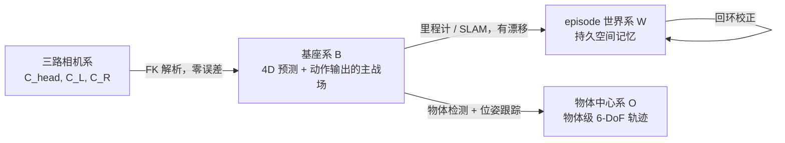

**关键理由：**

- **4D 与动作必须同系。** 你要输出的动作是双臂关节角与末端位姿，这些天然在基座系里定义。如果 4D 在相机系里预测，每次要用 4D 去约束动作时都要做一次带噪声的坐标变换，还会把相机外参误差引入动作。
- **基座系的相机外参是解析的。** 这是你相对于 DROID 之类数据集的**优势**而非劣势：$T_{\text{base}\leftarrow\text{cam,head}} = \text{FK}(q^{\text{torso}}, q^{\text{neck}})$，$T_{\text{base}\leftarrow\text{cam,wrist-L}} = \text{FK}(q^{\text{arm,L}}) \cdot T_{\text{ee}\leftarrow\text{cam}}$。每一帧都精确已知，不需要估计。
- **[4D-VLA](https://arxiv.org/html/2506.22242v1) 指出的"坐标系混乱"问题在这里反而更容易解决。** 该论文发现 DROID 里 67% 的样本机器人底座被遮挡，模型无法从像素推断出机器人在哪，导致空间基准漂移。你的情况是：底座**永远不可见**（相机都在身上），但底座位置**永远精确已知**。把它直接喂进去就行。
- **持久记忆必须在世界系。** 基座系会随机器人移动而移动，无法在其中累积"房间里有什么"。里程计漂移在 episode 尺度（几十秒到几分钟）内通常可接受；对更长时程，加视觉回环。

> **一个容易踩的坑**：训练数据里如果没有基座运动（比如从固定基座数据集借来的），基座系与世界系重合，模型学不到两者的区别；一旦部署时基座开始动，4D 预测会崩。**对策**：训练时对基座位姿做增广（人为注入虚拟基座运动并相应变换 4D 真值），并且在混合数据训练时用 embodiment token 标明"该样本是否有基座运动"。

#### 3.2.1 从「坐标系」到「表征」：把观测重表达成机器人系 pointmap

选定坐标系只是第一步。真正的问题是：**这个坐标系怎么进到模型里？** 光把外参数值拼进 state 向量，模型还是要自己学会做坐标变换。更彻底的做法是**把每个像素直接表达成机器人系下的 3D 坐标**（pointmap），让空间关系变成视觉 token 的内容而非需要推理的东西。

[See like a Robot](https://arxiv.org/abs/2607.11498) 对这条路做了迄今最完整的阶梯消融，数字非常干净：

| 表征 | 得分 | 增量 |
|---|---|---|
| 纯 RGB | 27.9 | — |
| + Plücker 射线 | 28.7 | +0.8 |
| + 深度图 | 31.6 | +2.9 |
| **+ 基座系 pointmap** | **34.7** | **+3.1** |
| **+ 末端执行器系 pointmap** | **36.9** | **+2.2** |

三条对你直接有用的附加结论：

1. **视角鲁棒性的差距远大于绝对分数的差距。** 在随机化视角下，纯 RGB 掉 **9.6 分**，pointmap 只掉 **1.8 分**；基座系 pointmap 掉 2.0，**EE 系 pointmap 只掉 0.3**。**你三路相机全部在动，正是"随机化视角"的极端情形——这条收益会被放大，而不是缩小。**
2. **注入方式有明确的优劣序**：**逐元素相加到 RGB token（34.7）> 通道拼接（30.7）> 点云 + MLP 分支（24.2）**。最后一种比纯 RGB 还差 3.7 分，说明"另开一路点云编码器"是个陷阱。这与 §3.4 里 G³VLA 的零初始化相加注入是同一结论。
3. **在 π0.5 上的端到端收益是 55.3 → 62.9。** 不是小打小闹的辅助头级别提升。

**对本方案的具体建议：**

- **主路用基座系 pointmap**（与动作、与 4D 预测同系，链路最短）。
- **腕部相机额外加一路 EE 系 pointmap**。EE 系对视角变化几乎免疫（掉 0.3），而腕部相机恰恰是视角变化最剧烈的一路。这是一个非常便宜的加固——EE 系与基座系之间的变换就是 FK，解析可得。
- **注入方式一律用零初始化的逐元素相加**，不要拼接，更不要另开点云分支。
- 相关工作 [Robo3R](https://arxiv.org/abs/2606.19913) 更进一步：**RGB + 关节角 → 直接输出标准机器人系下的度量几何**，并报告在透明/反光/细小物体上优于深度相机。如果你的场景里这类物体多，值得作为深度来源的替代或补充。

> **与硬件深度的关系**：这不是"要 pointmap 就不要 RGB-D"。硬件深度是 pointmap 的输入之一（$P = T_{\text{base}\leftarrow\text{cam}} \cdot \pi^{-1}(u, D)$，全解析）。pointmap 的价值在于**把这个变换的结果直接摆到 token 里**，而不是让模型隐式学。

### 3.3 派生输入信息清单（按性价比排序）

标注"解析"的表示由 URDF/FK/标定直接算出，**零误差、零学习**，是你这个设定下的免费午餐。

| # | 派生信息 | 怎么得到 | 在线代价 | 价值 | 建议 |
|---|---|---|---|---|---|
| 0 | **基座系 / EE 系 pointmap** | **解析**：深度 + FK 外参逐像素反投影 | ~1 ms | ★★★★★ **本设定下单项收益最高**（§3.2.1：+6.8 分，视角鲁棒性 9.6→1.8） | **必做，优先级最高** |
| 1 | **三路相机 ray map（基座系）** | **解析**：FK + 内参 | ~0 | ★★★★★ 消除多视角歧义，且每帧都变，必须逐帧算 | **必做** |
| 2 | **全身自遮挡掩膜 + 本体深度** | **解析**：URDF + 全关节角 + 可微渲染 | ~1–2 ms（nvdiffrast） | ★★★★★ 告诉模型"哪些像素是我自己"；在腕部相机里这部分占比很大 | **必做** |
| 3 | **ego-flow（自运动导致的光流）** | **解析**：已知相机位姿变化 + 深度 → 逐像素重投影位移 | ~1 ms | ★★★★★ **本设定专属**。把观测光流减去 ego-flow 得到残差流 = 真实场景运动 | **必做** |
| 4 | **基座里程计位姿** | 轮式里程计 + IMU 融合；或视觉里程计 | ~0 | ★★★★★ 连接基座系与世界系 | **必做** |
| 5 | **度量深度图** | RGB-D 直出；或 [Depth Anything 3 Metric](https://huggingface.co/depth-anything/DA3METRIC-LARGE)（0.35B，Apache 2.0） | 5–15 ms/帧 | ★★★★★ 2D→3D 的钥匙 | **必做**（优先硬件深度） |
| 6 | **点图 / 跨视角几何** | [VGGT](https://github.com/facebookresearch/vggt) / [DA3](https://github.com/bytedance-seed/depth-anything-3) / [CUT3R](https://cut3r.github.io/) / π³ | 30–100 ms | ★★★★ 校验标定、补全深度 | 训练必做；推理时算力允许可常开 |
| 7 | **2D/3D 点轨迹** | CoTracker3 / SpatialTracker V2 / TAPIP3D | 离线（或在线，算力允许） | ★★★★★ 最紧凑的 4D 监督 | **必做** |
| 8 | **残差光流 / 场景流** | RAFT 系减去 ego-flow | 离线 | ★★★★★ 真正的"场景在动"信号 | **必做** |
| 9 | **法线图** | 从深度求导 / DSINE | 离线 | ★★★ TesserAct 用它稳住几何 | 建议做 |
| 10 | **物体/部件分割 + 跨帧追踪** | SAM 2 / Grounded-SAM（用指令名词做 prompt） | 离线 | ★★★★ 物体级 4D、real-to-sim 前提 | **必做** |
| 11 | **双手接触状态 / 接触点** | 从夹爪开度突变 + 物体掩膜相交反标注 | 离线 | ★★★★ 双臂协同的关键中间量 | **建议做** |
| 12 | **自碰撞距离场** | **解析**：URDF 胶囊体最近距离 | ~1 ms | ★★★★ 双臂本体必需 | **必做** |
| 13 | **可达性 / 基座落位热力图** | **半解析**：IK 可解性采样 + 学习修正 | 离线预计算 + 在线查表 | ★★★★ 移动操作的关键 | 建议做 |
| 14 | **持久空间记忆 token** | §3.6 | 中等 | ★★★★ 移动本体必需 | 建议做 |
| 15 | **历史帧 memory bank** | 稀疏采样（4D-VLA 的 memory bank sampling；GaussianDream 取 {t-10, t-5, t}） | 增加 token | ★★★★ 解决状态混乱 | **必做** |
| 16 | **子目标 / 具身思维链文本** | VLM 自动标注 + 人工校验（π0.5 的 high-level 子任务、Gemini Robotics 的 embodied thinking） | 慢分支 | ★★★★ 长程任务的关键 | 建议做 |
| 17 | **embodiment / 相机配置 / 运动模式 token** | 手工配置 | ~0 | ★★★★ 跨本体训练；标明"当前是移动段还是操作段" | **必做** |
| 18 | **优势指示 token（Advantage）** | 训好 value 后打标（RECAP） | ~0 | ★★★★ 让模型能从失败数据学习 | 后期 |
| 19 | **语义 3D 场景图 / 物体 6-DoF 位姿** | FoundationPose / BundleSDF | 较贵 | ★★★ real-to-sim 输入 | 后期 |

> **第 3 条（ego-flow）是本设定下最被低估的一条。** 具体做法：给定 $t$ 到 $t+1$ 之间某路相机的位姿变化 $\Delta T$（解析可得）和 $t$ 时刻的深度 $D_t$，对每个像素 $u$ 计算 $u' = \pi(\Delta T \cdot \pi^{-1}(u, D_t))$，则 $f_{\text{ego}}(u) = u' - u$ 就是**假设场景完全静止时应该观察到的光流**。用实测光流减去它，得到的残差流几乎纯粹反映场景中真实运动的物体。把 $f_{\text{ego}}$ 作为额外输入通道、把残差流作为 4D 监督目标，等于把"自运动补偿"这件事从学习问题降级成了算术问题。

### 3.4 几何注入：把「解析可得的外参」用满

三条路线可以叠加，且在你的设定下第一条的价值比常规设定更高（因为外参每帧都变，模型无法靠"记住固定布局"来蒙混过关）。

**(a) 逐帧 ray map + PRoPE（推荐，来自 [G³VLA](https://arxiv.org/html/2606.24472)）**

对每个视角 $v$、每个像素 $u$，计算归一化投影射线并转到基座系，得到 ray map；再用一个**零初始化**的投影层把它嵌到 patch 网格上，加到视觉编码器输出的 token 上。零初始化保证不破坏预训练权重。注意力里用 PRoPE（投影位置编码），让不同视角的 token 之间带上相对相机几何。G³VLA 在 π0 / π0.5 / GR00T 1.5 上都验证有效。

**这条路对你尤其可信，因为 G³VLA 的真机实验用的就是你这个配置**——论文原话是"内参一次标定、**外参每帧由前向运动学计算**"。它的组件消融：去掉射线嵌入 **−2.0**，去掉 PRoPE **−1.1**，用单阶段训练代替两阶段 **−0.7**。也就是说三个组件都有独立贡献，但**射线嵌入是最主要的那个**。

```python
# 伪代码：逐帧几何注入（在 SigLIP/DINOv2 输出后）
for v in ["head", "wrist_L", "wrist_R"]:
    T_base_cam = forward_kinematics(urdf, q_t, camera_link[v])   # 解析，每帧重算
    ray_cam    = normalize(inv(K[v]) @ pixel_grid)               # [H/p, W/p, 3]
    ray_base   = T_base_cam[:3, :3] @ ray_cam                    # 转到基座系
    origin     = T_base_cam[:3, 3].broadcast_to(ray_base.shape)  # 光心位置
    geo_emb    = zero_init_mlp(concat([ray_base, origin]))
    tokens[v]  = vision_encoder(img[v]) + geo_emb                # 零初始化，不破坏预训练

tokens = cross_view_attn_with_PRoPE(tokens, relative_poses)
```

**(b) Ego3D 位置编码（[SpatialVLA](https://arxiv.org/abs/2501.15830)）**：用深度把每个 patch 反投影成 3D 坐标，正弦编码后加到 token 上。与 (a) 互补：(a) 给的是"这个像素对应哪条射线"，(b) 给的是"这个像素对应哪个 3D 点"。两者一起用效果更好。

**(c) 正交投影重渲染（[BridgeVLA](https://github.com/BridgeVLA/BridgeVLA)）**：把三路点云在**基座系**融合后，从俯视/正视/侧视三个正交方向重新渲染。对你的设定尤其有价值——因为三路相机视角都在动，一个**姿态稳定的虚拟俯视图**能给模型一个恒定的空间参照。代价是需要好的深度和标定（你都有）。

**(d) 把已知位姿注入几何基础模型（当你要用 VGGT 类模型时）**

如果你要在管线里用几何基础模型做点图/深度补全，**不要用它们的默认"什么都估"模式**——你的位姿是已知的，让模型再估一遍纯属浪费且引入误差。两个可用的接口：

- [**OmniVGGT**](https://arxiv.org/abs/2511.08222) 的 **GeoAdapter**：用**零卷积**注入相机位姿、直接注入深度，可用任意子集。7-Scenes 上位姿估计误差 0.104 → **0.036**（降 65.4%）。零卷积的设计与 (a) 的零初始化同源，都是"不破坏预训练"。
- [**MapAnything**](https://map-anything.github.io/)（**Apache 2.0**）：因子化表征，**位姿与深度是可选输入而非只能是输出**。它的 "calibrated MVS" 模式（已知内参 + 已知外参 → 只求深度与结构）正是你的情形。许可证宽松，工程上最省事。

**(e) 建议组合**：(a) + (b) + §3.2.1 的 pointmap 作为主路，(c) 的基座系俯视图作为**第四路"虚拟相机"**输入。俯视图对双臂协同的空间布局判断、以及基座落位判断特别有用，且它不随头部转动而变化，等于人为造了一个"固定第三人称视角"。需要跨帧几何时用 (d) 的已知位姿注入模式。

> **一个必须知道的现状**：调研确认，**目前没有任何单一模型同时具备"在线流式 + 位姿可注入 + 度量尺度 + 动态场景处理"这四项**。你的需求恰好四项全要。可行的组合路径是：**MapAnything / OmniVGGT 作骨干（拿位姿注入 + 度量）+ MoRe / [StreamVGGT](https://arxiv.org/abs/2507.11539) 的因果注意力改造（拿在线流式）+ PAGE-4D 的动态掩膜（拿动态处理）**。另有 [TTT3R](https://rover-xingyu.github.io/TTT3R/) 值得注意：**20 FPS、6 GB 显存、可处理数千帧、且是 training-free 的**，作为长序列在线重建的兜底方案代价极低。

### 3.5 全身状态编码

不要只喂一个拼接向量。建议的状态张量（以每臂 7-DoF 为例）：

| 分量 | 维度 | 说明 |
|---|---|---|
| 双臂关节角 | 2 × 7 × 2 | 用 $(\sin q, \cos q)$ 编码避免角度环绕 |
| 双臂关节速度 | 2 × 7 | |
| 双臂末端位姿 | 2 × (3 + 6) | 位置 + **6D 旋转表示**（旋转矩阵前两列），避免四元数双覆盖与欧拉角万向锁 |
| **双臂相对位姿** | 3 + 6 | $T^{\text{ee,L}\leftarrow\text{ee,R}}$。**显式给出这一项**——闭链任务里它是核心量，让模型自己从两个绝对位姿去减是浪费容量 |
| 双夹爪开度 | 2 | |
| 躯干 / 颈部关节角 | $n_t + n_n$ | 决定头部相机指向 |
| 基座位姿（世界系） | 3 + 2 | $(x, y, \sin\theta, \cos\theta)$ + 可选 z |
| 基座速度 | 3 | $(v_x, v_y, \omega_z)$ |
| **最小自碰撞距离** | 1 + K | 全局最小距离 + K 对关键连杆对的距离。解析可得 | 
| 历史窗口 | × K | K = 3–5，稀疏采样（如 t, t-5, t-10） |
| embodiment / 运动模式 token | 可学习 embedding | 跨本体训练必需；同时标明"移动段/操作段/协同段" |

状态经小 MLP 投影到与视觉 token 同维度，作为额外 token 拼入 prefix。

> **一个来自 GR00T-WholeBodyControl 的实践提示**：对人形全身场景，让 VLA 直接输出全部关节角是低效的——它改为输出 64 维 latent motion token，由预训练的全身控制器（SONIC）解码成 29-DoF 关节命令并保证平衡，VLA 推理 2.5 Hz、WBC 执行 50 Hz。你的本体是可动基座而非双足，平衡约束弱得多，因此**上肢可以直接输出关节角**（OpenHLM 也证明关节空间接口更好），但**基座建议走离散命令 + 底层控制器**（§4.1）。

### 3.6 持久空间记忆：移动本体的必需品

固定基座机器人可以假设"我看到的就是全部"。你的机器人转个身就看不到刚才的东西了，因此需要一个跨时间累积的空间表示。三种技术路线：

| 路线 | 表示 | 更新方式 | 优点 | 缺点 |
|---|---|---|---|---|
| **显式几何地图** | TSDF / 体素占据 / 点云，在 episode 世界系 | 每帧用深度 + 里程计融合 | 直接可用于碰撞检测与导航；可视化直观 | 语义弱；对动态物体处理差 |
| **特征场（feature field）** | 每个体素/高斯挂一个视觉-语言特征向量 | 蒸馏 CLIP/DINO 特征（F3RM、GNFactor、ManiGaussian 路线） | 可用语言查询"杯子在哪"；语义与几何统一 | 计算重；动态更新难 |
| **隐式记忆 token** | 一组可学习的 memory token，跨时间步 attention 更新 | 端到端学习 | 最灵活，可学到任务相关的抽象 | 不可解释；容量有限；难验证 |

**推荐组合（算力不限时全都做）：**

1. **底层：世界系体素占据 + 语义标签**。用深度 + 里程计做增量 TSDF 融合，SAM2 掩膜提供物体实例 ID。这一层负责"房间里有什么、在哪"，直接支撑碰撞检测与基座导航。
2. **中层：物体级 6-DoF 记忆表**。每个见过的物体记录 {实例 ID、类别、最后一次观测的 6-DoF 位姿、观测时间、置信度}。这解决 object permanence——转身后还知道杯子在哪。
3. **上层：投影成 token 喂给 VLM**。把当前基座系视锥内的记忆内容（包括**当前视野外但记忆中存在**的物体）渲染成一路"记忆图"或编码成若干 token，与三路相机 token 一起进入模型。

**这一节不是"锦上添花"，有一组数字说明它的量级。** [3D-ALP](https://arxiv.org/abs/2606.06839) 在需要记忆的多步任务上做了对照：带空间记忆的模型在"记忆步"上得分 **0.650**，贪心基线 **0.006**；到第 5 步的成功率是 **0.822 vs 0.000**。他们的归因分析显示 **82% 的性能提升来自空间记忆本身**，而非其他组件。**对移动本体来说，这不是一个可选项。**

几个值得直接借鉴的具体设计：

- [**4D Latent Mapping**](https://arxiv.org/abs/2603.01843)（ICRA 2026）**是与你的设定最接近的一个**：用神经点分别表示环境和**关节化的机器人本体**；机器人那部分的点**由 FK 直接更新**（与 §4.3 的解析捷径完全同源），环境那部分用逐实例刚体变换更新；最后**在多个坐标系、多个分辨率下 tokenize**。这套设计把"本体解析、环境学习"和"多坐标系表达"两件事一起解决了。
- [**Mem-World**](https://arxiv.org/abs/2606.10664) 的 **W-VMem**：以**腕部视角为中心**的 4D surfel 记忆。对你的双腕配置直接适用。
- [**SOMA**](https://arxiv.org/abs/2604.02618)：专门为"**可动头部相机 + 目标不在视野内**"的操作设计。这正是你的头部相机转开后会遇到的情形。
- [**CUT3R**](https://cut3r.github.io/) 的**虚拟射线查询**：可以直接问"如果我把头转到某个角度，会看到什么"。这既是记忆的读取接口，也是 §3.7 主动视觉的免费监督信号。

> **与 4D 输出的关系**：持久记忆是 4D 预测的**输入先验**（知道视野外有什么障碍），4D 预测的结果又可以**写回**记忆（预测某物体将移动到哪）。这个闭环是移动操作与桌面操作最本质的区别之一。

### 3.7 三路相机的角色分工与头部主动视觉

不要把三路相机平等对待。它们的物理特性差异极大：

| 相机 | 视野 | 运动特性 | 深度范围 | 遮挡 | **建议角色** |
|---|---|---|---|---|---|
| **头部** | 宽，覆盖工作区与环境 | 中速（基座平移 + 头部转动），可主动控制 | 0.5–5 m | 少（俯视全局） | **全局 4D 主力**：场景占据、物体位置、基座导航、可达性判断 |
| **腕部 L/R** | 窄，特写 | 高速、模糊重 | 0.05–0.5 m | 严重（夹爪与被抓物体） | **接触区精细 4D**：抓取点、接触事件、物体局部几何、精细对准 |

**具体建议：**

1. **分辨率与 token 预算不对称分配**。头部相机给更多 token（它承载全局几何）；腕部相机可以用更小分辨率但更高帧率（它需要捕捉快速接触动态）。
2. **4D 预测头分开**。头部相机预测"场景级 4D"（占据、物体轨迹、导航空间）；腕部相机预测"接触级 4D"（局部深度、接触点、被抓物体的相对运动）。用同一个头去拟合 0.05 m 和 5 m 两个尺度是很糟的设计。
3. **深度归一化要分开**。腕部近距离深度与头部远距离深度的分布完全不同，共用一个归一化会让近距离精度被淹没。建议每路相机独立的深度归一化参数，或直接预测视差（inverse depth）。
4. **头部朝向作为动作输出的一部分**。既然头部可动，"看哪里"就是一个决策。把 $q^{\text{neck,cmd}}$ 纳入动作块，让模型学会主动注视目标。[**ViA**](https://arxiv.org/abs/2506.15185)（6-DoF 机器人颈部）报告相比"腕部 + 固定胸部相机"提升 **45%**。4D 侧还有一个漂亮的自监督信号：**预测"如果我把头转到某角度会看到什么"**——用后续实际转头看到的帧作真值，完全免费（CUT3R 的虚拟射线查询提供了现成接口）。
5. **但主动视觉有两条必须知道的反面证据，不要无条件开。**
   - [**Hsu et al.**](https://openreview.net/forum?id=NxoFmGgWC9)（ICLR）的受控实验：**第三人称视角对学会某些任务是必需的，但同时会损害 OOD 泛化**——因为策略会过拟合到"整个场景长什么样"而非"任务相关的部分"。他们的解法是加 **VIB（变分信息瓶颈）正则**。**具体建议：把 VIB 只加在头部相机这一路上，腕部不加**——腕部视野本来就窄，信息已经天然瓶颈化了。
   - [**TAVIS**](https://arxiv.org/abs/2603.14624) 的评测：主动视觉的收益是**任务条件性的，不是一致的**；且多任务策略在分布偏移下**退化得比单任务更剧烈**。所以不要把"头部朝向纳入动作"当成必然正收益，要按任务分组做消融（§8.3）。
6. **腕部相机的自遮挡必须显式处理**。腕部相机画面里往往 30–50% 是夹爪本身。用 §3.3 第 2 条的解析掩膜把这些像素标出来，在深度/光流损失里排除，同时作为输入通道告诉模型"这块是我的手"。[**Cloak**](https://arxiv.org/abs/2604.15417) 给了一个更激进的用法：**用 FK + 投影直接在视觉编码器里把夹爪 patch 掩掉**。注意它同时指出 **DROID 的相机参数太噪、这招在 DROID 上用不了**——而你的标定是好的，这条对你成立而对大多数公开数据集不成立。

### 3.8 时间同步与标定

题设已假定相机已标定已同步，这里只列**在移动双臂本体上额外需要注意**的几点：

1. **关节角与图像的时间戳必须同源。** 因为外参由关节角算出，关节角与图像错开 10 ms，在手臂高速运动时就是几厘米的外参误差。这比固定相机的情形敏感得多。建议记录时给每帧图像和每条关节状态打同一时钟源的时间戳，训练时按时间戳插值对齐关节角，而不是按帧序号配对。
2. **里程计与图像的对齐同理**，且里程计通常频率更高，需要插值。
3. **标定漂移监控**：用重投影误差在线监控——把腕部相机看到的、已知在基座系中位置的静态特征（比如机器人自己的某个连杆边缘）投影回图像，误差超阈值就告警。可动基座机器人的碰撞与振动会让标定漂移比固定装置快。
4. **深度对齐与置信度掩膜**：深度需 align 到彩色帧；边缘飞点用置信度掩膜滤掉，否则会污染 4D 监督。运动模糊帧要额外降权。
5. **训练时的外参增广**：即使部署时标定精确，训练时也应对外参加小噪声（±2 mm / ±0.5°），提升对标定漂移的鲁棒性。

---

## 4. 输出侧设计：全身动作 + 6 个层次的 4D 信息

### 4.1 动作块的规格：双臂 + 基座 + 躯干的结构化设计

这是本设定下与常规单臂 VLA 差异最大的部分。核心原则：**不同性质的自由度用不同的表示与不同的头，绝不拼成一个大向量。**

#### 4.1.1 动作块的整体结构

```
action_chunk @ 10 Hz, H = 16~50 步（对应 1.6~5 s）

沿运动学链自上而下解码（每级以上级「已去噪」的结果为条件）：

① 基座命令（离散 token 自回归头）
   └── u_base[H]  ∈ {停止/锁定, 前进 Δd, 后退, 左移, 右移, 左转 Δθ, 右转 Δθ, ...}
        ↓ 条件
② 躯干 / 头部（连续，小头）
   ├── q_torso[H, n_t]             升降 / 俯仰
   └── q_neck[H, n_n]              头部朝向 ← 主动视觉的决策输出
        ↓ 条件
③ 双臂连续动作（flow matching / diffusion 头）
   ├── coordination gate  α[H] ∈ [0,1]                  ← 「这一步要不要协同」，可学习
   ├── shared coordination latent  z_shared[H, d_s]      ← 任务级协同意图
   ├── residual latent (L)          z_L[H, d_r]          ← 左臂执行微调
   ├── residual latent (R)          z_R[H, d_r]          ← 右臂执行微调
   └── 加性解码：a_L = α·W_L(z_shared) + z_L,  a_R = α·W_R(z_shared) + z_R
        ├── q_arm[H, 2, n_a]        双臂关节角（绝对值）
        ├── T_ee[H, 2, 9]           双臂末端位姿（3 位置 + 6D 旋转）
        ├── T_rel[H, 9]             双臂相对位姿（闭链任务的核心量）
        └── gripper[H, 2]           双夹爪

辅助输出（与动作同头预测，用于门控与解释）
   ├── selfcol_risk[H]             未来每步的自碰撞风险
   ├── coord_mode[H]               协同模式分类：独立/松耦合/紧耦合/闭链
   └── phase[H]                    运动模式：移动段 / 操作段 / 过渡段
```

**这个自上而下的顺序不是任意的**，理由见 §4.1.4。

#### 4.1.2 为什么双臂要用「共享 + 残差」而不是一个大向量

[Co-VLA](https://arxiv.org/html/2606.20285v1) 的论证很直接：把双臂动作表示成一个整体向量，**混淆了两种本质不同的变异来源**——"任务要求两只手怎么配合"（低频、结构化、跨任务可复用）和"每只手具体怎么执行"（高频、本体相关）。分开之后：

- 紧耦合任务成功率 **+27 个百分点**；
- 真机 OOD 场景从 13% 提升到 27%；
- 完成时间缩短 **25%**；
- 失败可归因：是协同计划错了，还是单臂执行错了。

部署时还可以用 **Latent-Aware Controller** 读取这两组 latent 来调节同步强度与平滑度——比如检测到 shared latent 表示"紧耦合"时，自动收紧两臂的时间同步并限制速度。这个控制器工作在关节命令层，**不需要力控或阻抗控制**，与你"不考虑力控"的约束完全兼容。

**但有三条必须一起抄的配套，否则会适得其反：**

1. **SAE 不能单独用。** Co-VLA 自己的消融显示，只加 SAE 而不加 LAC 时成功率从 **63% 掉到 57%**。结构化分解会把动作空间切开，如果没有东西把它重新绑住，两臂就会各走各的。
2. **必须配三个任务自适应辅助损失**：残差稀疏性 $\mathcal{L}_{\text{sparse}}$（逼迫协同信息进 shared 而不是被 residual 吸收）、共享一致性 $\mathcal{L}_{\text{shared}}$、时间同步性 $\mathcal{L}_{\text{sync}}$。"任务自适应"指权重随 coord_mode 变化——独立并行时 $\mathcal{L}_{\text{sync}}$ 权重应当接近 0。
3. **平滑必须是 latent 感知的。** Co-VLA 报告**朴素 EMA 平滑会掉分**。只有在 shared latent 能量高（判定为协同段）时才收紧同步与平滑。

**必须额外加一个显式的协同门控 α。** 这是 Co-VLA 本身没有、但 [SkillVLA](https://arxiv.org/abs/2606.16652) 证明不可或缺的东西。SkillVLA 测的是"左右臂技能各自见过、组合没见过"的泛化：

| 模型 | 未见技能组合成功率 |
|---|---|
| π0.5 | **0%** |
| π0-FAST | **0%** |
| TwinVLA（有结构化，无门控） | 4% |
| **SkillVLA（有可学习门控 α）** | **51%** |

这组数字说明：**耦合必须是"可开可关、由模型逐步决定"的。** 始终打开的耦合（哪怕是结构化的耦合）会把左右臂的技能绑死在训练时见过的组合上。所以本方案的加性解码写成 $a_L = \alpha \cdot W_L(z_{\text{shared}}) + z_L$——$\alpha \to 0$ 时两臂完全独立，退化成两个单臂策略；$\alpha \to 1$ 时进入紧耦合模式。$\alpha$ 与 coord_mode 辅助头共享监督。

**另一条可选路线**是 [TwinVLA](https://github.com/jellyho/TwinVLA) 的组合式：两份预训练**单臂** VLA + joint attention + MoE 管理共享输入。它的价值在于**绕开双臂数据稀缺**——公开单臂数据（OXE、DROID）比双臂数据多一个数量级。两个实现细节要照抄：它用**绝对 EEF 位姿 + 6D 旋转**而不是 delta（delta 在两臂拼接时会丢失相对空间关系），以及训练前把异构数据源的**控制频率统一对齐到 20 Hz**。三条路线可以叠加：TwinVLA 式初始化 + Co-VLA 式共享/残差结构 + SkillVLA 式门控。

#### 4.1.3 为什么基座要用离散命令

[WholeBodyVLA](https://arxiv.org/html/2512.11047v1) 做了直接对照实验，结论很硬：把 LMO 离散命令接口换成常规的连续速度跟踪 RL 控制器，**成功率下降 24 个百分点，且 91.7% 的差距集中在包含移动的子目标上**。失败模式是具体的：绊倒、路径偏移、"转弯时伴随前进"。

原因：连续速度跟踪的训练目标是"跟上任意给定的速度指令"，这对通用运动是对的，但对 loco-manipulation 来说过于宽泛——你真正需要的是"精确走 30 cm 然后干净地停住"这种**位置级、可复现**的行为。离散命令接口把控制问题从"跟踪任意速度曲线"缩小成"可靠执行有限几种原语"，训练更容易、执行更稳。

**建议的基座原语集合**（按你的本体调整）：

| 类别 | 原语 | 参数 |
|---|---|---|
| 平移 | 前进 / 后退 | 步长 Δd ∈ {5, 10, 20, 50} cm，或连续标量作为原语的附加参数 |
| 侧移 | 左移 / 右移 | 同上（若为全向底盘） |
| 转向 | 原地左转 / 右转 | Δθ ∈ {5°, 15°, 30°, 90°} |
| 复合 | 朝目标点移动 | 目标点在基座系中的 (x, y, θ)，交给底层导航执行 |
| 保持 | 停止 / 锁定 | 操作阶段必须能可靠"钉住" |

> **"停止/锁定"这个原语容易被忽略但极其重要**：精细操作时基座任何微小漂移都会破坏手眼配合。显式的锁定状态比"下发零速度"可靠得多。

#### 4.1.4 为什么要「沿运动学链自回归」而不是各部分并行输出

前面确定了双臂用共享/残差、基座用离散命令。还剩一个问题：**这三组（基座 / 躯干 / 双臂）之间怎么组织？** 三种可能：一个大平铺向量、三个完全独立的头、或者沿运动学链条件依赖。

**答案是第三种，而且有三条独立路线收敛到这里：**

| 工作 | 做法 | 关键论据 |
|---|---|---|
| [**WB-VIMA**](https://behavior-robot-suite.github.io/)（CoRL 2025） | **逐段条件去噪**：base(3) → torso(4) → arms(14)，每段以上游**已去噪**的结果为条件（不是独立采样） | "躯干膝关节 **10° 的误差会造成末端 0.14 m 偏移**" |
| [**AC-DiT**](https://arxiv.org/abs/2507.01961) | mobility-to-body 条件：先算移动意图，再据此调制全身动作生成 | 独立实现，交叉验证 |
| [**Galaxea G0.5**](https://github.com/OpenGalaxea/G0) | 分组 27 维 ActionCodec（残差 VQ，按 base / torso / arms 分组） | 与你硬件同构的平台上的工程实现 |

**反面证据同样明确**：[OpenHLM](https://arxiv.org/abs/2606.22174) 报告 **81 维 SMPL 表征因维度冗余落后 32 维联合关节表征 13 个百分点**——不是维度越高越好，冗余会直接伤害学习。

**物理直觉很简单**：末端执行器在世界系中的位置 = 基座位姿 ∘ 躯干变换 ∘ 手臂 FK。上游任何误差都会被下游放大。如果三组独立采样，手臂那部分就是在"假设躯干会走到某个位置"的前提下规划的，而躯干实际去噪出来的可能是另一个值——两者不一致，末端就偏了。让下游看到上游的**实际去噪结果**，等于把这个误差链在采样时就闭合掉。

**实现上很轻**：在 DiT/flow 头里把动作序列按组切成三段，去噪时按 base → torso → arms 的顺序做，后一段的条件输入拼上前一段当前步的去噪结果。不需要三个模型，一个模型里改注意力掩膜和条件拼接即可。

#### 4.1.5 其余设计要点

- **关节角 + 末端位姿两套都输出，并加 FK 一致性损失**：$\mathcal{L}_{\text{consist}} = \|\text{FK}(q^{\text{cmd}}_{t+i}) \ominus T^{\text{ee,cmd}}_{t+i}\|$。几乎免费，显著提升物理自洽性，且是后面所有 4D 输出的基础。
- **末端位姿用相对当前帧的 delta**（UMI 的 relative-trajectory action representation），泛化性远好于绝对坐标；关节角用绝对值（避免累积漂移）。
- **显式输出双臂相对位姿 $T_{\text{rel}}$**，并在闭链任务上加硬约束损失：$\mathcal{L}_{\text{closed-chain}} = \mathbb{1}[\text{闭链}] \cdot \|T_{\text{rel}}(t+i) - T_{\text{rel}}(t)\|$，即两手刚性抓同一物体时相对位姿应保持不变。这条损失能极大改善"双手抬同一个箱子"这类任务。
- **归一化**用 q01/q99 分位数而非 min/max，抗离群点。跨数据集训练时需要 per-embodiment 的统计量。基座命令是离散的，不需要归一化。
- **动作块长度与执行策略**：预测 $H$ 步但只执行前 $k$ 步（$k \approx H/2$），或用 temporal ensembling。10 Hz 下建议 $H = 20$（2 s）、$k = 8$（0.8 s），重叠部分用 `weighted_average` 或 [RTC](https://www.pi.website/research/real_time_chunking) 融合。
- **两臂节奏不同步的处理**：常见情况是一只手保持不动（扶着）、另一只在动。如果用单一动作头，"不动"的那只手的输出会被"在动"的那只手的梯度污染。共享/残差结构天然缓解这个问题；此外建议在损失里对"静止臂"降权，或引入一个 per-arm 的 activity gate。

### 4.2 4D 输出的六个层次（L0–L5）

这是本方案的核心设计。**把"4D 输出"拆成可独立开关的六层，每层有明确的表示、监督、代价和用途。**

> **算力不限时的取舍变了**：在常规方案里，这六层只能挑两三层做，且高层次的只能训练时用、推理时丢。在你的设定下，**L0–L4 都可以在线常开**，L5 因为涉及网格提取与文件导出仍建议离线。这直接回应了"输出的 4D 信息越多越好"这个需求。
>
> **所有层次的 4D 都在基座系中表达**（§3.2），需要世界系时用里程计变换。

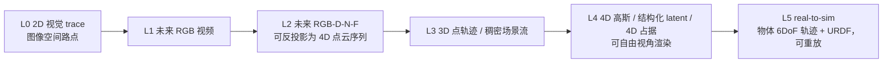

#### L0：2D 视觉轨迹（visual trace）

- **表示**：图像空间上末端执行器（及关键物体点）未来 $\Delta$ 步的 2D 路点序列，如 `[[242,115],[140,77],[94,58],...]`，整数量化到 [0,256)。
- **怎么做**：作为额外的文本 token 自回归输出（MolmoAct 的做法），几乎零成本。
- **监督**：把真值末端 3D 轨迹用相机内外参投影到图像平面即可，**完全免费**。
- **用途**：可视化预检、人工可编辑引导、给动作头当密集子目标。
- **强烈建议第一天就做。** 这是投入产出比最高的一层。

#### L1：未来 RGB 视频

- **表示**：$\hat I_{t+1:t+\Delta}^{(v)}$，多视角未来帧。
- **怎么做**：视频扩散头（LTX-Video / Wan2.2 / Cosmos-Predict2 系）。
- **代价**：高。多步去噪。**但按 GE / EnerVerse 的经验，可以低频运行（1–5 Hz）且只做 1 步去噪也能提供有用的 latent。**
- **注意**：单独的 RGB 视频**不是 4D**，它只有在配上深度/几何时才成为 4D。

#### L2：未来 RGB-D(+N/F)——**推荐的主力 4D 通道**

- **表示**：与 L1 同步生成的深度图 $\hat D$、法线图 $\hat N$、光流场 $\hat F$。有了 $\hat D$ 和内外参，每帧像素可反投影成 3D 点云；有了 $\hat F$（或跨帧对应），点云在时间上被串起来 → **这就是 4D**。
- **代表实现**：
  - [TesserAct](https://github.com/UMass-Embodied-AGI/TesserAct)：RGB-D-N，提供把生成的三通道视频转成高质量 4D 场景的算法，支持新视角合成。**有完整开源训练/推理/LoRA 微调代码**，是最好的起点。
  - [RynnWorld-4D](https://huggingface.co/Alibaba-DAMO-Academy/RynnWorld-4D)：RGB-D-F，三分支 DiT + 跨模态联合注意力 + frame-wise 3D RoPE。它明确论证了"光流比法线更接近末端动作"，因为反投影后直接就是**度量 3D 场景流**。
- **监督**：伪标签。深度用 Depth Anything 3 / 硬件深度；光流用 RAFT 系；法线从深度求导。RynnWorld-4D 为此构建了 2.544 亿帧的伪标签数据集。
- **建议**：**采用 RGB-D-F 而非 RGB-D-N**。理由是光流直接对应运动，与你要的"手臂如何活动"语义一致；法线主要帮助表面细节，对动作帮助较小。

#### L3：3D 点轨迹 / 稠密场景流——**性价比最高的 4D 输出**

- **表示**：$\{p_i(t+\tau) \in \mathbb{R}^3\}_{i=1..N, \tau=1..\Delta}$。$N$ 取 256~1024，可以是网格均匀采样 + 物体上加密 + 末端附近加密。
- **怎么做**：一个轻量 Transformer 头（几百万参数），从 prefix 直接回归。**单次前向，无需去噪。**
- **监督**：离线用 CoTracker3 / SpatialTracker V2 / TAPIP3D 跑出 2D/3D 长时轨迹；或用深度 + 光流合成 3D 场景流（GaussianDream 就是用"伪 3D 场景流"监督）。
- **优点**：
  - 极其紧凑：1024 点 × 16 步 × 3 维 = 49K 浮点，比一帧 480p 深度图还小。
  - 天然具备物体恒常性（ATM 的论点），不会像像素生成那样幻觉出物体消失。
  - 可以直接用来解算物体刚体变换（Track2Act 的 PnP 做法）→ 通往 L5。
  - **ATM 的关键发现**：给了轨迹之后，策略甚至不再需要语言指令——轨迹已经把问题降维成逆动力学。
- **强烈建议作为主力 4D 输出。**

#### L4：4D 高斯 / 结构化 3D latent / 4D 占据

- **三种子形式**：
  1. **4D 高斯**：预测高斯基元的位置/协方差/颜色及其速度。可自由视角渲染，视觉质量最好。参考 GWM、ManiGaussian、GaussianDream、DynamicVGGT 的 Dynamic 3D Gaussian Head（用 learnable motion token 在场景流监督下预测高斯速度）。
  2. **结构化稀疏体素 latent**：[Structured 4D Latent Predictive Model](https://arxiv.org/html/2607.01166v1) 的做法，编码成稀疏体素网格 latent，可解码为 3DGS。比 1D 全局 latent 保留更多空间先验。
  3. **4D 语义占据栅格**：[ORV](https://orangesodahub.github.io/ORV/) 用 T×400×400×400 的占据；自动驾驶那边的 OccWorld/Cam4DOcc 系可迁移。对"机械臂会扫过哪片空间"这个问题，占据栅格是最直接的答案，**且天然可用于碰撞检测**。
- **代价**：训练与推理都重。
- **建议**：**作为离线/低频分支**。或者采用 GaussianDream 的非对称策略——训练时用，推理时丢掉解码头只留 prefix；需要 4D 可视化时再把解码头挂回来跑一次。

#### L5：real-to-sim（可重放的 4D 场景）

- **表示**：一份可以导入 Isaac Sim / MuJoCo 的场景描述：物体网格 + 每个物体的 6-DoF 位姿轨迹 + 机器人 URDF + 关节角轨迹。
- **怎么做**：
  1. 场景静态部分：多视角 3DGS 重建 → mesh 提取（SplatSim / RoboGSim / RialTo 的流程）。
  2. 物体动态部分：从 L3 的 3D 点轨迹用 PnP/Procrustes 解出每个物体的刚体变换序列（Track2Act 的算法）。
  3. 机器人部分：预测的关节角 + URDF FK（**解析、精确**）。
- **用途**：最强的"4D 信息输出"形态——可以在任意视角重放、可以改物体位置重新仿真、可以做碰撞检查、可以生成增广数据。
- **建议**：后期做，作为差异化亮点。

#### L+：移动双臂本体专属的 4D 输出（本设定新增）

除了通用的 L0–L5，你的本体还应该输出四类别人不需要的 4D 信息：

| 输出 | 表示 | 怎么得到 | 用途 |
|---|---|---|---|
| **全身 swept volume** | 未来 H 步内整个机器人（基座+躯干+双臂+头）扫过的占据体素 | **解析**：FK + URDF 网格沿时间扫描（§4.3） | 安全预检；与场景占据求交即得碰撞预警 |
| **自碰撞风险场** | 未来每步的双臂/躯干最近距离与碰撞概率 | **解析**：URDF 胶囊体距离；训练时可另训一个快速近似头 | 门控不安全动作（CoFreeVLA 思路） |
| **基座落位可达性热力图** | 基座系地面网格上每点的"若停在此处，任务可达性"评分 | 半解析：对候选基座位姿采样 IK 可解性 + 学习修正 | 移动操作的核心决策；直接回答"我该走到哪" |
| **导航自由空间预测** | 未来若干秒内地面可通行区域的占据演化（含动态障碍） | 头部相机 4D + 持久记忆 | 移动段的路径安全 |

这四项都**同时满足**"是 4D 信息"和"能直接用于决策"两个条件，而且前两项是解析的、零学习成本。

> **第一项在文献里是空白。** 调研确认：**目前没有任何 VLA 把自身未来 swept volume 作为输出**。现有的 swept volume 工作（NeuralSVCD 等）都是独立于策略的碰撞检测模块，不在策略回路里、也不随动作块一起产生。而在本方案里，它是"预测了动作 → FK → 扫描"的自然副产品，**边际成本接近零**。这是"4D 输出越多越好"这个目标下最容易拿到、也最有实用价值的一块。

#### 六个层次的对比总表

| 层次 | 表示大小（典型） | 推理增量 | 监督来源 | 可微 | 10 Hz + 无限算力下的建议 |
|---|---|---|---|---|---|
| L0 2D trace | ~100 int | ~0 | 投影真值轨迹（免费） | ✅ | **常开**（三路都出） |
| L1 RGB 视频 | 16×256×256×3 ×3 视角 | 高（多步去噪） | 原始视频（免费） | ✅ | **常开，低频（1–3 Hz）** |
| L2 RGB-D-F | ×3 通道 ×3 视角 | 高 | 伪标签 | ✅ | **常开，低频**；头部与腕部分头 |
| L3 3D 点轨迹 | 1024×16×3 | 极低（单次前向） | 点跟踪器伪标签 | ✅ | **常开，全频（10 Hz）** |
| L4 4D 高斯/占据 | 10⁴–10⁶ 基元 | 中–高 | 多视角渲染 + 场景流 | ✅ | **常开，低频**；占据栅格优先（可直接做碰撞检测） |
| L5 real-to-sim | 场景文件 | 离线 | 重建 + 位姿求解 | ❌（非端到端） | 离线 / 按需触发 |
| L+ 本体解析 4D | 网格 + 体素 | ~1–2 ms | **解析，无需监督** | ✅ | **常开，全频** |

### 4.3 全身 4D 的「解析捷径」——本设定下价值更大

**这是本方案里最容易被低估、但收益最确定的一点，而且在可动基座双臂本体上比在单臂本体上更有价值。**

你在预测未来 $H$ 步的：基座命令 $u^{\text{base}}$、躯干/颈部关节角、双臂关节角。把基座命令积分成基座位姿轨迹（底层控制器的运动学模型已知），再套 URDF 前向运动学，就能得到**整个机器人每个连杆在每个时刻的 6-DoF 位姿**——精确、可微、零幻觉。

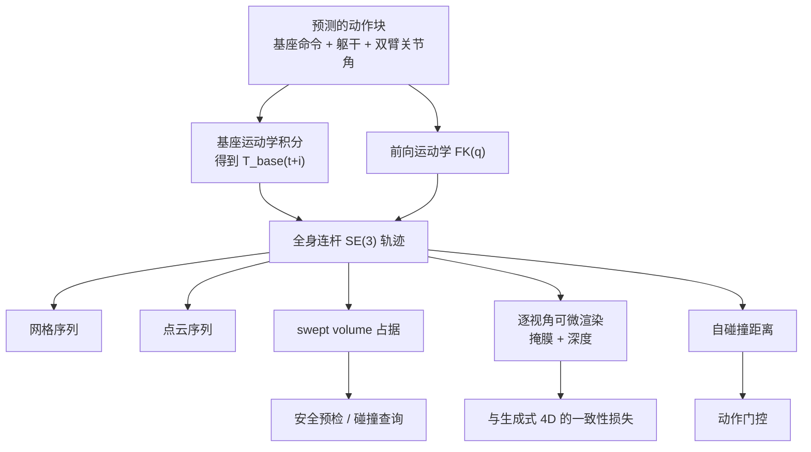

| 本体 4D 产物 | 怎么得到 | 用途 |
|---|---|---|
| 每个连杆的 $SE(3)$ 轨迹（含基座、躯干、双臂、头） | 基座积分 + FK | 最基础的全身 4D |
| 全身未来的三角网格序列 | URDF mesh + 位姿 | 可视化、碰撞检测 |
| 全身未来的点云序列 | mesh 采样 | 与场景点云拼成完整 4D 场景 |
| 全身未来扫过的 **swept volume** | 网格沿时间扫描 | **安全预检的核心产物**；与场景占据求交即得碰撞预警 |
| **自碰撞距离序列** | 胶囊体最近距离 | 双臂本体的关键安全量 |
| 每个相机视角下本体未来的**分割掩膜与深度** | nvdiffrast / PyTorch3D 可微渲染 | 与 L2 生成的深度图做一致性损失 |
| **未来相机外参** | 由预测的关节角与基座位姿解析得到 | 让 4D 生成分支知道"未来这一帧是从哪儿看的"——这是本设定特有的强条件 |

**关键用法一（本方案的核心创新点）：用解析渲染去约束生成式 4D。**

```
L_robot_consistency = || render_depth(FK(q_pred), K_v, T_v(q_pred)) ⊙ M_robot
                       - D_pred^(v) ⊙ M_robot ||_1
```

生成式 4D 分支预测出来的深度图，在"机器人像素"区域必须与由预测关节角解析渲染出来的深度一致。这条损失把**动作输出与 4D 输出硬绑定**，满足 WAM"预测的未来必须参与动作路径"的契约，同时消除生成分支在机器人本体上的幻觉。**在腕部相机上这条损失尤其强**——那里机器人本体常占 30–50% 的像素。

**关键用法二（本设定特有）：把「未来相机位姿」作为生成分支的条件输入。**

这是常规设定做不到的。常规的未来视频生成必须同时想象"场景怎么变"和"相机怎么动"；而你**已经预测了动作，因此未来每一帧的三路相机外参都是解析可得的**。把它们作为条件喂给视频/4D 生成头，等于把问题从"生成一段自由视角视频"降级成"给定相机轨迹渲染场景变化"——难度大幅下降，几何一致性也大幅提升。

**关键用法三：把 4D 显式拆成「ego 支」与「scene 支」——这是"移动 + 4D"这块空白的落地答案。**

§2.9 结尾指出：没有任何公开工作同时预测"走过去会看到什么"和"操作会发生什么"。原因不难理解——基座一动，画面里所有东西都在动，生成模型要同时负责"我怎么动"和"世界怎么变"，两件事在像素上完全纠缠。

**拆法：**

| 分支 | 内容 | 怎么得到 | 代价 |
|---|---|---|---|
| **ego 支** | 未来每一帧三路相机的位姿、本体在画面中的位置、由自运动导致的全部像素位移 | **解析**：动作块 + 基座运动学积分 + URDF FK | ~0 |
| **scene 支** | 场景与物体在**动作块起点的基座帧**下的 4D 演化 | 学习：生成/回归 | 主要成本 |

**关键在于 scene 支的参照系选择：固定在动作块起点的基座帧，而不是逐帧跟随基座。** 这样 scene 支预测的就是"世界本身怎么变"，完全不含自运动；而自运动由 ego 支解析提供。**基座运动只被建模一次，不会被建模两遍。** 需要还原到某一未来帧的相机视角时，用 ego 支的解析外参做一次变换即可。

这个拆法还有一个副产品：**scene 支的训练数据可以直接复用固定基座的数据集**（TesserAct、4D-VLA 那一批工作的设定），因为在起点基座帧下看，移动本体的数据与固定本体的数据分布是同一个。这对数据稀缺问题是实质性的缓解。

> **两个独立确认的空白**：(1) 调研确认**没有任何 VLA 把自身未来 swept volume 作为预测头输出**——现有 swept volume 工作（NeuralSVCD 等）都是独立的碰撞检测模块，不在策略回路里；(2) **没有任何工作把 URDF 自渲染深度当作生成式 4D 的免费度量锚点**。两轮独立调研分别、独立地提出了与本节相同的思路，这既说明它是自然的正确方向，也说明它确实还没被做过。**这是本方案可以直接吃到的结构性红利，实现成本却只是"跑一遍 FK + nvdiffrast"。**

**优缺点权衡：**

- 精确、免费、可微、无幻觉；把 4D 预测问题的难度砍掉一大半。
- 天然支持全身：只要有 URDF 与全身动作预测就成立。
- 天然给出自碰撞与环境碰撞的查询能力，这是双臂移动本体最需要的安全保障。
- 要求 URDF 与实物一致、标定准确、底层控制器的跟踪误差可建模（基座积分尤其依赖这一点——轮式打滑会引入误差，建议用里程计反馈闭环校正而非纯开环积分）。
- 只覆盖机器人本体，不覆盖被操作物体与环境——那部分仍需神经网络。

### 4.4 双手-物体-场景三方交互的 4D 表达

双臂操作的 4D 与单臂最大的不同：**被操作物体可能同时受两只手作用**，其运动是两只手运动的联合结果。建议显式建模三方关系：

| 输出 | 表示 | 说明 |
|---|---|---|
| **接触状态** | 每只手 × 每个物体的二值接触 + 接触点 3D 位置（基座系） | 从夹爪开度突变 + 掩膜相交反标注即可得到监督 |
| **物体 6-DoF 轨迹** | 每个被操作物体未来 H 步的 $SE(3)$ | 来自 L3 点轨迹的刚体拟合（Procrustes / PnP） |
| **手-物相对运动** | $T^{\text{obj}\leftarrow\text{ee,L}}$、$T^{\text{obj}\leftarrow\text{ee,R}}$ 的时序 | **抓稳时这两项应保持恒定**——这是一条极强的自监督约束 |
| **闭链一致性** | 双手同时抓同一刚体时，$T^{\text{ee,L}\leftarrow\text{ee,R}}$ 恒定 | 与 §4.1.5 的动作侧约束呼应，形成动作-4D 双向绑定 |

> **一条很有用的自监督损失**：当模型预测"左手在 $t+i$ 时刻与物体 A 接触"时，就应该同时满足 $T^{\text{obj A}}(t+i) = T^{\text{ee,L}}(t+i) \cdot T^{\text{grasp}}_{\text{const}}$。也就是说，**接触预测、物体轨迹预测、动作预测三者必须自洽**。这条约束不需要任何额外标注，却能同时改善三个输出头。

**一个现成的紧凑表示**：[RoTri](https://arxiv.org/abs/2606.13627) 把双臂-物体的三元关系编码成 $[\,p_{L \to R},\ p_{L \to \text{obj}},\ p_{R \to \text{obj}}\,] \in \mathbb{R}^{21}$（三组相对位置/位姿），作为 VLA 的中间表征。它的好处是**只有 21 维、完全由几何决定、与本体无关**，可以跨机器人迁移。建议直接把它作为 4D 输出的一个轻量层（挂在 L1 附近），既是有用的 4D 信息，又是上面那条自洽约束的天然载体。

> **闭链约束仍是公开空白，但你可以用纯几何补上。** 调研确认没有任何工作把闭链约束硬编码进 VLA。最接近的 Structure-Aware DP 用 CDTS 表征（绝对 + 相对分解）把成功率从 58% 提到 89%，但它依赖力反馈——你没有力控。**好消息是闭链约束本身是纯运动学的**：两手刚性抓同一刚体时 $T^{\text{ee,L}\leftarrow\text{ee,R}}$ 恒定，这条不需要任何力信息就能写成损失（§4.5）。

### 4.5 输出一致性约束总表

把动作和 4D 绑在一起的所有可用损失：

| 损失 | 形式 | 作用 |
|---|---|---|
| FK 一致性 | $\|\text{FK}(q_{\text{pred}}) \ominus T^{\text{ee}}_{\text{pred}}\|$ | 两个动作头自洽 |
| 本体渲染一致性 | §4.3 | 动作 ↔ 生成式 4D |
| 未来相机位姿条件 | 把解析外参喂给生成头 | 动作 → 4D 的硬条件 |
| 末端 trace 一致性 | $\|\Pi_v(\text{FK}(q_{\text{pred}})_{\text{ee}}) - \text{trace}^{(v)}_{\text{pred}}\|$ | 动作 ↔ L0 |
| 点轨迹-动作一致性 | 末端附近的预测 3D 点应随末端刚体运动 | 动作 ↔ L3 |
| **闭链一致性** | 双手抓同一刚体时相对位姿恒定 | 双臂协同 ↔ 4D |
| **抓握恒定性** | 接触期间手-物相对位姿恒定 | 接触预测 ↔ 物体轨迹 ↔ 动作 |
| **自碰撞门控** | 预测的本体 4D 自交则惩罚 | 安全 |
| **ego-flow 一致性** | 预测的场景流在静止区域应等于解析 ego-flow | 自运动解耦（本设定特有） |
| 跨视角几何一致性 | 视角 $v_1$ 的点图投影到 $v_2$ 应对齐（[Geometry-aware 4D](https://arxiv.org/html/2507.01099v3) 的做法） | 多视角自洽 |
| 逆动力学闭环 | 从预测的 4D 反解动作，应等于预测的动作 | 双向约束 |

---

## 5. 架构候选与决策

### 5.0 先定分层：三层架构是前提，不是候选之一

在讨论"用哪种 WAM 架构"之前，必须先确定系统的分层。对可动基座双臂本体，**三层是共识**：

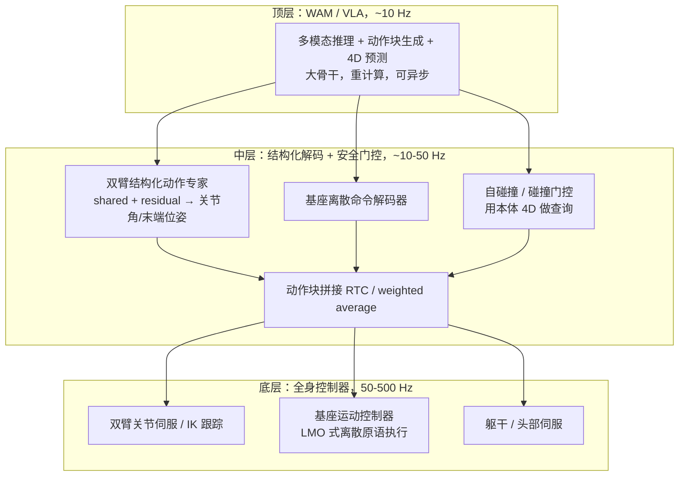

**依据**：[WholeBodyVLA](https://arxiv.org/html/2512.11047v1) 的 VLA 层 ~10 Hz + LMO 控制器 50 Hz；Figure Helix 的 S2 ~7–9 Hz + S1 200 Hz；GR00T-WholeBodyControl 的 VLA 2.5 Hz + SONIC WBC 50 Hz。**你的 10 Hz 指标只约束顶层。**

**一个需要留意的反面意见**：[OpenHLM](https://arxiv.org/abs/2606.22174) 明确指出，把上下半身解耦成独立控制器会"限制协同，产生类似轮式双臂平台的行为"，他们主张 whole-body native 的端到端做法。但注意——**他们批评的正是"轮式双臂平台式的行为"，而你的本体本来就是轮式双臂平台**。对双足人形，全身协调（比如弯腰时用腿部补偿）是刚需；对可动基座本体，基座与上身的动力学耦合弱得多，分层的代价小得多。**因此对你的本体，分层是合适的选择**；但如果躯干有大范围升降且重心变化明显，需要在中层加一个简单的稳定性约束。

### 5.1 方案 A：VLA 底座 + 非对称 4D 辅助头（轻量，在你的设定下不推荐作为终态）

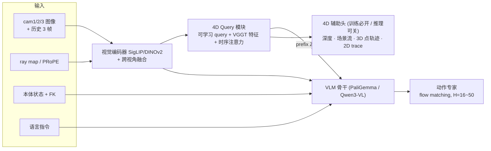

- **核心思想**：来自 [GaussianDream](https://arxiv.org/html/2605.20752) 的非对称设计 + [Spatial Forcing](https://github.com/OpenHelix-Team/Spatial-Forcing) 的特征对齐 + [G³VLA](https://arxiv.org/html/2606.24472) 的几何注入。
- **4D 输出**：L0（2D trace）+ L3（3D 点轨迹）常开；L2（深度/流）通过挂回辅助头按需产生。
- **优点**：推理开销几乎不增（辅助头可丢），改动可控，能复用 π0.5/GR00T 权重。
- **缺点**：**4D 输出的生成性弱**——不能外推较长的未来、不能做新视角合成、不能做反事实推演（"如果这样动会怎样"）。这三点恰恰是"4D 信息越多越好"这个需求最想要的。
- **在你的设定下的定位**：**不作为终态，但值得作为并行的对照基线与降级模式**。理由：①它是消融矩阵里的关键对照组，用来量化"闭环生成 4D 到底比辅助监督好多少"；②当 4D 分支出问题时可以降级到它；③它的所有组件（几何注入、伪标签、4D 辅助头）在方案 B/C 里全部复用，不是沉没成本。

### 5.2 方案 B：慢 4D 世界模型 + 快动作专家（双频双系统）

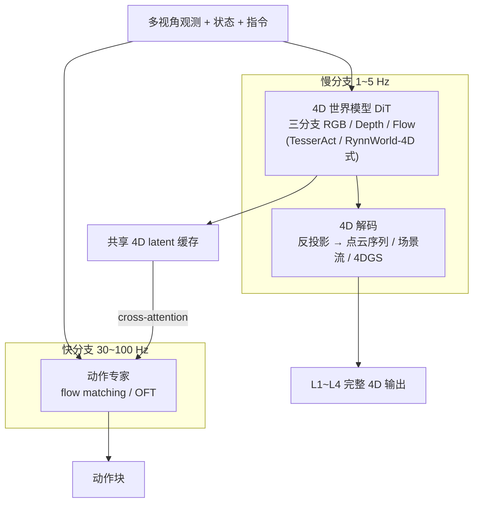

- **核心思想**：这正是 [Genie Envisioner](https://arxiv.org/html/2508.05635) 的 slow-fast 异步、[EnerVerse](https://arxiv.org/html/2501.01895v3) 的复用首步去噪特征、[RynnWorld-4D-Policy](https://huggingface.co/Alibaba-DAMO-Academy/RynnWorld-4D) 的"动作头直接吃内部 4D latent 单次前向"三者的合流。
- **关键工程点**：动作专家**不等**世界模型把像素解出来，只读它的中间 latent。世界模型低频跑，需要输出可视 4D 时再多跑几步去噪。
- **在你的设定下的关键增强**：由于**未来相机外参解析可得**（§4.3），慢分支的生成条件比常规设定强得多——它不需要想象相机怎么动，只需要在给定相机轨迹下渲染场景变化。这会显著提升生成质量与几何一致性。
- **优点**：4D 输出最丰富（L1–L4 全有）、可外推、可新视角、可反事实；动作分支延迟低。
- **缺点**：训练复杂度高，需要两阶段训练 + 精细的 latent 接口设计；显存占用大（算力不限时不是问题）。
- **参考数字**：GE-Act 动作解码器仅 160M；EnerVerse-A 在 RTX 4090 上 8 步动作块约 280 ms；RynnWorld-4D-Policy 达到 9 Hz+ 闭环双臂；LingBot-VA 在 RoboTwin 2.0 上 Easy 92.9% / Hard 91.6%，超过 π0、π0.5、X-VLA。
- **双臂/移动的适配**：慢分支要做 loco/mani 分离（§2.7 的 WholeBodyVLA 发现）——建议两个 4D 头，一个吃头部相机预测场景级 4D，一个吃腕部相机预测接触级 4D。

### 5.3 方案 C：统一 DiT + latent frame injection（架构最优雅）

- **核心思想**：完全照搬 [Cosmos Policy](https://github.com/NVlabs/cosmos-policy) —— **不改任何架构**，把 proprio、action chunk、future proprio、future images、value 全部编码成"隐帧"，插进视频模型的 latent diffusion 序列里。官方的帧布局是：

  | 位置 | 内容 |
  |---|---|
  | 0 | 占位空帧 |
  | 1 | 当前 proprio |
  | 2–4 | 当前图像（1 腕部 + 2 第三人称）|
  | 5 | 动作块（K × d_act）|
  | 6 | 未来 proprio |
  | 7–9 | 未来图像 |
  | 10 | value（未来累计回报）|

- **你的扩展**：把 depth / flow / 3D 点轨迹 / **未来相机外参** / **自碰撞风险** 也编码成隐帧插进去，就得到了一个原生的 4D-WAM。隐帧机制的优雅之处在于**加新模态不需要改架构**，只需要多插一帧。
- **双臂/移动的适配**：帧布局改为 `[空帧, 当前 proprio(含基座), 头部图, 左腕图, 右腕图, 俯视虚拟图, 动作块(双臂+基座+躯干), 未来 proprio, 未来相机外参, 未来三视角图, 未来深度, 未来场景流, 3D点轨迹, value]`。
- **推理技巧**：动作跑 5–20 步去噪（算力不限可多跑），未来状态和 value 各 1 步；**best-of-N 采样 + value 排序做测试时规划**（见 §5.5）。
- **成绩**：LIBERO 98.5%、RoboCasa 67.1%，真机双臂最高分。
- **优点**：架构极简；天然同时是策略、世界模型和价值函数；**天生支持基于模型的规划**——这在算力不限时是决定性优势。
- **缺点**：绑定 Cosmos-Predict2 生态；没有官方对"额外几何模态隐帧"的支持，需要自己摸索；许可证需确认（Cosmos 3 为 OpenMDW-1.1）。

### 5.4 决策：在 10 Hz + 无限算力下应该选什么

常规决策树（"3 个月内要结果吗""算力够吗"）在你的设定下大部分分支都不成立。重新推导：

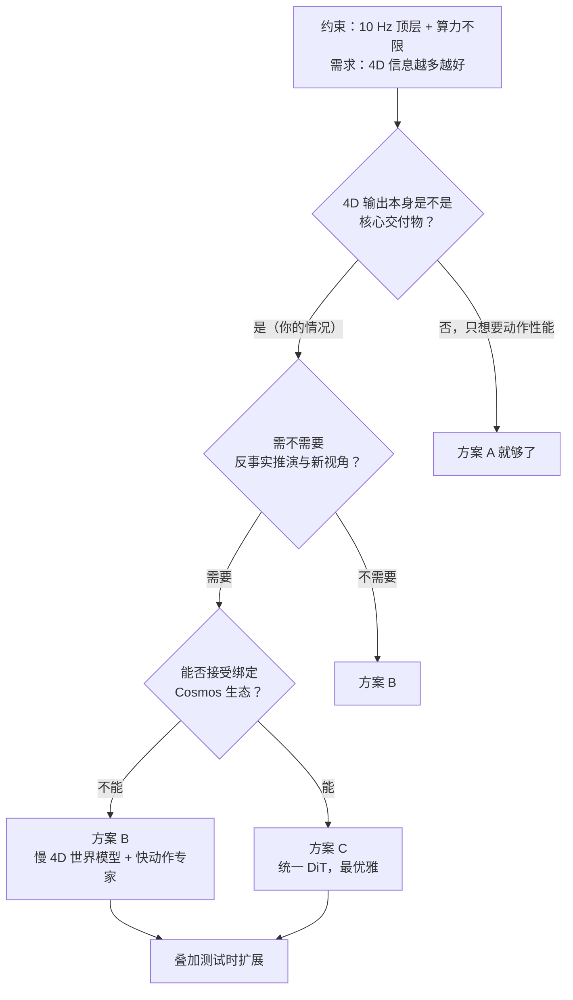

**本方案的推荐：以方案 B 为主线，把方案 A 作为对照基线并行保留，把方案 C 作为可选的架构简化路径。**

理由：

1. **方案 B 的 4D 输出最完整且可控**。它能给出 L1–L4 全部层次，包括新视角合成与长时外推——这是"4D 越多越好"的直接答案。方案 A 做不到，方案 C 能做到但绑定更深。
2. **方案 B 的双分支结构天然适配 loco/mani 分离**。WholeBodyVLA 的发现（操作与移动的视觉模式冲突）要求 4D 侧也分头处理，方案 B 的模块化让这件事很自然；方案 C 的单一 DiT 里做这种分离要别扭得多。
3. **方案 A 必须保留为对照**。整个项目最该回答的问题是"闭环生成 4D 相对于纯辅助监督，到底带来多少动作性能提升"。没有 A 作对照，这个问题无解，而且很可能出现"4D 看起来很漂亮但对动作没帮助"的情况（§10 的 R9）。
4. **方案 C 值得小规模并行探索**。它的隐帧机制在"想加新的 4D 模态"时扩展性最好，而你恰好要加很多种。如果小规模验证顺利，可以作为长期架构。

### 5.5 测试时扩展：10 Hz 下最被低估的一块收益

这是算力不限带来的、常规方案完全没有的能力。核心思路：**既然有一个世界模型能预测"这样动会发生什么"，就不该只用它当监督，而应该用它来挑动作。**

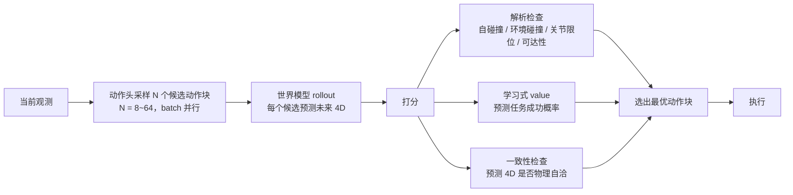

**四条打分通路，按实施成本排序：**

| 打分方式 | 怎么算 | 成本 | 对双臂移动本体的价值 |
|---|---|---|---|
| **解析安全检查** | 用 §4.3 的本体 4D 做自碰撞/环境碰撞/关节限位/可达性查询 | 极低（毫秒级，纯几何） | **极高**。自碰撞与撞环境是这类本体的主要失败模式，而这类失败完全可以在执行前查出来 | 
| **Value 头打分** | 在模型里加一个 value 隐帧/头，预测未来累计回报（Cosmos Policy 已内置） | 低（与动作同一次前向） | 高 |
| **世界模型 rollout 一致性** | 对每个候选生成未来 4D，检查是否与物理常识一致（物体不穿模、不消失） | 中 | 中 |
| **完整 MPC / CEM** | 多轮采样-评估-精化 | 高 | 视任务而定；精细对准任务收益大 |

**为什么 10 Hz 下这件事变得可行**：N 个候选动作块可以在 batch 维度**完全并行**，算力不限时墙钟时间几乎不随 N 增长。2 秒的块预算里（§1.2.1），跑一次 N=32 的批量前向 + 解析碰撞检查是非常宽裕的。

#### 5.5.1 但有一组对照必须先看：测试时想象的价值高度依赖 OOD 程度

这是本节最重要的一个判断，两组结果表面矛盾、实际互补：

| 研究 | 结论 | 设定 |
|---|---|---|
| [**Fast-WAM**](https://arxiv.org/html/2603.22078v2) 的受控消融 | **去掉测试时想象几乎不掉分**（91.8 → 90.6 / 91.3）；但**去掉训练时视频共训会崩**（→ 83.8，真机叠毛巾掉到 10%） | **全部是域内任务** |
| [**DreamZero**](https://arxiv.org/abs/2602.15922) | 带世界模型想象的 WAM 相对纯 VLA 有 **2 倍以上**优势 | **零样本新任务** |

**合起来读**：测试时想象的价值随 OOD 程度**单调上升**，在域内接近于零。

**对本方案的直接含义：**

- **训练时的 4D / 视频共训是刚需，不能省。** Fast-WAM 的 83.8 和真机 10% 是硬证据。
- **测试时想象是"按需开启"的，不是常开。** 建议做成可配置：域内熟悉任务关掉（省算力、降延迟），遇到新物体/新场景/新指令组合时打开。判据可以用 value 头的置信度或 4D 预测的不确定度。
- **评测时必须分开报域内和 OOD**，否则你会得出"测试时扩展没用"的错误结论（§8.3）。

#### 5.5.2 候选采样的成本-收益：不要用完整 MPC，用 best-of-N

[**RoboMonkey**](https://arxiv.org/abs/2506.17811) 给了一条很有用的经验规律：**动作误差随采样数呈指数幂律下降**。更实用的是它的实现细节——**候选不必每个都跑一次完整前向，用高斯扰动生成即可**，成本低得多。16 个候选 + 验证约 **650 ms**；收益是 **OOD +25%，域内只有 8–9%**（又一次印证 §5.5.1）。

[**Pre-VLA**](https://arxiv.org/abs/2604.02061) 是更轻的一档：每个动作块 **183.9 ms** 的验证开销，且可与主推理并行。LIBERO 30.79% → **37.62%**。

完整 MPC / CEM 则要慎重，原因在 §1.2.5 已说过：**它扩的是"深度"，加 GPU 不会变快。** 一个对比数字很能说明问题——[V-JEPA 2-AC](https://arxiv.org/abs/2506.09985) 在**潜空间**做 CEM，8000 条 rollout 在单张 4090 上 **16 秒**；Cosmos 在**像素空间**做同样的规划需要 **4 分钟/动作**。潜空间快 15 倍还多跑 10 倍样本。**如果你确实要做 MPC，一定在 latent 空间做，不要在像素空间做。**

[**Cosmos Policy**](https://github.com/NVlabs/cosmos-policy) 的 best-of-N 约 **5 秒/动作块**，超出你的 2 秒预算，需要减少候选数或去噪步数。它还有两条工程经验值得记：训 value 头需要 **rollout 数据**（含失败样本，他们用了 648 条），且这部分要占 **90% 的批次权重**；**基于模型的 $V(s')$ 打分优于免模型的 $Q(s,a)$ 打分**。

#### 5.5.3 一个几乎免费的加速：单步蒸馏

[**SnapFlow**](https://arxiv.org/abs/2604.11889) 的单步蒸馏在 π0.5 上：LIBERO **1 步 98.75%** vs **10 步 97.75%**，**9.6 倍加速且分数不降反升**。这看起来像免费午餐，但真正的用法不是"省算力"（你不缺算力），而是**把省下的串行深度换成并行宽度**——同样的墙钟时间里，1 步采样能跑出的候选数是 10 步的 9.6 倍。**在 best-of-N 的框架下，蒸馏和测试时扩展是相乘而非相斥的关系。**

#### 5.5.4 最低限度的建议

即使不做上面任何一条，也**一定要做"解析安全检查 + 拒绝采样"**。这一条几乎零成本（本体 4D 反正要算），却能直接消除一大类硬失败：采样 8 个候选动作块 → 对每个算 swept volume → 与场景占据和自身求交 → 丢弃有碰撞的 → 在剩下的里选 value 最高的。全部有碰撞则退回"停止 + 重新规划"。**这是纯几何计算，没有任何模型不确定性，是整个测试时扩展里可靠性最高的一环。**

---

## 6. 推荐方案详解

### 6.1 整体架构

推荐架构 = 方案 B（慢 4D 世界分支 + 快动作专家）+ 双臂结构化动作头 + 基座离散命令头 + 全身解析 4D + 测试时安全筛选。

```
════════════════════════════ 输入层 ════════════════════════════
 头部相机 ── 左腕相机 ── 右腕相机   × 历史帧 {t-10, t-5, t}
 ★ 基座系 pointmap（三路） + EE 系 pointmap（双腕，解析反投影）
 [虚拟第四路] 基座系俯视重渲染图（BridgeVLA 式，姿态稳定的参照）
 逐帧 ray map（FK 解析，基座系）  |  ego-flow（解析）  |  本体自遮挡掩膜（解析）
 全身状态：双臂 q/q̇/T_ee/T_rel/gripper、躯干、颈部、基座位姿与速度、自碰撞距离
 ★ 前滚状态（用上一动作块推到预计执行起点，VLASH 式）
 持久空间记忆 token（世界系体素 + 物体 6-DoF 记忆表，投影到当前基座系）
 语言指令  |  embodiment / 运动模式 token
════════════════════════════════════════════════════════════════
                              ▼
┌──────────────────── 视觉 / 几何编码 ────────────────────┐
│ 视觉塔（沿用底座的 SigLIP / Qwen3-VL 视觉塔）             │
│  + pointmap 逐元素相加（See like a Robot；不可拼接）      │
│  + 零初始化 ray embedding（G³VLA，逐帧重算）              │
│  + Ego3D PE（SpatialVLA）                                 │
│  + 跨视角注意力（PRoPE，带解析相对位姿）                   │
│  + [仅头部路] VIB 正则，抑制第三人称过拟合                 │
│  ├─→ [训练] VGGT / DA3 教师特征 → 余弦对齐（Spatial Forcing）│
│  └─→ 4D Query 模块 → Z_4D prefix                          │
└────────────────────────┬─────────────────────────────────┘
                         ▼
┌─────── VLM 骨干（π0.5 / GR00T N1.7 初始化，可上更大规模）───────┐
│ prefix = [三路视觉 tok | 俯视虚拟视角 tok | Z_4D | 记忆 tok       │
│           | 全身状态 tok | embodiment tok | 文本 tok]            │
│ 自回归输出：子任务文本、L0 2D trace（三路）、协同模式、运动模式    │
└────────────────────────┬─────────────────────────────────────┘
         ┌───────────────┼────────────────────────────┐
         ▼               ▼                            ▼
   ┌─────────── 沿运动学链自回归：① base → ② torso/neck → ③ arms ──────────┐
   ▼                                                                        ▼
┌─────────────────┐ ┌──────────────────┐  ┌─────────────────────────┐
│ 慢 4D 世界分支   │ │ ③ 双臂结构化专家   │  │ ① 基座命令头 ② 躯干/头部 │
│  1~3 Hz          │ │  10 Hz            │  │  10 Hz                   │
│ scene 支：DiT    │ │ 协同门控 α        │  │ 离散原语 AR 解码          │
│ RGB / D / Flow   │ │ + shared latent   │  │ + 躯干俯仰升降            │
│ 锚在块起点基座帧 │ │ + L/R residual    │  │ + 颈部朝向（主动视觉）    │
│ ego 支：解析     │ │ flow matching     │  └───────────┬─────────────┘
│ 条件：**解析的   │ │ 5~20 步去噪       │              │ 已去噪结果作条件
│ 未来相机外参**   │ │                   │◀─────────────┘
│ ├ 头部头：场景级 │ │ 读慢分支 latent    │
│ └ 腕部头：接触级 │ │  (cross-attention) │
└────────┬────────┘ └─────────┬──────────┘
         │                    ▼
┌──────────────────┐  q_arm, T_ee, T_rel, gripper, u_base, q_torso/neck
│ 4D 解码组         │              │
│ L1 未来 RGB       │              ▼
│ L2 未来 D / Flow  │   ┌────────────────────────────────┐
│ L3 3D 点轨迹      │   │ 全身解析 4D（FK + URDF + 渲染） │
│ L4 4D 占据 / 4DGS │   │ 连杆位姿 / 网格 / 点云          │
│ L5 real-to-sim    │   │ swept volume / 自碰撞距离       │
│ L+ 可达性热力图    │   │ 逐视角掩膜与深度 / 未来外参     │
└────────┬─────────┘   └───────────┬────────────────────┘
         │                         │
         │   ┌─────────────────────┴──────────┐
         │   │ 一致性损失（训练）              │
         │   │ 安全查询与候选筛选（推理，§5.5） │
         │   └────────────────────────────────┘
         ▼
   完整 4D 输出（可视化 / 导出 / 决策）
```

**几个必须理解的连接关系：**

1. **动作 → 4D 的硬条件**：动作块决定了未来的相机外参，把它作为慢分支的条件输入。这是本设定独有的强约束。
2. **4D → 动作的软条件**：动作专家通过 cross-attention 读慢分支的中间 latent，不等它解出像素。
3. **解析 4D ↔ 生成 4D 的一致性**：本体区域的深度/掩膜必须一致，消除本体幻觉。
4. **解析 4D → 安全门控**：swept volume 与自碰撞距离直接用于候选动作筛选。
5. **loco / mani 分离贯穿始终**：视觉编码后分两路 4D 头，动作侧分双臂专家与基座命令头，潜动作监督也用两套码本。
6. **动作侧的三级条件链**：基座命令先出，躯干/颈部以它为条件，双臂再以两者的**已去噪结果**为条件（WB-VIMA）。这条链与第 1 条形成闭环——基座与躯干一旦定下，未来相机外参就确定了，慢分支可以立刻拿到条件。
7. **4D 的 ego / scene 二分**：ego 支（自运动导致的一切）走解析路径，scene 支（世界本身怎么变）走生成路径且锚在动作块起点的基座帧。**基座运动只被建模一次。**

### 6.2 各模块的具体选型

| 模块 | 推荐选择 | 备选 | 理由 |
|---|---|---|---|
| 实验框架 | [StarVLA](https://github.com/StarVLA/StarVLA)（MIT） | openpi / Isaac-GR00T / LeRobot | backbone × head 正交，能在同一套代码里横向对比多种动作头与 VLM/世界模型骨干 |
| 初始权重 | `pi05_base`（openpi） | `nvidia/GR00T-N1.7`（Apache 2.0） | [OpenHLM 的受控实验](https://arxiv.org/abs/2606.22174)：π0.5 初始化的"看到错误→纠正→重试"闭环行为能跨本体迁移，而 PaliGemma 初始化不能——且这个差距用 action MSE 完全看不出来 |
| 双臂动作头 | **Co-VLA 式 SAE + SkillVLA 式协同门控 α + LAC**（三者必须一起） | TwinVLA 式双单臂 + joint attention | 紧耦合 +27 个百分点；但**SAE 单独用会掉分（63→57%）**，且无门控时未见技能组合归零（π0.5 0% / TwinVLA 4% / 有门控 51%） |
| 动作头组织 | **沿运动学链自回归去噪**：base → torso → arms，下游以上游**已去噪**结果为条件 | 三个独立头 / 一个大平铺向量 | WB-VIMA、AC-DiT、G0.5 三条独立路线收敛；反证是 OpenHLM 的 81 维 SMPL 落后 32 维联合关节 13 个百分点 |
| 基座命令头 | **离散原语 AR 解码**（LMO 式） | 连续速度回归 | WholeBodyVLA 对照实验：连续速度版本成功率低 24 个百分点 |
| **视觉输入表征** | **基座系 pointmap（主）+ 腕部额外 EE 系 pointmap**，逐元素相加注入 | 纯 RGB + 深度通道 | See like a Robot：27.9 → 34.7 → 36.9；视角随机化下纯 RGB 掉 9.6 而 pointmap 只掉 1.8。**注入方式：相加 34.7 > 拼接 30.7 > 点云分支 24.2** |
| 参照平台 / 数据 | **Galaxea R1-Lite / R1 Pro 生态**（500+ 小时开源数据 + G0.5 + `r1pro_wbc` 配置） | AgiBot World / RoboTwin 2.0 | 硬件逐项同构：全向轮式基座 + 4-DoF 躯干 + 双臂 + 头部 ZED 2 + 双腕 ZED-Mini + T265 |
| 慢 4D 世界分支 | [RynnWorld-4D](https://huggingface.co/Alibaba-DAMO-Academy/RynnWorld-4D) 式三分支 DiT（RGB-D-Flow） | [TesserAct](https://github.com/UMass-Embodied-AGI/TesserAct)（RGB-D-N，开源完整）；Wan2.x / Cosmos-Predict2 微调 | 光流分支反投影后直接是度量 3D 场景流，与"手臂如何运动"语义一致 |
| 4D 头拆分 | **两个独立头**：头部相机→场景级 4D，腕部相机→接触级 4D | 单一共享头 | WholeBodyVLA 的双 LAM 发现；尺度差 100 倍不能共用归一化 |
| 视觉塔 | 沿用底座的视觉塔；训练时额外挂 VGGT 或 DA3 做教师 | DINOv3 | Spatial Forcing 证明特征对齐比换视觉塔更划算 |
| 几何注入 | **逐帧** ray map + PRoPE（零初始化）+ Ego3D PE | 只用其中一种 | 外参每帧都变，模型无法靠记住固定布局蒙混，几何注入的价值比常规设定更高 |
| 虚拟第四视角 | BridgeVLA 式基座系俯视重渲染 | 无 | 人为造一个"姿态稳定的第三人称视角"，补偿三路相机全动的缺陷 |
| 持久空间记忆 | 世界系 TSDF/体素 + 物体 6-DoF 记忆表 + 投影成 token | 纯隐式 memory token | 可解释、可直接用于碰撞与导航 |
| 里程计 | 轮式里程计 + IMU 融合；视觉里程计做校正 | 纯视觉 SLAM | 连接基座系与世界系 |
| 深度伪标签 | 硬件深度优先；补 [DA3METRIC-LARGE](https://huggingface.co/depth-anything/DA3METRIC-LARGE)（0.35B, Apache 2.0） | Depth Anything V2 | DA3 直接预测深度而非视差，几何精度更好 |
| 点图/位姿 | **[MapAnything](https://map-anything.github.io/)（Apache 2.0）的 calibrated-MVS 模式**，或 [OmniVGGT](https://arxiv.org/abs/2511.08222) 的 GeoAdapter 零卷积注入已知位姿 | VGGT / DA3 Nested；[TTT3R](https://rover-xingyu.github.io/TTT3R/)（20 FPS / 6 GB / training-free，长序列兜底） | **不要让模型再估你已知的位姿**。OmniVGGT 注入已知位姿后误差 0.104 → 0.036（降 65.4%）。**注意：目前没有任何单一模型同时具备"在线流式 + 位姿可注入 + 度量 + 动态"四项**，需要组合 |
| 点跟踪 | CoTracker3 / SpatialTracker V2 / TAPIP3D | — | 详见 §7.2 |
| 光流 | RAFT 系；**减去解析 ego-flow 得残差流** | 从点图差分 | 残差流才是真正的场景运动信号 |
| 分割 | SAM 2 + Grounded-SAM | — | 物体级 4D 与 real-to-sim 的前提 |
| 可微渲染 | nvdiffrast（快）或 PyTorch3D（易用） | Isaac 渲染 | 用于全身解析 4D |
| 可微 FK | [pytorch_kinematics](https://github.com/UM-ARM-Lab/pytorch_kinematics) | urdfpy（不可微） | FK 一致性损失要求可微 |
| 自碰撞检测 | URDF 胶囊体最近距离（解析）+ 轻量近似网络 | FCL / Bullet | 解析版做真值，网络版做在线快速门控 |
| 底层控制器 | RL 训练的离散原语基座控制器（LMO 式）+ 双臂关节伺服 | 传统导航栈 + IK | 与顶层离散命令接口匹配 |

### 6.3 损失函数清单

$$\mathcal{L} = \underbrace{\lambda_a \mathcal{L}_{act}}_{\text{主任务}} + \underbrace{\lambda_{fk}\mathcal{L}_{fk} + \lambda_{tr}\mathcal{L}_{trace} + \lambda_{pt}\mathcal{L}_{ptrack}}_{\text{轻量 4D + 一致性}} + \underbrace{\lambda_d \mathcal{L}_{depth} + \lambda_f \mathcal{L}_{flow} + \lambda_{rgb}\mathcal{L}_{render}}_{\text{稠密 4D}} + \underbrace{\lambda_{sf}\mathcal{L}_{align} + \lambda_{rc}\mathcal{L}_{robot}}_{\text{对齐与自洽}}$$

| 分组 | 损失 | 定义 | 建议权重 | 备注 |
|---|---|---|---|---|
| 动作 | $\mathcal{L}_{act}$ | flow matching：$\|v_\theta(\tau\epsilon+(1-\tau)a^*, c, \tau) - (\epsilon - a^*)\|^2$，双臂连续部分 | 1.0 | 主任务 |
| 动作 | $\mathcal{L}_{base}$ | 基座离散命令的交叉熵 | 0.5 | 离散头 |
| 动作 | $\mathcal{L}_{coord}$ | Co-VLA 式协同结构损失：约束 shared latent 编码任务级协同、residual 编码单臂执行 | 0.2 | **双臂核心** |
| 一致性 | $\mathcal{L}_{fk}$ | 关节角 FK 与末端位姿一致 | 0.1 | 几乎免费 |
| 一致性 | $\mathcal{L}_{chain}$ | 闭链任务中双臂相对位姿恒定 | 0.2（仅闭链样本） | **双臂核心** |
| 一致性 | $\mathcal{L}_{grasp}$ | 接触期间手-物相对位姿恒定 | 0.2 | 无需额外标注 |
| 一致性 | $\mathcal{L}_{robot}$ | 全身解析渲染深度/掩膜与生成深度一致（§4.3） | 0.2 | **本方案自研点** |
| 一致性 | $\mathcal{L}_{ego}$ | 静止区域的预测场景流应等于解析 ego-flow | 0.1 | **本设定特有** |
| 4D 轻量 | $\mathcal{L}_{trace}$ | 三路 2D 路点交叉熵 / L1 | 0.1 | |
| 4D 轻量 | $\mathcal{L}_{ptrack}$ | 3D 点轨迹 L1 + 可见性 BCE（基座系） | 0.5 | **核心 4D 监督** |
| 4D 稠密 | $\mathcal{L}_{depth}$ | scale-invariant + 梯度损失，**头部与腕部分开归一化** | 0.3 | 有硬件深度时权重可调高 |
| 4D 稠密 | $\mathcal{L}_{flow}$ | 残差流 EPE，带有效性掩膜 | 0.3 | 用残差流不用原始光流 |
| 4D 稠密 | $\mathcal{L}_{rgb}$ | 未来 RGB 的扩散损失 | 0.3 | 慢分支 |
| 4D 重型 | $\mathcal{L}_{occ}$ | 4D 占据的 BCE / Focal | 0.2 | 可直接用于碰撞检测 |
| 4D 重型 | $\mathcal{L}_{render}$ | 4DGS 渲染的 L1 + SSIM/LPIPS | 0.1 | 仅 L4 分支开启时 |
| 对齐 | $\mathcal{L}_{align}$ | 与 VGGT/DA3 特征的余弦相似度（Spatial Forcing） | 0.5 | 监督**较深但非最深**的层 |
| 对齐 | $\mathcal{L}_{lam}$ | 潜动作 token 预测（**mani 与 loco 两套码本各一项**） | 0.3 + 0.3 | S1 阶段主力 |
| 安全 | $\mathcal{L}_{selfcol}$ | 未来自碰撞风险的 BCE（真值由 URDF 解析生成） | 0.2 | **双臂本体必需** |
| 安全 | $\mathcal{L}_{reach}$ | 基座落位可达性热力图的 BCE | 0.1 | 移动操作 |

**调参提示：**

- Spatial Forcing 指出对齐损失应加在"较深但不是最深"的层——最深层丢失了太多视觉特征，难以被几何监督。建议在骨干的 60–80% 深度处做扫描实验。
- **分阶段开启**比一次全开更稳：先动作 + 一致性，再加 4D 轻量，再加 4D 稠密，最后加重型与安全。

**关于"20 个损失项怎么平衡"——这是本方案最大的工程风险，值得单列。** 调研发现，实际做成的系统**基本不靠调损失权重**，而是用结构性手段绕开：

| 手段 | 出处 | 做法 |
|---|---|---|
| **批次划分代替损失加权** | [Cosmos Policy](https://github.com/NVlabs/cosmos-policy) | 不给不同任务配权重，而是**划分批次比例**（先 50/50，后期 10/90 偏向动作）。梯度尺度天然由样本数决定，比手调 $\lambda$ 稳定得多 |
| **分阶段 + 分支 dropout + 余弦衰减注入** | [RynnWorld-4D](https://arxiv.org/html/2607.06559) | 分阶段训练；训练中随机 drop 掉某些分支强制各分支独立可用；4D latent 向动作头的注入强度按余弦衰减 |
| **用视频权重插值初始化动作权重** | [LingBot-VA](https://arxiv.org/abs/2601.21998) | 动作头不随机初始化，而是从视频分支权重插值而来，起点就在同一个 basin 里 |
| **非对称优先级投影** | GCR-PPO | 发生梯度冲突时**只调整低优先级任务的梯度**，高优先级（动作）梯度不动。比 PCGrad 的对称投影更适合"有明确主任务"的场景 |

**建议的优先序**：批次划分（最简单、最有效）→ 分阶段开启 → 分支 dropout → 非对称投影。**不确定性加权（Kendall 式）和 PCGrad 作为兜底，不作为首选**——它们在 20 个损失项的规模下调试成本很高，且会掩盖"某个损失根本学不动"这类真问题。

- 另一个来自 Cosmos Policy 的细节：他们改了扩散噪声分布（**0.7 权重的 log-normal + 0.3 权重的 uniform[1, 85]**），推理时 $\sigma_{\min}$ 用 **4** 而不是默认的 0.002。这类"看起来无关紧要"的超参在多任务联合训练下影响很大，建议直接照抄而不是重新搜。

### 6.4 训练阶段划分

| 阶段 | 数据 | 训练内容 | 冻结策略 | 关键点 |
|---|---|---|---|---|
| **S0 伪标签生产** | 全部视频数据 | 深度/法线/残差流/点轨迹/分割/位姿/接触/自碰撞 | — | 见 §7.2；本设定下多一步"解析量生成" |
| **S1 4D + 潜动作预训练** | 机器人视频 + 人类第一视角视频（**无需动作标签**）+ **自采的"操作感知移动"视频** | 训 4D query 模块与两组 4D 头；同时训 **mani LAM 与 loco LAM 两套码本**并让骨干预测两组潜动作 token | 冻结 VLM 与视觉塔 | **必须分离 loco/mani**，否则两种视觉模式互相干扰 |
| **S2 动作对齐** | 有动作标签的机器人数据（含单臂公开数据） | 训双臂结构化动作专家 + 基座命令头 + 4D 头联合 | LLM 用 LoRA 或**知识隔离**（π0.5 的 knowledge insulation：动作梯度不回传 VLM 主干） | 单臂数据可用来训 residual 分支（TwinVLA 思路） |
| **S3 任务后训练** | 目标场景真机数据 | 全参或 LoRA 微调；开启全部一致性与安全损失 | — | 加入闭链、接触、自碰撞样本 |
| **S4 经验强化** | 自主 rollout + 人工接管纠正 | RECAP：训 value → 打 advantage 标签 → 条件监督（CFG）；value 头同时供测试时打分用 | — | value 头是 §5.5 测试时扩展的前提 |

**S1 是本方案区别于普通 VLA 微调的关键**，而且在你的设定下有一个额外的必做项：

- 4D 预训练**不需要动作标签**，可以用上海量人类第一视角视频（Ego4D / Ego-Exo4D / EgoDex）与无动作标注的机器人视频。GR00T N1.7 用 2 万小时 EgoScale 人类视频，并报告了"灵巧度缩放律"；RynnWorld-4D 的数据集有 2.544 亿帧。
- **额外必做项：自采"操作感知移动"视频**。WholeBodyVLA 的做法是设计一个极简采集流程——单人手持单目相机，模拟机器人视角走位、接近工作台、转身、下蹲。这类数据对 loco LAM 的训练是刚需，而公开数据里几乎没有"带操作意图的移动"（导航数据集里的移动是纯导航，操作数据集里没有移动）。这个缺口只能自己补，好在成本极低。

**关于知识隔离**：π0.5 的做法是让动作专家的梯度不污染 VLM 主干，这样 VLM 保持开放世界泛化，动作专家专注控制。openpi 已开源该配置。建议在 S2 采用。

**一条来自同构平台的课程设计经验**：[Galaxea G0](https://arxiv.org/abs/2509.00576) 的三阶段课程是"跨本体预训练 → **单本体预训练** → 任务微调"，他们明确报告 **Stage 2（单本体预训练）是最关键的一阶段**。翻译到本方案：在 S2 与 S3 之间应当插一个**"只用你自己这台机器人的全部数据、不分任务地训"**的阶段，而不是从跨本体预训练直接跳到目标任务微调。这一步让模型先吃透本体的运动学与相机布局，再去学任务。

**另一条来自 [CLAP](https://arxiv.org/abs/2604.09677) 的分阶段自由度释放**：双臂潜动作预训练期间**锁定基座与躯干**，只学双臂；等双臂表征稳定后再放开全身。对你这种"双臂 + 躯干 + 基座"的高维动作空间，这可以避免早期训练时基座的大位移把双臂的精细梯度淹没。

### 6.5 推理调度设计

**关键前提（§1.2.1）：推理预算是"当前动作块的剩余执行时间"，不是 100 ms。** 下面按 $H=20$（10 Hz 下 2 s 块）、执行到 50% 时启动下一次推理来排布，即**有效预算约 1 秒**。

```
双时间轴：动作块执行（连续）‖ 模型推理（异步，与执行重叠）

执行轴  ├────── 块 N 执行中（2.0 s，10 Hz 逐步下发）──────┤├── 块 N+1 ──…
        0.0s                 1.0s                      2.0s

推理轴                        ├─── 为块 N+1 推理（预算 ≈1.0 s）───┤
                              │
        t=0 ms（相对推理起点）
        ├─ 采集三路图像 + 全身状态 + 里程计
        ├─ 解析计算：pointmap、ray map、ego-flow、本体掩膜、自碰撞距离   (~5 ms)
        ├─ 记忆检索：把世界系记忆投影到当前基座系                      (~5 ms)
        ├─ ★ 状态前滚：用块 N 把状态推进到预计执行起点（VLASH / FDM）   (~1 ms)
        │      ↑ 这一步是异步的成败关键，见下
        │
t=15ms  ├─ [主干] VLM 前向 → prefix                                  (~50 ms)
        │
t=65ms  ├─ [并行 A] 动作专家采样 N=16~64 个候选块（batch 并行）        (~150 ms)
        ├─ [并行 B] L3 3D 点轨迹头（单次前向）                        (~20 ms)
        ├─ [并行 C] 慢 4D 世界分支（大骨干，可跑满 ~600 ms）
        │            → L1/L2 未来 RGB-D-Flow，L4 占据 / 4DGS
        │
t=250ms ├─ 对 N 个候选：FK + swept volume + 自碰撞 + 场景占据求交      (~20 ms, 纯几何)
        ├─ [OOD 模式] 世界模型 rollout 打分                            (~300 ms)
        ├─ value 头打分 → 选出最优候选                                (~20 ms)
        │
t=600ms ├─ 与块 N 做 RTC / weighted_average 融合
        └─ 块 N+1 就绪，等待块 N 执行完毕后无缝衔接

底层控制器全程以 50~500 Hz 独立跟踪，不受上述节奏影响。

旁路（不影响控制环）：
        └─ 4D 输出写入可视化通道 / 记忆更新 / 日志与离线评测
```

关键工程点：

- **状态前滚是硬性要求，不是优化项。** 模型看到的是推理开始时刻的观测，产出的块却要在约 1 秒后才开始执行。必须用上一个块把状态前滚到预计执行起点再送进模型（[VLASH](https://arxiv.org/abs/2512.01031) 的 future-state-aware 处理）。[LingBot-VA](https://arxiv.org/abs/2601.21998) 的代价数字：FDM-grounded 异步 **90.4** vs 朴素异步 **74.3**；3 步长程任务 **85.6 vs 32.9**。**跳过这一步，长程任务会直接崩。**
- **异步推理架构**：用 LeRobot 的 `PolicyServer` + `RobotClient`（gRPC）。参数：`actions_per_chunk=20`（10 Hz 下 2 s）、`chunk_size_threshold=0.5~0.6`、`aggregate_fn_name=weighted_average`。
- **动作块拼接抖动**：除了加权平均，用 Physical Intelligence 的 [Real-Time Chunking](https://www.pi.website/research/real_time_chunking)——把"新块要延续旧块"作为 inpainting 约束加进去噪过程。
- **延迟补偿**：测量端到端延迟 $\delta$，把命令按 $t+\delta$ 的目标位姿提前下发。参照 OpenHLM 的结论，底层控制器的未来帧预览延迟设在 **0.2 s** 附近。
- **候选数与去噪步数的取舍**：§1.2.5 的"宽度可扩、深度不可扩"在这里落地——如果预算紧张，**优先砍去噪步数（用 SnapFlow 式单步蒸馏）而不是砍候选数**，因为前者可以靠蒸馏几乎无损地压缩，后者砍了就是真的少了搜索空间。
- **基座与手臂的时序协调**：移动段与操作段之间的切换要平滑。建议在动作块里显式输出 `phase` 标签，中层据此决定"基座锁定 / 手臂锁定 / 两者同时动"。**大多数失败发生在切换瞬间**——手还在动基座就开始走，或者基座还没停稳手就伸出去。
- **降级策略**（虽然算力不限，但为鲁棒性仍需要）：4D 慢分支超时 → 复用上一次的 latent；候选筛选超时 → 直接用第一个候选；记忆检索失败 → 退化为纯当前观测。

### 6.6 "抄作业"级别的关键技巧

这一节把散落在各篇论文里、但对本项目直接可用的具体技巧集中列出。每一条都独立可实施、风险低、收益明确。

| # | 技巧 | 出处 | 一句话说明 | 实施成本 |
|---|---|---|---|---|
| T1 | **独立扩散时间步** | UWM（Unified World Model） | 给视觉分支和动作分支各自的扩散时间步，推理时把视觉分支的时间步设为"跳过"，即可在保留视频训练表征的同时完全省掉视觉生成 | 极低，改几行采样逻辑 |
| T2 | **非对称训练/推理** | [GaussianDream](https://arxiv.org/html/2605.20752) | 训练时挂满 4D 解码头，推理时全部丢弃只留 prefix | 低 |
| T3 | **特征对齐代替显式几何** | [Spatial Forcing](https://github.com/OpenHelix-Team/Spatial-Forcing) | 用 VGGT/DA3 特征做余弦对齐损失，~30 行代码，无需推理时深度 | 极低 |
| T4 | **零初始化几何注入** | [G³VLA](https://arxiv.org/html/2606.24472) | ray embedding 用零初始化投影层加到视觉 token 上，不破坏预训练权重 | 低 |
| T5 | **知识隔离** | π0.5 | 动作专家的梯度不回传 VLM 主干，保住开放世界泛化 | 低（openpi 已实现） |
| T6 | **动作块注意力掩膜** | [WorldVLA/RynnVLA-002](https://github.com/alibaba-damo-academy/WorldVLA) | 自回归生成动作块时屏蔽先前动作，阻断误差传播 | 低 |
| T7 | **优势条件化** | [RECAP / π*0.6](https://arxiv.org/html/2511.14759v2) | 把 RL 变成"条件监督 + CFG"，绕开 flow matching 无 log-prob 的问题；阈值取 ~30% 为正样本，训练时对优势指示做 30% dropout，推理时恒定输入"positive" | 中 |
| T8 | **动作熵选视角** | [UniviewVLA](https://arxiv.org/html/2606.21501) | 生成多个辅助视角时，用"哪个视角让动作分布熵最低"来挑最有信息量的那个 | 中 |
| T9 | **共享-残差双臂分解** | [Co-VLA](https://arxiv.org/html/2606.20285v1) | 动作头拆成"任务级协同 latent + 每臂残差 latent"，紧耦合任务 +27 个百分点 | 中 |
| T10 | **双单臂组合** | [TwinVLA](https://github.com/jellyho/TwinVLA) | 两份预训练单臂 VLA + joint attention + MoE，绕开双臂数据稀缺 | 中 |
| T11 | **基座离散命令接口** | [WholeBodyVLA](https://arxiv.org/html/2512.11047v1) | 用有限原语替代连续速度跟踪，成功率差 24 个百分点 | 低 |
| T12 | **loco / mani 双码本** | [WholeBodyVLA](https://arxiv.org/html/2512.11047v1) | 移动与操作的视觉变化模式冲突，潜动作模型与 4D 头都要分开 | 低 |
| T13 | **未来相机外参作为生成条件** | 本方案（基于 §4.3 的解析性质） | 动作已定 → 未来相机位姿解析可得 → 把"生成自由视角视频"降级为"给定相机轨迹渲染场景变化" | 低 |
| T14 | **ego-flow 解析扣除** | 本方案（基于已知外参与深度） | 观测光流减去解析自运动光流 = 纯场景运动，把自运动补偿从学习问题降为算术问题 | 低 |
| T15 | **任务进度分数替代二值成功率** | [OpenHLM](https://arxiv.org/abs/2606.22174) | 分段给分的 [0,1] 进度分捕捉更细的失败模式；同时注意 action MSE 不能反映预训练价值 | 极低 |
| T16 | **解析安全检查 + 拒绝采样** | 本方案（§5.5） | 采样多个候选动作块，用解析 swept volume 与自碰撞检查过滤，几乎零成本消除一类硬失败 | 低 |
| T17 | **机器人系 pointmap 逐元素相加** | [See like a Robot](https://arxiv.org/abs/2607.11498) | 把像素表达成基座系（腕部再加一路 EE 系）3D 坐标，加到 RGB token 上。27.9→36.9；视角扰动下鲁棒性差 5 倍以上。**注意必须相加不能拼接** | 低 |
| T18 | **状态前滚（future-state-aware 异步）** | [VLASH](https://arxiv.org/abs/2512.01031)、[LingBot-VA](https://arxiv.org/abs/2601.21998) | 用上一块把状态推到执行起点再送模型。3 步任务 85.6 vs 32.9 | 低 |
| T19 | **沿运动学链自回归去噪** | [WB-VIMA](https://behavior-robot-suite.github.io/) | base→torso→arms 逐段以上游已去噪结果为条件。一个模型内改注意力掩膜即可 | 低 |
| T20 | **协同门控 α** | [SkillVLA](https://arxiv.org/abs/2606.16652) | 让耦合可开可关。未见技能组合 0% → 51% | 低 |
| T21 | **批次划分代替损失加权** | [Cosmos Policy](https://github.com/NVlabs/cosmos-policy) | 20 项损失不调权重，改调批次比例（先 50/50 后 10/90）。比手调 λ 稳定得多 | 极低 |
| T22 | **单步蒸馏换取采样宽度** | [SnapFlow](https://arxiv.org/abs/2604.11889) | 1 步 98.75% vs 10 步 97.75%，9.6× 加速。省下的串行深度换成 best-of-N 的并行宽度 | 中 |
| T23 | **已知位姿注入几何模型** | [OmniVGGT](https://arxiv.org/abs/2511.08222)、[MapAnything](https://map-anything.github.io/) | 别让 VGGT 类模型再估你已知的外参。注入后误差降 65.4% | 低 |
| T24 | **URDF 自渲染深度作为免费度量锚点** | 本方案（§4.3，调研确认为空白） | 生成式 4D 在机器人像素区域必须与解析渲染深度一致。腕部相机上这块占 30–50% 像素 | 低 |

### 6.7 与"输出 4D 信息越多越好"这个目标的对应关系

把需求原文和方案逐条对上：

| 你的需求 | 本方案的对应 | 所在章节 |
|---|---|---|
| 输入 3 个相机的图片或短视频 | 头部 + 双腕三路，支持单帧与短片段；额外造一路基座系俯视虚拟视角 | §3.1、§3.4 |
| 输入当前机器人状态 | 全身状态张量：双臂 + 相对位姿 + 躯干 + 颈部 + 基座位姿速度 + 自碰撞距离 | §3.5 |
| 输入任务指令 | 语言指令 + 自动生成的子任务分解 | §3.3 第 16 项 |
| "对原始输入还可以处理得到其它更有用的信息" | §3.3 的 19 项派生信息清单，其中 6 项是**解析可得、零误差**的 | §3.3 |
| 输出多时间步关节角 | 双臂结构化动作专家的主输出 | §4.1 |
| 输出多时间步末端位姿 | 第二输出 + FK 一致性损失 + 双臂相对位姿 | §4.1、§4.5 |
| （新增）基座与全身运动 | 基座离散命令头 + 躯干/颈部头 | §4.1.3 |
| "以像素形式"输出 4D | L1 未来 RGB + L2 未来深度/法线/光流，三路视角 | §4.2 |
| "以 4D 生成形式"输出 | L2 反投影的 4D 点云序列 + L4 4D 高斯 / 结构化 latent / 4D 占据 | §4.2 |
| "以 real-to-sim 形式"输出 | L5：物体 6-DoF 轨迹 + 网格 + URDF，可导入 Isaac/MuJoCo 重放 | §4.2 |
| **手臂/全身在 4D 空间怎么活动** | **§4.3 的解析捷径**：基座积分 + FK + URDF + 可微渲染 → 精确的全身连杆位姿轨迹、网格序列、点云序列、swept volume、自碰撞距离、逐视角掩膜与深度、未来相机外参 | §4.3 |
| 场景/物体在 4D 空间怎么活动 | L3 3D 点轨迹与稠密场景流（主力）+ L2/L4（增强）+ 物体级 6-DoF 轨迹 | §4.2、§4.4 |
| （新增）双手与物体的交互 4D | 接触状态、接触点、手-物相对运动、闭链一致性 | §4.4 |
| （新增）移动相关 4D | 基座落位可达性热力图、导航自由空间预测 | §4.2 的 L+ |
| "越多越好" | 10 Hz + 无限算力下 **L0–L4 与 L+ 全部在线常开**，L5 离线导出 | §4.2、§6.5 |

---

## 7. 数据方案与伪标签流水线

### 7.1 可用公开数据集

你的本体是"可动基座 + 双臂 + 头部/双腕相机"。**匹配度最高的不是常被推荐的 DROID（单臂 + 固定第三人称），而是 Galaxea 与 AgiBot World 这两条线**——它们的相机配置与你逐项一致。

| 数据集 | 规模 | 相机配置 | 双臂 | 可动基座 | 深度 | 与本设定匹配度 |
|---|---|---|---|---|---|---|
| [**Galaxea Open-World Dataset**](https://huggingface.co/OpenGalaxea) | **500+ 小时**，LeRobot 格式 | **ZED 2 头部 + 双 ZED-Mini 腕部 + T265 VIO** | ✅ | **✅ 全向轮式 + 4-DoF 躯干** | ✅ | **最高**。硬件逐项同构；配套开源 VLA（G0/G0.5，含 `r1pro_wbc`）、开源仿真、CoRL 2025 论文 |
| [**AgiBot World**](https://agibot-world.com/)（GO-1） | 3000+ 小时 | **头部 + 双腕**（与你一致） | ✅ | 部分型号有 | ✅ | **极高**。规模最大。Genie Envisioner 与 WholeBodyVLA 的 mani LAM 都用它 |
| **AgiBot World Challenge 2026** | — | LeRobot 格式，键名 `top_head` / `hand_left` / `hand_right` + depth | ✅ | ✅ | ✅ | **极高**。格式可直接对接，无需写 adapter |
| [**RoboTwin 2.0**](https://robotwin-platform.github.io/) | 仿真 | `head_camera` + `left_camera` + `right_camera` | ✅ | 部分 | ✅ 完美真值 | **极高**。**相机键名与你的配置一一对应**；双臂基准，WAM 论文常用；可导出完美 4D 真值 |
| [Open X-Embodiment](https://robotics-transformer-x.github.io/) | ~100 万+ 轨迹，22 种本体 | 混杂 | 部分 | 少数 | 少数子集 | 中。跨本体预训练的事实标准，子集质量参差需筛选 |
| [DROID](https://droid-dataset.github.io/) | 7.6 万条 / 350 小时 / 564 场景 | 2 路固定 ZED + 1 腕部 | ✗ | ✗ | ✅ 立体 | 中。**相机配置与你相反**，但场景多样性极好，适合泛化预训练。**注意：其相机参数噪声较大，不适合做需要精确外参的实验**（Cloak 明确指出这点） |
| RH20T | 11 万条 | 多视角 | **✗（单臂）** | ✗ | ✅ RGB-D | 中低。**此前误记为"部分双臂"，实为单臂数据集** |
| RoboMIND | 10 万+ | 多视角 | ✅ | ✗ | ✅ | 中高 |
| Mobile ALOHA 数据 | 小 | 头部 + 双腕 | ✅ | **✅ 轮式** | ✗ | **配置匹配度高但规模小**，适合做 sanity check |
| BEHAVIOR-1K / Habitat 3.0 / OVMM | 仿真 | 可配置 | 部分 | ✅ | ✅ | 移动操作的仿真来源；BEHAVIOR Robot Suite 用的就是 Galaxea R1 |
| [**EgoDex**](https://arxiv.org/abs/2505.11709) | **829 小时** | 第一视角 | 人类双手（含 3D 手部姿态） | 人在走动 | — | **高**。规模最大的带手部姿态的第一视角数据 |
| **HuMI** | — | 人形版 UMI | ✅ | **含骨盆轨迹** | — | 骨盆轨迹可直接映射到你的基座位姿，是稀缺的"人类移动 + 操作"信号 |
| Ego4D / Ego-Exo4D / HOI4D | 数千小时 | 第一视角（+ Ego-Exo4D 有外部视角） | 人类双手 | 人在走动 | 部分 | **4D 与潜动作预训练的主力** |

**几条实务判断：**

1. **Galaxea 生态优先于一切。** 500 小时不算最大，但**硬件同构 + 数据 + 模型 + 仿真 + 论文齐全**，是唯一一个你可以"照着跑通再改"的参照系。规模上再叠 AgiBot World。
2. **RoboTwin 2.0 的相机键名与你的配置一一对应**（`head_camera` / `left_camera` / `right_camera`），意味着仿真侧的实验代码几乎不用改就能跑。这对做消融（§8.3）是很大的便利。
3. **DROID 仍然值得用，但用法要变。** 它有固定视角，可以用来训"从固定视角学到的场景理解"再通过 embodiment token 迁移。但**不要用它做需要精确外参的实验**——Cloak 论文明确报告 DROID 的相机参数噪声大到无法用 FK 投影做夹爪掩膜。你自己的数据没有这个问题。
4. **人类第一视角视频对你的价值比对单臂机器人更大**。①人天然是双手协同的；②人在操作时会走动、会转头，视觉模式与你的全动态相机高度相似——固定相机的机器人数据完全没有这个特性。EgoDex 的 829 小时 + 3D 手部姿态是当前最好的一份。
5. **HuMI 的骨盆轨迹是个被低估的信号**：它是极少数同时包含"人在移动"和"人在操作"的标注数据，可以直接映射成基座位姿的监督，正好补上第 6 条说的空白。
6. **"操作感知移动"数据必须自采**（§6.4 已述）。公开数据里导航归导航、操作归操作，中间那段"带着操作意图接近工作台"的数据是空白。
7. **仿真是唯一能给完美 4D 真值的来源**，对校准 4D 头至关重要（§7.4）。

> **一条许可证提醒**：GR00T 系列里**只有 N1.7 是商用友好的**（Apache 2.0），早期版本许可证更严。如果考虑商用，选型时要核对。

### 7.2 伪标签流水线（S0 阶段的核心工程）

这是把"普通机器人视频"变成"4D 监督数据"的关键。建议做成一个可并行、可断点续跑的批处理 pipeline：

流水线分成**解析支路**（零误差、必须先跑，因为后续步骤依赖它）和**学习支路**（伪标签，有噪声）。这个划分是本设定特有的——因为你有完整的 URDF、全关节角与解析外参。

```
原始 episode（N 帧 × 3 视角 + 全关节角 + 里程计）
   │
   ├══ 解析支路（先跑，零误差）═══════════════════════════════
   │   ├─[A1] FK + URDF          → 全身连杆位姿序列（含基座、躯干、双臂、头）
   │   ├─[A2] 逐帧相机外参        → T_base←cam(v, t)，三路
   │   ├─[A3] nvdiffrast 渲染     → 本体掩膜 M_robot / 本体深度 D_robot（逐视角逐帧）
   │   ├─[A4] 胶囊体距离          → 自碰撞距离序列 + 碰撞事件标签
   │   ├─[A5] 末端 3D 轨迹投影    → 2D visual trace（L0 真值，三路）
   │   └─[A6] 里程计积分          → 基座世界系位姿轨迹
   │
   ├══ 学习支路（伪标签）═════════════════════════════════════
   │   ├─[B1] 硬件深度对齐 + 置信度掩膜        → D_gt（若有）
   │   ├─[B2] DA3-Metric / DA3-Nested         → D_pseudo（度量尺度）
   │   │       ↳ 用 [A3] 的 D_robot 直接替换机器人区域（精确）
   │   ├─[B3] 深度 → 法线                      → N_pseudo
   │   ├─[B4] RAFT 系光流（相邻帧 & 跨 k 帧）   → F_obs
   │   ├─[B5] **ego-flow 解析计算**（用 [A2] + D） → F_ego
   │   │       ↳ **F_residual = F_obs − F_ego  ← 真正的场景运动信号**
   │   ├─[B6] VGGT / DA3 多视角                → pointmap（校验 [A2] 的标定）
   │   ├─[B7] CoTracker3 / SpatialTracker V2   → 2D/3D 长时点轨迹（1024 点）
   │   │       ↳ 用 [A3] 的 M_robot 排除本体像素，避免在无纹理金属面上跟丢
   │   │       ↳ 轨迹转到**基座系**表达（用 [A2]），而非相机系
   │   ├─[B8] SAM2 + Grounded-SAM（指令名词做 prompt） → 物体掩膜 + 跨帧追踪
   │   ├─[B9] 夹爪开度突变 × 物体掩膜相交      → **接触事件 + 接触点 3D 位置**
   │   ├─[B10] 点轨迹刚体拟合（Procrustes）    → 物体 6-DoF 轨迹
   │   ├─[B11] IK 可解性采样                   → 基座落位可达性热力图
   │   └─[B12] VLM 自动标注 → 子任务分解 / **协同模式分类** / **运动模式分段** / 质量评分
   ↓
LeRobotDataset v3.0（Parquet + MP4 分片）+ 4D 通道（独立 zarr/npz 分片）
```

**关键实现提示：**

- **解析支路必须先跑**，因为 [B2]、[B5]、[B7] 都依赖它。很多团队把 [A3] 当成可选优化项而跳过，结果伪深度在机器人本体上一塌糊涂，点跟踪在夹爪上到处跟丢。
- **[B5] 的 ego-flow 是本设定的关键一步**。三路相机全在动，$F_{\text{obs}}$ 里绝大部分是自运动。不减掉它，4D 头会把容量浪费在学习本来可以算出来的东西上。
- **[B7] 的坐标系转换容易被忽略**：点跟踪器输出的是相机系轨迹，必须用 [A2] 转到基座系再作为监督，否则训练目标会随相机运动而剧烈变化。
- **[B9] 的接触事件几乎是免费的**，却支撑了 §4.4 的三条一致性损失，性价比极高。
- **[B12] 的运动模式分段（移动/操作/过渡）是 loco-mani 分离训练的前提**，必须做。可以用简单规则（基座速度阈值）+ VLM 校验。
- **存储**：3 视角 × 30 fps × 深度(uint16) + 光流(fp16 双通道) 会让数据量涨 5–10 倍。深度存 uint16 PNG（毫米单位）或压成视频；光流只存关键帧对与残差流；点轨迹只存 1024 个采样点（极小）；解析量可以**不存**，训练时现算（FK 与渲染都很快）。
- **质量门控**：为每个 episode 计算伪标签置信度（深度置信、跟踪可见性比例、跨视角重投影误差、**运动模糊评分**），低于阈值的样本在 4D 损失里降权甚至屏蔽。移动本体的运动模糊帧比例远高于固定本体，这一项尤其重要。**不做质量门控是伪标签方案最常见的失败原因。**
  - **不要用检测器自带的置信度当可靠性评分。** [SPARC](https://arxiv.org/abs/2605.05712) 明确指出检测器置信度**标定很差**，改用三个几何/时序信号的组合：**阶段感知的运动一致性**（该帧处于什么操作阶段、运动是否符合该阶段的先验）、**3D 夹爪邻近度**（伪标签点是否在夹爪附近，近的更可信）、**本体重叠惩罚**（落在机器人自身像素上的伪标签直接降权——你有解析的 $M_{\text{robot}}$，这一项是免费的）。
  - **多级串联过滤的保留率会低到吓人，要提前有预期。** [4DNeX](https://arxiv.org/abs/2508.13154) 的流水线（几何一致性门 → 运动门 → MCV/HCPR 检查）最终**保留率约 1%**。这不是流水线有问题，而是"能用于 4D 监督的高质量片段本来就稀少"。规划数据量时按最终保留量倒推，不要按原始时长。
- **跨视角融合要在 3D 里做，不要在 2D 里做。** [PEAfowl](https://arxiv.org/abs/2604.03462) 指出：当多路相机视野重叠有限时（你的头部 + 双腕正是这种情况），2D 跨视角特征匹配会大面积失败。正确做法是**先各自反投影到共享基座系，再在 3D 里融合**。这与 §3.2 的坐标系选择一致。
- **点跟踪工具的一个便利**：[TAPIP3D](https://tapip3d.github.io/) 直接接受 `rgb / depths / intrinsics / extrinsics` 的 npz 输入，**输出世界系轨迹**。你恰好这四项全都有且精确，属于开箱即用——不需要它去估任何东西。
- **格式**：主数据走 [LeRobotDataset v3.0](https://huggingface.co/docs/lerobot/main/lerobot-dataset-v3)（Parquet + MP4 分片 + JSON 元数据，支持 `StreamingLeRobotDataset` 流式读取），4D 通道作为附加特征挂上去。GR00T 1.7 的后训练也要求这个格式。

### 7.3 自采数据的覆盖维度

比"采多少条"更重要的是"覆盖了哪些维度"。DROID 的价值很大程度上来自 564 个不同场景，而非单纯的轨迹数。针对你的本体，需要覆盖的维度比单臂固定基座多两组：

**通用维度**：物体外观、初始布局、光照、干扰物、操作速度、失败与恢复（RECAP 需要失败数据）。

**双臂专属维度**（必须刻意覆盖，否则模型学不到协同结构）：

| 协同类型 | 示例任务 | 为什么必须单独覆盖 |
|---|---|---|
| 独立并行 | 左手拿杯子、右手拿盘子，互不干涉 | 模型需要学会"两只手可以互不相关" |
| 松耦合 | 左手扶住盒子、右手开盖 | 一臂静止一臂运动，是动作头最容易出问题的模式 |
| 紧耦合 | 双手同时把柔性物体拉开 | 需要时间同步，但无刚性约束 |
| **闭链** | 双手抬同一个箱子 / 传递刚体 | 相对位姿恒定的硬约束；不覆盖就学不到 |
| 交接 | 左手把物体递给右手 | 涉及接触状态的切换，是接触预测的关键样本 |
| **接近自碰撞** | 双臂在狭窄空间内交叉作业 | 自碰撞头需要正负样本；纯示教数据几乎没有正样本，需靠仿真补 |

**移动操作专属维度**：

| 维度 | 说明 |
|---|---|
| 不同起始距离与朝向 | 机器人从远处、侧面、背对等不同初始位姿接近工作区 |
| 移动-操作切换 | 边走边伸手 vs 停稳再伸手；这是失败高发区 |
| 不同工作面高度 | 需要躯干升降配合 |
| 移动中的视觉退化 | 运动模糊、曝光突变、快速转头 |
| 出视野再回来 | 转身拿东西再转回来——检验持久记忆 |
| 基座落位失败与纠正 | 停错位置够不到，需要重新调整基座 |

**"操作感知移动"视频**（§6.4 提到的必采项）：单人手持单目相机模拟机器人视角，走近工作台、绕行、转身、下蹲、调整站位。这类数据不需要机器人、不需要遥操作，成本极低，但对 loco LAM 与移动段 4D 训练是刚需。

> **一个反直觉的采集规范（Co-Motion 悖论）**：**不要为了"看起来更像双臂协同"而要求示教者两只手尽量同时动。** 调研发现，并发式双臂演示虽然采集/生成更快，却让训练显著变难——**π0 从 76% 掉到 50%，Co-VLA 从 82% 掉到 56%**。推测原因是并发演示对两臂的时序对齐要求更严、容错窗口更窄。**正确的做法是让示教者按任务的自然节奏操作**，该顺序执行就顺序执行，让"是否同时动"由任务本身决定，而不是由采集规范强加。

> **另一个相关的采集陷阱**：不要把"两只手同时在动的时间比例"当作数据质量指标。RoboTwin 2.0 的官方双臂任务里，**SMP（两臂同时运动的时间步占比）只有 26.10%**——也就是说，即使在专门设计的双臂基准里，四分之三的时间也只有一只手在动。这是正常的，不是数据缺陷。

**低成本补充采集**：[UMI](https://umi-gripper.github.io/) 手持夹爪（30 秒/条，GoPro + SLAM 定位）、[FastUMI](https://proceedings.mlr.press/v305/zhaxizhuoma25a.html)（商用 tracker 替代 VIO，已开源 1.5 万条 24 任务数据）、以及 OpenHLM 提到的 **HuMI**（人形版 UMI，用于全身场景）。注意 UMI 类设备只有腕部视角，缺头部视角，适合作为补充预训练数据而非主数据。

### 7.4 仿真与生成式增广

| 手段 | 工具 | 对本方案的独特价值 |
|---|---|---|
| 物理仿真（4D 真值） | Isaac Lab / Isaac Sim、ManiSkill3、**RoboTwin 2.0（双臂）**、RoboCasa（含移动基座）、MuJoCo Playground、Genesis、Habitat 3.0 / BEHAVIOR-1K（移动操作） | **免费导出完美的 4D 真值**：深度、法线、光流、场景流、分割、物体 6-DoF、占据。这是仿真对本项目最大的价值——不是训策略，而是**给 4D 头提供无噪声真值做预训练与校准** |
| **自碰撞负样本生成** | 任意支持 URDF 的仿真器 + 随机采样构型 | **双臂本体的刚需**。示教数据里几乎没有自碰撞正样本，只能靠仿真生成海量标注 |
| **移动轨迹增广** | 在仿真里对同一操作任务变化基座起始位姿 | 覆盖"从不同位置接近"这个维度，真机采集成本高 |
| 轨迹增广 | GR00T-Mimic / DexMimicGen（**支持双臂**） / MimicGen | 少量人类 demo → 大量变体 |
| 生成式增广 | [RoboTransfer](https://github.com/HorizonRobotics/RoboTransfer)（多视角几何一致）、GR00T-Dreams、Cosmos Transfer | 换背景/换物体且**保持多视角几何一致**——对你的三路相机训练至关重要 |
| real-to-sim | RialTo / SplatSim / RoboGSim | 数字孪生里做 RL 鲁棒化 |

> **强烈建议**：即使最终不用仿真训策略，也要搭一个仿真环境专门用来做三件事——①生成完美 4D 真值校准 4D 头；②生成自碰撞负样本；③做基座落位可达性的密集采样。这三件事在真机上要么做不到、要么成本极高。用仿真真值校准过的 4D 头，在真实伪标签上的表现会稳定得多。

---

## 8. 评测方案

### 8.0 两条必须先立的评测原则

**原则一：不要用 action MSE 判断模型好坏。** [OpenHLM 的受控实验](https://arxiv.org/abs/2606.22174)给出了非常具体的反例：π0.5 初始化与 PaliGemma 初始化的两个模型，在留出集上的动作 MSE **在整个微调过程中几乎无法区分**，但真机上差距巨大——前者会"抓失败→重试"，后者几乎不会恢复。他们的原话是"action MSE 是衡量机器人预训练价值的糟糕代理指标"。这意味着**离线指标只能用来排除明显坏的模型，不能用来选最好的模型**。

**原则二：用任务进度分数而非二值成功率。** 同样来自 OpenHLM：把每个任务按子阶段拆解，给出 $[0,1]$ 的进度分（例如"接近工作台 0.2 / 抓起物体 0.5 / 移动到目标 0.8 / 放置成功 1.0"）。对长程移动操作任务，二值成功率的方差极大且丢失了大量信息。他们每个 (策略, 任务) 对跑 5 次独立 rollout，每次换目标物体位置与干扰物布局，但**所有策略共用同一组 5 个初始配置**（拍照记录）以保证公平。

### 8.1 动作侧

| 层次 | 基准 | 说明 |
|---|---|---|
| 仿真快速迭代（单臂） | LIBERO（4 套件）、LIBERO-Plus、LIBERO-Occ | 参考：Cosmos Policy 98.5%、Spatial Forcing ~98.5%、RynnVLA-002 97.4%、GR00T 1.7 96.5%、MolmoAct 86.6%。**注意 LIBERO 已接近饱和，只适合做回归测试，不适合做方法比较** |
| 仿真（双臂） | **RoboTwin 2.0** | 双臂主战场。参考：LingBot-VA Easy 92.9% / Hard 91.6%，超过 π0、π0.5、X-VLA、Motus |
| 仿真（移动操作） | BEHAVIOR-1K、Habitat 3.0、OVMM、RoboCasa（带移动基座）、ManiSkill3 | |
| 泛化 | SimplerEnv、COLOSSEUM | 跨视角、跨物体、跨场景 |
| 真机 | 自定义协议 | 固定初始布局并拍照记录，每任务 ≥5 次（长程移动任务）或 ≥20 次（桌面任务），报告**任务进度分数**的均值与标准误；同时记录任务吞吐（单位时间完成数）——RECAP 指出吞吐比成功率更有区分度 |

**双臂专属指标（建议直接采用 BiCoord 这套已有定义，不要自造）：**

| 指标 | 定义 | 为什么需要 |
|---|---|---|
| **SMP**（Simultaneous Motion Proportion） | 两臂同时运动的时间步占比 | 衡量"有没有在同时动" |
| **STI**（Spatio-Temporal Interdependence） | 两臂运动的时空相互依赖度 | 衡量"同时动的时候是不是真在协同" |
| **MRD / ARD** | 运动/动作的相对差异度 | 衡量两臂行为的异质性 |
| **SMT** | 同时运动的时长 | 与 SMP 互补 |
| 协同同步误差 | 闭链任务中双臂相对位姿的时序偏离 | 直接反映紧耦合能力 |
| 自碰撞发生率 | 执行中触发自碰撞保护的比例 | 双臂本体的主要硬失败 |
| 单臂空闲污染 | 一臂应静止时的实际抖动幅度 | 检验共享/残差分解是否真的解耦 |
| 交接成功率 | 手到手传递的成功比例 | 接触状态切换的能力 |
| 环境碰撞率（RoboEval 定义） | 执行中与环境的碰撞次数 | 与自碰撞分开统计 |

> **SMP 和 STI 必须一起看，单看任何一个都会误判。** 两个基准数字说明问题：**RLBench2 的 SMP 高达 97%，但 STI 只有 11**——两臂几乎全程同时在动，却基本各干各的，不构成真正的协同。反过来，**RoboTwin 2.0 的 SMP 只有 26.10%**，四分之三的时间只有一只手在动，但那 26% 里是真协同。**"同时动"不等于"协同"**，这是评测双臂能力时最容易犯的错。

> **必须单独设一组"未见技能组合"测试。** SkillVLA 的结果（§2.8）表明这是双臂 VLA 最脆弱的一环，而常规评测协议完全测不到它。协议：训练时让左臂见过技能集 $S_L$、右臂见过 $S_R$，测试时组合出训练中未出现过的 $(s_L, s_R)$ 配对。参考基线：π0.5 **0%**、TwinVLA **4%**、SkillVLA **51%**。如果你的模型在这一项上接近 0，说明协同门控没起作用。

**移动操作专属指标：**

| 指标 | 定义 |
|---|---|
| 基座落位质量 | 停下后目标是否在双臂可达空间内（可用 IK 可解性衡量） |
| 移动-操作切换平滑度 | 切换瞬间的速度突变与失败率 |
| 大范围任务完成率 | 需要移动超过 N 米才能完成的任务 |
| 记忆保持能力 | 转身离开再回来后，对物体位置的记忆准确度 |
| 导航碰撞率 | 移动段撞到环境的次数 |

### 8.2 4D 侧

| 输出层次 | 指标 |
|---|---|
| L0 2D trace | 与真值投影轨迹的平均像素误差、终点误差（三路分别报告） |
| L2 深度 | AbsRel、δ<1.25、边缘完整性。**头部与腕部分开报告**——尺度差 100 倍，混在一起的平均值没有意义 |
| L2 光流/场景流 | EPE（2D 像素 / 3D 毫米）。**必须报告残差流的 EPE 而非原始光流**，否则数字会被自运动主导而显得虚高 |
| L3 3D 点轨迹 | 3D-AJ、δ_avg（TAP-Vid 3D 协议）、可见性 F1。**在基座系中评测** |
| L4 4D 高斯/占据 | 新视角 PSNR/SSIM/LPIPS、Chamfer 距离、IoU（占据） |
| L+ 本体解析 4D | 与真实执行轨迹的连杆位姿误差（衡量的其实是底层控制器的跟踪精度与基座积分误差，不是 4D 头的误差） |
| L+ 可达性热力图 | 与 IK 采样真值的 AUC / IoU |
| 整体世界模型质量 | [EWMBench](https://github.com/AgibotTech/EWMBench)：场景一致性（DINOv2 patch 相似度）、运动正确性（对称 Hausdorff 距离 HSD、归一化 DTW、动态一致性 DYN）、语义对齐 |

**本设定特有的两个评测陷阱：**

1. **不要在相机系里评 4D。** 相机在动，相机系的"误差"会混入自运动，数字既不可比也不可解释。所有 4D 指标都应在基座系（或 episode 世界系）中计算。
2. **移动段与操作段必须分开报告。** 两者的 4D 难度差异巨大——移动段视差大、模糊重、场景变化快；操作段相机近似静止、变化局部。合并报告会掩盖问题。

### 8.3 消融设计

这是整个项目最该认真做的实验。方案里有很多独立的设计选择，必须逐个验证，否则无法知道收益来自哪里。建议按三组分开做（一次只动一个变量，这也是 OpenHLM 的方法论）。

**A 组：4D 到底有没有用**

| 变体 | 几何注入 | 4D 监督 | 4D 推理 | 目的 |
|---|---|---|---|---|
| A0 baseline | ✗ | ✗ | ✗ | π0.5 原版（适配双臂+基座动作空间） |
| A1 | ✓ ray/PRoPE/Ego3D | ✗ | ✗ | 几何注入单独收益 |
| A2 | ✓ | ✓ 特征对齐（Spatial Forcing） | ✗ | 最便宜的 4D 监督 |
| A3 | ✓ | ✓ L3 点轨迹 | ✗ | 点轨迹监督收益 |
| A4 | ✓ | ✓ L2+L3 | ✗ | 稠密 4D 监督收益（方案 A 完整版） |
| A5 | ✓ | ✓ L2+L3 | ✓ 闭环生成 | **闭环 4D vs 仅监督**（方案 B vs A，本项目最关键的一问） |
| A6 | ✓ | ✓ 全部 + 全身解析一致性 | ✓ | 完整方案 |

**B 组：双臂与移动的结构化设计**

| 变体 | 双臂动作头 | 基座接口 | loco/mani 分离 | 目的 |
|---|---|---|---|---|
| B0 | monolithic 28 维向量 | 连续速度 | ✗ | 朴素基线 |
| B1 | **shared + residual** | 连续速度 | ✗ | 验证 Co-VLA 式分解的收益 |
| B2 | shared + residual | **离散原语** | ✗ | 验证 LMO 式接口的收益 |
| B3 | shared + residual | 离散原语 | **✓ 双 LAM / 双 4D 头** | 验证 loco/mani 分离的收益 |
| B4 | TwinVLA 式双单臂组合 | 离散原语 | ✓ | 对照另一条双臂路线 |

**C 组：测试时扩展（必须分域内 / OOD 两条线报告）**

| 变体 | 候选数 N | 筛选方式 | 目的 |
|---|---|---|---|
| C0 | 1 | 无 | 基线 |
| C1 | 8 | 仅解析安全检查（碰撞/自碰撞/限位） | **最便宜的收益，预期最大** |
| C2 | 8 | 安全检查 + value 打分 | |
| C3 | 32 | 安全检查 + value + 世界模型 rollout 一致性 | 完整测试时扩展 |
| C4 | 32 | 完整 MPC/CEM 多轮精化（**在 latent 空间做**） | 上限探索 |

> **C 组如果只在域内测，你会得出"测试时扩展没用"的错误结论。** §5.5.1 已给出证据：Fast-WAM 在域内去掉测试时想象几乎不掉分（91.8 → 90.6），而 RoboMonkey 在 OOD 上有 **+25%**、域内只有 **8–9%**，DreamZero 在零样本新任务上有 **2 倍以上**优势。**每个 C 变体都必须在"域内熟悉任务"和"OOD（新物体 / 新场景 / 新指令组合 / 新技能组合）"两组上分别报告**，否则这组消融的结论是错的。

**每个变体都要报告**：任务进度分数（分双臂类型、分移动/静止、**分域内/OOD**）、样本效率曲线（10%/25%/50%/100% 数据）、自碰撞发生率、SMP + STI、推理延迟、显存。

> **样本效率曲线往往比绝对分数更能体现 4D 监督的价值**（Spatial Forcing 报告最高 3.8× 训练加速）。同时**务必记住 §8.0 的原则一**——如果只看离线 MSE，A 组的差异可能完全看不出来。

**D 组：本设定特有的两项（不做的话方案里两个核心假设无法验证）**

| 变体 | 变量 | 目的 |
|---|---|---|
| D0 | 纯 RGB 输入 | 基线 |
| D1 | + 基座系 pointmap | 验证 §3.2.1（预期 +3 左右） |
| D2 | + 腕部额外 EE 系 pointmap | 验证 EE 系对视角剧变的鲁棒性（预期主要体现在视角随机化条件下） |
| D3 | D2 + **训练时相机外参随机化** | 这一组是关键：**pointmap 的主要价值在鲁棒性而非绝对分数**，不做视角扰动条件就测不出来 |
| D4 | 4D 不拆 ego/scene 支（单一生成分支） | 对照 §4.3 的拆分设计 |
| D5 | 4D 拆成 ego 解析 + scene 生成 | 验证"基座运动不被建模两遍"的收益 |

---

## 9. 工程实现要点

### 9.1 部署形态

```
┌── 机器人本体 ────────────────┐        ┌── 推理服务器（算力不限）──────────────┐
│ 三路相机采集 ──┐               │        │  ┌─→ VLM 主干前向                      │
│ 全关节角/里程计 ┼── gRPC ──────┼───────▶│  ├─→ 双臂动作专家（N 候选并行采样）      │
│                │               │        │  ├─→ 基座离散命令头                    │
│ ┌── 中层（可在本体也可在服务器）│        │  └─→ 慢 4D 世界分支（异步、低频）       │
│ │ 结构化解码 + 安全门控         │◀───────┤                                        │
│ │ 动作块拼接 RTC/加权平均       │        │  解析层（可在任一侧）：                 │
│ └───────────┬─────────────────┘        │   FK / 渲染 / swept volume / 自碰撞      │
│             ▼                │         └────────────────┬───────────────────────┘
│ 底层控制器 50~500 Hz          │                          ▼
│  双臂伺服 / 基座原语执行       │                4D 可视化 · 记忆更新 · 日志 · 离线评测
└──────────────────────────────┘
```

**分层部署的取舍：**

- **顶层必须在服务器**（大骨干 + 慢 4D 分支）。
- **中层建议在本体**：安全门控与动作块拼接对延迟敏感，且网络中断时必须能安全停机。把"最后一道安全检查"放在本体侧是基本的工程纪律。
- **底层必然在本体**。
- **解析层（FK/渲染/碰撞）可以两侧都跑**：服务器侧用于训练一致性损失与候选筛选，本体侧用于最终安全校验。两侧用同一份 URDF 与同一套代码，避免不一致。

**推理加速手段**（即使算力不限也值得做，因为它们直接换成更多的测试时候选数）：bf16/fp8 量化、TensorRT-LLM 或 torch.compile、KV cache 复用、视觉塔 token 剪枝、慢分支的 few-step 蒸馏。

### 9.2 训练工程要点

| 议题 | 要点 |
|---|---|
| **多损失平衡** | §6.3 有 20 项损失，手调权重不现实。**优先用结构性手段而非权重调参**：批次划分（Cosmos Policy）→ 分阶段开启 → 分支 dropout（RynnWorld-4D）→ 非对称优先级投影（GCR-PPO）。不确定性加权与 PCGrad 作兜底 |
| **异步执行的状态前滚** | 必须实现 VLASH 式 future-state-aware 输入。这不是优化项——LingBot-VA 的对照显示朴素异步在 3 步任务上从 85.6 掉到 32.9 |
| **数据加载瓶颈** | 3 视角 × 多种 4D 通道会让 IO 成为瓶颈。解析量（FK、渲染、ego-flow）**建议训练时现算而非预存**，GPU 上很快且省掉数十 TB 存储 |
| **异构数据共训** | 单臂数据、双臂数据、移动数据、人类视频的动作空间都不同。用 embodiment token + 分支化的动作头（缺失分量做 masked loss），而不是强行 padding 到同一维度 |
| **loco/mani 分离的实现** | 两套 LAM 码本、两个 4D 头、运动模式 token 三者要一致。数据侧的运动模式分段（§7.2 的 B12）是前提 |
| **仿真真值校准** | 用仿真的完美 4D 真值先把 4D 头训到收敛，再切到真实伪标签微调。这一步能显著降低伪标签噪声的影响 |
| **确定性与可复现** | 固定 seed、记录所有伪标签模型的版本号、把标定参数写进数据元信息。4D 伪标签的模型换个版本，训练结果可能变很多 |

### 9.3 开源软件清单（按在本方案中的角色分类）

这一节把前面散落的开源项目按"你会在哪一步用到它"重新组织。

**A. 策略底座与训练框架**

| 项目 | 许可证 | 角色 | 备注 |
|---|---|---|---|
| [StarVLA](https://github.com/StarVLA/StarVLA) | MIT | **主实验框架** | 乐高式：backbone / action head / 数据管线可自由组合；已支持 Cosmos-Predict2 当 backbone |
| [openpi](https://github.com/Physical-Intelligence/openpi) | Apache 2.0 | π0 / π0-FAST / π0.5 权重与训练代码 | JAX + PyTorch 双版本；知识隔离已实现 |
| [Isaac-GR00T](https://github.com/NVIDIA/Isaac-GR00T) | Apache 2.0 | GR00T N1.7 权重与后训练脚本 | 双系统；Jetson Thor 官方支持；要求 LeRobot v3.0 数据格式 |
| [LeRobot](https://github.com/huggingface/lerobot) | Apache 2.0 | **数据格式 + 异步推理 + 真机驱动** | `LeRobotDataset v3.0`、`PolicyServer`/`RobotClient` 异步栈、`weighted_average` 动作块拼接 |
| [OpenVLA](https://github.com/openvla/openvla) | MIT | 轻量对照基线 | 7B，autoregressive |
| [cosmos-policy](https://github.com/NVlabs/cosmos-policy) | NVIDIA OSS | latent frame injection 参考实现 | 方案 C 的直接参考 |
| [WorldVLA / RynnVLA-002](https://github.com/alibaba-damo-academy/WorldVLA) | Apache 2.0 | 动作-世界互预测的自回归实现 | 动作块注意力掩膜的参考实现 |
| [Genie-Envisioner](https://github.com/AgibotTech/Genie-Envisioner) | — | GE-Base/GE-Act/GE-Sim + EWMBench | slow-fast 异步的参考实现 |

**A2. 双臂与移动操作专用（本设定新增）**

| 项目 | 角色 | 备注 |
|---|---|---|
| [**Galaxea G0 / G0.5**](https://github.com/OpenGalaxea/G0) | **首选参照实现** | **硬件与你逐项同构**（全向轮式 + 4-DoF 躯干 + 双臂 + 头部 ZED 2 + 双腕 ZED-Mini + T265）；含 `r1pro_wbc` 全身控制配置、分组 ActionCodec、三阶段课程；配套 [500+ 小时数据](https://huggingface.co/OpenGalaxea) |
| [**BEHAVIOR Robot Suite / WB-VIMA**](https://github.com/behavior-robot-suite/brs-algo) | **沿运动学链自回归动作头的参考实现** | CoRL 2025；base→torso→arms 逐段条件去噪；**公布完整超参**；跑在 Galaxea R1 上 |
| [TwinVLA](https://github.com/jellyho/TwinVLA) | 双臂组合式架构参考实现 | ICLR 2026；两份单臂 VLA + joint attention；含 RoboTwin 与 Tabletop-Sim 适配；模板生成器支持换 VLM 骨干 |
| Co-VLA | 双臂共享/残差动作头 | 论文；SAE + LAC 需自行实现。**注意 SAE 必须与 LAC、三个辅助损失一起用** |
| SkillVLA | 双臂协同门控 | 论文；未见技能组合上 51% vs π0.5 的 0% |
| [AC-DiT](https://ac-dit.github.io/) | mobility-to-body 条件的独立实现 | 与 WB-VIMA 互为交叉验证 |
| [WholeBodyVLA](https://github.com/OpenDriveLab/WholebodyVLA) | **loco-manipulation 参考实现** | ICLR 2026；双 LAM、LMO 离散命令 RL 策略、10 Hz VLA + 50 Hz 控制器 |
| [OpenHLM](https://openhlm-project.github.io/) | 全身 VLA 的经验配方 | 代码、训练数据与 checkpoint 全开放；受控消融的方法论值得照搬 |
| RDT-1B | 双臂扩散 Transformer 基线 | 常见双臂对照组 |
| ACT / ALOHA / Mobile ALOHA | 动作块与双臂遥操作的开山工作 | Mobile ALOHA 含可动基座 |
| [RoboTwin 2.0](https://github.com/RoboTwin-Platform/RoboTwin) | 双臂仿真基准 | WAM 论文的常用战场 |
| Being-0 | 人形分层系统 | 工程完整度高 |

**B. 4D 伪标签工具链（S0 阶段）**

| 项目 | 用途 | 备注 |
|---|---|---|
| Depth Anything 3（DA3-Metric / DA3-Nested） | 单目度量深度 + 多视角一致深度 | Apache 2.0；本方案深度伪标签主力 |
| [**MapAnything**](https://map-anything.github.io/) | **位姿/深度可作为输入**的因子化几何模型 | **Apache 2.0**；"calibrated MVS" 模式正是你的情形（已知内外参求结构） |
| [OmniVGGT](https://arxiv.org/abs/2511.08222) | GeoAdapter 零卷积注入已知位姿 | 注入后位姿误差降 65.4% |
| [VGGT](https://github.com/facebookresearch/vggt) | 前馈多视角几何（pointmap + 相机位姿） | 可用来交叉校验标定 |
| [TTT3R](https://rover-xingyu.github.io/TTT3R/) | 长序列在线重建兜底 | **20 FPS / 6 GB / training-free / 可处理数千帧** |
| [StreamVGGT](https://arxiv.org/abs/2507.11539) | 因果注意力改造的在线流式版本 | 与 MoRe 同类，用于把离线模型改成流式 |
| [CoTracker3](https://github.com/facebookresearch/co-tracker) | 长时 2D 点跟踪 | L3 监督的来源 |
| SpatialTracker V2 / TAPIP3D | 长时 **3D** 点跟踪 | 直接产出 3D 轨迹真值 |
| RAFT / SEA-RAFT / MemFlow | 光流 | L2 的 F 通道 |
| [SAM 2](https://github.com/facebookresearch/sam2) + Grounded-SAM | 物体分割与跨帧追踪 | 用指令里的名词做 prompt |
| [nvdiffrast](https://github.com/NVlabs/nvdiffrast) / PyTorch3D / Kaolin | 可微渲染机器人网格 | §4.3 解析 4D 的执行器 |
| [pytorch_kinematics](https://github.com/UM-ARM-Lab/pytorch_kinematics) / [pk / urdfpy](https://github.com/mmatl/urdfpy) | 可微前向运动学 | FK 一致性损失需要它可微 |
| [FoundationPose](https://github.com/NVlabs/FoundationPose) / BundleSDF | 物体 6-DoF 位姿跟踪 | L5 real-to-sim 的物体轨迹来源 |
| [gsplat](https://github.com/nerfstudio-project/gsplat) / 4DGS | 4D 高斯训练与渲染 | L4 |

**C. 仿真与增广**

| 项目 | 用途 |
|---|---|
| [Isaac Lab](https://github.com/isaac-sim/IsaacLab) / Isaac Sim | 4D 真值生成（深度/法线/光流/场景流/分割/占据）、RL |
| [ManiSkill3](https://github.com/haosulab/ManiSkill) | GPU 并行操作仿真，评测快 |
| [RoboCasa](https://github.com/robocasa/robocasa) / [MuJoCo Playground](https://github.com/google-deepmind/mujoco_playground) / [Genesis](https://github.com/Genesis-Embodied-AI/Genesis) | 场景多样性、可微物理 |
| [RoboTwin 2.0](https://github.com/RoboTwin-Platform/RoboTwin) | 双臂基准，WAM 论文常用 |
| [MimicGen](https://github.com/NVlabs/mimicgen) / DexMimicGen | 从少量 demo 生成大量变体 |
| [RoboTransfer](https://github.com/HorizonRobotics/RoboTransfer) | **多视角几何一致**的扩散增广（对多相机方案很关键） |
| [SplatSim](https://github.com/qureshinomaan/SplatSim) / [RialTo](https://github.com/real-to-sim-to-real/RialToPolicyLearning) | real-to-sim-to-real |

**D. 评测**

| 项目 | 用途 |
|---|---|
| [LIBERO](https://github.com/Lifelong-Robot-Learning/LIBERO) / LIBERO-Plus | 动作侧快速迭代 |
| [SimplerEnv](https://github.com/simpler-env/SimplerEnv) | 真机-仿真相关性较好的泛化评测 |
| [EWMBench](https://github.com/AgibotTech/EWMBench) | 世界模型质量（场景一致性 / 运动正确性 / 语义对齐） |
| TAP-Vid / TAP-Vid-3D 协议 | 点轨迹指标（3D-AJ、δ_avg） |

---

## 10. 风险清单与缓解措施

| # | 风险 | 概率 | 影响 | 缓解 |
|---|---|---|---|---|
| R1 | **伪标签噪声污染 4D 头**，反而拖累动作性能 | 高 | 高 | 质量门控 + 置信度加权；先用仿真完美真值校准；4D 损失权重做成可调并在 §8.3 A 组消融里验证 |
| R2 | ~~4D 分支拖慢推理~~ → **改为：4D 分支的稳定性而非速度** | 中 | 中 | 10 Hz + 无限算力下速度不再是主要矛盾；真正的风险是慢分支偶发失败导致动作分支拿到脏 latent。对策：latent 缓存 + 超时复用上一次结果 + 异常检测 |
| R3 | **标定漂移**导致几何注入变成噪声——在移动本体上更严重（碰撞与振动多） | 高 | 高 | 用重投影误差在线监控（把已知位置的本体连杆投影回图像）；定期重标定；训练时外参加噪声增广 |
| R4 | **生成式 4D 幻觉**（物体消失/形变），TesserAct 官方也承认这个局限 | 高 | 中 | 本体用解析 FK；把未来相机外参作为硬条件（§4.3）大幅降低幻觉；加跨视角一致性与 ego-flow 约束；生成分支的输出经过物理合理性检查再用于打分 |
| R5 | **动作块拼接抖动** | 中 | 中 | RTC / weighted_average / temporal ensembling；控制端限速与平滑 |
| R6 | **数据量不足**，尤其是双臂 + 移动 + 三动态相机这个组合的公开数据几乎没有 | **高** | **高** | S1 用无动作标签的人类视频（人天然双手协同、天然边走边看）；TwinVLA 式从单臂数据组合；自采"操作感知移动"视频；RoboTwin 2.0 与仿真补充；生成式增广（RoboTransfer 保多视角几何一致） |
| R7 | **许可证与合规**：部分底座/数据集不可商用 | 中 | 中 | 优先 Apache 2.0（GR00T N1.7、openpi、DA3）、MIT（StarVLA、OpenVLA、TwinVLA）；逐一登记 |
| R8 | **评测不可靠**，长程移动任务方差大且单次试验成本高 | 高 | 中 | 用任务进度分数而非二值成功率（§8.0）；固定并拍照记录初始配置；建仿真回归套件做每日 CI；**绝不用 action MSE 选模型** |
| R9 | 4D 输出**看起来漂亮但对动作无用** | 中 | **高** | §8.3 的 A 组消融是唯一答案；特别注意 A5 vs A4（闭环生成 vs 仅监督）——如果没有显著差距，就说明重型架构不值得，退回方案 A |
| R10 | 跨本体/跨相机布置迁移失败 | 中 | 中 | embodiment token + 外参增广 + Motion Transfer 式跨本体共训；OpenHLM 的实证表明轮式双臂↔全身的迁移比预期容易 |
| R11 | **双臂自碰撞**在示教数据里几乎没有负样本，模型学不会避免 | **高** | **高** | 用 URDF 解析检测在仿真里生成海量自碰撞负样本；训专门的风险头；**推理时用解析检查做硬门控**（§5.5），不依赖学习结果 |
| R12 | **移动-操作切换处失败**（手还在动基座就走 / 基座没停稳手就伸） | **高** | 中 | 动作块里显式输出 phase 标签；中层按 phase 做互锁；数据侧刻意覆盖切换样本；基座"锁定"原语必须可靠 |
| R13 | **里程计漂移**导致持久记忆错位 | 中 | 中 | 短 episode 内可接受；加视觉回环校正；记忆里存"相对最近一次观测"的位姿而非绝对位姿；对久未观测的记忆项降低置信度 |
| R14 | **loco/mani 混训互相干扰**（WholeBodyVLA 已实证） | **高** | 中 | 双 LAM 码本、双 4D 头、运动模式 token 三管齐下；数据侧做好运动模式分段 |
| R15 | **腕部相机的 4D 质量极差**（模糊 + 遮挡 + 近距离） | 高 | 中 | 腕部与头部分头、分归一化；用解析本体掩膜排除自遮挡区域；运动模糊帧在损失里降权；腕部主攻接触区域而非全局几何 |
| R16 | **多损失梯度冲突**，20 项损失互相拉扯 | 中 | 中 | 优先用批次划分与分阶段开启等结构性手段（§6.3）；不确定性加权 / PCGrad 作兜底 |
| R17 | **朴素异步导致长程任务崩塌**（预测区间与执行区间错位） | **高** | **高** | 必须实现 VLASH 式状态前滚。LingBot-VA 对照：3 步任务 85.6 → 32.9。**这是本方案里代价最低、后果最严重的一条** |
| R18 | **跨臂技能组合归零**——左右臂技能各自会、组合就不会 | **高** | **高** | 显式协同门控 α（SkillVLA）；§8.1 单设"未见技能组合"测试组。参考基线 π0.5 = 0%，不测就发现不了 |
| R19 | **只抄了 Co-VLA 的一半**（有 SAE 无 LAC/辅助损失），结果比不抄还差 | 中 | 中 | Co-VLA 自身消融：SAE 单独用 63% → 57%。SAE + 门控 + 三个辅助损失 + latent 感知平滑必须打包实施 |
| R20 | **测试时扩展在域内看不出收益**，被误判为无用而砍掉 | 中 | 中 | §8.3 C 组必须分域内/OOD 报告。Fast-WAM 域内差异仅 1.2 分，RoboMonkey OOD 有 +25% |
| R21 | **数据采集规范把训练难度做上去了**（刻意要求两手同时动） | 中 | 中 | Co-Motion 悖论：并发演示让 π0 从 76% 掉到 50%。让示教者按任务自然节奏操作（§7.3） |
| R22 | **伪标签流水线的最终保留率远低于预期** | 中 | 中 | 4DNeX 的多级过滤保留率约 1%。按最终保留量倒推采集规模，不要按原始时长规划 |
| R23 | **主动视觉（头部朝向纳入动作）反而损害 OOD 泛化** | 中 | 中 | Hsu et al. 的受控结果：第三人称视角提升域内、损害 OOD。对策是在头部相机这一路加 VIB 正则（腕部不加）；TAVIS 提示收益是任务条件性的，需分任务消融 |

---

## 11. 能力分级与依赖关系

这一节不谈排期，只谈**技术上的依赖顺序**——哪些能力必须先有，哪些可以并行，哪些依赖前者。这决定了工作的拓扑序而非时间线。

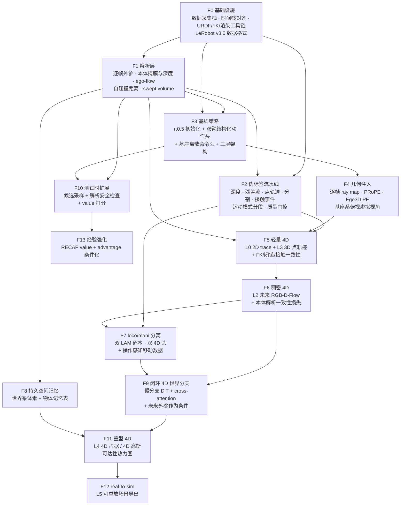

**关键依赖关系的解释：**

| 能力 | 前置 | 为什么 |
|---|---|---|
| F1 解析层 | F0 | 一切的地基。**必须先于 F2**——伪标签流水线的深度替换、点跟踪排除、ego-flow 都依赖它 |
| F5 轻量 4D | F1 + F2 + F4 | 点轨迹要在基座系表达，需要 F1 的解析外参；几何注入让模型有能力理解这个坐标系 |
| F6 稠密 4D | F5 | 先把便宜的做对，再上贵的。本体解析一致性损失需要 F1 |
| F7 loco/mani 分离 | F2 的运动模式分段 + 自采移动数据 | 没有分段标签就无法分离训练 |
| F9 闭环 4D | F6 + F7 | 慢分支要生成的正是 F6 的内容；不做 F7 分离会导致移动段生成质量崩坏 |
| F10 测试时扩展 | F1 + F3 | **只依赖解析层和基线策略，不依赖任何 4D 生成**。这意味着它可以很早独立开展，且是性价比最高的一块 |
| F11–F13 | 各自前置 | 增值能力 |

**三条值得注意的路径特性：**

1. **F10（测试时扩展）的依赖链最短，收益却很高。** 它只需要 F1 的解析安全检查 + F3 的基线策略，就能消除一大类硬失败（自碰撞、撞环境、够不到）。不要因为它排在编号后面就以为它要最后做。
2. **F1 是整张图的关键节点**，被 F2/F3/F5/F8/F10 五处依赖。把它做扎实（尤其是 URDF 与实物的一致性、渲染的正确性）比什么都重要。
3. **F5 → F6 → F9 是 4D 能力的主干**，每一级都应该在进入下一级前跑一遍 §8.3 的对应消融。如果 F5 到 F6 的收益已经很小，F9 大概率也不会有惊喜——这时应该停下来重新审视，而不是继续加码。

**每级能力的验证标准（技术性，非管理性）：**

| 能力 | 验证方式 |
|---|---|
| F1 | 把解析渲染的本体掩膜叠加到真实图像上目视检查；重投影误差 < 2 px |
| F2 | 在有硬件深度/仿真真值的子集上量化伪标签误差；质量门控的通过率分布合理 |
| F3 | RoboTwin 2.0 上不低于 π0.5 基线；真机上任务进度分数可测 |
| F5 | §8.3 的 A3 相对 A1 有可测提升；3D-AJ 指标建立基线 |
| F6 | A4 相对 A3 有提升；AbsRel / EPE 建立基线 |
| F7 | B3 相对 B2 有提升；移动段的 4D 质量不再显著劣于操作段 |
| F9 | A5 相对 A4 有提升；EWMBench 达到可比水平 |
| F10 | C1 相对 C0 的自碰撞发生率显著下降 |

---

## 12. 参考资料总表

### 12.1 综述与定义

- World Action Models: A Survey — [alphaXiv](https://www.alphaxiv.org/abs/2606.20781) ｜ [项目主页与论文列表](https://world-action-models.github.io/) ｜ [Preprints 版](https://www.preprints.org/manuscript/202606.1403)
- World Action Models: The Next Frontier in Embodied AI — [arXiv PDF](https://arxiv.org/pdf/2605.12090)
- NVIDIA：Pretrained to Imagine, Fine-Tuned to Act — [技术博客](https://developer.nvidia.com/blog/pretrained-to-imagine-fine-tuned-to-act-the-rise-of-world-action-models/)
- VLA 全栈综述（含硬件/数据/评测）— [IEEE Access 2025](https://doi.org/10.1109/access.2025.3609980) ｜ [vla-survey.github.io](https://vla-survey.github.io)
- Large VLM-based VLA for Robotic Manipulation: A Survey — [arXiv 2508.13073](https://arxiv.org/html/2508.13073)

### 12.2 VLA 底座（开源）

- openpi（π0 / π0-FAST / π0.5）— [GitHub](https://github.com/Physical-Intelligence/openpi)
- Isaac GR00T N1.7 — [GitHub](https://github.com/NVIDIA/Isaac-GR00T) ｜ [HF 博客](https://huggingface.co/blog/nvidia/gr00t-n1-7) ｜ [LeRobot 集成](https://huggingface.co/blog/nvidia/nvidia-isaac-teleop-and-gr00t17-in-lerobot)
- StarVLA — [GitHub](https://github.com/StarVLA/StarVLA) ｜ [arXiv 2604.05014](https://arxiv.org/abs/2604.05014)
- OpenVLA — [GitHub](https://github.com/openvla/openvla)
- MolmoAct — [GitHub](https://github.com/allenai/MolmoAct) ｜ [Ai2 博客](https://allenai.org/blog/molmoact) ｜ [arXiv 2508.07917](https://arxiv.org/html/2508.07917v1)
- π*0.6 / RECAP — [arXiv 2511.14759](https://arxiv.org/html/2511.14759v2) ｜ [RLinf 实现](https://rlinf.readthedocs.io/en/latest/rst_source/examples/embodied/recap.html)
- Gemini Robotics 1.5 — [arXiv 2510.03342](https://arxiv.org/abs/2510.03342) ｜ [技术报告 PDF](https://storage.googleapis.com/deepmind-media/gemini-robotics/Gemini-Robotics-1-5-Tech-Report.pdf)

### 12.3 世界模型 / WAM

- NVIDIA Cosmos（含 Cosmos 3）— [GitHub](https://github.com/NVIDIA/Cosmos) ｜ [Cosmos 3 技术博客](https://developer.nvidia.com/blog/develop-physical-ai-reasoning-world-and-action-models-with-nvidia-cosmos-3/)
- Cosmos Policy — [GitHub](https://github.com/NVlabs/cosmos-policy) ｜ [项目页](https://research.nvidia.com/labs/dir/cosmos-policy/cosmos_policy_index.html) ｜ [Cookbook 配方](https://nvidia-cosmos.github.io/cosmos-cookbook/recipes/post_training/predict2/cosmos_policy/post_training.html)
- Genie Envisioner（GE-Base / GE-Act / GE-Sim）— [GitHub](https://github.com/AgibotTech/Genie-Envisioner) ｜ [arXiv 2508.05635](https://arxiv.org/html/2508.05635)
- V-JEPA 2 — [GitHub](https://github.com/facebookresearch/vjepa2) ｜ [arXiv 2506.09985](https://arxiv.org/html/2506.09985)
- WorldVLA → RynnVLA-002 — [GitHub](https://github.com/alibaba-damo-academy/WorldVLA)
- LingBot-VA（Causal World Modeling for Robot Control，蚂蚁）— [arXiv 2601.21998](https://arxiv.org/pdf/2601.21998)
- DreamZero: World Action Models are Zero-shot Policies（NVIDIA）— [PDF](https://dreamzero0.github.io/DreamZero.pdf)
- Do World Action Models Generalize Better than VLAs? A Robustness Study — [arXiv 2603.22078](https://arxiv.org/html/2603.22078v2)（含 WAM 横向对比与实测延迟）
- Genie 3（仅参照）— [DeepMind](https://deepmind.google/models/genie/)

### 12.3.1 潜动作模型（从无动作标注视频学习）

- LAPA: Latent Action Pretraining from Videos — [项目页](https://latentactionpretraining.github.io/) ｜ [arXiv 2410.11758](https://arxiv.org/html/2410.11758v1)
- UniVLA: Learning to Act Anywhere with Task-centric Latent Actions — [arXiv 2505.06111](https://arxiv.org/html/2505.06111v1)
- Motion-Focused Latent Action from Human EgoVideos — [arXiv 2606.18955](https://arxiv.org/html/2606.18955v1)

### 12.4 4D 具身世界模型

- TesserAct — [GitHub](https://github.com/UMass-Embodied-AGI/TesserAct) ｜ [项目页](https://tesseractworld.github.io/) ｜ [arXiv 2504.20995](https://arxiv.org/html/2504.20995)
- RynnWorld-4D — [HF 模型页](https://huggingface.co/Alibaba-DAMO-Academy/RynnWorld-4D) ｜ [项目页](https://alibaba-damo-academy.github.io/RynnWorld-4D.github.io/) ｜ [arXiv 2607.06559](https://arxiv.org/html/2607.06559)
- EnerVerse — [arXiv 2501.01895](https://arxiv.org/html/2501.01895v3)
- ORV: 4D Occupancy-centric Robot Video Generation（CVPR 2026）— [项目页](https://orangesodahub.github.io/ORV/) ｜ [CVF](https://openaccess.thecvf.com/content/CVPR2026/html/Yang_ORV_4D_Occupancy-centric_Robot_Video_Generation_CVPR_2026_paper.html)
- Structured 4D Latent Predictive Model — [arXiv 2607.01166](https://arxiv.org/html/2607.01166v1)
- Geometry-aware 4D Video Generation for Robot Manipulation — [arXiv 2507.01099](https://arxiv.org/html/2507.01099v3)
- GWM: Gaussian World Models（ICCV 2025）— [arXiv 2508.17600](https://arxiv.org/html/2508.17600v1)
- ManiGaussian — [项目页](https://guanxinglu.github.io/ManiGaussian/)
- GaussianDream — [arXiv 2605.20752](https://arxiv.org/html/2605.20752)

### 12.5 3D/4D 增强 VLA

- SpatialVLA — [arXiv 2501.15830](https://arxiv.org/abs/2501.15830)
- BridgeVLA — [GitHub](https://github.com/BridgeVLA/BridgeVLA) ｜ [NeurIPS 2025](https://proceedings.neurips.cc/paper_files/paper/2025/file/5c1a8aa04c1a2cf5013f28831870dafa-Paper-Conference.pdf)
- 4D-VLA — [GitHub](https://github.com/LogosRoboticsGroup/4D-VLA) ｜ [arXiv 2506.22242](https://arxiv.org/html/2506.22242v1)
- Spatial Forcing（ICLR 2026）— [GitHub](https://github.com/OpenHelix-Team/Spatial-Forcing) ｜ [arXiv 2510.12276](https://arxiv.org/html/2510.12276)
- G³VLA — [arXiv 2606.24472](https://arxiv.org/html/2606.24472)
- 3DVLA — [arXiv 2605.29416](https://doi.org/10.48550/arxiv.2605.29416)
- UniviewVLA — [arXiv 2606.21501](https://arxiv.org/html/2606.21501)
- Video Prediction Policy（ICML 2025）— [项目页](https://video-prediction-policy.github.io/) ｜ [arXiv 2412.14803](https://arxiv.org/abs/2412.14803)

### 12.6 点轨迹 / 几何基座

- ATM: Any-point Trajectory Modeling — [项目页](https://xingyu-lin.github.io/atm/) ｜ [arXiv 2401.00025](https://arxiv.org/html/2401.00025v2)
- Track2Act — [arXiv 2405.01527](https://arxiv.org/html/2405.01527v2)
- Depth Anything 3 — [GitHub](https://github.com/bytedance-seed/depth-anything-3) ｜ [arXiv 2511.10647](https://arxiv.org/html/2511.10647) ｜ [DA3METRIC-LARGE](https://huggingface.co/depth-anything/DA3METRIC-LARGE)
- CUT3R — [项目页](https://cut3r.github.io/)
- DynamicVGGT（CVPR 2026）— [CVF PDF](https://openaccess.thecvf.com/content/CVPR2026/papers/He_DynamicVGGT_Learning_Dynamic_Point_Maps_for_4D_Scene_Reconstruction_in_CVPR_2026_paper.pdf)

### 12.7 real-to-sim / 数据引擎 / 框架

- RialTo — [项目页](https://real-to-sim-to-real.github.io/RialTo/)
- SplatSim — [项目页](https://splatsim.github.io/) ｜ [arXiv 2409.10161](https://arxiv.org/html/2409.10161)
- RoboGSim — [arXiv 2411.11839](https://arxiv.org/pdf/2411.11839)
- RL-GSBridge — [arXiv 2409.20291](https://arxiv.org/html/2409.20291)
- RoboTransfer（CVPR 2026）— [GitHub](https://github.com/HorizonRobotics/RoboTransfer) ｜ [项目页](https://horizonrobotics.github.io/robot_lab/robotransfer/)
- LeRobot 异步推理 — [文档](https://huggingface.co/docs/lerobot/en/async) ｜ [Dataset v3.0](https://huggingface.co/docs/lerobot/main/lerobot-dataset-v3)
- UMI — [项目页](https://umi-gripper.github.io/) ｜ UMI-3D [arXiv 2604.14089](https://arxiv.org/html/2604.14089) ｜ FastUMI [PMLR](https://proceedings.mlr.press/v305/zhaxizhuoma25a.html)
- GR00T-WholeBodyControl / GEAR-SONIC — [文档](https://nvlabs.github.io/GR00T-WholeBodyControl/tutorials/vla_workflow.html)
- EWMBench — [GitHub](https://github.com/AgibotTech/EWMBench)

### 12.8 双臂协同（本设定新增）

- Co-VLA: Coordination-Aware Structured Action Modeling for Dual-Arm VLA — [arXiv 2606.20285](https://arxiv.org/html/2606.20285v1)
- TwinVLA: Data-Efficient Bimanual Manipulation with Twin Single-Arm VLA（ICLR 2026）— [arXiv 2511.05275](https://arxiv.org/html/2511.05275v1) ｜ [GitHub](https://github.com/jellyho/TwinVLA)
- SkillVLA（可学习协同门控；未见技能组合 51% vs π0.5 的 0%）— [arXiv 2606.16652](https://arxiv.org/abs/2606.16652)
- CLAP: 双臂潜动作预训练（Astribot S1，头 + 双腕）— [arXiv 2604.09677](https://arxiv.org/abs/2604.09677)
- RoTri: 双臂-物体三元关系表征 $\mathbb{R}^{21}$ — [arXiv 2606.13627](https://arxiv.org/abs/2606.13627)
- GAP: 联合动作 + 未来 pointmap 预测（CVPR 2026，开源，推理时可跳过解码）
- Diffusion-Based Imaginative Coordination（单向注意力，推理时可跳过视频生成；ALOHA +24.9%，RoboTwin +11.1%，真机 +32.5%）
- CoFreeVLA（双臂自碰撞风险门控，<5 ms，VLA 10 Hz + 控制器 30 Hz）、Dexora（高自由度双臂+灵巧手开源系统）
- Structure-Aware DP / CDTS（绝对+相对分解，58%→89%；**依赖力反馈**）
- BiCoord 协同度量（MRD / ARD / SMT / SMP / STI）、RoboEval（自碰撞与环境碰撞指标）
- RDT-1B（Robotics Diffusion Transformer，双臂基线）
- ACT / ALOHA / Mobile ALOHA（动作块与双臂遥操作的开山工作）
- RoboTwin 2.0（双臂基准，`head_camera` + `left_camera` + `right_camera`）— [GitHub](https://github.com/RoboTwin-Platform/RoboTwin)
- EgoDex（829 小时第一视角 + 3D 手部姿态）— [arXiv 2505.11709](https://arxiv.org/abs/2505.11709)

### 12.9 移动操作 / 全身控制（本设定新增）

- **Galaxea R1-Lite / R1 Pro + G0/G0.5**（与本方案硬件同构的完整生态）— [arXiv 2509.00576](https://arxiv.org/abs/2509.00576) ｜ [GitHub](https://github.com/OpenGalaxea/G0) ｜ [数据集](https://huggingface.co/OpenGalaxea)
- **BEHAVIOR Robot Suite / WB-VIMA**（CoRL 2025，沿运动学链自回归去噪，跑在 Galaxea R1 上）— [项目页](https://behavior-robot-suite.github.io/) ｜ [GitHub](https://github.com/behavior-robot-suite/brs-algo)
- AC-DiT: Adaptive Coordination Diffusion Transformer（mobility-to-body 条件）— [arXiv 2507.01961](https://arxiv.org/abs/2507.01961) ｜ [项目页](https://ac-dit.github.io/)
- WholeBodyVLA: Towards Unified Latent VLA for Whole-body Loco-manipulation Control（ICLR 2026）— [arXiv 2512.11047](https://arxiv.org/html/2512.11047v1) ｜ [GitHub](https://github.com/OpenDriveLab/WholebodyVLA) ｜ [项目页](https://opendrivelab.com/WholeBodyVLA/)
- OpenHLM: An Empirical Recipe for Whole-Body Humanoid Loco-Manipulation — [arXiv 2606.22174](https://arxiv.org/abs/2606.22174) ｜ [项目页](https://openhlm-project.github.io/)
- MoManipVLA: Transferring VLA Models for General Mobile Manipulation（CVPR 2025）— [arXiv 2503.13446](https://arxiv.org/abs/2503.13446)
- Mobi-π: Mobilizing Your Robot Learning Policy（基座落位问题的形式化）
- Being-0（人形分层系统）、HEAD、LBM（Boston Dynamics）、Ψ0
- Harmonic Mobile Manipulation、TidyBot++、Stretch 3（移动操作平台）
- Habitat 3.0 / BEHAVIOR-1K / OVMM（移动操作仿真与基准）

> **可靠性提示**：Figure Helix 02 的性能数字来自公司博客，无论文、无第三方复现，**仅作架构思想参考**；Astribot 整机规格来自商业评测博客，建议不引用；GEN-0 的"7B ossification 相变 / 10B+ 高效泛化"同样出自公司博客，未经同行评议。

### 12.10 动态相机下的 4D 感知与几何注入（本轮新增）

- **See like a Robot: 机器人系 pointmap 表征**（阶梯消融 27.9 → 34.7 → 36.9；π0.5 55.3 → 62.9）— [arXiv 2607.11498](https://arxiv.org/abs/2607.11498)
- Robo3R: RGB + 关节角 → 标准机器人系度量几何（透明/反光物体优于深度相机）— [arXiv 2606.19913](https://arxiv.org/abs/2606.19913)
- **MapAnything**（Apache 2.0；位姿/深度可作为输入的因子化几何模型）— [项目页](https://map-anything.github.io/)
- OmniVGGT / GeoAdapter（零卷积注入已知位姿，误差降 65.4%）— [arXiv 2511.08222](https://arxiv.org/abs/2511.08222)
- StreamVGGT（因果注意力改造为在线流式）— [arXiv 2507.11539](https://arxiv.org/abs/2507.11539)
- TTT3R（20 FPS / 6 GB / training-free / 数千帧）— [项目页](https://rover-xingyu.github.io/TTT3R/)
- TAPIP3D（接受 rgb/depth/内参/外参 npz，直出世界系轨迹）— [项目页](https://tapip3d.github.io/)
- Cloak（用 FK + 投影在视觉编码器里掩掉夹爪；指出 DROID 相机参数噪声过大）— [arXiv 2604.15417](https://arxiv.org/abs/2604.15417)
- 3D-ALP（空间记忆；记忆步 0.650 vs 0.006，第 5 步 0.822 vs 0.000）— [arXiv 2606.06839](https://arxiv.org/abs/2606.06839)
- 4D Latent Mapping（ICRA 2026；神经点 + FK 更新本体 + 多坐标系多分辨率 tokenize）— [arXiv 2603.01843](https://arxiv.org/abs/2603.01843)
- Mem-World / W-VMem（腕部视角为中心的 4D surfel 记忆）— [arXiv 2606.10664](https://arxiv.org/abs/2606.10664)
- SOMA（可动头部相机 + 目标出视野的操作）— [arXiv 2604.02618](https://arxiv.org/abs/2604.02618)
- ViA（6-DoF 机器人颈部主动视觉，+45%）— [arXiv 2506.15185](https://arxiv.org/abs/2506.15185)
- TAVIS（主动视觉收益的任务条件性；GALT 指标）— [arXiv 2603.14624](https://arxiv.org/abs/2603.14624)
- Hsu et al.（第三人称视角提升域内但损害 OOD；VIB 正则）— [OpenReview](https://openreview.net/forum?id=NxoFmGgWC9)
- SPARC（伪标签可靠性评分：阶段感知运动 + 3D 夹爪邻近 + 本体重叠惩罚）— [arXiv 2605.05712](https://arxiv.org/abs/2605.05712)
- 4DNeX（多级过滤流水线，最终保留率约 1%）— [arXiv 2508.13154](https://arxiv.org/abs/2508.13154)
- PEAfowl（有限视野重叠下 2D 跨视角匹配失效，应在共享 3D 系融合）— [arXiv 2604.03462](https://arxiv.org/abs/2604.03462)
- Ctrl-World（加入腕部相机预测显著降低接触交互中的幻觉）

### 12.11 异步执行与测试时扩展（本轮新增）

- DreamZero（WAM 14B 50% vs 5B 21% vs VLA 8B/32B 均 0%；块预算而非帧预算）— [arXiv 2602.15922](https://arxiv.org/abs/2602.15922)
- VLASH（future-state-aware 异步处理）— [arXiv 2512.01031](https://arxiv.org/abs/2512.01031)
- LingBot-VA（FDM-grounded 异步 90.4 vs 朴素 74.3；3 步任务 85.6 vs 32.9）— [arXiv 2601.21998](https://arxiv.org/abs/2601.21998)
- RoboMonkey（best-of-N 幂律；高斯扰动生成候选；OOD +25%，域内 8–9%）— [arXiv 2506.17811](https://arxiv.org/abs/2506.17811)
- Pre-VLA（183.9 ms 可并行验证；LIBERO 30.79% → 37.62%）— [arXiv 2604.02061](https://arxiv.org/abs/2604.02061)
- SnapFlow（单步蒸馏；π0.5 LIBERO 1 步 98.75% vs 10 步 97.75%，9.6× 加速）— [arXiv 2604.11889](https://arxiv.org/abs/2604.11889)
- V-JEPA 2-AC（潜空间 CEM：8000 rollout / 4090 / 16 秒，对比像素空间 4 分钟）— [arXiv 2506.09985](https://arxiv.org/html/2506.09985)
- Self-Forcing（H100 上 1.3B 流式 17 FPS，首帧 0.8 s）

---

## 附录 A：关键设计判断速查

把全文中最容易被质疑、也最值得记住的判断集中在一处。每条都注明依据。

| # | 判断 | 依据 | 若判断错了会怎样 |
|---|---|---|---|
| A1 | 4D 在**基座系**预测，不在相机系 | 三路相机全动，无稳定参照系；外参 FK 解析可得；动作也在基座系 | 若改在相机系，每次用 4D 约束动作都要带噪声变换，且训练目标随相机运动剧烈变化 |
| A2 | 双臂动作头用**共享 + 残差**分解，**且必须配协同门控与辅助损失** | [Co-VLA](https://arxiv.org/html/2606.20285v1)：+27 个百分点，OOD 翻倍；但 SAE 单独用会掉分（63→57%） | 只抄一半会比不抄更差 |
| A2b | 必须有**显式协同门控 α** | [SkillVLA](https://arxiv.org/abs/2606.16652)：未见技能组合上 π0.5 **0%**、TwinVLA 4%、有门控 51% | 左右臂技能会被绑死在训练见过的组合上，组合泛化归零 |
| A2c | 三组动作**沿运动学链自回归**：base → torso → arms | WB-VIMA（"膝关节 10° → 末端 0.14 m"）、AC-DiT、G0.5 三条独立路线收敛；OpenHLM 反证 81 维 SMPL 落后 13 个百分点 | 上游误差被下游放大，末端精度崩坏 |
| A3 | 基座用**离散命令**而非连续速度 | [WholeBodyVLA](https://arxiv.org/html/2512.11047v1)：连续速度版本成功率低 24 个百分点 | 停走不干脆、路径漂移、转弯伴随前进 |
| A4 | **loco 与 mani 的表征必须分离** | [WholeBodyVLA](https://arxiv.org/html/2512.11047v1) 的双 LAM 消融 | 两种视觉模式的注意力目标冲突，表征学习不稳定 |
| A5 | 全身 4D 用**解析 FK + 渲染**，不用神经网络预测 | 数学上精确；机器人在腕部相机中常占 30–50% 像素 | 浪费模型容量去学可以算出来的东西，且引入本体幻觉 |
| A6 | **未来相机外参作为生成条件** | 本方案推论：动作已定 → 未来外参解析可得 | 生成分支要同时想象场景变化与相机运动，难度与幻觉都大幅上升 |
| A7 | **ego-flow 解析扣除** | 本方案推论：已知外参变化 + 深度 → 可算自运动光流 | 4D 头把大部分容量花在学习自运动上 |
| A7b | 输入用**基座系 / EE 系 pointmap**，逐元素相加注入 | See like a Robot：27.9 → 34.7 → 36.9；视角随机化下 RGB 掉 9.6 而 pointmap 掉 1.8；相加 34.7 > 拼接 30.7 > 点云分支 24.2 | 三路全动相机下泛化性明显更差；若误用点云分支还会比纯 RGB 更差 |
| A8 | 10 Hz 下**直接上闭环生成 4D**，不先做轻量版 | 真实预算是动作块时长 ≈2 s 而非 100 ms；RynnWorld-4D 单次前向 1106 ms 仍达 9 Hz | 若判断错（实际延迟不达标），退回方案 A——但方案 A 的组件全部可复用，代价可控 |
| A8b | **异步必须配状态前滚**（VLASH / FDM） | LingBot-VA：3 步任务 85.6 vs 32.9 | 长程任务直接崩塌，且症状容易被误诊为"模型能力不足" |
| A8c | 算力加在**视频/世界模型骨干**，不加在 VLM 基座 | DreamZero：WAM 14B 50% / 5B 21%；VLA 8B 与 32B 均 0% | 把预算浪费在完全没有收益的方向上 |
| A8d | 4D 拆成**解析 ego 支 + 学习 scene 支**，scene 支锚在动作块起点的基座帧 | 本方案推论；"移动 + 4D"无先例，两轮独立调研均确认为空白 | 基座运动被建模两遍，生成分支同时背负自运动与场景变化，幻觉与训练难度双升 |
| A9 | **π0.5 初始化**优于从通用 VLM 起步 | [OpenHLM](https://arxiv.org/abs/2606.22174) 的受控实验：闭环纠错行为可迁移，而 action MSE 看不出差别 | 模型抓失败后不会重试，真机表现远差于离线指标暗示的水平 |
| A10 | **不用 action MSE 选模型** | 同上 | 会选到离线好看、真机很差的模型 |
| A11 | 三层架构（10 Hz 顶层 + 中层门控 + 高频底层） | WholeBodyVLA、Helix、GR00T-WBC 都是这个形态 | 若强行端到端直出高频全身命令，10 Hz 的延迟无法被底层补偿 |
| A12 | **测试时解析安全检查是必做项** | 本体 4D 反正要算，检查几乎零成本；自碰撞与撞环境是这类本体的主要硬失败 | 白白放过一大类可预先排除的失败 |
| A13 | **测试时想象按 OOD 程度开关**，不常开 | Fast-WAM 域内去掉几乎不掉分（91.8→90.6）；DreamZero 零样本上 2 倍以上优势；RoboMonkey OOD +25% / 域内 8–9% | 域内白烧算力；或在域内测出"没用"而错误砍掉 OOD 上的关键能力 |
| A14 | **训练时的视频/4D 共训不可省** | Fast-WAM：去掉后掉到 83.8，真机叠毛巾 10% | 这是与 A13 相反的一条——想象可以关，共训不能省 |
| A15 | 以 **Galaxea R1 生态**为主参照，不以双足人形为参照 | 硬件逐项同构；500+ 小时数据 + 开源 VLA + 开源仿真 + CoRL 2025 论文 | 走双足路线会引入大量与轮式无关的复杂度（平衡控制、踉跄恢复） |
| A16 | 移动与操作**软耦合即可**，不引入双足式高频平衡层 | OpenHLM：解耦让人形退化成"轮式双臂样"——而你本来就是轮式 | 白白增加一层 50 Hz–1 kHz 的 RL 控制器，收益为零 |

**仍需与实际情况核对的前提：**

| # | 前提 | 若不成立 |
|---|---|---|
| P1 | URDF 与实物一致，标定精度足够（重投影误差 < 2 px） | §4.3 的解析捷径全线失效，整个方案的地基动摇 |
| P2 | 基座运动可由命令与里程计较准确地推算（打滑不严重） | 未来相机外参的解析性下降，需要改用带不确定性的估计 |
| P3 | 三路相机中至少头部有硬件深度 | 全靠单目深度估计，度量尺度可靠性下降，L2/L4 的绝对精度受影响 |
| P4 | 任务包含真正的双臂协同（而非两只手各干各的） | 若全是独立并行任务，§4.1.2 的结构化分解收益会小很多 |
| P5 | 任务包含真正的大范围移动（而非原地微调） | 若基座只做小幅调整，loco/mani 分离与持久记忆的价值下降，可简化 |
| P6 | 需要商用许可 | 优先 Apache 2.0（GR00T **N1.7 才是**、openpi、DA3、MapAnything）、MIT（StarVLA、OpenVLA、TwinVLA）；逐一登记每个组件 |
| P7 | 你的本体是**全向轮式**（而非差速或双足） | 若是差速底盘，基座离散原语集合要去掉侧移；若含双足，A16 不成立，需要补 System 0 平衡层 |
| P8 | 你的任务中有相当比例是"左右臂技能的新组合" | 若全是固定的少数几种协同模式，A2b 的协同门控收益会小很多，可简化 |
| P9 | 存在真正的 OOD 场景（新物体 / 新场景 / 新指令） | 若部署环境高度固定，§5.5 的测试时想象几乎无收益，只保留解析安全检查即可 |

